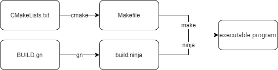

# .gn 和 .cm 文件的逻辑和原理

在编译一个 fuchsia 的组件时，需要使用 `BUILD.gn` 和 `program.cml` 或 `program.cmx` 文件来完成组件的编译和构建。

其中 `BUILD.gn` 描述了构建、导入 `cm` 配置、封装成包的过程。最终会通过谷歌的 `gn` 工具，解析成可供 `ninja` 编译的文件，最后通过 `ninja` 在 fuchsia 下编译为可执行的二进制文件。

## gn 文件介绍

> [GN](https://fuchsia.dev/docs/glossary#gn) is the meta-build system used by Fuchsia. Fuchsia extends GN by defining templates. Templates provide a way to add to GN's built-in target types. ([Reference Form: Building components  | Fuchsia](https://fuchsia.dev/fuchsia-src/development/components/build#component-package))
>
> GN 是在 Fuchsia 中使用的一个原构建系统。Fuchsia 通过定义模板扩展了 GN。模板提供了一种添加到 GN 内置目标类型的方法。

GN 是为了在系统中构建组件 (component) 或包 (package) 的工具，通过编写 `BUILD.gn` 文件，让 gn 工具生成可供 ninja 编译

### gn 文件与 ninja 编译工具

如果使用 cmake、make 来对比 gn、ninja 做举例，我们编写 `CMakeLists.txt` 文件，通过运行 `cmake $program_path` 命令来生成可以被 make 命令使用的 `Makefile` 文件，最后通过 `make` 命令编译生成可执行文件。同理，谷歌的 gn 也做了差不多的事情：编写 `BUILD.gn` 文件，通过运行 `gn gen out/xxx` 生成可被 ninja 命令使用的 `build.ninja` 文件（out/xxx为你的项目所在的目录），最后通过 `ninja -C out/xxx ProgramName` 生成可执行程序。



### gn 文件解析

> Note: 这里只讨论文档中出现的编程语言

#### import

用于导入依赖文件，语法很简单：

```gn
import("xxxx_path")
```

对于不同的编程语言，需要导入不同的依赖，具体可以参考 [Building components  | Fuchsia](https://fuchsia.dev/fuchsia-src/development/components/build#language-specific-component-examples) 

#### executable 或 xxx_binary

用于指明构建一个可执行程序，同时需要指定源文件，可指定包名。

```gn
executable("bin") {
  output_name = "my_program"
  sources = [ "main.cc" ]
}
```

其中，`output` 后面的输出名将会为最终生成的可执行程序名，对于 go、rust 可以不指定源文件。

#### fuchsia_component & fuchsia_package

> Note: 这是在 fuchsia 中才会用到的两个语法。

用于将可执行程序打包为 fuchsia 下的组件和包。

```
fuchsia_component("my_component") {
  manifest = "meta/my_component.cml"
  deps = [ ":bin" ]
}

fuchsia_package("my_package") {
  deps = [ ":my_component" ]
}
```

fuchsia_component 用于将刚刚生成的 bin 依赖进来，通过在 `manifest` 属性中指定 cm 元配置文件（下方会讲到）来打包为一个组件，通过元配置文件赋予一些能力（类似安卓中的权限）或者指定生成可执行程序文件的位置，或者传入一些参数。

fuchsia_package 用于指定最终打包后的包名，便于通过 fuchsia-pkg 的组件 URL 访问得到。一个 fuchsia-pkg 组件 URL 结构如下：

```
fuchsia-pkg://<repo-hostname>[/<pkg-name>[/<pkg-variant>][?hash=<pkg-hash>][#<path-to-manifest>]]
```

如上的 fuchsia_package 对应的 URL 如下：

```
fuchsia-pkg://fuchsia.com/my_package#meta/my_component.cm
```

如果开发一个简单的 fuchsia 组件，那么就可以通过上面的 URL 访问到组件。具体运行可以参考 [Run an example component  | Fuchsia](https://fuchsia.dev/fuchsia-src/development/run/run-examples#run-the-example-component)。

## cm 文件介绍

cm 文件，在本文主要指 cml 和 cmx 两种**组件清单源**文件。用于描述可以做什么、它使用和暴露出来的功能、它的子组件以及运行组件所需的其他信息。

**组件清单**：将组件清单源文件通过 cmc 工具编译之后，生成的 cm 文件，而我们通过 fuchsia-pkg URL 链接连接到的也是 cm 文件。

组件声明：将作用功能等信息，使用 ComponentDecl FIDL 表来描述。

### cmx 与 cml 文件关系和差异

cmx 是一种 JSON 格式文件，键使用双引号包含，格式严谨，不能使用注释。

cml 是一种 JSON5 格式的文件，键不使用双引号包含，格式宽松，可以使用单行注释和块注释，允许有空行，更适合用于编写组件清单文件。

cmx 是 Components v1 的版本，cml 是 Components v2 的版本，由文章 [Components v2 migration  | Fuchsia](https://fuchsia.dev/fuchsia-src/contribute/open_projects/components/migration) 中提到的，截至 2021 年 9 月，已经迁移了超过三分之一的生产组件。在文章中还可以找到三篇移植的举例，请结合 [Migrating system components  | Fuchsia](https://fuchsia.dev/fuchsia-src/development/components/v2/migration) 来学习如何迁移到 cml。

### cmx & cml 文件解析

> fonts.cmx

```json
{
    "include": [
        "syslog/client.shard.cmx"
    ],
    "program": {
        "binary": "bin/font_provider"
    },
    "sandbox": {
        "services": [
            "fuchsia.logger.LogSink",
            "fuchsia.pkg.FontResolver"
        ]
        ...
    }
}
```

常见的，我们会包含一个系统输入输出日志的 cmx 文件，使用 `"include": ["syslog/client.shard.cmx"]` 来包含。

**"program"：** 描述程序位置，必须包含一个 `"binary"` 来指定编译出来的可执行程序的位置，这个位置和 `BUILD.gn` 中可执行文件的输出目录 `bin/${output_name}` 是一样的，这里的 `output_name` 指 `BUILD.gn` 中的可执行标签的属性。

"sandbox"：用于开启一个沙盒，每个组件都运行在一个沙盒中，通过在下面的 "services" 来赋予组件的能力。

> fonts.cml

```json
{
    include: [
        // Enable system logging
        "syslog/client.shard.cml",
    ],
    program: {
      runner: "elf",
      binary: "bin/font_provider",
    },
    use: [
        {
            protocol: [ "fuchsia.pkg.FontResolver" ],
        },
    ],
}
```

相比之下，除了写法上的调整，还有以下区别：

include：include 包含的文件修改为 "syslog/client.shard.cml"；

program：添加 `runner: "elf"` 用于指定使用 elf 来运行二进制文件，这在 cmx 中是默认的行为。

use：沙盒改为 use，服务改为 protocol 协议。

其他的属性值的介绍和版本差异可以参照： [Migrating system components  | Fuchsia](https://fuchsia.dev/fuchsia-src/development/components/v2/migration)。

## gn 和 cm 文件

### 两者的关系

前面提到过整个编译流程中，cm 作为 gn 的一个依赖项，编写在 manifest 属性下。其实是因为整个编译的入口是由 `BUILD.gn` 来决定的，整个 fuchsia 的组件编译又是由根目录的 `.gn` 文件决定的。通过编译出的二进制文件，用 cm 去索引到，才能运行起来。

如果只考虑编写一个组件来梳理，gn 控制了整个组件编译的过程，包括导入 cm 文件；而 cm 用于描述组件的目的和能力。两者共同合作才能使组件运行起来。

### gn 文件在 fuchsia 下的使用

通常情况下，我们都会通过在组件中赋予 manifest 属性一个组件清单源，然后在最后的包中去指明包名。但是作为一个小的组件，也可以像下面这样做：

```gn
import("//build/components.gni")

executable("rot13_encoder_decoder") {
  sources = [ "rot13_encoder_decoder.cc" ]
}

fuchsia_package_with_single_component("rot13") {
  manifest = "meta/rot13.cml"
  deps = [ ":rot13_encoder_decoder" ]
}
```

通过 `fuchsia_package_with_single_component` 直接指明包名 `rot13` 和导入的组件清单源 `meta/rot13.cml` 。最后通过 URL：`fuchsia-pkg://fuchsia.com/rot13#meta/rot13.cm` 去运行。

### 编写两者代码的注意事项

> BUILD.gn 中的 executable 标签 

该标签由于编程语言的不同，编写的名称也不一样，内部是否需要 sources 属性，也由编程语言决定。具体可以参考：[Building components  | Fuchsia](https://fuchsia.dev/fuchsia-src/development/components/build#language-specific-component-examples)。

> 路径引用

在 fuchsia 学习中我们也遇到路径名中的一些语法，大部分和 linux 路径描述是一致的，但也有部分需要提及一下。

- `//xxx`：从项目的根目录下开始引用。
- `../`：上一级目录。
- `:xxx`：寻找标签（注：标签是指类似 `fuchsia_package_with_single_component` 后面的 `rot13` 。常见比如 `deps` 属性会引用本路径下的可执行程序的标签名。）

## 参考引用

- [跨平台：GN实践详解（ninja, 编译, windows/mac/android实战）强烈推荐 - Bigben - 博客园](https://www.cnblogs.com/bigben0123/p/12643839.html)
- [ninja和gn - 知乎](https://zhuanlan.zhihu.com/p/136954435)
