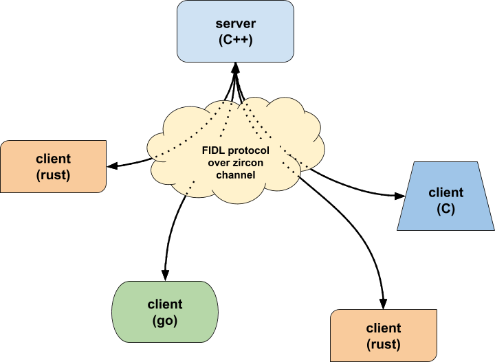

# 初识 Fuchsia 中的 IPC 机制

FIDL（Fuchsia Interface Definition Language）是 fuchsia 系统上的远程调用机制（IPC），类似 Android 中的 binder。

FIDL 的主要作用是允许不同的客户端和服务端相互操作。因为客户端的语言不同，可能会包括了 C/C++、Rust、Dart 等，但是服务端不会为每个服务都提供一种协议来实现，所以就需要 FIDL 工具链。服务端的开发人员仅需要创建一个定义文件，该文件定义了协议。然后，FIDL 编译器可以使用此文件以任何受支持的目标语言生成客户端和服务端的代码（.fidl）。



### FIDL 架构

FIDL 主要分为以下三个部分：

* FIDL 定义文件
* 客户端代码
* 服务端代码

其中，客户端代码和服务端代码均由 FIDL 编译器工具链生成。

### 简易 FIDL 通信举例

#### 1.编译 FIDL

首先定义 FIDL 协议：//examples/fidl/fuchsia.examples/types.test.fidl

```
library fuchsia.examples;

const BOARD_SIZE uint8 = 9;
const NAME string = "Tic-Tac-Toe";

type FileMode = strict bits : uint16 {
    READ = 0b001;
    WRITE = 0b010;
    EXECUTE = 0b100;
};

type LocationType = strict enum {
    MUSEUM = 1;
    AIRPORT = 2;
    RESTAURANT = 3;
};

type Color = struct {
    id uint32;
    name string:MAX_STRING_LENGTH = "red";
};

type JsonValue = strict union {
    1: reserved;
    2: int_value int32;
    3: string_value string:MAX_STRING_LENGTH;
};

type User = table {
    1: reserved;
    2: age uint8;
    3: name string:MAX_STRING_LENGTH;
};

type GameState = struct {};

protocol TicTacToe {
    StartGame(struct {
        start_first bool;
    });
    MakeMove(struct {
        row uint8;
        col uint8;
    }) -> (struct {
        success bool;
        new_state box<GameState>;
    });
    -> OnOpponentMove(struct {
        new_state GameState;
    });
};
```

以及：examples/fidl/fuchsia.examples/echo.test.fidl

```
// Copyright 2020 The Fuchsia Authors. All rights reserved.
// Use of this source code is governed by a BSD-style license that can be
// found in the LICENSE file.
library fuchsia.examples;

const MAX_STRING_LENGTH uint64 = 32;

@discoverable
protocol Echo {
    EchoString(struct {
        value string:MAX_STRING_LENGTH;
    }) -> (struct {
        response string:MAX_STRING_LENGTH;
    });
    SendString(struct {
        value string:MAX_STRING_LENGTH;
    });
    -> OnString(struct {
        response string:MAX_STRING_LENGTH;
    });
};

@discoverable
protocol EchoLauncher {
    GetEcho(struct {
        echo_prefix string:MAX_STRING_LENGTH;
    }) -> (resource struct {
        response client_end:Echo;
    });
    GetEchoPipelined(resource struct {
        echo_prefix string:MAX_STRING_LENGTH;
        request server_end:Echo;
    });
};

service EchoService {
    regular_echo client_end:Echo;
    reversed_echo client_end:Echo;
};

```

接着为 FIDL 库创建 GN 文件

```
# Copyright 2020 The Fuchsia Authors. All rights reserved.
# Use of this source code is governed by a BSD-style license that can be
# found in the LICENSE file.

# Import the fidl GN template.
import("//build/fidl/fidl.gni")

# Define a target for our FIDL library by passing it the FIDL source files
# that make up the library.
fidl("fuchsia.examples") {
  sources = [
    "echo.test.fidl",
    "types.test.fidl",
  ]
  fuzzers = [
    {
      protocol = "fuchsia.examples.Echo"
    },
  ]
}

```

随后就可以编译 FIDL 库了：fx set core.x64 --with //examples/fidl/fuchsia.examples

#### 2.为 FIDL 协议实现服务端

创建组件的过程略过。

首先添加 FIDL 库的依赖，在 bin 中添加如下：

```
executable("bin") {
  output_name = "fidl_echo_hlcpp_server"
  sources = [ "main.cc" ]
  deps = [
    "//examples/fidl/fuchsia.examples",
    "//sdk/lib/fidl/cpp",
    "//sdk/lib/sys/cpp",
    "//zircon/system/ulib/async-loop:async-loop-cpp",
    "//zircon/system/ulib/async-loop:async-loop-default",
  ]
}
```

并且将如下头文件添加依赖：

```
#include <fuchsia/examples/cpp/fidl.h>
#include <lib/async-loop/cpp/loop.h>
#include <lib/async-loop/default.h>
#include <lib/fidl/cpp/binding.h>
#include <lib/sys/cpp/component_context.h>
```

在 main 函数上方添加

```
class EchoImpl : public fuchsia::examples::Echo {
 public:
  void EchoString(std::string value, EchoStringCallback callback) override { callback(value); }
  void SendString(std::string value) override {
    if (event_sender_) {
      event_sender_->OnString(value);
    }
  }

  fuchsia::examples::Echo_EventSender* event_sender_;
};
```

在 main 函数中添加如下：

```
int main(int argc, const char** argv) {
  async::Loop loop(&kAsyncLoopConfigAttachToCurrentThread);

  EchoImpl impl;
  fidl::Binding<fuchsia::examples::Echo> binding(&impl);
  impl.event_sender_ = &binding.events();
  fidl::InterfaceRequestHandler<fuchsia::examples::Echo> handler =
      [&](fidl::InterfaceRequest<fuchsia::examples::Echo> request) {
        binding.Bind(std::move(request));
      };
  auto context = sys::ComponentContext::CreateAndServeOutgoingDirectory();
  context->outgoing()->AddPublicService(std::move(handler));

  printf("Running echo server\n");
  return loop.Run();
}
```

随后就可以编译 Fuchsia，运行服务端后可以看到输出，并且服务端并没有立刻退出，而是继续等待传入请求。

#### 3.为 FIDL 协议实现客户端

这里我们以异步客户端距离。

在 GN 中添加如下依赖：

```
  deps = [
    "//examples/fidl/fuchsia.examples",
    "//sdk/lib/sys/cpp",
    "//zircon/system/ulib/async-loop:async-loop-cpp",
    "//zircon/system/ulib/async-loop:async-loop-default",
  ]

```

在 main.cc 中添加：

```
#include <fuchsia/examples/cpp/fidl.h>
#include <lib/async-loop/cpp/loop.h>
#include <lib/async-loop/default.h>
#include <lib/sys/cpp/component_context.h>
```

在组建清单中将协议包含在客户端组件的沙盒中：

```
{
    "include": [
        "syslog/client.shard.cmx"
    ],
    "program": {
        "binary": "bin/fidl_echo_hlcpp_client"
    },
    "sandbox": {
        "services": [
            "fuchsia.examples.Echo"
        ]
    }
}

```

main 函数中：

```
int main(int argc, const char** argv) {
  async::Loop loop(&kAsyncLoopConfigAttachToCurrentThread);

  fuchsia::examples::EchoPtr echo_proxy;
  auto context = sys::ComponentContext::Create();
  context->svc()->Connect(echo_proxy.NewRequest());

  echo_proxy.set_error_handler([&loop](zx_status_t status) {
    printf("Error reading incoming message: %d\n", status);
    loop.Quit();
  });

  int num_responses = 0;
  echo_proxy->SendString("hi");
  echo_proxy->EchoString("hello", [&](std::string response) {
    printf("Got response %s\n", response.c_str());
    if (++num_responses == 2) {
      loop.Quit();
    }
  });
  echo_proxy.events().OnString = [&](std::string response) {
    printf("Got event %s\n", response.c_str());
    if (++num_responses == 2) {
      loop.Quit();
    }
  };

  loop.Run();
  return num_responses == 2 ? 0 : 1;
}
```

#### 4.在 Fuchsia 上将服务端和客户端一起运行

如果我们直接运行服务端和客户端是无法正常运行的，这时我们需要使用 Launcher 工具。

这是因为客户端不会在它的沙盒里自动获取 Echo 协议。为了让它工作，就需要使用 Launcher 工具来发布服务，创建一个新的环境给客户端，这个环境提供服务端的协议然后在它里面运行客户端。

上面的解释看起来非常拗口，简单来说的话就是，客户端没有服务端和协议的环境，所以需要 Launcher 工具来创建这个环境。

运行的命令如下：

```
fx shell run fuchsia-pkg://fuchsia.com/echo-launcher#meta/launcher.cmx fuchsia-pkg://fuchsia.com/echo-hlcpp-client#meta/echo-client.cmx fuchsia-pkg://fuchsia.com/echo-hlcpp-server#meta/echo-server.cmx fuchsia.examples.Echo
```
