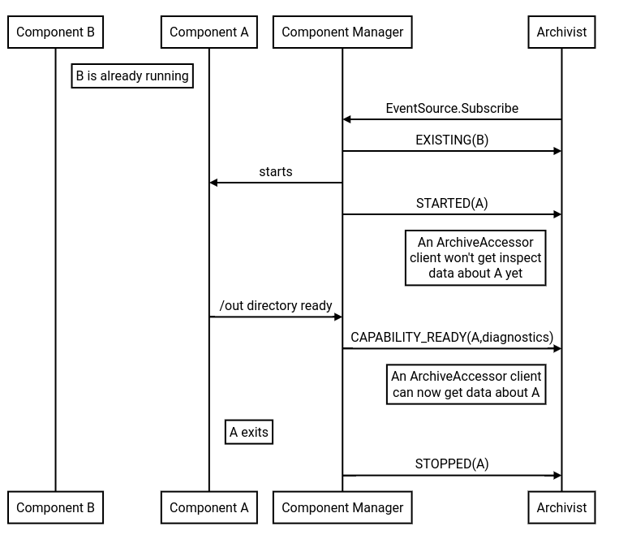

# Lifecycle events

The [Archivist][archivist] consumes lifecycle events to ingest diagnostics data. This document
explains what these events are.

## Archivist consumption of lifecycle events {#archivist-consumption}

The archivist ingests events from the component framework.
The following diagram shows a very high level overview of the three lifecycle events
(started, directory_ready and stopped) the archivist is interested in.

The archivist consumes the following lifecycle events under component manager through
[`fuchsia.sys2.EventSource`][event_source]:

- **Started**: Sent by component manager when a component starts, the [runner] might still
  need to launch the component, but the component has started from the framework perspective.
- **Stopped**: Sent by component manager when a component stops, the runner might still need to to
  tear down the component, but the component is gone from the framework perspective.
- **Running**: Sent by component manager for all components that are running at the moment the
  archivist starts listening for events. In other words, a synthesized started event. This event
  is provided to the reader as **Started**, but consumed from the framework as “Running”.
- **Directory ready**: The archivist listens for directory ready of the `out/diagnostics`
  directory. When the component starts serving this directory, the component manager sends this
  event to the Archivist.

## Related docs

- [Event capabilities][event_capabilities]
- [Inspect discovery and hosting - Archivist section][inspect_discovery_hosting]

[archivist]: /docs/reference/diagnostics/inspect/tree.md#archivist
[event_source]: https://fuchsia.dev/reference/fidl/fuchsia.sys2#EventSource
[component_event_provider]: https://fuchsia.dev/reference/fidl/fuchsia.sys.internal#ComponentEventProvider
[event_capabilities]: /docs/concepts/components/v2/capabilities/event.md
[inspect_discovery_hosting]: /docs/reference/diagnostics/inspect/tree.md#archivist
[runner]: /docs/glossary#runner
