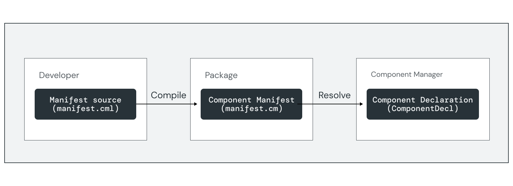

# Component manifests {#component-manifests}

<<../_v2_banner.md>>

A [component manifest](#component-manifest) is a file that defines a component
by encoding a [component declaration](#component-declaration). This document
gives an overview of the concepts used by component declarations.
Component declarations contain information about the following:

-   **Execution:** Details about the runtime and executable binary for
    components that include an [executable program][manifest-program].
-   **Composition:** [Child component instances][doc-children]
    and [dynamic collections][doc-collections] managed by this component.
-   **Capabilities:** [Routing rules][doc-capabilities] that describe how
    capabilities are provided and consumed between components.
-   **Metadata:** [Freeform data][manifest-facet], which is ignored by the
    component framework but can be interpreted by third parties.

Note: For complete details on component manifest attributes and syntax, see the
[CML reference](https://fuchsia.dev/reference/cml).

{: width="836"}

## Component manifest source {#component-manifest-source}

A [component manifest source][glossary.component manifest source] is a file that
encodes part of a component manifest. Component manifest sources are written in
component manifest language (CML), which is the developer-facing source format
for component manifests. CML files are [JSON5][json5-external]{: .external}
files that end with a `.cml` extension.

The [`cmc`][src-cmc] tool compiles component manifest sources to
[component manifests](#component-manifest) as a part of the build process.

## Component manifest {#component-manifest}

A [component manifest][glossary.component manifest] is a binary file that
encodes the [component declaration](#component-declaration), usually distributed
as part of a [package][glossary.package]. The binary format is the
[persistent encoded form][fidl-wire-encoded] of the component declaration FIDL
object.

A [component URL][doc-component-url] identifies a component in a package by its
component manifest resource path, typically ending in a `.cm` extension.

## Component declaration {#component-declaration}

A [component declaration][glossary.component declaration] describes what a
component can do, the capabilities it uses and exposes, its children, and other
information needed to run the component. Component declarations are represented
using the [`Component`][fidl-component-decl] FIDL table.

The framework calls a [component resolver][capability-resolver] to retrieve a
component declaration from a component URL.

[capability-resolver]: concepts/components/v2/capabilities/resolvers.md
[capability-runner]: concepts/components/v2/capabilities/runners.md
[doc-children]: concepts/components/v2/realms.md#child-component-instances
[doc-capabilities]: concepts/components/v2/capabilities/README.md
[doc-collections]: concepts/components/v2/realms.md#collections
[doc-component-url]: concepts/components/v2/identifiers.md#component-urls
[doc-environments]: concepts/components/v2/environments.md
[fidl-component-decl]: https://fuchsia.dev/reference/fidl/fuchsia.component.decl#Component
[fidl-wire-encoded]: reference/fidl/language/wire-format/README.md#dual-forms
[glossary.component declaration]: glossary/README.md#component-declaration
[glossary.component manifest]: glossary/README.md#component-manifest
[glossary.component manifest source]: glossary/README.md#component-manifest-source
[glossary.package]: glossary/README.md#package
[json5-external]: https://json5.org/
[manifest-program]: https://fuchsia.dev/reference/cml#program
[manifest-facet]: https://fuchsia.dev/reference/cml#facets
[src-cmc]: /tools/cmc
