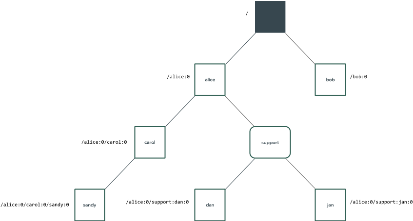

# Monikers (Components v2)

<<../_v2_banner.md>>

A moniker identifies a specific component instance in the component tree using
a topological path.

Note: Use [component URLs][doc-component-urls] to identify the location from
which the component's manifest and assets are retrieved; use monikers to
identify a specific instance of a component.

## Types

There are three types of monikers:

- Child moniker: Denotes a child of a component instance relative to its parent.
- Relative moniker: Denotes the path from a source component instance to a
  target component instance. It is expressed as a sequence of child monikers.
- Absolute moniker: Denotes the path from the root of the component instance
  tree to a target component instance. It is expressed as a sequence of child
  monikers. Every component instance has a unique absolute moniker.

## Stability

Monikers are stable identifiers. Assuming the component topology does not
change, the monikers used to identify component instances in the topology
will remain the same.

## Uniqueness

Each time a component instance is destroyed and a new component instance with
the same name is created in its place in the component topology (as a child
of the same parent), the new instance is assigned a unique instance identifier
to distinguish it from prior instances in that place.

Monikers include unique instance identifiers to prevent confusion of old
component instances with new component instances of the same name as the
tree evolves.

## Privacy

Monikers may contain privacy-sensitive information about other components that
the user is running.

To preserve the encapsulation of the system, components should be unable to
determine the identity of other components running outside of their own
realm. Accordingly, monikers are only transmitted on a need-to-know basis
or in an obfuscated form.

For example, components are not given information about their own absolute
moniker because it would also reveal information about their parents and
ancestors.

Monikers may be collected in system logs. They are also used to implement the
component framework's persistence features.

## Notation

This section describes the syntax used for displaying monikers to users.

### Instance and Collection Names

Parents assign names to each of their children. Dynamically created children
are arranged by their parent into named collections.

Syntax: Each name is a string of 1 to 100 of the following characters:
`a-z`, `0-9`, `_`, `.`, `-`.

See [component manifest][doc-manifests] documentation for more details.

### Instance Identifiers

Instance identifiers ensure the uniqueness of monikers over time whenever a
parent destroys a component instance and creates a new one with the same name.

Syntax: Decimal formatted 32-bit unsigned integer using characters: `0-9`.

### Child Monikers

Represented by the child's collection name (if any), name, and instance
identifier delimited by `:`.

Syntax: `{name}:{id}` or `{collection}:{name}:{id}`

The following diagram shows an example component topology,
with the children of `alice` labeled with their child monikers.

  

Examples:

- `carol:0`: child "carol" (instance id 0)
- `support:dan:1`: child "dan" (instance id 1) in collection "support"

### Relative Monikers

Represented by the minimal sequence of child monikers encountered when tracing
upwards from a source to the common ancestor of the source and target and then
downwards to the target.

A relative path begins with `.` and is followed by path segments. ` \ ` denotes
an upwards traversal segment. `/` denotes a downwards traversal segment. There
is no trailing ` \ ` or `/`.

Relative monikers are invertible; a path from source to target can be
transformed into a path from target to the source because information about
both endpoints are fully encoded by the representation.

In contrast, file system paths are not invertible because they use `..`
to denote upwards traversal so some inverse traversal information is missing.

To maintain invertibility, the syntax for denoting paths varies slightly
for upward and downward traversals. A downward path segment is a child moniker
of one of the current component instance's children: `./carol:2`. Conversely,
an upward path segment *is* the child moniker of on the current component
instance, according to its parent: `.\alice:2/bob:0`. The reason that the child
moniker is explicitly specified in the upward path
(instead of a generic "upward traversal" marker like `..`) is that otherwise the
relative moniker would not be invertible, and would not uniquely identify a
component instance. For downward traversals, the paths don't need to include
the parent's name to be traceable because a child only has *one* parent.
However, for upward traversals the source path can be one of many children of
its parent path.

Syntax: `.\{path from source to ancestor}/{path from ancestor to target}`

The following diagram shows an example component topology, with all relative
monikers that can be derived from the source component `alice` labeled. Note
that `support` is not a component but rather a collection with two
children: `dan` and `jan`.

  

Examples:

- `.`: self - no traversal needed
- `./carol:2`: a child - traverse down `carol:2`
- `./carol:2/sandy:1`: a grandchild - traverse down `carol:2` then down `sandy:1`
- `.\alice:2/bob:0`: a cousin - traverse up `alice:2` then down `bob:0`
- `./support:dan:1`: a child - traverse down into collection child `support:dan:1`

### Absolute Monikers

Represented by the absolute path from the root to the component instance as
a sequence of child monikers.

An absolute path begins with `/` and is followed by downwards traversal path
segments delimited by `/`. There is no trailing `/`.

Syntax: `/{path from root to target}`

The following diagram shows an example component topology, all absolute
monikers that can be derived from the unnamed root component labeled. The root
component is unnamed because it is inherently not the child of any other
component and components are named by their parents, not by components
themselves. Note that `support` is not a component but rather a collection with
two children: `dan` and `jan`.

  

Examples:

- `/`: the root itself (it has no name because it has no parent)
- `/alice:2/support:dan:1`: from root traverse down `alice:2` then down `support:dan:1`
- `/alice:2/carol:1`: from root traverse down `alice:2` then down `carol:1`

[doc-manifests]: component_manifests.md
[doc-component-urls]: introduction.md#component-urls
