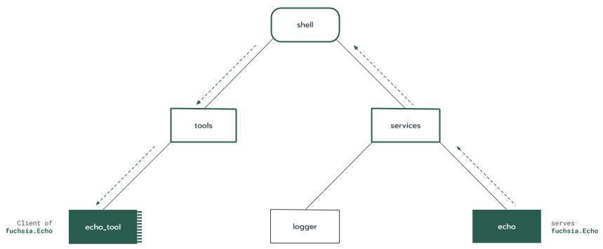
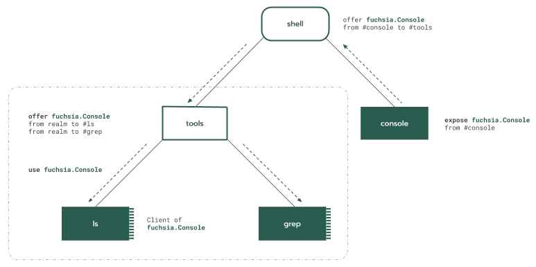

<!--
# Realms
 -->
# 领域

<!--
A [glossary.realm] is the term for any [glossary.component] and its
[children][glossary.child-component-instance]. In other words, realm is another
word for any sub-tree of the
[component instance tree][glossary.component-instance-tree].
 -->
[领域][glossary.realm]是任意[组件][glosossary.component]及其[子组件][glossary.child-component-instance]的术语。亦即，领域是[组件实例树][glossary.component-instance-tree]任意子树的同义词。

<!--
Component instances may contain [children](#child-component-instances). Each
[child component instance](/glossary#child-component-instance) in turn
defines its own [sub-realm](/glossary#sub-realm). The union of these
sub-realms, along with the
[parent component instance](/glossary#parent-component-instance), is
equivalent to a subtree. Therefore, it is common to conceive of a realm as a
component instance along with its set of children.
 -->
组件实例可能包含[子组件实例](#child-component-instances)。每个[子组件实例](/glossary#child-component-instance)依次定义其自己的[子领域](/glossary#sub-realm)。这些子领域的联合，连同[父组件实例](/glossary#parent-component-instance)，相当于一个子树。因此，通常将领域视为一个组件实例及其子实例集。

<!--
Realms play a special role in the component framework. A realm is an
*encapsulation boundary* for component instances. This means:
 -->
领域在组件框架中扮演着特殊的角色。领域是组件实例的“封装边界”（*encapsulation boundary*）。这意味着：

<!--
-   Realms act as a [capability](/glossary#capability) boundary. It's up to
    the realm to decide whether a capability originating in the realm can be
    [routed](/glossary#capability-routing) to component instances
    outside of the realm. This is accomplished through an [`expose`][expose]
    declaration in a [component manifest][component-manifests].
-   The internal structure of a sub-realm is opaque to the parent component
    instance. For example, the sub-realm could be structured either as one or
    multiple component instances, and from the perspective of the parent
    component instance this looks the same as long as the sub-realm
    [exposes][expose] the same set of capabilities.
 -->
-   领域充当[能力](/glossary#capability)边界。由领域来决定来源于其的能力是否可以[路由](/glossary#capability-routing) 到领域外的组件实例。这是通过[组件清单][component-manifests]中的 [`expose`][expose]（公开）声明来完成的。
-   子领域的内部结构对父组件实例是不透明的。例如，子领域可以构造为一个或多个组件实例，从父组件实例的角度来看，只要子领域[公开][expose]同一能力集，看起来都是一样的。

<!--
A realm also acts as an *ownership boundary*, that is, a child component
instance is the root of a sub-realm that is owned by the parent, who controls
its existence. See [Child component instances](#child-component-instances) for
more information.
 -->
领域也充当“所有权边界”（*ownership boundary*），即子组件实例是其父组件实例所拥有的子领域的根，并由父级控制其存在。要获取详细信息，请参阅[子组件实例](#child-component-instances)。

<!--
## Example
 -->
## 示例

<!--
Here is an example of a realm with a capability routed through it:
 -->
下面是一个领域的示例，一项能力通过它路由：

<!--
  
 -->
  

<!--
In this example, the `shell` component has two children: `tools` and `services`.
`services` has two children, `logger` and `echo`, while `tools` has one child
`echo_tool`. Components encapsulate their children, so while the `shell`
component sees its own children, it has no direct knowledge of its grandchildren
`echo_tool`, `logger`, or `echo`. Nevertheless, all of these component instances
are considered part of the `shell` realm.
 -->
本示例中，`shell` 组件有两个子组件：`tools`（工具）和 `services`（服务）。`services` 有两个子组件——`logger` 和 `echo`，而 `tools` 有一个子组件 `echo_tool`。组件封装了它们的子组件，因此，当 `shell` 组件看到自己的子组件时，它并不直接知道其孙子组件 `echo_tool`、`logger` 或 `echo`。然而，所有这些组件实例都被视为 `shell` 领域的一部分。

<!--
The arrows illustrate the path of an `fuchsia.Echo` service capability that is
routed through the realm from `echo` to `echo_tool`. The upward arrows
correspond to [`expose`][expose] declarations, while the downward arrows
represent [`offer`][offer] declarations. The `expose` declarations cause
`fuchsia.Echo` to be exposed outside of the capability boundary of the
corresponding realms. For example, if `services` did not expose `fuchsia.Echo`,
`shell` would not be aware that `fuchsia.Echo` exists, and could not offer the
service to its children or access it at runtime.
 -->
箭头描绘了通过领域路由从 `echo` 到 `echo_tool` 的 `fuchsia.Echo` 服务能力的路径。向上的箭头对应 [`expose`][expose] 声明，而向下的箭头代表 [`offer`][offer] 声明。 `expose` 声明使得 `fuchsia.Echo` 公开于相应领域的能力边界之外。例如，如果 `services` 没有公开 `fuchsia.Echo`，`shell` 将不知道 `fuchsia.Echo` 的存在，并且无法向其子组件提供服务，或在运行时对其访问。

<!--
For a more detailed walkthrough of capability routing with this example, see the
[component manifest capability routing example][component-manifest-examples].
 -->
要获取关于该示例能力路由的更详细的演示，请参阅[组件清单能力路由示例][component-manifest-examples]。

<!--
## Child component instances {#child-component-instances}
 -->
## 子组件实例 {#Child-Component-Instances}

<!--
Component instances may contain children. Child component instances are
considered part of the parent instance's definition and are wholly owned by the
parent. This has the following implications:
 -->
组件实例可能包含子组件实例。子组件实例被认为是父组件实例定义的一部分，并且由父组件实例完全拥有。这具有以下含义：

<!--
-   A component instance decides what children it contains, and when its
    children are created and destroyed.
-   A component instance cannot exist without its parent.
-   A component instance may not execute unless its parent is executing.
-   A component instance determines the capabilities available to its children
    by making [`offer`][offer] declarations to them.
-   A component instance has some degree of control over the behavior of its
    children. For example, a component instance may bind to capabilities exposed
    from the child's realm through the [`Realm`](#realm-framework-protocol)
    framework service, or set hooks to intercept child lifecycle events. This
    control is not absolute, however. For example, a component instance cannot
    use a capability from a sub-realm that was not explicitly exposed to it.
 -->
-   组件实例决定它包含哪些子组件实例，以及是何时创建和销毁的。
-   组件实例不能独立于其父组件实例存在。
-   组件实例不可执行，除非其父组件实例已在执行。
-   组件实例通过向其子组件实例进行 [`offer`][offer]（提供）声明来确定其子组件可用的功能。
-   组件实例对其子组件实例的行为有一定程度的控制。例如，组件实例可以通过 [`Realm`](#realm-framework-protocol)（领域）框架服务绑定到从子领域公开的能力，或者设置钩子来拦截子生命周期事件。然而，这种控制不是绝对的。例如，组件实例不能使用子领域未向其显式公开的能力。

<!--
There are two varieties of child component instances, [static](#static-children)
and [dynamic](#dynamic-children).
 -->
子组件实例有两个变种，[静态的](#static-children)和[动态的](#dynamic-children)。

<!--
### Static children {#static-children}
 -->
### 静态子组件实例 {#static-children}

<!--
A *static child* is a component instance that was statically declared in the
component's [manifest][component-manifests] by a [`children`][children]
declaration. This declaration is necessary and sufficient to establish the child
component instance's existence.
 -->
静态子组件实例（*static child*）在组件的[清单][component-manifests]中通过 [`children`][children] 声明。该声明是保证子组件实例存在的充要条件。

<!--
Typically, a child should be statically declared unless it has a reason to be
dynamic (see [Dynamic children](#dynamic-children)). When a child is statically
declared, its definition and capabilities can be audited and capabilities can be
statically routed from it.
 -->
通常，应静态声明子组件实例，除非其有理由是动态的（请参阅[动态子组件实例](#dynamic-children)）。当静态声明时，其定义和能力可以审查，并且其能力可以向外静态路由。

<!--
A static child is defined, foremost, by two pieces of information:
 -->
静态子组件实例最主要通过两条信息来定义：

<!--
-   The child instance's *name*. The name is local to the parent component
    instance, and is used to form [monikers][monikers]. It is valid to declare
    multiple children with the same URL and different names.
-   The child instance's [component URL][component-urls].
 -->
-   子实例的“名称”。该名称对父组件实例而言是本地的，用于形成[代称][monikers]。声明多个具有相同网址和不同名称的子实例是有效的。
-   子实例的[组件网址][component-urls]。

<!--
For information on providing additional configuration information to child
declarations, see [children][children].
 -->
要获取关于向子实例声明提供额外配置信息的内容，请参阅[子组件实例][children]。

<!--
### Dynamic children {#dynamic-children}
 -->
### 动态子组件实例 {#dynamic-children}

<!--
A *dynamic child* is a component instance that was created at runtime in a
[component collection](#collections). A dynamic child is always scoped
to a particular collection. Dynamic children can be used to support use cases
where the existence or cardinality of component instances cannot be determined
in advance. For example, a testing realm might declare a collection in which
test component instances can be created.
 -->
动态子组件实例（*dynamic child*）在运行时创建于[组件集合](#collections)中。动态子实例总是局限于特定的集合中。动态子实例可用于支持组件实例的存在或基数无法事先确定的使用情况。例如，测试领域可能会声明可以创建测试组件实例的集合。

<!--
Most of the metadata to create a dynamic child is identical to that used to
declare a static instance, except that it's provided at runtime. The name of a
dynamic child is implicitly scoped to its collection; thus it is possible to
have two dynamic children in two different collections with the same name.
 -->
创建动态子实例的元数据大多数与用于声明静态子实例的相同，除了前者是在运行时提供的。动态子实例的名称隐含地局限在其集合中。因此，两个不同的集合中可以有两个具有相同名字的动态子组件实例。

<!--
Capabilities cannot be statically routed from dynamic instances. This is an
inherent restriction: there's no way to statically declare a route from a
capability exposed by a dynamic instance. However, certain capabilities can be
routed from the collection as a whole. TODO: service directories as an example
 -->
能力不能静态路由自动态实例。这是固有限制：无法静态声明从动态实例公开能力的路由。然而，某些能力可以作为整体而路由自集合。TODO：服务目录为例

<!--
### Component collections {#collections}
 -->
### 组件集合 {#collections}

<!--
A *collection* is a container for [dynamic children](#dynamic-children) that
may be created and destroyed at runtime using the
[Realm](#realm-framework-protocol) framework service.
 -->
集合（collection）是[动态子组件实例]（#dynamic-children）的容器，可以在运行时使用[领域](#realm-framework-protocol)框架服务创建和破坏。

<!--
Collections support two modes of *durability*:
 -->
集合支持两种“持续”（*durability*）模式：

<!--
-   *Transient*: The instances in a *transient* collection are automatically
    destroyed when the instance containing the collection is stopped.
-   *Single Run*: The instances in a *single run* collection are started when
    they are created, and destroyed when they are stopped. This means that the
    instances in a single run collection can only be run once.
 -->
-   **暂时**：当包含该集合的实例停止时，“暂时”集合中的实例会自动销毁。
-   **单次运行**：“单次运行”集合中的实例在创建时启动，在停止时销毁。这意味着单次运行集合中的实例只能运行一次。

<!--
For more information about component execution and persistence, see
[lifecycle][lifecycle].
 -->
要获取关于组件执行和持久性的更多信息，请参阅[生命周期][lifecycle]。

<!--
Collections are declared in the [`collections`][collections] section of a
component manifest. When an [`offer`][offer] declaration targets a collection,
the offered capability is made available to every instance in the collection.
Some capabilities can be exposed or offered from the collection as a whole, as
an aggregation over the corresponding capabilities exposed by the instances in
the collection.
 -->
集合在组件清单的 [`collections`][collections] （集合）部分声明。当 [`offer`][offer] （提供）声明以集合为目标时，所提供的能力可用于集合中的每个实例。某些能力可以作为整体自集合公开或提供，作为集合中实例公开的相应能力的聚合。

<!--
TODO: service directories as an example
 -->
TODO：服务目录为例

<!--
#### Example
 -->
#### 示例

<!--
The following diagram illustrates a realm with a collection:
 -->
下图说明了一个带有集合的领域：

<!--
  
 -->
  

<!--
In this example, the `shell` component declares a static child `console` and a
collection `(tools)`, highlighted by the grey background (the `()` notation
denotes a collection). `(tools)` contains two dynamic instances, `ls` and
`grep`. These instances are dynamic children of `shell`, scoped to `(tools)`.
The use of a collection implies that the existence of `ls` and `grep` is not
known in advance. This is plausible if you imagine that `ls` and `grep` are
command-line tools that are instantiated on demand as the user requests them.
 -->
本例中，`shell` 组件声明了静态子组件实例 `console`（控制台）和集合 `(tools)`（工具）（以灰色背景突出显示，`()` 表示集合）。`(tools)` 包含两个动态实例——`ls` 和 `grep`。这些实例是 `shell` 的动态子实例，范围为 `(tools)`。集合的使用意味着 `ls` 和 `grep` 的存在是不可预知的。如果您将 `ls` 和 `grep` 想象为根据用户需求而实例化命令行工具，那么这看起来是合理的。

<!--
The example also illustrates a capability routing path with the arrows. First,
`console` [exposes][expose] `fuchsia.Console` to its parent `shell`, which
[offers][offer] it to `(tools)`. `fuchsia.Console` then becomes available for
any component instance in the collection to [use][use] -- it does not need to be
routed to the dynamic instances independently.
 -->
该示例还用箭头描绘了的能力路由路径。首先，`console` 向其父实例 `shell`[公开][expose] `fuchsia.Console`，父实例又将其[提供][offer]给 `(tools)`。然后，`fuchsia.Console` 可供集合中的任何组件实例[使用][use]，而不需要单独路由到动态实例。

<!--
## Environments {#environments}
 -->
## 环境 {#environments}

<!--
Every realm is assigned an [environment][environments], which configures certain
choices the framework makes for components in a realm. For example,
[runner capabilities][runners] are registered to an environment, which makes
them available to any component instance in the realm. Read
[Environments][environments] for information on what properties are configurable
through the environment.
 -->
每个领域都分配有[环境][environments]，它配置框架为领域中的组件所做的某些选择。例如，[运行器能力][runners]被注册到一个环境中，使其可用于对应领域中的任何组件实例。要获取关于可通过环境配置的属性的信息，请参阅[环境][environments]。

<!--
## The Realm framework protocol {#realm-framework-protocol}
 -->
## 领域框架协议 {#Realm-Framework-protocol}

<!--
There is a [framework protocol][framework-protocols] available to every
component, [`fuchsia.component.Realm`][realm.fidl]. The `Realm` protocol provides
APIs for a component instance to manage the children in its realm, such as
binding to children and creating dynamic children. See the linked FIDL
definitions for full documentation.
 -->
有一个[框架协议][framework-protocols]可用于各个组件，它就是 [`fuchsia.component.Realm`][realm.fidl]。`Realm`（领域）协议为组件实例提供 API 来管理其领域中的子组件，例如绑定到子组件和创建动态子组件。要获取完整文档，请参阅链接的 FIDL 定义。

[glossary.storage capability]: /glossary/README.md#storage-capability
[children]: https://fuchsia.dev/reference/cml#children
[collections]: https://fuchsia.dev/reference/cml#collections
[component-manifest-examples]: ./component_manifests.md#examples
[component-manifests]: ./component_manifests.md
[component-urls]: /concepts/components/v2/identifiers.md#component-urls
[environments]: ./environments.md
[expose]: https://fuchsia.dev/reference/cml#expose
[offer]: https://fuchsia.dev/reference/cml#offer
[framework-protocols]: ./capabilities/protocol.md#framework
[monikers]: ./identifiers.md#monikers
[realm.fidl]: https://fuchsia.dev/reference/fidl/fuchsia.component#Realm
[runners]: ./capabilities/runners.md
[topology-instance-tree]: ./topology.md#component-instance-tree
[use]: https://fuchsia.dev/reference/cml#use
[lifecycle]: /concepts/components/v2/lifecycle.md
