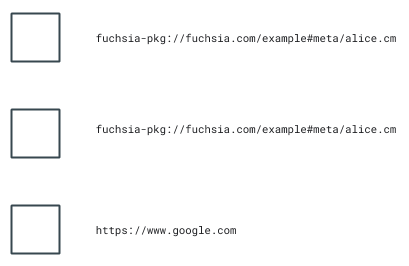
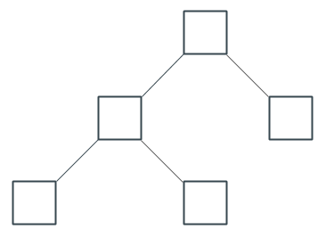
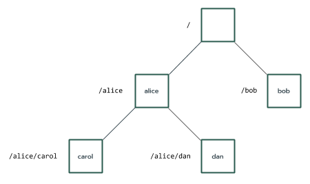
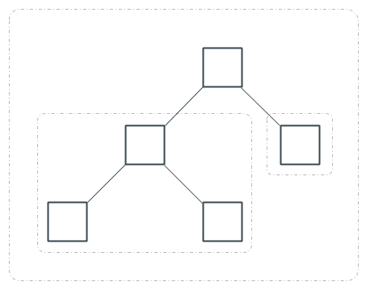
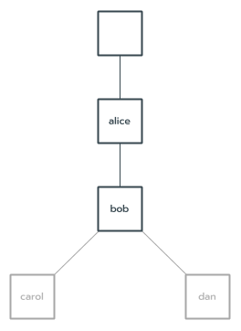
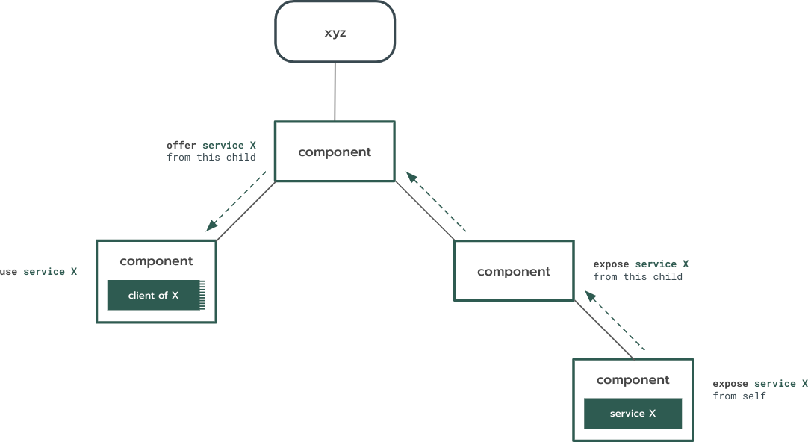

# Component topology

<<../_v2_banner.md>>

The _[component topology][glossary.component topology]_ is a general concept
that expresses the set of relationships between
[component instances](#component-instances).

These relationships are the following:

-   Component instance tree: Describes how component instances are
    [composed](#composition) together (their parent-child relationships).
-   Capability routing graph: Describes how component instances gain access to
    use capabilities published by other component instances (their
    provider-consumer relationships).

## Component instances {#component-instances}

A _component instance_ is a distinct embodiment of a
[component][glossary.component] running in its own sandbox that is isolated from
other component instances (including other instances of the same component).

You can often use the terms component and component instance interchangeably
when the context is clear. For example, it would be more precise to talk about
"starting a component instance" rather than "starting a component" but you can
easily infer that "starting a component" requires an instance of that component
to be created first so that the instance can be started.

While components are identified by a [URL][doc-component-urls], component
instances are identified by a [moniker](#monikers). Different instances of the
same component thus share the same URL but have different monikers.

  

## Component instance tree {#composition}

The _component instance tree_ expresses how components are assembled together to
make more complex components.

Using hierarchical composition, a parent component creates instances of other
components, which are known as its _children_. The child instances belong to the
parent and depend on the parent to provide them with the capabilities that they
need to run. Meanwhile, the parent gains access to the capabilities exposed by
its children through [capability routing](#capability-routing).

Children can be created in two ways:

-   Statically: The parent declares the existence of the child in its own
    [component declaration][doc-component-declaration]. The child is destroyed
    automatically if the child declaration is removed in an updated version of
    the parent's software.
-   Dynamically: The parent uses the
    [Realm framework protocol][doc-realm-framework-protocol] to add a child to a
    [component collection][doc-collections] that the parent declared. The parent
    destroys the child in a similar manner.

The component topology represents the structure of these parent-child
relationships as a [component instance tree][glossary.component-instance-tree].

  

## Monikers {#monikers}

A _moniker_ identifies a specific component instance in the component tree using
a topological path. There are three types of monikers, depending on how the
moniker is being used and kind of relationship it's describing: absolute,
relative, and child.

See the [monikers documentation][doc-monikers] for more information.

  

## Realms {#realms}

A _realm_ is a subtree of the component instance tree. Each realm is rooted by a
component instance and includes all of that instance's children and their
descendants. Put another way, realms express
[hierarchical composition](#composition) of component instances.

Realms are important [encapsulation](#encapsulation) boundaries in the component
topology. The root of each realm receives certain privileges to influence the
behavior of components, such as:

-   Declaring how capabilities flow into, out of, and within the realm.
-   Binding to child components to access their capabilities.
-   Creating and destroying child components.

See the [realms documentation][doc-realms] for more information.

  

## Encapsulation {#encapsulation}

A component acts as an encapsulation boundary. Capabilities cannot escape a
component's [realm](#realms) unless explicitly allowed to by an
[expose][doc-expose] declaration.

Children remain forever dependent upon their parent; they cannot be reparented
and they cannot outlive their parent. When a parent is destroyed so are all of
its children.

This model resembles [composition][wiki-object-composition]{:.external} in
object-oriented programming languages.

See the [realms documentation][doc-realms] for more information.

  

## Capability routing graph {#capability-routing}

The _capability routing graph_ describes how components gain access to use
capabilities exposed and offered by other components in the component instance
tree. For a capability provided by a component instance to be usable by a
consumer component instance, there must be capability routing path between them.
Such capability routes are determined by `use`, `offer`, and `expose`
declarations in [component declarations][doc-component-declaration].

See the [capability routing documentation][doc-capability-routing] for more
information.

  

[glossary.component]: /glossary/README.md#component
[glossary.component instance tree]: /glossary/README.md#component-instance-tree
[glossary.component topology]: /glossary#component-topology
[doc-collections]: /concepts/components/v2/realms.md#collections
[doc-environments]: /concepts/components/v2/environments.md
[doc-expose]: https://fuchsia.dev/reference/cml#expose
[doc-realms]: /concepts/components/v2/realms.md
[doc-realm-framework-protocol]: /concepts/components/v2/realms.md#realm-framework-protocol
[doc-monikers]: /concepts/components/v2/identifiers.md#monikers
[doc-component-urls]: /concepts/components/v2/identifiers.md#component-urls
[doc-capability-routing]: /concepts/components/v2/capabilities/README.md#routing
[doc-component-declaration]: /concepts/components/v2/component_manifests.md#component-declaration
[wiki-least-privilege]: https://en.wikipedia.org/wiki/Principle_of_least_privilege
[wiki-object-composition]: https://en.wikipedia.org/wiki/Object_composition
