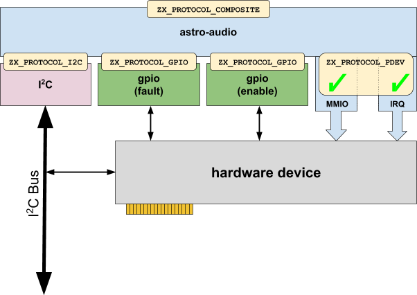
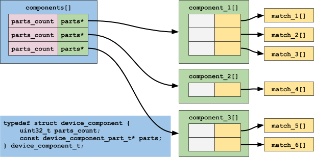
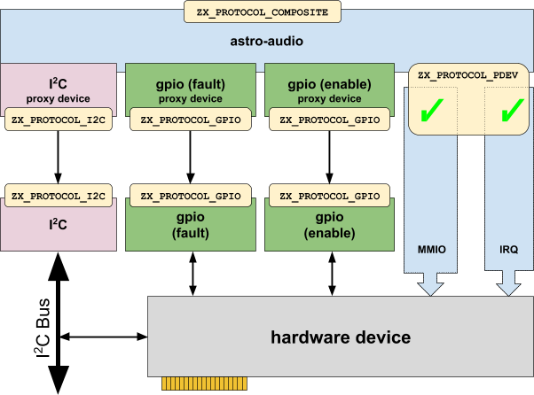

# Composite devices

[TOC]

## Introduction

In this section, we look at **composite devices**.
A composite device is a device composed of other devices.

These devices address the case of hardware-level composition,
in which a "device" (from the user's perspective) is implemented by several
distinct hardware blocks.

Examples include:

* a touch panel composed of an I2C device and a GPIO,
* an ethernet device composed of a MAC chip and one or more PHYs, or
* an audio device composed of an audio controller and a set of codecs.

In these situations, the relationship of the hardware is known to the board
driver at boot time (either statically or through a dynamic means, such as
ACPI).

We'll use the `astro-audio` device for our examples:



This device features:

* an I2C bus interface
* two sets of GPIOs (one for fault, one for enable)
* MMIO (memory mapped I/O) for bulk data transfer, and
* an IRQ (interrupt request) line to generate interrupts to the driver.

Note that the `ZX_PROTOCOL_I2C` and `ZX_PROTOCOL_GPIO` protocols are used to
transfer data; that is, I2C messages, and GPIO pin status are sent and received
through the respective drivers.

The `ZX_PROTOCOL_PDEV` part is different.
Here, the protocol is used only to grant access (the green checkmarks in the
diagram) to the MMIO and IRQ; the actual MMIO data and interrupts are **not**
handled by the `PDEV`; they're handled directly by the `astro-audio` driver
itself.

## Creating a composite device

To create a composite device, a number of data structures need to be set up.

### Binding instructions

We need a number of binding instructions (`zx_bind_inst_t`) that tell us which
devices we match.
These binding instructions are the ones discussed in the
["Registration" topic](/docs/development/drivers/developer_guide/simple.md#Registration) in the introduction section.

For the `astro-audio` device, we have:

```c
static const zx_bind_inst_t root_match[] = {
    BI_MATCH(),
};

static const zx_bind_inst_t i2c_match[] = {
    BI_ABORT_IF(NE, BIND_PROTOCOL, ZX_PROTOCOL_I2C),
    BI_ABORT_IF(NE, BIND_I2C_BUS_ID, ASTRO_I2C_3),
    BI_MATCH_IF(EQ, BIND_I2C_ADDRESS, I2C_AUDIO_CODEC_ADDR),
};

static const zx_bind_inst_t fault_gpio_match[] = {
    BI_ABORT_IF(NE, BIND_PROTOCOL, ZX_PROTOCOL_GPIO),
    BI_MATCH_IF(EQ, BIND_GPIO_PIN, GPIO_AUDIO_SOC_FAULT_L),
};

static const zx_bind_inst_t enable_gpio_match[] = {
    BI_ABORT_IF(NE, BIND_PROTOCOL, ZX_PROTOCOL_GPIO),
    BI_MATCH_IF(EQ, BIND_GPIO_PIN, GPIO_SOC_AUDIO_EN),
};
```

These binding instructions are used to find the devices.

We have four binding instruction arrays; a `root_match[]`, which contains
common information for the other three, and then the three devices:
the I2C (`i2c_match[]`) device and the two GPIOs (`fault_gpio_match[]` and
`enable_gpio_match[]`).

These instructions are then placed into an array of structures
(`device_fragment_part_t`), which defines each fragment:


In the `astro-audio` device, we have:

```c
static const device_fragment_part_t i2c_fragment[] = {
    { countof(root_match), root_match },
    { countof(i2c_match), i2c_match },
};

static const device_fragment_part_t fault_gpio_fragment[] = {
    { countof(root_match), root_match },
    { countof(fault_gpio_match), fault_gpio_match },
};

static const device_fragment_part_t enable_gpio_fragment[] = {
    { countof(root_match), root_match },
    { countof(enable_gpio_match), enable_gpio_match },
};
```

At this point, we have three fragment devices, `i2c_fragment[]`,
`fault_gpio_fragment[]`, and `enable_gpio_fragment[]`.

### Fragment device matching rules

The following rules apply:

1. The first element must describe the root of the device tree &mdash; this
   is why we've used the mnemonic `root_match` identifier.
   Note that this requirement is likely to change, since most users provide
   an "always match" anyway.
2. The last element must describe the target device itself.
3. The remaining elements must match devices on the path from the root to
   the target device, in order.
   Some of those **devices** may be skipped, but every **element** must
   be matched.
4. Every device on the path that has a property from the range
   `BIND_TOPO_START` through `BIND_TOPO_END` (basically buses, like I2C
   and PCI) must be matched.
   These sequences of matches must be unique.

Finally, we combine them into an aggregate called `fragments[]` of type
`device_fragment_t`:



This now gives us a single identifier, `fragments[]`, that we can use
when creating the composite device.

In `astro-audio`, this looks like:

```c
static const device_fragment_t fragments[] = {
    { "i2c", countof(i2c_fragment), i2c_fragment },
    { "gpio-fault", countof(fault_gpio_fragment), fault_gpio_fragment },
    { "gpio-enable", countof(enable_gpio_fragment), enable_gpio_fragment },
};
```

### Creating the device

For simple (non-composite) devices, we used **device_add()** (which we
saw in the ["Registration" section](/docs/development/drivers/developer_guide/simple.md#Registration) previously).

For composite devices, we use **device_add_composite()**:

```c
zx_status_t device_add_composite(
    zx_device_t* dev,
    const char* name,
    const zx_device_prop_t* props,
    size_t props_count,
    const device_fragment_t* fragments,
    size_t fragments_count,
    uint32_t coresident_device_index);
```

The arguments are as follows:

Argument                  | Meaning
--------------------------|---------------------------------------------------
`dev`                     | Parent device
`name`                    | The name of the device
`props`                   | Properties ([see "Declaring a Driver"](/docs/development/drivers/developer_guide/driver-development.md#declaring-a-driver))
`props_count`             | How many entries are in `props`
`fragments`              | The individual fragment devices
`fragments_count`        | How many entries are in `fragments`
`coresident_device_index` | Which driver host to use

The `dev` value must be the `zx_device_t` corresponding to the "`sys`"
device (i.e., the platform bus driver's device).

Note that the `coresident_device_index` is used to indicate which driver host
the new device should use.
If you specify `UINT32_MAX`, the device will reside in a new driver host.

> Note that `astro-audio` uses **pbus_composite_device_add()** rather
> than **device_add_composite()**.
> The difference is that **pbus_composite_device_add()** is an API
> provided by the platform bus driver that wraps **device_add_composite()** and
> inserts an additional fragment for ferrying over direct-access resources
> such as MMIO, IRQs, and BTIs.

## Using a composite device

From a programming perspective, a composite device acts like an ordinary device,
but it has no banjo protocol. This allows you to access all of the individual
fragments that make up the composite device.

The first thing to retrieve a device for each fragment.
This is done with **device_get_fragment()**:

```c
bool device_get_fragment (
     zx_device_t* parent,
     const char* fragment_name,
     zx_device_t** fragment);
```

The arguments are as follows:

Argument          | Meaning
------------------|---------------------------------------------------
`parent`          | Pointer to `zx_device_t` representing parent
`fragment_name`   | The name of the fragment you wish to fetch
`fragment`        | Pointer to `zx_device_t` representing the fragment

The program starts by declaring an array of `zx_device_t*` pointers to hold the
devices, and call **device_get_fragment()**:

```
zx_device_t* fragment;
bool found = device_get_fragment(&composite, "fragment-name", &fragment);
if (!found) {
    zxlogf(ERROR, "could not get fragment-name");
    return ZX_ERR_INTERNAL;
}
```

> The name of fragment supplied to **device_get_fragment()**
> is the same as the one in **device_fragment_t** entries supplied to
> the **device_add_composite()** call by the board driver.

## Advanced Topics

Here we discuss some specialized / advanced topics.

### Composite devices and proxies

What's actually going on in the `astro-audio` driver is a little more complex than
initially shown:



The fragments are bound to an internal driver (located in the
[//src/devices/internal/drivers/fragment][fragment] directory).

The driver handles proxying across process boundaries if necessary.
This proxying uses the `DEVICE_ADD_MUST_ISOLATE` mechanism (introduced
in the [Isolate devices][isolate] section).

When a device is added with `DEVICE_ADD_MUST_ISOLATE`, two devices
end up being created:
the normal device, in the same process as its parent, and a proxy.

The proxy is created in a new driver host; if the normal device's
driver is `normal.so`, then its driver is `normal.proxy.so`.
This driver is expected to implement a **create()** method, which calls
**device_add()** and stashes the IPC channel it's given.
That channel will be used later for communicating with the normal
device in order to satisfy the proxy's children's requests.

The normal device implements the `rxrpc` hook, which is invoked by
the driver runtime each time a message is received from the channel
shared with the proxy.

So, in order to implement a new protocol proxy, one must modify the
`fragment.proxy.so` drivers to handle the desired protocol by sending
messages to the normal device, and modify the `fragment.so` driver to
service those messages appropriately.

The fragment proxy is implemented in
[/src/devices/internal/drivers/fragment/fragment-proxy.cc][fragment-proxy.cc], and
the other half in
[/src/devices/internal/drivers/fragment/fragment.cc][fragment.cc].

<!-- xrefs -->

[fragment-proxy.cc]: /src/devices/internal/drivers/fragment/fragment-proxy.cc
[fragment.cc]: /src/devices/internal/drivers/fragment/fragment.cc
[fragment]: /src/devices/internal/drivers/fragment/
[driver.h]: /src/lib/ddk/include/ddk/driver.h
[isolate]: /docs/development/drivers/developer_guide/driver-development.md#isolate-devices

<!-- diagram source at https://docs.google.com/document/d/1JKLPaHmoISdS23TFHgDmxJgIb78TS_t4TNDnbd6PXiE/edit?usp=sharing -->
