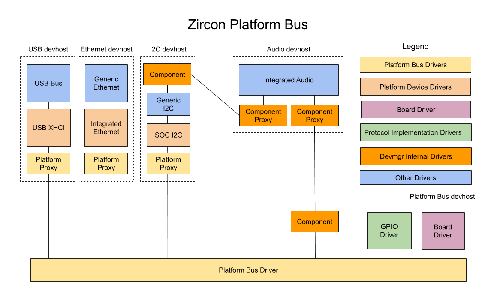

# Platform Bus

## Introduction

The term **platform bus** refers to a specific Fuchsia driver with source code located at
[//fuchsia/src/devices/bus/drivers/platform/](/src/devices/bus/drivers/platform/).
However this term also refers to the framework that manages the lower level drivers in Fuchsia.
In this document, **platform bus driver** refers to a specific driver and **platform bus**
refers to the general framework.

The platform bus as a whole contains several types of drivers:

- The **platform bus driver**, which manages the platform bus. This is a generic driver
with no hardware specific functionality. The platform bus driver is started automatically
by the driver manager when the system boots.

- The **board driver**, which is the first driver loaded by the platform bus driver.
The board driver contains all the platform specific information needed by the platform bus
and controls what other drivers will be loaded by the platform bus.
On arm64 platforms, the platform bus driver uses information from the bootloader or boot shim
to bind the correct board driver for the platform it is running on.
On x86 platforms, the platform bus driver always loads the x86 board driver and creates platform
devices based on information from ACPI.

- The **platform device drivers** are the foundations for the higher level drivers in Fuchsia.
These drivers provide the lowest level of support for a particular feature, like USB,
eMMC or NAND storage, etc., with higher level drivers loading on top of that.

- The **protocol implementation drivers** are drivers that provide protocols that are needed
by the board driver. One common example of this is the GPIO driver, which is often needed by the
board driver for pin-muxing. In the past, the platform bus used to also proxy these drivers'
protocols to platform devices, but now we use composite devices instead.
Over time, we will likely phase out the use of protocol implementation drivers in the platform bus
and replace it with a new approach that does not require blocking to wait for drivers to load.

- Finally, the **platform proxy driver** a companion to the platform bus driver that loads
into the platform device driver hosts. This driver supports proxying the platform device protocol
and other resource protocols from the platform device driver to the platform bus driver and
protocol implementation drivers. This is needed because the platform device drivers run in a
different driver host process than the platform bus driver and the protocol implementation drivers.

Source: [https://goto.google.com/zircon-platform-bus-diagram](https://goto.google.com/zircon-platform-bus-diagram)

## Platform Bus Initialization

The platform bus driver is started automatically by the driver manager at boot.
Since the platform bus driver is a generic driver that contains no information about the
platform it is running on, it first loads the board driver, which handles platform specific logic.
To determine which board driver to load, platform bus driver reads the `ZBI_TYPE_PLATFORM_ID`
record from the [ZBI data](/zircon/system/public/zircon/boot/image.h) passed from the
bootloader. It then adds a device with protocol `ZX_PROTOCOL_PBUS` with the
`BIND_PLATFORM_DEV_VID` and `BIND_PLATFORM_DEV_PID` binding variables set to the vid and did
from the platform data record. The correct board driver will bind to this device and continue
the platform bus initialization process. On x86 platforms, the x86 board driver is loaded
automatically.

The board driver uses the platform bus protocol to communicate with the platform bus driver.
After it does its own initialization, the board driver then uses the `ProtocolDeviceAdd()`
call in the platform bus protocol to load protocol implementation drivers.
After the protocol implementation driver loads, it must register its protocol with the platform bus
driver by calling the platform bus `RegisterProtocol()` API.
`ProtocolDeviceAdd()` will block until the driver calls `RegisterProtocol()`, so the board driver
must call `RegisterProtocol()` from one of its own threads rather than a driver manager callback like
`Bind()`.

After the protocol devices are added, the board driver will call the `DeviceAdd()` call
in the platform bus protocol to create platform devices, which will result in
platform device drivers loading each in its own driver host.
After the platform devices are created, the platform bus initialization is complete.

## Composite Platform Devices

The platform bus also supports adding platform devices to be used as components in composite
devices. The platform bus `CompositeDeviceAdd()` call adds a composite device, with the zeroth
component being a platform device described by the provided `PBusDev` struct.
The binding rules for the remaining components are provided by the `components` parameter.
The `coresident_device_index` is used to specify which driver host the composite device
should be created in. A value of `UINT32_MAX` will result in a new driver host being created for the
composite device, while a value of 1 through n will add the composite device to the driver host of one
of the other components. Passing 0 is not allowed, since we do not want the composite device
to be added to the platform bus driver's driver host.

The internals of composite platform devices are a bit different than the non-composite case.
Instead of using the platform proxy driver, the driver manager **component** and **component proxy** drivers
proxy the platform device protocol instead. For example, in the diagram above we have a composite device
for an audio driver with a platform device as its first component and an I2C channel as its second.
The audio driver is started in a new driver host, and the driver manager component and component proxy drivers
are responsible for proxying the PDEV and I2C protocols to the audio driver.

## Platform Device Protocol

The [platform device protocol](/sdk/banjo/fuchsia.hardware.platform.device/platform-device.fidl)
(`ZX_PROTOCOL_PDEV`) is the main protocol provided by the platform bus to
platform device drivers. This protocol provides access to resources like MMIO ranges, interrupts,
BTIs, and SMC ranges to the platform device driver. Rather than requesting MMIOs and interrupts by
physical addresses or IRQ numbers, these resource are requested by a zero-based index.
This allows us to have platform device drivers for particular IP that works across multiple
platforms, since the knowledge of the exact MMIO addresses and interrupt numbers do not need to be
known by the driver. Instead, the board driver configures the MMIO addresses and IRQ numbers in the
`PbusDev` struct passed with `AddDevice()`.

The platform device protocol is also available to protocol implementation drivers.
For example, a GPIO driver may use the platform device protocol to access its MMIO and interrupts.
This allows protocol implementation drivers to be shared among different SOC variants,
where the functionality may be identical but the MMIO addresses and interrupt numbers may be
different.

## Platform Bus Protocol

The [platform bus protocol](/sdk/banjo/fuchsia.hardware.platform.bus/platform-bus.fidl)
(`ZX_PROTOCOL_PBUS`) is used by board drivers and protocol implementation drivers
to communicate with the platform bus driver. It is only available to drivers running in the
platform bus's driver host (in particular, it is not accessible to platform device drivers).
The purpose of this protocol is for the board driver to load protocol implementation drivers
and to start platform device drivers. It is also used by protocol implementation drivers to
register their protocols with the platform bus so their protocols can be made available
to platform device drivers.

