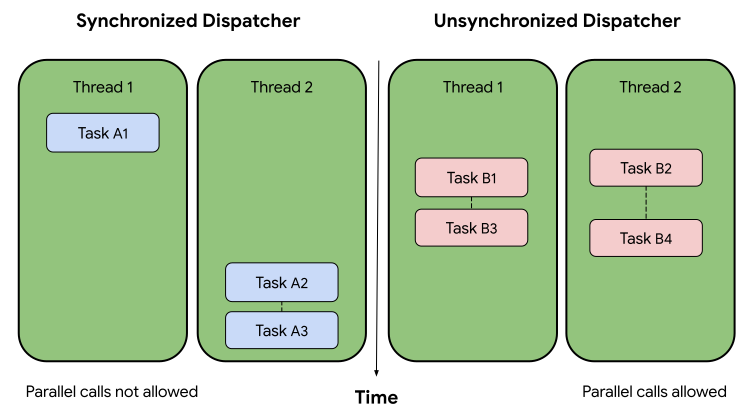
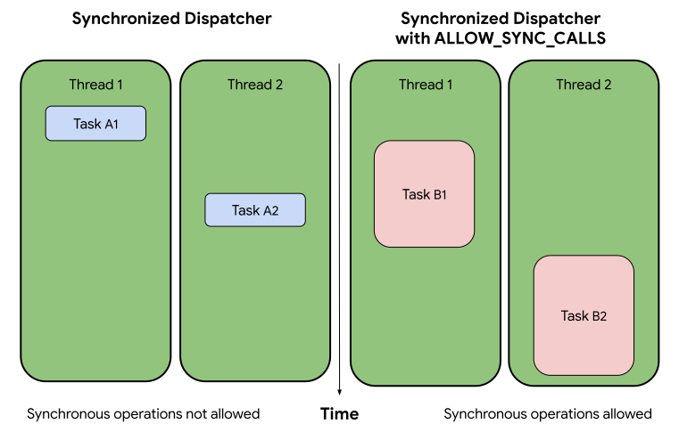

# Driver dispatcher and threads

Dispatchers enable drivers to schedule asynchronous work on threads available
in a [driver host][driver-host]. These shared threads, managed by the
[driver runtime][driver-runtime], allow for better overall performance and
thread safety among drivers in a driver host. Drivers are strongly discouraged
from spawning their own threads.

Fuchsia’s [driver framework][driver-framework] offers
[`fdf::Dispatcher`][fdf-dispatcher], which is the recommended dispatcher to be
used with Fuchsia drivers. This driver dispatcher supports the following
features:

- Enforce a specified [threading model](#threading-model).
- Enforce no [reentrancy](#reentrancy-guarantees).
- Enable [driver transport FIDL][driver-transport] for in-process
  driver-to-driver communication.
- Provide an implementation of the [`async`][async-lib] library as an interface
  for initiating asynchronous operations.

## Dispatcher operations {:#dispatcher-operations}

A dispatcher, assigned to a driver, coordinates and performs asynchronous
operations for the driver. All dispatchers in a driver host (therefore, in the
same process) are backed by a pool of shared threads managed by the
driver runtime. Dispatchers can only operate within a driver runtime environment,
such as a driver host or a driver testing framework (for example,
[`DriverTestLoopFixture`][driver-test-loop-fixture]).

A dispatcher mainly handles two tasks: it schedules asynchronous work to run on
threads in a driver host (in response to a callback created by a driver or a
driver host) and it actually runs the work on those threads on behalf of
a driver (or “calls into a driver”).

A dispatcher may call into a driver in the following common scenarios:

- A driver hook is run (see [Default dispatcher](#default-dispatcher)).
- A callback for a previously registered asynchronous operation is run.
  - A posted [task][async-cpp-task] is ready.
  - A [wait][async-cpp-wait] has been signaled.
  - A FIDL request or response is received.
- The dispatcher is shutting down
  (see [Shutting down dispatchers](#shutting-down-dispatchers)).

## Threading model {:#threading-model}

Dispatchers in a driver host may be created with different options to configure
their own threading model for:

- Making parallel calls into a driver
  (see [Synchronized and unsynchronized](#synchronized-and-unsynchronized))
- Scheduling blocking operations
  (see [Synchronous operations](#synchronous-operations))

### Synchronized and unsynchronized {:#synchronized-and-unsynchronized}

Created with the `FDF_DISPATCHER_OPTION_SYNCHRONIZED` option, synchronized
dispatchers never make parallel calls into a driver. This may be thought of as a
single-threaded dispatcher, with the caveat that it makes no guarantee that the
dispatcher calls into a driver from the same thread each time
(see [Thread local storage](#thread-local-storage)).

Created with the `FDF_DISPATCHER_OPTION_UNSYNCHRONIZED` option, unsynchronized
dispatchers may make parallel calls into a driver. However, with this option,
there are no ordering guarantees; the driver is in charge of all synchronization
of state. Therefore, when possible, it is preferable to use a synchronized
dispatcher to avoid such complexity.

<!--
Diagram source: https://docs.google.com/drawings/d/1WjTg6I-sk-ByDnrDlCq4Nv4uYzVIPpKsSI444QqFK04/edit?usp=sharing&resourcekey=0-bX0UaNyWTzqSqE7XKWfVgA
-->

**Figure 1**. A timeline of callbacks scheduled by synchronized and
unsynchronized dispatchers.

As shown in Figure 1, the synchronized dispatcher shows no parallel callbacks
while the unsynchronized dispatcher shows multiple parallel callbacks.

### Synchronous operations {:#synchronous-operations}

In general, drivers are discouraged from making synchronous calls because
they can block other tasks from running. However, if necessary, a driver
can create a dispatcher with the `FDF_DISPATCHER_OPTION_ALLOW_SYNC_CALLS`
option, which is only supported for
[synchronized dispatchers](#synchronized-and-unsynchronized).

This option spawns an additional thread in the thread pool when the dispatcher
is created. This helps the driver runtime mitigate the chances that synchronous
calls introduced by the driver would block other drivers in the same driver
host.

**Figure 2**. A timeline of callbacks scheduled by synchronized dispatchers with
and without the `FDF_DISPATCHER_OPTION_ALLOW_SYNC_CALLS` option.

<!--
Diagram source: https://docs.google.com/drawings/d/1fsB-vqWmZH3bEws9BqbzFvlsTVK1nswp800xziZ4-dE/edit?usp=sharing&resourcekey=0-ZbRByhe4aSIDK6iIsNueFA
-->

In Figure 2, the boxes on the left (Task A1 and Task A2) represent non-blocking
tasks while the boxes on the right (Task B1 and Task B2) represent blocking
tasks. Thread 1 and 2 are shared by the dispatchers in a driver host to run both
blocking and non-blocking tasks. Task B1 is running a synchronous call, blocking
other tasks from scheduled on Thread 1. However, the driver runtime is free to
schedule asynchronous tasks on Thread 2 while Thread 1 is in use.

### Thread local storage {:#thread-local-storage}

A dispatcher may call into a driver from any shared thread managed by the driver
runtime. However, the driver runtime makes no guarantee that it will be the same
thread per call. For this reason, drivers should not use any thread-local
storage (for instance, using the `thread_local` keyword in `C++`) since such
storages tie the lifetime of variables to a distinct thread.

### Reentrancy guarantees {:#reentrancy-guarantees}

A dispatcher never makes reentrant calls into a driver – a call is considered
reentrant if the driver has previously received a call from the dispatcher in
the same call stack. If a call would be reentrant, the dispatcher schedules it
to occur on a future iteration of the dispatcher loop.

## Lifetime of a dispatcher {:#lifetime-dispatcher}

A driver host manages the lifetime of a driver's
[default dispatcher](#default-dispatcher). The driver host guarantees that this
dispatcher is not destroyed until the driver is stopped.

### Default dispatcher {:#default-dispatcher}

In DFv2, a dispatcher is provided to a driver as part of the driver’s start hook
(that is, the `Start()` function in the driver’s code). This becomes the default
dispatcher for the driver. To retrieve this dispatcher, the driver may call the
`fdf::Dispatcher::GetCurrent()` function during a driver hook, such as
`Start()`, `PrepareStop()`, and `Stop()`.

In DFv1, a driver host creates a new dispatcher for a driver when it is bound.
To retrieve this dispatcher, the driver may call the
`fdf::Dispatcher::GetCurrent()` function during a [driver hook][driver-hook] or
[device hook][device-hook], such as `Bind()`, `Unbind()`, and `Release()`.

### Shutting down dispatchers {:#shutting-down-dispatchers}

In DFv2, the driver host automatically shuts down all dispatchers for a driver
before the driver’s `Stop()` hook is called. If a driver wishes to be notified
before the shutdown occurs, the driver may implement the `PrepareStop()` hook.

In DFv1, a driver’s default dispatcher automatically shuts down after the
`Unbind()` hook in the driver’s main device is called (which also causes all
child devices to be unbound), but before the `Release()` hook is called – the
driver's main device is the device added by the driver's `Bind()` hook. The
driver must handle the shutting down of any additional dispatchers it has created.

When a dispatcher is shutting down, it dispatches all pending callbacks with the
`ZX_ERR_CANCELED` status and calls the shutdown handler that was provided to
`fdf::Dispatcher::Create()`.

### Creating additional dispatchers {:#creating-additional-dispatchers}

A driver can only create an additional dispatcher during a callback from a
dispatcher, that is, when a dispatcher calls into a driver (see
[Dispatcher operations](#dispatcher-operations) for examples of when this occurs).
Unlike the default dispatcher, the driver owns and manages the lifetime of these
additional dispatchers. In DFv2, the driver host automatically shuts down a
driver’s additional dispatchers before the driver’s `Stop()` hook is called.

<!-- Reference links -->

[driver-host]: /docs/concepts/drivers/driver_framework.md#driver_host
[driver-framework]: /docs/concepts/drivers/driver_framework.md
[fdf-dispatcher]: https://cs.opensource.google/fuchsia/fuchsia/+/main:sdk/lib/driver/runtime/include/lib/fdf/cpp/dispatcher.h
[driver-transport]: /docs/development/languages/fidl/tutorials/cpp/topics/driver-transport.md
[async-lib]: https://cs.opensource.google/fuchsia/fuchsia/+/main:/zircon/system/ulib/async/README.md
[driver-runtime]: /docs/concepts/drivers/driver_framework.md#driver_runtime
[driver-test-loop-fixture]: https://cs.opensource.google/fuchsia/fuchsia/+/main:sdk/lib/driver/runtime/testing/loop_fixture/test_loop_fixture.h
[async-cpp-task]: http://cs/fuchsia/zircon/system/ulib/async/include/lib/async/cpp/task.h
[async-cpp-wait]: http://cs/fuchsia/zircon/system/ulib/async/include/lib/async/cpp/wait.h
[driver-hook]: http://cs/fuchsia/src/lib/ddk/include/lib/ddk/driver.h
[device-hook]: http://cs/fuchsia/src/lib/ddk/include/lib/ddk/device.h
