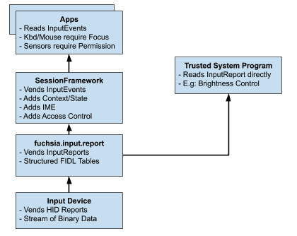

<!--
    (C) Copyright 2020 The Fuchsia Authors. All rights reserved.
    Use of this source code is governed by a BSD-style license that can be
    found in the LICENSE file.
-->

# Fuchsia input drivers

Fuchsia's input drivers implement the
[fuchsia.input.report](/sdk/fidl/fuchsia.input.report) FIDL API. Input drivers
cover a range of input devices like mice, keyboards, touchscreens, consumer
controls (media buttons), and sensors. Input drivers cover a range of protocols including USB,
I2C, and Bluetooth.

## Overview

The
[`fuchsia.input.report`](https://fuchsia.dev/reference/fidl/fuchsia.input.report)
FIDL API represents the lowest level of structured input in a Fuchsia system.
This API should try to represent the underlying input hardware as close as
possible. No additional state should be added to this API that doesn't exist in
hardware. FIDL tables are used to ensure that future input devices and future
features can be added while maintaining compatibility. The
`fuchsia.input.report` API is based on the Human Interface Device (HID) Protocol
which is a hardware protocol for Input devices. Basing this API on the HID
Protocol helps ensure that the API will support most HID devices.

This API is consumed by the next layer of the input stack, which
provides IME support, access control, and statefulness. This API is also
consumed by trusted system programs that are unable or unwilling to be a part of
the input stack.

## Background

The Human Interface Device or
[HID standard](https://www.usb.org/sites/default/files/documents/hid1_11.pdf) is a
hardware protocol for Input devices that is standardized across USB, I2C, and
bluetooth. It supports a wide variety of input devices such as Mice, Keyboards,
Touchscreens, Styluses, Sensors, LEDs, Gamepads, and more. At its core, the
HID standard provides a way to assign meaning to binary reports being sent
from the input device to the host computer.

The devices that HID can describe are infinitely flexible, but this makes the
API difficult to consume. 95% of HID devices fit cleanly into a well defined
group of Input Devices and can easily be described in generic terms. An API
layer like `fuchsia.input.report` is necessary in order to abstract away from the
HID protocol and allow clients to easily use “typical” devices.

## Design Decisions

### Clients and Typical Usage

`fuchsia.input.report` is meant to be the lowest level of the input stack. This
API should be consumed by the next stage of the input stack, and a modified
version of these reports should be passed to higher-level clients. The clients
for these Reports should be programs that are responsible for the rest of the
input stack (e.g: `RootPresenter`, `SessionFramework`).

These reports are not suitable for direct consumption by generic apps in the
system. Generic apps should use the full input stack, which provides
InputEvents that have full context and have valid access control.

Some lower-level system programs want to access `fuchsia.input.report` in
order to read sensors and other simplified input. These are programs that
are trusted by the system and that require access to input at this level. The
system terminal Virtcon requires low level access to the keyboard. The
Screen-Brightness program requires access to the brightness sensor. These are
the types of programs that should be using `fuchsia.input.report` directly. The
[`print-input-report`](/src/ui/tools/print-input-report) binary can be used as
an example program for using low level input.

### Stateless Reports

`fuchsia.input.report` should be as faithful as possible to the
hardware reports that are sent by the physical device. This means that the
`fuchsia.input.report` API should not add additional state that is not present in
the hardware device. This means that some reports are missing context and state
from the rest of the system. For example, the mouse reports give relative X and
Y movements, but do not keep track of global position on a screen. The touch
reports give finger id’s but do give “Hover”, “Press”, “Release” events
directly. Keyboard reports have no concept of keyboard layout. This information
will need to be filled in by the higher levels of the input stack.

### Fuchsia-specific Enums

The InputReport API will explicitly not use HID enums for descriptions (e.g: LED
enums, Keyboard Key enums). It will use Fuchsia specific enums. This grants
the API an extra layer of flexibility for declaring additional uses and removing
usages that we choose not to support. (One example is that HID does not have a
Factory Data Reset (FDR) button enum, which we need to support).

It is easier to be consistent by explicitly not using HID enums than to be
inconsistent and use HID enums for some cases but add additional values in
others.

