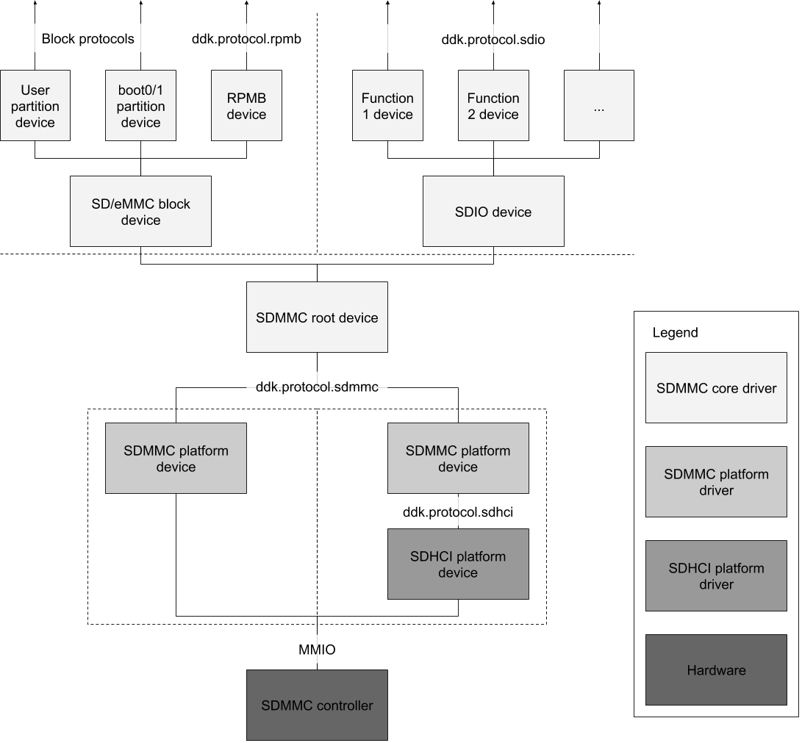

# SDMMC drivers architecture

The SDMMC driver stack is divided into two main components: platform drivers
that talk directly to controller hardware, and the core driver that handles
protocol-specific device initialization and communication. The core driver is
further divided into an SDIO driver and a block driver (for SD and eMMC). Each
SDMMC controller has a different platform driver, while the core driver is
used on all platforms.

## Bringup

Bringing up an SoC with a new SDMMC controller requires writing a new platform
driver. If the controller implements the SDHCI specification then this driver
should implement
[fuchsia.hardware.sdhci](/sdk/banjo/fuchsia.hardware.sdhci/sdhci.fidl), otherwise it
should implement
[fuchsia.hardware.sdmmc](/sdk/banjo/fuchsia.hardware.sdmmc/sdmmc.fidl). It may be
helpful to disable DMA and higher speed modes through `SdmmcHostInfo` and
`SdmmcHostPrefs` until the basic functionality of the hardware has been
validated. See the SDHCI and SDMMC protocol definitions for more information.

## SD/eMMC core driver

The SD/eMMC block driver creates a device that implements
[fuchsia.hardware.block.BlockImpl](/sdk/banjo/fuchsia.hardware.block/block.fidl) and
[fuchsia.hardware.block.partition](/sdk/banjo/fuchsia.hardware.block.partition/partition.fidl)
for the user data partition, as well as devices for the boot0 and boot1
partitions if enabled (eMMC only). A device implementing
[fuchsia.hardware.rpmb](/sdk/banjo/fuchsia.hardware.rpmb/rpmb.fidl) is created if the
device supports it (eMMC only, based on JEDEC standard JESD84-B51 section 6.6.22).

## SDIO core driver

The SDIO core driver creates devices that implement
[fuchsia.hardware.sdio](/sdk/banjo/fuchsia.hardware.sdio/sdio.fidl), one for
each IO function. Whereas the only expected client of the SD/eMMC block driver
is the storage stack, the SDIO driver will have different clients depending on
what kind of SDIO card is detected. Client drivers bind to the SDIO core driver
using the bind variables specified in the table below. Client drivers that use
more than one IO function should bind to a composite device that has each
function device as a fragment. Note that there could be multiple concurrent SDIO
client drivers for combo cards, e.g. for Bluetooth and WiFi, in which case
access to the bus will be shared through the core driver. Clients also cannot
directly access function 0 to prevent possibly disrupting other clients. See the
SDIO protocol definition for more information.

### SDIO client binding

| Bind variable        | Meaning                                               |
| ---------------------| ------------------------------------------------------|
| `BIND_SDIO_VID`      | The IO function's manufacturer ID read from FBR       |
| `BIND_SDIO_PID`      | The IO function's product ID read from FBR            |
| `BIND_SDIO_FUNCTION` | The IO function number from 1 to 7                    |

## Device diagram

