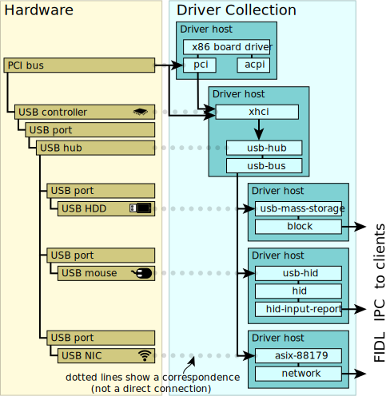

# Driver framework (DFv2)

Important: This page contains information that is specific to the new
version of the driver framework (DFv2).

Fuchsia’s driver framework is a collection of libraries, tools, metadata, and
components that enable developers to create, run, test, and distribute drivers
for Fuchsia systems. The driver framework aims to provide a stable ABI that
allows developers to write a driver once and deploy it on multiple versions of
the Fuchsia platform. (However, Fuchsia's driver framework is constantly evolving
and has not achieved ABI stability yet.)

The driver framework comprises the following entities for running drivers in a
Fuchsia system:

*   [Driver manager](#driver_manager)
*   [Driver host](#driver_host)
*   [Driver index](#driver_index)
*   [Driver runtime](#driver_runtime)
*   [FIDL interface](#fidl_interface)

## Driver manager

Fuchsia's driver manager, which runs as a Fuchsia
component (`driver_manager.cm`), is one of the initial processes to start
when a Fuchsia system boots up. The driver manager starts and stops drivers in
a Fuchsia system and routes FIDL capabilities for the  drivers.

The driver manager maintains the topology of all known devices
(or [nodes][nodes]) in a Fuchsia system. When the driver manager sees a node
that represents a new device in the system, it asks the
[driver index](#driver_index) (a Fuchsia component) to find the correct driver
to [bind][driver-binding] to that node. When a driver is matched to the node,
the driver manager then creates a new [driver host](#driver_host) (or reuses an
existing driver host), which also runs as a component. The driver host starts an
instance of the driver and begins providing the device’s services to other
Fuchsia components in the system.

In addition, the driver manager hosts a virtual filesystem named
[`devfs`][service-discovery] (as in "device filesystem"). All non-driver
components use this `devfs` to discover services provided by the drivers
running in the system.

Note: Fuchsia will continue to support `devfs`. However, it will be deprecated
at some point.

## Driver host

Every driver lives in a driver host, which runs as a Fuchsia component
(`driver_host2.cm`). Driver hosts provide isolation between drivers in
a Fuchsia system. Each driver host is a process, meaning it has its own address
space and manages its own set of threads.

After the driver manager binds a driver to a node, it asks a driver host to
create an instance of the driver. The driver host then initializes the
driver. A driver's initialization involves calling the driver's start hook
(the `Start()` function in the driver’s code) and handing the driver control of
the node to which it’s bound.

More than one driver can be co-located within a single driver host. After a
driver is bound to a node, the driver is often placed in a new driver
host. However, a driver can also choose to be placed in the same driver
host as its parent driver. When drivers are co-located in the same driver host,
they share the same address space.

{: width="600"}

**Diagram 1**. Driver hosts representing USB devices connected to the PCI bus.

## Driver index

The driver index, which runs as a Fuchsia component (`driver-index.cm`), is
responsible for the following tasks:

*  Keep track of all the drivers available in the system, where each driver is
   stored along with metadata (such as its component URL and bind rules).
*  Compare all known drivers to a target [node][nodes] (that is, a device in the
   system) for matching.

The driver index tracks the following types of drivers in a Fuchsia system:

*  **Boot drivers**: Drivers that exist in the Zircon boot image (ZBI) and are
   needed for bootstrapping the system (for example, storage drivers). The ZBI
   has limited space compared to base drivers.
*  **Base drivers**: Drivers that are available in the Fuchsia image and
   are not critical for bootstrapping the system. These drivers are loaded from
   the system's storage, so they need to be loaded after the boot drivers have
   enabled storage (for example, USB drivers, networking drivers) These are
   similar to Fuchsia’s [base packages][base-packages].
*  **Universe drivers**: Drivers that are registered manually after the system’s
   initial boot (for instance, using the `ffx driver register` or `bazel run`
   command), which are loaded using the universe package resolver, similar to
   Fuchsia’s [universe packages][universe-packages]. However, registering
   universe drivers is supported for driver development purposes only.

When the driver manager needs to find a driver for an unbound node in the
[node topology][node-topology], it uses the [`MatchDriver`][fidl-matchdriver]
FIDL protocol to send a match request to the driver index. The driver index then
evaluates the [node properties][node-properties] (which is included in
the match request) against the bind rules of every driver that is being tracked.
When there is a match, the driver index returns the matched driver’s metadata to
the driver manager. But if there is no match, the driver index responds with
a `Not Found` error code. (For more information on the bind rules and binding
process, see [Driver binding][driver-binding].)

## Driver runtime

At a high level, a driver communicates with the following three groups in a
Fuchsia system: the driver framework, other drivers, and non-driver components.
Most of the communication occurs using FIDL calls over Zircon channels. However,
with the driver runtime, co-located drivers  in the same process can avoid going
in and out of the Zircon kernel. In other words, the driver runtime provides a
mechanism that enables co-located drivers to communicate with each other locally,
which is much more efficient than communicating using kernel channels. The
driver runtime is an in-process runtime modeled after the Zircon kernel. The
driver runtime provides primitives similar to the Zircon channel and port, and
a new FIDL transport is built on top of this runtime. (For more details, see the
[RFC][rfc-driver-runtime] on the driver runtime.)

## FIDL interface

The FIDL interface in the driver framework refers to the following two FIDL
protocols:

*  [`fuchsia.driver.framework/Node`][fidl-node]
*  [`fuchsia.driver.framework/NodeController`][fidl-nodecontroller]

The combination of these two protocols forms the basis of how drivers
communicate with the driver framework. Other protocols supported by the
framework are largely used for internal communication between various driver
framework entities (that is, the driver manager, the driver index, the driver
hosts, etc.).

There are also some auxiliary FIDL protocols used between non-driver components
and the driver framework. For instance, we have several protocols for debugging
in the `fuchsia.driver.development` FIDL library which are used by our debugging
tools. We also have some protocols for registering new drivers and handling
shutdown. However, most of these are not particularly interesting for a driver
developer.

<!-- Reference links -->

[nodes]: drivers_and_nodes.md
[driver-index]: driver_framework.md#driver_index
[driver-binding]: driver_binding.md
[driver-host]: driver_framework.md#driver_host
[service-discovery]: driver_communication.md#service_discovery
[node-properties]: drivers_and_nodes.md#node_attributes
[node-topology]: drivers_and_nodes.md#node_topology
[rfc-driver-runtime]: /docs/contribute/governance/rfcs/0126_driver_runtime.md
[fidl-node]: https://cs.opensource.google/fuchsia/fuchsia/+/main:sdk/fidl/fuchsia.driver.framework/topology.fidl;l=107
[fidl-nodecontroller]: https://cs.opensource.google/fuchsia/fuchsia/+/main:sdk/fidl/fuchsia.driver.framework/topology.fidl;l=73
[fidl-matchdriver]: https://cs.opensource.google/fuchsia/fuchsia/+/main:sdk/fidl/fuchsia.driver.framework/driver_index.fidl;l=96
[base-packages]: /docs/concepts/packages/package.md#base-packages
[universe-packages]: /docs/concepts/packages/package.md#universe-packages
