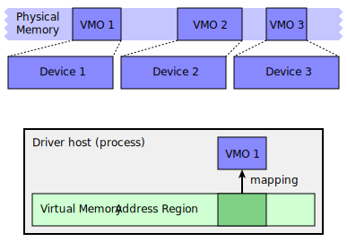

# Mapping a device’s memory in a driver

Drivers communicate with devices in a system by reading and writing bits and
bytes in the devices’ memory. In Fuchsia, a driver performs the following actions
to set up access to a device's memory:

- Obtain an object that represents the device’s memory region in the system.
- Map the object to an [address space][address-spaces] in the [driver host][driver-host]
  (which is the process that the driver resides in).

{: width="500"}

**Diagram 1**. A process maps a virtual memory object (VMO) to its own virtual
memory address region (VMAR) to access the memory region represented by the VMO.

Note: To learn about the concept of memory mapping in operating systems, see the
[Memory management unit][mmu]{:.external} (MMU) page on Wikipedia.

## Accessing a device’s memory from a driver {:#accessing-devices}

In Fuchsia, a driver acquires the ability to read and write data in a device’s memory
by obtaining a virtual memory object ([VMO][vmo]) that represents the device’s
memory region in the system.

Unlike a process’s memory, which is commonly backed by DRAM, a device’s memory region
is backed by registers. A device’s VMO therefore represents a memory-mapped I/O
([MMIO][mmio]{:.external}) region that points to these registers. When a driver
reads from or writes to this region, it has the same effect as directly reading
from or writing to the device’s registers.

A root bus driver (such as the platform, PCI, or ACPI bus driver), which is aware of
all devices connected to the bus, has a special capability to create VMOs for
devices in the system. Once created, these VMOs can be passed to other drivers. The
drivers then use the VMOs to access the memory-mapped I/O regions of their target
devices.

The sequence below walks through the events that enable a driver to access
a device's memory:

1. The [driver manager][driver-manager] discovers a device and
   [binds][driver-binding] a driver to it.
1. The driver makes a request to [generate a VMO](#generating-a-vmo-for-a-device)
   for the device.
1. The root bus driver invokes a special syscall to create a VMO for the device.
1. The Zircon kernel creates a VMO that represents the device’s memory region.
1. The root bus driver receives the VMO and passes it to the driver.
1. The driver [maps the VMO](#mapping-a-vmo-to-a-vmar-in-a-driver) to a virtual
   memory address region ([VMAR][vmar]) in the [driver host][driver-host].
1. The driver reads and writes data in the driver host’s mapped address space to
   communicate with the device.

## Generating a VMO for a device {:#generating-a-vmo-for-a-device}

Fuchsia provides the following (but not limited to) methods for retrieving a VMO that
represents a device’s memory:

- The PCI FIDL protocol provides [`GetBar()`][pci-getbar] for retrieving a base area
  register ([BAR][bar]{:.external}) from a device.
- The ACPI FIDL protocol provides [`GetMmio()`][acpi-getmmio] for retrieving a device’s
  memory region.
- The platform device protocol (based on [Banjo][banjo]) provides
  [`GetMmio()`][banjo-getmmio] for retrieving a device’s memory region.

Once a driver obtains a device’s VMO, the driver maps the VMO to a region of a
virtual address space in the driver host. This setup is necessary for the driver to
read and write data in the device’s memory
(see [Mapping a VMO to a VMAR in a driver](#mapping-a-vmo-to-a-vmar-in-a-driver)).

While Diagram 1 seems to show that there exists one VMO per device, a device can
have multiple memory regions in the physical memory. In which case, the device
may need to generate multiple VMOs to represent those memory regions separately.

### A device’s VMO in the physical memory {:#a-devices-vmo-in-the-physical-memory}

A VMO, in general, represents a contiguous region of virtual memory. But for
devices, a VMO is created differently than other usual VMOs. A device’s VMO is
backed by physical pages that cover a continuous region in the system’s physical
memory.

To create this type of VMO, the bus driver, with a special capability, invokes
the [`zx_vmo_create_physical`][zx-vmo-create-physical] syscall and provides a
physical address and size of the device’s memory region to the Zircon kernel.
The kernel then returns a VMO that is backed by a cluster of continuous physical
pages in the system's memory.

### Address space allocation for a device {:#address-space-allocation-for-a-device}

In a Fuchsia system, a region of address space for a device is determined in one
of the following ways:

- The board driver interprets [ACPI][acpi] or [device trees][device-trees] and
  provides a static range of addresses to the [driver framework][driver-framework].

- The device dynamically negotiates a range of addresses, typically at boot
  time.

USB devices, however, never receive a region of address space. In other words,
no VMOs are ever generated for USB devices when they are hotplugged into a
Fuchsia system. Instead, the USB controller driver gets hold of memory-mapped
resources for all USB devices. Drivers for USB devices use FIDL protocols to
communicate with their USB controller driver, and the USB controller driver then
transforms these interactions into read and write operations in its own
memory-mapped address space.

For PCI devices, which also allow hotplugging, a specific region of address
space gets pre-allocated in the system for all possible PCI devices that may be
hotplugged. Subsections of this address space get distributed to the drivers
bound to the hotplugged PCI devices. And it is the PCI controller driver’s
responsibility to provide the correct regions of this address space to the
drivers.

## Mapping a VMO to a VMAR in a driver {:#mapping-a-vmo-to-a-vmar-in-a-driver}

A [VMAR][vmar] (virtual memory address region) represents a contiguous region of a
virtual address space in a process. In Fuchsia, a process usually maps a VMO,
which represents a contiguous region of virtual memory in the system, to a VMAR
to facilitate reading and writing data in the memory region represented by the
VMO.

Without being mapped to VMARs, processes can only interact with VMOs using a set
of syscalls, such as [`zx_vmo_read`][zx-vmo-read] and [`zx_vmo_write`][zx-vmo-write].
This is because all memory is mapped into the kernel's address space, and only
syscalls can switch into the kernel mode to directly read from or write to
the memory.

In Fuchsia, however, drivers cannot use these syscalls to interact with a
device’s memory for the following reasons:

- Issues surrounding how registers are mapped (see
  [Cached and uncached registers](#cached-and-uncached-registers)).
- Limitation on the types of instructions that are safe to use for interacting
  with registers.

Hence, if a driver wants to read and write data in a device’s memory, the driver
must map the VMO that represents the device’s memory region in the system to a
VMAR in the [driver host][driver-host] (which is the process that the driver
resides in).

In case of multiple drivers in a single driver host, all drivers in the same
driver host share the same [root VMAR][root-vmar]. And VMOs from these drivers
get mapped to child VMARs that are created from this root VMAR of the driver host.

### Helper library for interacting with a device’s memory {:#helper-library-for-interacting-with-a-devices-memory}

Fuchsia provides a helper library (see [`lib/mmio`][lib-mmio]) that abstracts the
details of working with VMOs and VMARs. The abstraction provided by this helper
library ensures that reading from and writing to registers on a device are secure.
For instance, because not every instruction that interacts with memory in the
system is deemed to be safe, the helper library contains inline assembly
instructions to assure correctness when reading and writing data in registers.

### Cached and uncached registers {:#cached-and-uncached-registers}

Mapping registers in a cache coherent manner is preferred in Fuchsia. On x64,
peripheral memory is always cache coherent, so it can be mapped as cached.
However, on ARM, peripheral memory is not cache coherent, thus it is often mapped
as uncached.

Mapping registers using alternative means and manually managing the cache
coherency of those registers are permitted in Fuchsia. However, only advanced
developers who experience performance issues while using uncached mappings
should consider this approach.

[address-spaces]: /docs/concepts/memory/address_spaces.md
[driver-host]: /docs/concepts/drivers/driver_framework.md#driver_host
[vmo]: /docs/reference/kernel_objects/vm_object.md
[mmu]: https://en.wikipedia.org/wiki/Memory_management_unit
[mmio]: https://en.wikipedia.org/wiki/Memory-mapped_I/O
[driver-manager]: /docs/concepts/drivers/driver_framework.md#driver_manager
[driver-binding]: /docs/concepts/drivers/driver_binding.md
[vmar]: /docs/reference/kernel_objects/vm_address_region.md
[pci-getbar]: https://cs.opensource.google/fuchsia/fuchsia/+/main:sdk/fidl/fuchsia.hardware.pci/pci.fidl;l=339
[bar]: https://wiki.osdev.org/PCI#Base_Address_Registers
[acpi-getmmio]: https://cs.opensource.google/fuchsia/fuchsia/+/main:sdk/fidl/fuchsia.hardware.acpi/device.fidl;l=324
[banjo-getmmio]: https://cs.opensource.google/fuchsia/fuchsia/+/main:sdk/banjo/fuchsia.hardware.platform.device/platform-device.fidl;l=44
[banjo]: /docs/development/drivers/concepts/device_driver_model/banjo.md
[zx-vmo-create-physical]: /docs/reference/syscalls/vmo_create_physical.md
[acpi]: /docs/contribute/governance/rfcs/0112_acpi_support_on_x86.md
[device-trees]: /docs/contribute/governance/rfcs/0192_device_trees_on_fuchsia.md
[driver-framework]: /docs/concepts/drivers/driver_framework.md
[zx-vmo-read]: /docs/reference/syscalls/vmo_read.md
[zx-vmo-write]: /docs/reference/syscalls/vmo_write.md
[root-vmar]: /docs/concepts/memory/address_spaces.md#vmars_mappings_and_vmos
[lib-mmio]: https://cs.opensource.google/fuchsia/fuchsia/+/main:src/devices/lib/mmio/include/lib/mmio/mmio.h
