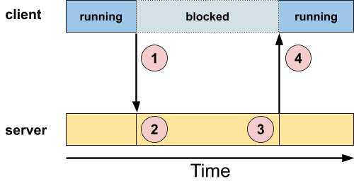
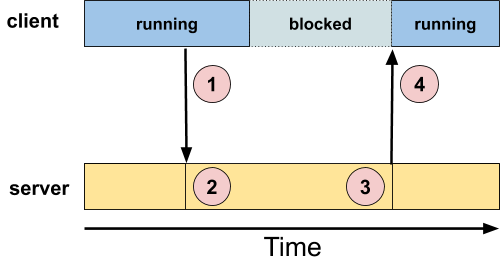
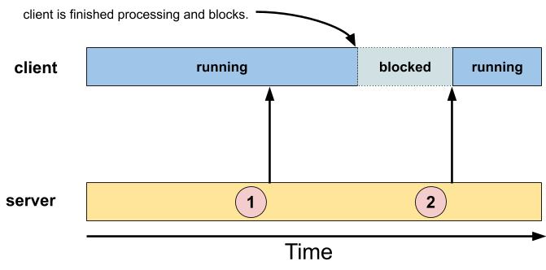

<!---

# FIDL Overview

This document is a high level overview of the Fuchsia Interface Definition
Language (FIDL), which is the language used to describe interprocess
communication (IPC) protocols used by programs running on Fuchsia. This overview
introduces the concepts behind FIDL &mdash; developers familiar with these concepts
already can start writing code by following the [tutorials][fidl-tutorials], or
dive deeper by reading the [language][language-reference] or
[bindings][bindings-reference] references.

--->

# FIDL总览

本文档概述了Fuchsia接口定义语言（FIDL），FIDL是一种用于描述在Fuchsia内运行程序使用的进程间通信（IPC）协议的语言。本概述介绍了FIDL背后的概念--熟悉相关概念的开发者已经可以根据[tutorials][fidl-tutorials]开始编写代码，或者通过阅读[language][language-reference]或者[bindings][bindings-reference]参考来进一步了解。

<!---

## What is FIDL?

While "**FIDL**" stands for "Fuchsia Interface Definition Language," the word
itself can be used to refer to a number of different concepts:

* [**FIDL wire format**][wire-format]: the FIDL wire format specifies how FIDL
  messages are represented in memory for transmission over IPC
* [**FIDL language**][language-spec]: the FIDL language is the syntax by which
  protocols are described in `.fidl` files
* [**FIDL compiler**][compiler-spec]: the FIDL compiler generates code for
  programs to use and implement protocols
* [**FIDL bindings**][bindings-reference]: the FIDL bindings are
  language-specific runtime support libraries and code generators that provide
  APIs for manipulating FIDL data structures and protocols.

--->

## 什么是FIDL

FIDL代表了”Fuchsia Interface Definition Language“，这个单词本身可用于参考为以下不同概念
* [**FIDL wire format**][wire-format]：FIDL 线型格式，明确FIDL消息在内存内的代表方式，以便通过IPC传输
* [**FIDL language**][language-spec]：FIDL语言是定义协议在.fidl文件内的语法
* [**FIDL compiler**][compiler-spec]：FIDL编译器生成程序使用和实现协议的代码
* [**FIDL bindings**][bindings-reference]：FIDL绑定是特定语言运行时支持库和代码的生成器，提供用于操作FIDL数据结构和协议的API

<!---

The main job of FIDL is to allow diverse clients and services to interoperate.
Client diversity is aided by decoupling the implementation of the IPC mechanism
from its definition, and is simplified by automatic code generation.

The FIDL language provides a familiar (though simplified) C-like declaration
syntax that allows the service provider to exactly define their protocols. Basic
data types, like integers, floats, and strings, can be organized into more
complex aggregate structures and unions. Fixed arrays and dynamically sized
vectors can be constructed from both the basic types and the aggregate types,
and these can all be combined into even more complex data structures.

Due to the number of client implementation target languages (C, C++, Rust, Dart,
and so on), we don't want to burden the developer of the service with providing
a protocol implementation for each and every one.

This is where the FIDL toolchain comes in. The developer of the service creates
just one `.fidl` definition file, which defines the protocol. Using this file,
the FIDL compiler then generates client and server code in any of the supported
target languages.

--->

FIDL的主要工作是允许多种client和service的互连。通过IPC机制从定义上的实现解耦来达成客户端多样性，并通过自动代码生成实现简化。

FIDL语言是一种类C（尽管是简化的）定义语法，允许service提供者详细定义其通信协议。基本数据类型，例如integers， float和string可以组合成更为复杂的聚合结构体(structures)和联合体(unions)。基本数据类型和聚合类型可以组成固定array和动态长度vector，并且还可以结合组成更加复杂的数据结构。

因为客户端有多种实现语言（C, C++, Rust, Dart等），我们不希望开发者因为服务端提供对应语言协议实现，从而增加开发负担。

所以FIDL工具链应运而生，服务端开发者仅需要创建相关 `.fidl` 定义文件描述其通信协议。FIDL编译器通过这些文件生成任何支持语言类型中的客户端和服务端代码。


<!---

In many cases, there will only be one implementation of the server (for example,
the particular service might be implemented in C++), whereas there could be any
number of implementations of the client, in a multitude of languages.

> Note that the Fuchsia operating system has no innate knowledge of FIDL. The
> FIDL bindings use a standard channel communication mechanism in Fuchsia. The
> FIDL bindings and libraries enforce a set of semantic behavior and persistence
> formats on how that channel is used.

--->

在很多使用场景中，服务端只有一个实现方式（例如，特定服务可能使用C++实现），尽管如此，可能存在很多语言实现的客户端。

>注意：Fuchsia操作系统没有内置FIDL相关内容，FIDL绑定器使用Fuchsia标准通道通信机制。FIDL绑定器和库对该通道的使用方式实施了一套语义行为和持久化格式。

<!---

### FIDL architecture

From a developer's point of view, the following are the main components:

*   FIDL definition file &mdash; this is a text file (ending in `.fidl` by
    convention) that defines the values, and protocols (methods with their
    parameters),
*   client code &mdash; generated by the FIDL compiler (`fidlc`) toolchain for
    each specific target language, and
*   server code &mdash; also generated by the FIDL compiler toolchain.

--->

### FIDL架构

从开发者角度，以下为其主要的组件：

* FIDL定义文件 — 这是一个定义变量和协议（方法和参数）的文本文件（以 `.fidl` 约定结尾）

* 客户端代码 — 通过FIDL编译器 (`fidlc`)工具链生成每种目标语言的代码

* 服务端代码—同样通过FDIL编译工具链生成

<!---

As a very simple example of a FIDL definition file, consider an "echo" service
&mdash; whatever the client sends to the server, the server just echoes back to
the client.

> Line numbers have been added for clarity and are not part of the `.fidl` file.

```fidl
1   library fidl.examples.echo;
2
3   [Discoverable]
4   protocol Echo {
5       EchoString(string? value) -> (string? response);
6   };
```

--->

以下为一个“echo"服务的非常简单的FIDL定义文件示例，客户端发送到服务端后，服务端回复到客户端

> 为了清楚起见，增加了行号，这不是 `.fidl`文件的内容
```fidl
1   library fidl.examples.echo;
2
3   [Discoverable]
4   protocol Echo {
5       EchoString(string? value) -> (string? response);
6   };
```
<!---

Let's go through it line by line.

**Line 1:** The `library` keyword is used to define a namespace for this
protocol. FIDL protocols in different libraries might have the same name, so the
namespace is used to distinguish amongst them.

**Line 3:** The `[Discoverable]` [**attribute**][attributes] indicates that the
protocol that follows should be made available for clients to connect to.

**Line 4:** The `protocol` keyword introduces the name of the protocol, here
it's called `Echo`.

**Line 5:** The method, its parameters, and return values. There are two unusual
aspects of this line:

*   Note the declaration `string?` (for both `value` and `response`). The
    `string` part indicates that the parameters are strings (sequences of
    characters), while the question mark indicates that the parameter is
    optional.
*   The `->` part indicates the return, which appears after the method
    declaration, not before. Unlike C++ or Java, a method can return multiple
    values.

--->

让我们来逐句解释该文件

**第一句**：关键字`library`用于定义协议的命名空间。不同库中的FIDL协议可能具有相同名字，所以采用命名空间来区分它们。

**第三句**： `[Discoverable]` [**attribute**][attributes]表示后面的协议提供给客户端连接使用。

**第四句**：`protocol`关键字引入协议的名称，示例中叫`Echo`。

**第五句**：方法、参数和返回值定义，这句中有两个不同以往的方面：

* 注意： `string?` （ `value` 和 `response`）声明。`string` 部分表示参数为字符串（字符的序列），问号表示参数为可选。

*  `->` 部分表示返回，出现于方法调用声明后而不是之前。不同于C++或者java，一个方法调用可以返回多个值。

<!---

The above FIDL file, then, has declared one protocol, called `Echo`, with one
method, called `EchoString`, that takes a nullable string and returns a nullable
string.

The simple example above used just one data type, the `string` as both the input
to the method as well as the output.

The possible FIDL data types are very flexible:

```fidl

```

The above declares a structure called `MyRequest` with three members: an
unsigned 32-bit integer called `serial`, a string called `key`, and a vector of
unsigned 32-bit integers called `options`

--->

上述FIDL文件，只定义了一个`Echo`的协议和一个`EchoString`的方法调用，它可接收一个可空字符串并返回一个可空字符串。

上述的简单示例只使用了一种数据类型， `string` 作为其方法调用的输入和输出。

FIDL数据类型也可以非常灵活：
```fidl

```

上述定义了一个叫做`MyRequest`的结构体和三个成员：一个32位无符号整数`serial`，一个字符串`key`和一个32位无符号整数向量 `options`

<!---

### Messaging Models

In order to understand FIDL's messaging, we need to break things up into two
layers, and clarify some definitions.

At the bottom (the operating system layer), there's an asynchronous
communications scheme geared towards independent progress of a **sender** and a
**receiver**:

*   **sender** &mdash; the party that originates a message,
*   **receiver** &mdash; the party that receives a message,

Sending a message is a non-blocking operation: the sender sends the message, and
is then free to continue processing, regardless of what the receiver is doing.

A receiver can, if it wants to, block in order to wait for a message.

The top layer implements FIDL messages, and uses the bottom (asynchronous)
layer. It deals with **client**s and **server**s:

*   **client** &mdash; the party that is making a request (of a server),
*   **server** &mdash; the party that is processing a request (on behalf of a
    client).

> The terms "sender" and "receiver" make sense when we're discussing the
> messages themselves &mdash; the underlying communications scheme isn't
> concerned about the roles that we've assigned to the parties, just that one is
> sending and one is receiving.
>
> The terms "client" and "server" make sense when we're discussing the roles
> that the parties play. In particular, a client can be a sender at one time,
> and a receiver at a different time; same for the server.

--->

### 消息模型

为了了解FIDL消息传递，我们需要将内容拆分为两个层次并阐明相关定义。

在系统底层（操作系统层面），有一个面向**发送方**和**接收方**独立的异步通信方案：

* **发送方** — 发出消息的一方，

* **接收方** — 接收消息的一方，

发送消息采用非阻塞的方式：发送方发出消息后，然后可以继续处理，而不用管接收方在做什么。而接收方愿意，可以阻塞自身等待消息传入。

顶层实现FIDL消息，并使用底层（异步）的层，被分为**客户端**和**服务端**

* **client** — 对（服务器）发出请求的一方

* **server** — 处理请求的一方（代表客户端）

> 注意: 当我们讨论消息本身时，术语"sender"和"receiver"是有意义的—底层通信方案并不关心我们分配给各方的角色，只关心一方是发送方，一方是接收方而已。
>
> 在我们讨论各方角色扮演时，术语“client”和“server”是有意义的。特别是，客户端可以一个时间段扮演发送方，也可以在不同时间扮演接收方，服务端也是一样。

<!---

Practically speaking, in the context of a client / server interaction, that
means that there are several models:

1.  **blocking call** &mdash; client sends to server, waits for reply
2.  **fire and forget** &mdash; client sends to server, doesn't expect reply
3.  **callback** or **async call** &mdash; client sends to server, but doesn't
    block; a reply is delivered asynchronously some time later
4.  **event** &mdash; server sends to client, without the client having asked
    for data

The first is synchronous, the rest are asynchronous. We'll discuss these in
order.

--->

实际上来说，在client/server交互中，存在以下几种模式：

1. **blocking call**  — 客户端发送到服务端后，等待其返回结果

2. **fire and forget**  — 客户端发送到服务端后，不期待其返回

3. **callback** or **async call** — 客户端发送到服务端后，不阻塞自身，稍后以异步的方式返回结果

4. **event** — 服务端发送给客户端，即使客户端并没有主动请求相关数据

除了第一种方式是同步，其余均为异步。我们将逐个讨论这些通信模式。

<!---

#### Client sends to server, waits for a reply

This model is the traditional "blocking call" or "function call" available in
most programming languages, except that the invocation is done over a channel,
and thus can fail due to transport level errors.

From the point of view of the client, it consists of a call that blocks, while
the server performs some processing.

--->

#### 客户端发送给服务端后，等待其回复

当前模型是在大多数编程语言中都有的典型“阻塞调用”或者“函数调用”，除了调用是通过一个通道完成的，因此可能由于传输级别错误产生调用失败。

从客户端来看，它包含了一个阻塞调用，同时服务端响应一些处理。



<!---

Here's a step-by-step description:

1.  A client makes a call (optionally containing data) and blocks.
2.  The server receives the client's call (and optional data), and performs some
    amount of processing.
3.  At the server's discretion, it replies to the client (with optional data).
4.  The server's reply causes the client to unblock.

To implement this synchronous messaging model over an asynchronous messaging
scheme is simple. Recall that both the client-to-server and server-to-client
message transfers are, at the bottom layer in the protocol, asynchronous. The
synchronization happens at the client end, by having the client block until the
server's message arrives.

--->

接下来是逐步的描述：

1. 客户端发起调用（可选包含数据）并阻塞。
2. 服务端接收客户端调用（可选数据），并执行一些处理响应。
3. 由服务端判断，回复到客户端（和可选数据）。
4. 服务端回复消息，解除客户端阻塞。

为了在异步消息方案中实现这种同步消息模型是很简单的。回顾一下，在协议底层，客户端到服务端和服务端到客户端的消息传输都是异步的。通过客户端阻塞等待服务端消息到达，使同步发生的客户终端。

<!---

Basically, in this model, the client and server have come to an agreement:

*   data flow is initiated by the client,
*   the client shall have at most only one message outstanding,
*   the server shall send a message to the client only in response to a client's
    message
*   the client shall wait for the server's response before continuing.

This blocking model is commonly used where the client needs to get the reply to
its current request before it can continue.

For example, the client may request data from the server, and not be able to do
any other useful processing until that data arrives.

Or, the client may need to perform steps in a specific order, and must therefore
ensure that each step completes before initiating the next one. If an error
occurs, the client may need to perform corrective actions that depend on how far
the operation has proceeded &mdash; another reason to be synchronized to the
completion of each step.

--->

基本地，在这个模型中，客户端和服务端达成以下共识：

*   数据流由客户端初始化，
*   客户端应当最多仅有一条消息未完成，
*   服务端应当仅发送一条消息作为回复到客户端，
*   客户端继续运行前应当等待服务端回复，

阻塞模型被广泛使用在客户端需要拿到当前请求调用回复后才能继续运行的使用场景中。

例如，客户端可能从服务端请求数据，然后在数据达到之前不能做任何其他有用的处理。

或者，客户端需要以特殊顺序执行步骤，因此来确保在下一条消息初始化之前完成每一个步骤。如果有错误发生，客户端需要依赖于操作进行到什么程度来执行纠正措施——这也是采用同步完成每个步骤的另一个原因。

<!---

#### Client sends to server, no reply {#fire-and-forget}

This model is also known as "fire and forget." In it, the client sends the
message to the server. and then carries on with its operation. In contrast to
the blocking model, the client *does not* block, *nor does it expect a
response*.

This model is used in cases where the client doesn't need to (or cannot)
synchronize to the processing of its request.

--->

#### 客户端发送给客户端后，不等待其返回

此模型同样被称为“发后即忘”。在此模型中，客户端发送消息给服务端，然后继续其操作。对比阻塞式模型，客户端*不会*自身阻塞，也*不期望收到回复*。

这种模型被用在客户端不需要（或者不能）同步处理其请求的使用场景中。


<!---

The classic example is a logging system. The client sends logging information to
the logging server (circles "1" and "2" in the diagram above), but has no reason
to block. A lot of things can go wrong at the server end:

1. the server is busy and can't handle the write request at this moment,
2. the media is full and the server can't write the data,
3. the server has encountered a fault,
4. and so on.

However, the client isn't in a position to do anything about those problems, so
blocking would just create more problems.

--->

典型的例子为日志系统。客户端发送日志信息到日志服务端（见上图圈1和圈2），但是没有理由需要阻塞。在客户端会可能存在很多错误运行。

1. 客户端忙，当前无法处理写入请求，
2. 多媒体已满，客户端无法写入数据，
3. 客户端遇到故障，
4. 等等情况

尽管如此，客户端也无法对这样的问题做出处理，所以阻塞也只会产生更多问题。

<!---

#### Client sends to server, but doesn't block

This model, and the next one ("server sends to client, without client asking for
data") are similar.

In the present model, the client sends a message to a server, but doesn't block.
However, the client expects some kind of response from the server, but the key
here is that it's not *synchronous* with the request.

This allows great flexibility in the client / server interaction.

While the synchronous model forces the client to wait until the server replies,
the present model frees the client to do something else while the server is
processing the request:

--->

#### 客户端发送到服务端，但是不阻塞

当前模型和下一个（“客户端没有请求数据时，服务端发送到客户端”）是类似的。

在当前模型中，客户端发送消息到服务端，但是不发生阻塞。尽管如此，客户端还是期待从服务端的回复，但是关键在于这不是*同步*调用。

这样可以保持在客户端/服务端交互中很大的灵活性。

同步调用模型中强制要求客户端等待服务端的回复响应，但是当前模型解放客户端可以在服务端响应时，做一些自己其他的操作。



<!---

The subtle difference in this diagram vs. the similar one above is that after
circle "1" the client is *still running*. The client chooses when to give up
CPU; it's not synchronous with the message.

There are actually two sub-cases here &mdash; one in which the client gets just
one response, and another in which the client can get multiple responses. (The
one where the client gets zero responses is the "fire and forget" model, which
we discussed earlier.)

--->

上图和模型1中细微的差别在于在图示圈1后，客户端还是*依然在运行*。客户端可选什么时候让出CPU；这是一种非同步调用的消息形式。

这里实际上有两个子案例—一个是客户端仅收到一个回复，而另一个则是客户端可以收到多条回复。（客户端没有收到回复是“发后即忘”模式，是我们上一个讨论的模型）

<!---

##### Single request, single response

The single response case is the closest to the synchronous model: the client
sends a message, and eventually, the server replies. You'd use this model
instead of multi-threading, for example, when you know that the client could be
doing useful work while waiting for the server's reply.

--->

###### 单一请求，单一响应

单一响应案例是最接近同步调用模型：客户端发送一条消息后，最终，服务端回复。你可以使用此模型代替多线程，例如，你知道客户端可以在服务端回复的时候做有用的工作，同时等待其回复。

<!---

##### Single request, multiple response

The multiple response case can be used in a "subscription" model. The client's
message "primes" the server, for example, requesting notification whenever
something happens.

The client then goes about its business.

Some time later, the server notices that the condition that the client is
interested in has happened, and thus sends the client a message. From a client /
server point of view, this message is a "reply", with the client receiving it
asynchronously to its request.

--->

##### 单一请求，多条回复

多条回复的场景可以应用于“订阅”模型。客户端信息”激励“服务器，例如，每当有事发生时，要求通知到客户端。

然后客户端就会去做自己的事情。

过一会儿后，服务端通知到客户端其关注的事件发生，发送消息给客户端。从客户端/服务端的角度来看，这条消息是一条“回复响应”，即客户端异步收到其调用。


<!---

There's no reason why the server couldn't send another message when another
event of interest occurs; this is the "multiple response" version of the model.
Note that the second (and subsequent) responses are sent *without* the client
sending any additional messages.

> Note that the client doesn't *need* to wait for the server to send it a
> message. In the diagram above, we showed the client in the blocked state
> before circle "3" &mdash; the client could just as well have been running.

--->

当另一个关注事件发生时，服务端没有理由不发送另一条信息；这就是“多条回复”的通信模型。注意，第二条回复（和后续回复）是*不需要*客户端发送额外信息的。

> 注意客户端发送消息时是*没有必要*等待服务端响应。在上图中，我们展示了客户端在圈3前的阻塞状态——客户端可以同样运行。

<!---

#### Server sends to client, without client asking for data

This model is also known as the "event" model.

-->

#### 没有客户端请求数据时，服务端发给客户端

这种模型同样也被称为“事件”模型。



<!---

In it, a client prepares to receive messages from a server, but doesn't know
when to expect them &mdash; the messages are not only asynchronous to the
client, but are also (from a client / server point of view) "unsolicited", in
that the client didn't explicitly request them (like it did in the previous
model, above).

The client designates a function (the "event handling function") to be called
when messages arrive from the server, but otherwise continues about its
business.

At the server's discretion (circles "1" and "2" in the diagram above), messages
are sent asynchronously to the client, and handled by the client's designated
function.

Note that the client may already be running when a message is sent (as in circle
"1"), or the client may have nothing to do and be waiting for a message to be
sent (as in circle "2").

> It is not a requirement that the client be waiting for a message.

--->

在图中，客户端准备好从服务端收取信息，但是不知道什么时候才能收到——消息不仅对客户端是不同步的，而且（从客户端/服务端的角度看）也是“主动提供”的，在客户端中没有明确请求它们（就像之前的模式一样）。

客户端指定一个功能函数被回调（“事件句柄函数”），当收到从服务端来的信息被调用，但除此之外继续运行其他业务。

在服务端判定中（上图圈1和2），消息被异步发送到客户端，然后被客户端指定的函数处理。

注意当消息已经被发送（圈1），客户端可能已经正在运行，或者客户端可能没有事情做正在等待消息发送（图2）。

> 并没有要求客户端要正在等待消息。

<!---

#### Asynchronous messaging complexity

Breaking up asynchronous messaging into the above (somewhat arbitrary)
categories is meant to show typical usage patterns, but isn't meant to be
exhaustive.

In the most general case of asynchronous messaging, you have zero or more client
messages loosely associated with zero or more server replies. It's this "loose
association" that adds the complexity in terms of your design process.

--->

#### 异步消息复杂度

如上分解异步消息（有点随意）的类型是为了展示典型的使用模式，但这并不意味着能详细描述。

在大多数异步消息的使用场景中，你可以有0个或者多个客户端消息与0个或者多个服务端的回复松散地联系在一起。这就是“松联系”增加设计过程的复杂度。

<!---

### IPC models in FIDL

Now that we have an understanding of the IPC models and how they interact with
FIDL's asynchronous messaging, let's see how they're defined.

We'll add the other models (fire and forget, and async call) to the protocol
definition file:

--->

### IPC模型在FIDL中

现在我们已经理解了IPC模型和怎样使用FIDL进行异步消息交互，让我们继续来看怎么定义它们。

我们将添加其他的模型（发后即忘，和异步调用）到协议定义文件中。


```fidl
1   library fidl.examples.echo;
2
3   [Discoverable]
4   protocol Echo {
5       EchoString(string? value) -> (string? response);
6       SendString(string? value);
7       -> ReceiveString (string? response);
8   };
```

<!---

**Line 5** is the `EchoString` method that we discussed above &mdash; it's a
traditional function call message, where the client calls `EchoString` with an
optional string, and then blocks, waiting for the server to reply with another
optional string.

--->

**Line 5**是 我们上述讨论的`EchoString` 方法——这是一个传统的方法调用消息，当客户端调用 `EchoString` 输入一个可选字符串，然后阻塞，等待客户端回复另一个可选字符串。

<!---

**Line 6** is the `SendString` method. It does not have the `->` return
declaration &mdash; that makes it into a "fire and forget" model (send only),
because we've told the FIDL compiler that this particular method does not have a
return associated with it.

> Note that it's not the lack of return **parameters**, but rather the lack of
> return **declaration** that's the key here &mdash; putting "`-> ()`" after
> `SendString` would change the meaning from declaring a fire-and-forget style
> method to declaring a function call style method that doesn't have any return
> arguments.

--->

**Line 6** 是 `SendString` 的调用方法。它不包含 `->` 的返回声明——这让它成为”发后即忘“的模型（仅发送），因为我们已经告诉给FIDL编译器，这个特殊的方法调用不包含相关的返回。

> 注意这不是缺少返回 **参数 **，而是缺少返回**声明**才是关键——放置“`-> ()`”在`SendString` 后会改变其声明意义，从声明发后即忘风格方法调用到声明没有返回参数的函数调用风格。

<!---

**Line 7** is the `ReceiveString` method. It's a little different &mdash; it
doesn't have the method name in the first part, but rather it's given after the
`->` operator. This tells the FIDL compiler that this is an "async call" model
declaration.

--->

**Line 7** 是 `ReceiveString` 方法调用。这有一些小差别——它在第一部分不含有调用名称，而是在`->` 操作符后给出。这告诉给FIDL编译器，这是一个“异步调用”模型声明。

<!---

### FIDL Bindings

The FIDL toolchain takes in FIDL protocol and type definitions, like the
examples shown above, and generates code in each target language that can "speak"
these protocols. This generated code is referred to as the FIDL bindings, which
are available in various flavors depending on the language:

*   **Native bindings**: designed for highly sensitive contexts such as device
    drivers and high-throughput servers, leverage in-place access, avoid memory
    allocation, but may require somewhat more awareness of the constraints of
    the protocol on the part of the developer.
*   **Idiomatic bindings**: designed to be more developer-friendly by copying
    data from the wire format into easier to use data types (such as heap-backed
    strings or vectors), but correspondingly somewhat less efficient as a
    result.

--->

### FIDL绑定

FIDL工具链接收FIDL协议和类型定义，例如上述示例所见，然后用每种目标语言生成对应代码来“讲述”它的协议。这种生成代码被称为FIDL绑定，它可以根据语言的不同而有不同的风格。

* **本机绑定**:为高敏感性上下文设计，例如设备驱动和高吞吐量服务，利用就地存取，避免内存分配，但是可能需要开发者对协议的限制有更多的认识。
* **惯用绑定**：为更开发者友好的方式设计，通过从线型格式的数据拷贝到更容易使用的数据类型（例如堆栈支持的字符串或者数组），但相应地降低了效率。

<!---

Bindings offer several various ways of invoking protocol methods depending on
the language:

*   **Send/receive**: read or write messages directly to a channel, no built-in
    wait loop (C)
*   **Callback-based**: received messages are dispatched asynchronously as
    callbacks on an event loop (C++, Dart)
*   **Port-based**: received messages are delivered to a port or future (Rust)
*   **Synchronous call**: waits for reply and return it (Go, C++ unit tests)

--->

取决于语言不通，绑定提供了几种不同的调用协议方式。

* **发送/接受**：直接在通道内读写信息，没有内置等待循环（C）
* **基于回调**：在事件循环上，接收信息并作为回调的异步分发（C++, Dart）
* **基于端口**：接收信息并分发到端口或者将值（future）（Rust）
* **同步调用**：等待回复并返回（Go, C++单元测试）

<!---

Bindings provide some or all of the following principal operations:

*   **Encode**: in-place transform native data structures into the wire format
    (coupled with validation)
*   **Decode**: in-place transform wire format data into native data structures
    (coupled with validation)
*   **Copy/Move To Idiomatic Form**: copy contents of native data structures
    into idiomatic data structures, handles are moved
*   **Copy/Move To Native Form**: copy contents of idiomatic data structures
    into native data structures, handles are moved
*   **Clone**: copy native or idiomatic data structures (that do not contain
    move-only types)
*   **Call**: invoke protocol method

--->

绑定提供以下一些或所有原则操作：

* **编码**：就地转换本地数据结构到线型格式（结合验证）
* **解码**：就地转换线型格式到本地数据结构（结合验证）
* **拷贝/移动到惯用格式**：拷贝本地数据结构目录到惯用数据结构，句柄转移
* **拷贝/移动到本地格式**：拷贝惯用数据结构目录到本地数据结构，句柄转移
* **克隆**：拷贝本地或者惯用数据结构（不包含仅移动类型）
* **调用**：调用协议方法

<!---

#### Client implementation

Regardless of the target language, the `fidlc` FIDL compiler generates client
code that has the following basic structure.

The first part consists of the administration and background handling, and
consists of:

1. some means of connecting to the server is provided
2. an asynchronous ("background") message handling loop is started
3. async call style and event style methods, if any, are bound to the message
   loop

--->

#### 客户端实现

不管目标语言是什么， `fidlc` FIDL编译器遵循基本结构生成客户端代码。

第一部分包含管理和背景处理，其中包括：

1. 提供一些连接到服务端的方法
2. 启动一个异步（“后台”）消息处理循环
3. 异步调用方式和事件调用放方法，如有，则绑定到消息循环中

<!---

The second part consists of implementations of the traditional function call or
fire and forget style methods, as appropriate for the target language.
Generally speaking, this consists of:

1. creating a callable API and declarations
2. generating code for each API that marshals the data from the call into a FIDL
   formatted buffer suitable for transmission to the server
3. generating code to transmit the data to the server
4. in the case of function call style calls, generating code to:
    1. wait for the response from the server
    2. unmarshal the data from the FIDL formatted buffer, and
    3. return the data via the API function.

Obviously, the exact steps may vary due to language implementation differences,
but that's the basic outline.

--->

第二部分包含传统函数调用或发后即忘式方法的实现，适配其目标语言。

通常来讲，其中包含：

1. 创建可调用的API和声明
2. 对每个API生成代码，将调用数据整理成FIDL格式的缓存区，以便传输到服务端
3. 生成传输数据到服务端的代码
4. 在函数调用类型的使用场景中，生成代码：
   1. 等待从服务端的回复
   2. 从FIDL格式化的缓冲区内解读数据，并且
   3. 通过API函数返回数据

很明显，由于语言实现的差异，具体步骤可能有所不同，但是列出的为基本概要。

<!---

#### Server implementation

The `fidlc` FIDL compiler also generates server code for a given target
language. Just like the client code, this code has a common structure regardless
of the target language. The code:

1. creates an object that clients can connect to,
2. starts a main processing loop, which:
    1. waits for messages
    2. processes messages by calling out to the implementation functions
    3. if specified, issues an asynchronous call back to the client to return
       the output

In the next chapters, we'll see the details of each language's implementation of
the client and server code.

--->

#### 服务端实现

 `fidlc` FIDL编译器同样根据目标语言生成服务端代码。就像客户端代码一样，不管是哪种目标语言，这段代码都有一个共同的结构。代码中包含：

1. 创建对象让客户端可以连接，
2. 开始主处理循环，其中：
   1. 等待信息
   2. 通过调用执行函数来处理消息
   3. 如果指定的话，发出异步调用，返回给客户端输出

在下一章节中，我们可以看到每种语言实现客户端和服务端代码的细节。

<!---

## Why Use FIDL?

Fuchsia extensively relies on IPC since it has a microkernel architecture
wherein most functionality is implemented in user space outside of the kernel,
including privileged components such as device drivers. Consequently the IPC
mechanism must be efficient, deterministic, robust, and easy to use:

**IPC efficiency** pertains to the computational overhead required to generate,
transfer, and consume messages between processes. IPC will be involved in all
aspects of system operation so it must be efficient. The FIDL compiler must
generate tight code without excess indirection or hidden costs. It should be at
least as good as hand-rolled code would be where it matters most.

**IPC determinism** pertains to the ability to perform transactions within a
known resource envelope. IPC will be used extensively by critical system
services such as filesystems, which serve many clients and must perform in
predictable ways. The FIDL wire format must offer strong static guarantees such
as ensuring that structure size and layout is invariant thereby alleviating the
need for dynamic memory allocation or complex validation rules.

**IPC robustness** pertains to the need to consider IPC as an essential part of
the operating system's ABI. Maintaining binary stability is crucial. Mechanisms
for protocol evolution must be designed conservatively so as not to violate the
invariants of existing services and their clients, particularly when the need
for determinism is also considered. The FIDL bindings must perform effective,
lightweight, and strict validation.

**IPC ease of use** pertains to the fact that IPC protocols are an essential
part of the operating system's API. It is important to provide good developer
ergonomics for accessing services via IPC. The FIDL code generator removes the
burden of writing IPC bindings by hand. Moreover, the FIDL code generator can
produce different bindings to suit the needs of different audiences and their
idioms.

--->

## 为什么使用FIDL？

Fuchsia广泛依赖于IPC，因为其微内核架构其中大部分功能都是在内核之外的用户空间实现，包括例如设备驱动的特权组件。因此IPC机制必须具有高效，确定性的，高稳定和易于使用的特性：

**IPC效率** 是指在进程间产生、传输和消费信息所需的计算开销。IPC涉及到操作系统的所有方面，所以其必须具备高性能。FIDL编译器必须生成紧凑的没有多余间接性或隐藏成本的代码。这样至少在最重要的地方和手写代码一样好。

**IPC确定性**  是指作为已知资源封头执行业务的能力。IPC将被广泛用于关键系统服务，例如文件系统中，它为很多客户端服务所以并且必须按照可预测的方式运行。FIDL线型格式必须提供强大的静态保障，例如确保结构体大小和布局是不变的，因此缓解动态内存分配或者复杂校验规则的需求。

**IPC稳定性** 是指考虑IPC作为操作系统ABI基础部分的需求。维护库稳定性是非常重要的。协议进化的机制必须保守地设计，以便不违反现有服务及客户端的不变性，尤其是当稳定性需求被考虑到时。FIDL绑定必须运行高效，轻便和严格校验。

**IPC便用性** 是指IPC协议是操作系统API的基础模块的事实。提供良好的开发者工效通过IPC访问服务是很重要的。FIDL代码生成器移除了手写IPC绑定的负担。更进一步来讲，FIDL代码生成器可以产生不同的绑定去适配不同读者和他们的习惯用语。

<!---

### Goals

FIDL is designed specifically to optimize for these for characteristics. In
particular, the design of FIDL aims to satisfy the following goals:

--->

### 目标

FIDL是为了优化以下特性所特别设计的。尤其是，FIDL的设计是为了满足以下目标：

<!---

#### Specificity

*   Describe data structures and protocols used by IPC on Zircon.
*   Optimized for interprocess communication. Although FIDL is also used for
    persisting to disk and for network transfer, its design is not optimized for
    these secondary use cases.
*   Efficiently transport messages consisting of data (bytes) and capabilities
    (handles) over Zircon channels between processes running on the same device.
*   Designed specifically to facilitate effective use of Zircon primitives.
    Although FIDL is used on other platforms (e.g. via ffx), its design puts
    Fuchsia first.
*   Offers convenient APIs for creating, sending, receiving, and consuming
    messages.
*   Perform sufficient validation to maintain protocol invariants (but no more
    than that).

--->

#### 特征

* 描述在Zircon上IPC使用的数据结构和协议
* 优化进程间通信。尽管FIDL同样被用作持久化存储的网络传输，但是它的设计并没有为这些次要的使用场景进行优化。
* 在同一设备上的不同进程间通过Zircon通道高效传输消息包括数据（字节）和功能（句柄）。
* 专门为促进有效使用Zircon原语而设计。尽管FIDL被用于其他的平台（例如：通过ffx），但是它的设计依旧把Fuchsia放在首位。
* 提供方便的API用于创建，发送，接受和消耗消息。
* 进行充分验证确保协议的不变性（但不过如此）

<!---

#### Efficiency

*   Just as efficient (speed and memory) as using hand-rolled data structures
    would be.
*   Wire format uses uncompressed native datatypes with little-endianness and
    correct alignment to support in-place access of message contents.
*   No dynamic memory allocation is required to produce or to consume messages
    when their size is statically known or bounded.
*   Explicitly handle ownership with move-only semantics.
*   Data structure packing order is canonical, unambiguous, and has minimum
    padding.
*   Avoid back-patching pointers.
*   Avoid expensive validation.
*   Avoid calculations that may overflow.
*   Leverage pipelining of protocol requests for asynchronous operation.
*   Structures are fixed size; variable-size data is stored out-of-line.
*   Structures are not self-described; FIDL files describe their contents.
*   No versioning of structures, but protocols can be extended with new methods
    for evolution.

--->

#### 效率

* 和手写的数据结构拥有一样的效率（速度和内存）。
* 线型格式使用非压缩本地数据类型，并包含小端定向和正确对齐方式，支持就地访问消息内容。
* 当消息大小静态已知或有界限的，不需要动态内存分配去产生和消费消息。
* 明确处理所有权，只需移动语义。
* 数据结构打包顺序是规范的，无歧义的，并且有最小填充。
* 避免后补的指针。
* 避免高昂的校验成本。
* 避免可能溢出的计算。
* 利用协议管道请求异步操作。
* 结构大小固定；可变大小的数据是线外存储的。
* 结构不是自我描述的；由FIDL文件描述它们的内容。
* 没有结构的版本，但协议可以用新的方式来扩展进化。

<!---

#### Ergonomics

*   Programming language bindings maintained by Fuchsia team:
    *   C, Low-Level C++, High-Level C++, Dart, Go, Rust
*   Keeping in mind we might want to support other languages in the future, such
    as:
    *   Java, JavaScript, etc.
*   The bindings and generated code are available in native or idiomatic flavors
    depending on the intended application.
*   Use compile-time code generation to optimize message serialization,
    deserialization, and validation.
*   FIDL syntax is familiar, easily accessible, and programming language
    agnostic.
*   FIDL provides a library system to simplify deployment and use by other
    developers.
*   FIDL expresses the most common data types needed for system APIs; it does
    not seek to provide a comprehensive one-to-one mapping of all types offered
    by all programming languages.

--->

#### 工效学

* Fuchsia团队维护以下编程语言绑定：
    *   C, Low-Level C++, High-Level C++, Dart, Go, Rust
* 考虑到我们将来可能要支持其他语言，例如：
    *   Java, JavaScript等
* 依赖于特定应用，绑定和生成代码有本地或习惯的两种方式。
* 使用编译时代码生成来优化消息的序列化，反序列化和验证。
* FIDL语法是熟悉的，易于理解的，并且与编程语言无关。
* FIDL提供一个库系统来简化部署和让其他开发者使用。
* FIDL表达了系统API最通用的数据类型；它并不寻求为所有编程语言提供所有类型的全面一对一映射。

<!---

## Workflow

This section recaps the workflow of authors, publishers, and consumers of IPC
protocols described using FIDL.

--->

## 工作流程

本章回顾了使用FIDL描述的IPC协议的作者，发布者和消费者的工作流程。

<!---

### Authoring FIDL

The author of a FIDL based protocol creates one or more ***.fidl files** to
describe their data structures, protocols, and methods.

FIDL files are grouped into one or more **FIDL libraries** by the author. Each
library represents a group of logically related functionality with a unique
library name. FIDL files within the same library implicitly have access to all
other declarations within the same library. The order of declarations within the
FIDL files that make up a library is not significant.

FIDL files of one library can access declarations within another FIDL library by
**importing** the other FIDL module. Importing other FIDL libraries makes their
symbols available for use thereby enabling the construction of protocols derived
from them. Imported symbols must be qualified by the library name or by an alias
to prevent namespace collisions.

--->

### 编写FIDL

基于FIDL协议的作者编写一个或多个***.fidl files**来描述他们的数据结构，协议和方法调用。

FIDL文件被作者分组成一个或多个**FIDL libraries** 。每一个独特命名的库代表了一组逻辑相关的功能。在同一个库中的FIDL文件可以访问同一库中的所有其他声明。组成一个库的FIDL文件声明的先后顺序并不重要。

一个库中的FIDL文件可以通过**importing**其他FIDL模块的方式访问其他FIDL库。导入其他FIDL库可以使用它们的符号，从而可以构建由它们衍生的协议。引入的符号必须由库名或别名来限定，以防止命名空间冲突。

<!---

### Publishing FIDL

The publisher of a FIDL based protocol is responsible for making FIDL libraries
available to consumers. For example, the author may disseminate FIDL libraries
in a public source repository or distribute them as part of an SDK.

Consumers need only point the FIDL compiler at the directory that contains the
FIDL files for a library (and its dependencies) to generate code for that
library. The precise details for how this is done will generally be addressed by
the consumer's build system.

--->

### 发布FIDL

基于FIDL协议的发布者负责将FIDL库提供给消费者。例如，作者在公共代码仓库发布FIDL库，或者以SDK的部分进行分发。

消费者仅需要在包含FIDL的路径下指定FIDL编译器去生成对应库的代码。如何做到这一点的明确细节一般由消费者的构建系统来解决。

<!---

### Consuming FIDL

The consumer of a FIDL based protocol uses the FIDL compiler to generate code
suitable for use with their language runtime specific bindings. For certain
language runtimes, the consumer may have a choice of a few different flavors of
generated code all of which are interoperable at the wire format level but
perhaps not at the source level.

In the Fuchsia world build environment, generating code from FIDL libraries will
be done automatically for all relevant languages by individual FIDL build
targets for each library.

In the Fuchsia SDK environment, generating code from FIDL libraries will be done
as part of compiling the applications that use them.

--->

### 使用FIDL

基于FIDL协议的消费者使用FIDL编译器生成代码去适配使用它们的语言运行时的特定绑定。对于某种语言运行时，消费者可以选择一些不同的生成代码偏好，所有的这些代码都是在线型格式中可以互操作的，但是在代码层面上就可能不一样了。

在Fuchsia世界构建环境中，从FIDL库中生成代码将由每个库的单独FIDL构建目标为所有相关语言自动完成。

在Fuchsia SDK环境中，从FIDL库生成的代码将被用作编译应用时的一部分。

<!---

## Getting Started

If you'd like to learn more about using FIDL, the Guides section has a number of
[developer guides][developer-guides] and [tutorials][fidl-tutorials] that you
can try. If you are developing on Fuchsia and would like to learn about how to
use bindings for an existing FIDL API, you can refer to the [FIDL bindings
reference][bindings-reference]. Finally, if you would like to learn more about FIDL or
would like to contribute, check out the [FIDL language
reference][language-reference], or the [contributing doc][fidl-contributing].

--->

## 开始

如果你想了解更多关于使用FIDL的内容，可以尝试了解导章节中有一些[开发者指南][developer-guides] 和[教程][fidl-tutorials]。如果你将在Fuchsia上开发，可以参考[FIDL绑定参考][bindings-reference]了解怎样使用现有FIDL API绑定。最后，如果你想要了解更多关于FIDL或者发布内容，请参考[FIDL语言参考][language-reference]或者[发布文档][fidl-contributing]。

<!-- xrefs -->

[fidl-tutorials]: /docs/development/languages/fidl/tutorials/overview.md
[language-reference]: /docs/reference/fidl/language/language.md
[bindings-reference]: /docs/reference/fidl/bindings/overview.md
[wire-format]: /docs/reference/fidl/language/wire-format
[language-spec]: /docs/reference/fidl/language/language.md
[developer-guides]: /docs/development/languages/fidl/
[fidl-contributing]: /docs/contribute/contributing-to-fidl/
[compiler-spec]: /docs/development/languages/fidl/guides/
[attributes]: /docs/reference/fidl/language/attributes.md
