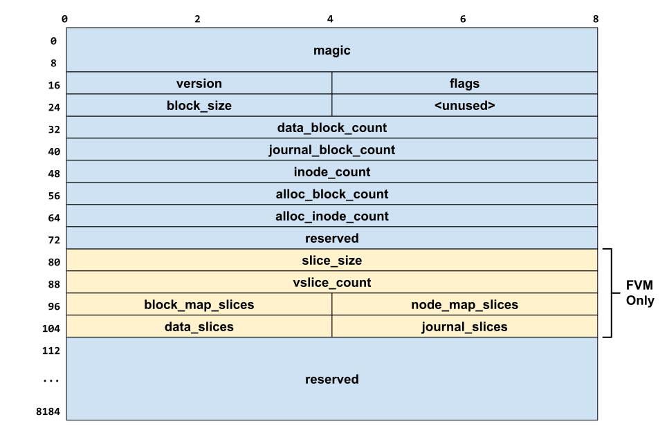
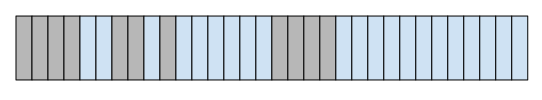
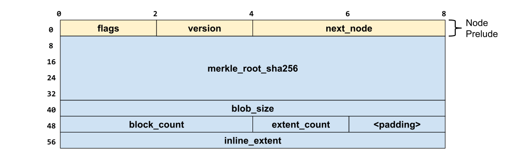
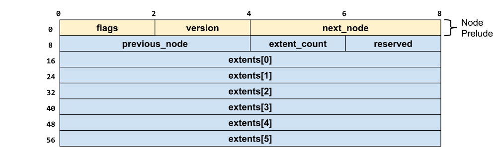
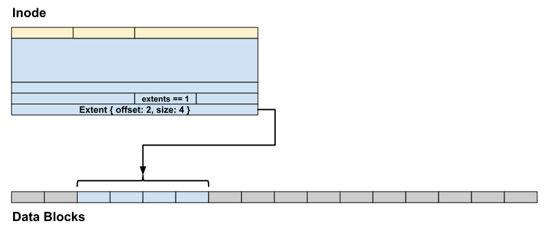
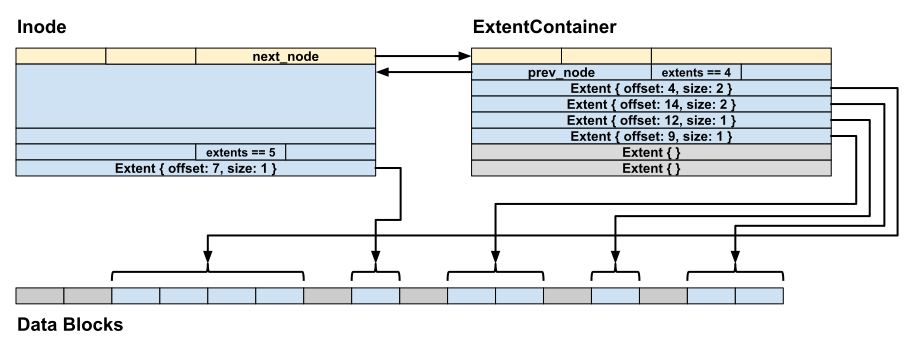
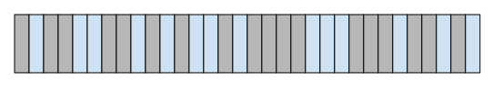
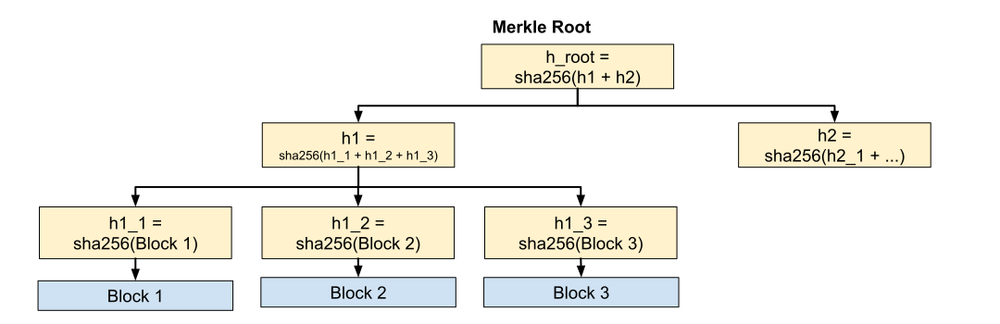

# BlobFS

**BlobFS** is a content-addressable filesystem optimized for write-once,
read-often files, such as binaries and libraries. On Fuchsia, BlobFS is the
storage system used for all software packages.

When mounted, BlobFS presents a single logical directory containing all files
(a.k.a., blobs):

```
blob/
 ├── 00aeb9b5652a4adbf630d04a6ca22668f9c8469746f3f175687b3c0ff6699a49
 ├── 01289d3e1d2cdbc7d1b4977210877c5bbdffdbad463d992badc149152962a205
 ├── 018951bcf92091fd5d294cbd1f3a48d6ca59be7759587f28077b2eb754b437c0
 └── 01bad8536a7aee498ffd323f53e06232b8a81edd507ac2a95bd0e819c4983138
```

Files in BlobFS are:

*   **Immutable**: Once created, a blob cannot be modified (except removal).
*   **Content-Addressable**: Blob names are deterministically derived from their
    contents.
*   **Verified**: Cryptographic checksums are used to ensure integrity of blob
    data.

These properties of blobs make BlobfS a key component of Fuchsia's security
posture, ensuring that software packages' contents can be verified before they
are executed.

## Design and implementation of BlobFS

### On-disk format

BlobFS stores each blob in a linked list of non-adjacent extents (a contiguous
range of data blocks). Each blob has an associated Inode, which describes where
the block's data starts on disk and other metadata about the blob.

BlobFS divides a disk (or a partition thereof) into five chunks:

*   The **Superblock** storing filesystem-wide metadata,
*   The **Block Map**, a bitmap used to keep track of free and allocated data
    blocks,
*   The **Node Map**, a flat array of Inodes (reference to where a blob's data
    starts on disk) or ExtentContainers (reference to several extents containing
    some of a blob's data).
*   The **Journal**, a log of filesystem operations that ensures filesystem
    integrity, even if the device reboots or loses power during an operation,
    and
*   The **Data Blocks**, where blob contents and their verification metadata are
    stored in a series of extents.


Figure 1: BlobFS disk layout

#### Superblock

The superblock is the first block in a BlobFS-formatted partition. It describes
the location and size of the other chunks of the filesystem, as well as other
filesystem-level metadata.

When a BlobFS-formatted filesystem is mounted, this block is mapped into memory
and parsed to determine where the rest of the filesystem lives. The block is
modified whenever a new blob is created, and (for FVM-managed BlobFS instances)
whenever the size of the BlobFS filesystem shrinks or grows.



Figure 2: BlobFS superblock

When BlobFS is managed by FVM, the superblock contains some additional metadata
describing the FVM slices that contain the BlobFS filesystem. These fields
(yellow in the above diagram) are ignored for non-FVM, fixed-size BlobFS images.

#### Block map

The block map is a simple bit-map that marks each data block as allocated or
not. This map is used during block allocation to find contiguous ranges of
blocks, known as _extents_, to store blob contents in.



Figure 3: An example block-map with several free extents of varying size.

When a BlobFS image is mounted, the block map is mapped into memory where it can
be read by the block allocator. The block map is written back to disk whenever a
block is allocated (during blob creation) or deallocated (during blob deletion).

#### Node map

The node map is an array of all nodes on the filesystem, which can come in two
variations:

*   **Inodes**, which describe a single blob on the filesystem, or
*   **ExtentContainers**, which point to an extent containing part of a blob's
    data.

Nodes of both types are stored together in a single flat array. Each node has a
common header that describes what type the node is, and whether the node is
allocated. Both node types are the same size, so there is no internal
fragmentation of the array.

##### Inodes

Each blob in the filesystem has a corresponding Inode, which describes where the
blob's data starts and some other metadata about the blob.



Figure 4: Layout of a BlobFS Inode.

For small blobs, the Inode may be the only node necessary to describe where the
blob is on disk. In this case `extent_count` is one, `next_node` must not be
used, and `inline_extent` describes the blob's single extent.

Larger blobs will likely occupy multiple extents, especially on a fragmented
BlobFS image. In this case, the first extent of the blob is stored in
`inline_extent`, and all subsequent extents are stored in a linked list of
ExtentContainers starting at `next_node.`


Figure 5: Format of an Extent (occupying 64 bits). This format is used both in
Inodes and ExtentContainers.

Note that this representation of extents implies that an extent can have at most
2\*\*16 blocks in it (the maximum value of Extent Size).

##### ExtentContainers

An ExtentContainer holds references to several (up to 6) extents, which store
some of the contents of a blob.

The extents in an ExtentContainer are logically contiguous (i.e. the logical
addressable chunk of the blob stored in extents[0] is before extents[1]) and are
filled in order. If `next_node` is set, then the ExtentContainer must be full.



Figure 6: Layout of a BlobFS ExtentContainer.

##### Properties of the node linked-list

A blob's extents are held in a linked-list of a single Inode (which holds the
first extent) and zero or more ExtentContainers (each of which holds up to 6
extents).

This linked list has the following properties. Violating any of these properties
results in blobfs treating the blob as corrupted.

*   Extents are logically contiguous:
    *   If Node A precedes Node B in the list, then all extents in Node A have
        lower logical offsets into the blob's contents.
    *   Within a given ExtentContainer, for extents 𝑥 and 𝑦, if 𝑥 < 𝑦, then
        extent 𝑥 has a lower logical offset into the blob's contents than extent
        𝑦.
*   Nodes are packed before a new node is linked. That is, if a Node has a
    non-null `next_node`, then it must be full of extents (*extent for Inodes
    and 6 extents for ExtentContainers).
*   The total number of extents in the linked-list must equal to the Inode's
    `extent_count`.
*   The sum of the size of all extents in the linked-list must equal to the
    Inode's `block_count`.
*   The end of the list is determined based on the `extent_count` in the Inode
    being satisfied. `next_node` in the final node should not be used.

##### Example Node layouts

This section contains some examples of different ways a blob's Nodes may be
formatted.

*   [Example: Single-extent blob](#example-single-extent-blob)
*   [Example: Multiple-extent blob](#example-multiple-extent-blob)

###### Example: Single-extent blob {: #example-single-extent-blob }



Figure 7: Node layout for a blob stored in a single extent

###### Example: Multiple-extent blob {: #example-multiple-extent-blob }



Figure 8: Node layout for a blob stored in several extents. Note that a blob's
extents may be scattered throughout the disk.

##### Blob fragmentation

A newly created BlobFS image has all of its data blocks free. Extents of
arbitrary size can easily be found, and blobs tend to be stored in a single
large extent (or a few large extents).

Over time, as blobs are allocated and deallocated, the block map will become
**fragmented** into many smaller extents. Newly created blobs will have to be
stored in multiple smaller extents.



Figure 9: A fragmented block map. While there are plenty of free blocks, there
are few large extents available.

Fragmentation is undesirable for several reasons:

*   **Slower Reads**: Reading a fragmented blob requires chasing pointers in the
    Node Map. This affects both sequential reads and random-access reads
*   **Slower Creation and Deletion:** Creating a blob requires finding free
    extents for it; this takes longer if many small extents must be found.
    Similarly, deleting a fragmented blob requires chasing down and freeing many
    extents.
*   **Metadata Overhead:** Storing fragmented blobs requires more nodes. There
    are a finite number of nodes in the Node Map, which can be exhausted,
    preventing blobs from being created.

Currently BlobFS does not perform defragmentation.

#### Journal

TODO

#### Data blocks

Finally, the actual contents of the blobs must be stored somewhere. The
remaining storage blocks in the BlobFS image are designated for this purpose.

Each blob is allocated enough extents to contain all of its data, as well as a
number of data blocks reserved for storing verification metadata of the blob.
This metadata is always stored in the first blocks of the blob. Metadata is
padded so that the actual data always starts at a block-aligned address.

This verification metadata is called a **Merkle Tree**, a data structure that
uses cryptographic hashes to guarantee the integrity of the blob's contents.

##### Merkle tree

A blob's Merkle Tree is constructed as follows (for more details, see
[Fuchsia Merkle Roots](concepts/packages/merkleroot.md)):

*   Each leaf node is a sha256 hash of a single block's worth of data.
*   Each non-leaf node is a sha256 hash combining its children's hashes.
*   The tree terminates at the level where there is a single sha256 hash.

The hash value at the top-most node is known as the **Merkle Root** of the blob.
This value is used as the name of the blob.



Figure 10: A simplified example Merkle Tree. Note that in practice more
information is included in each hash value (such as the block offset and
length), and each non-leaf node is significantly wider (in particular, each
non-leaf node can contain up to 8192 / 32 == 256 children).

### Implementation of BlobFS

Like other Fuchsia filesystems, BlobFS is implemented as a userspace process
that serves clients through a FIDL interface.

<!--

#### Startup and initialization

TODO

#### Blob lifecycle

##### Creation

TODO

##### Deletion

TODO

## BlobFS and Fuchsia

TODO: Finish this section describing Blobfs' role in the Fuchsia system and its
relationship to other components, such as pkgfs.

-->

