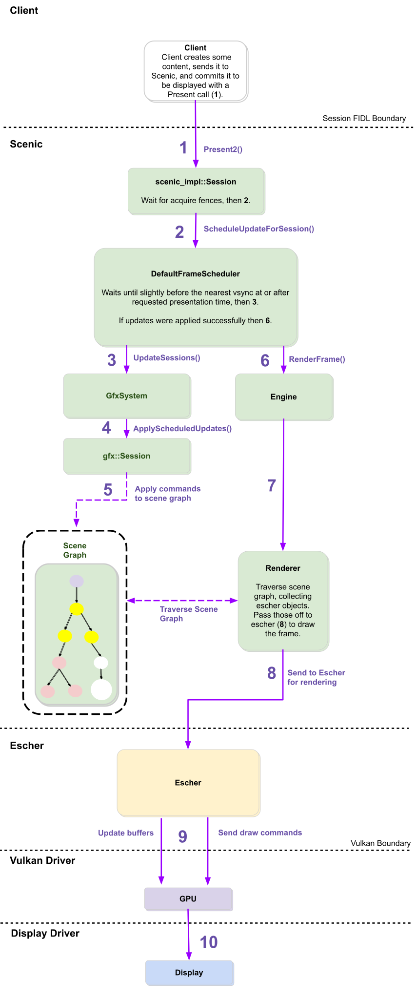

<!-- # Life of a Pixel -->

# 像素的一生

<!-- A client requests a set of commands to be Presented as part of a future Scenic frame. A single Scenic frame
can have multiple client "Presents", where each Present represents a Session's update to the global scene graph. This
doc describes the architecture internal to Scenic for how a request becomes pixels. -->

客户端向 Scenic 发送请求，请求其在未来的一帧（frame）中，`Present`（显示）一系列命令。Scenic 的一帧可以包含多个客户端的
`Present` 命令，其中每个 `Present` 命令代表对应的 Session 对全局 scene graph（场景图）的更新。Scenic 是怎样将这些请求变为屏幕上的像素的？本文描述了
Scenic 实现这一功能的内部架构。

<!-- The diagram below shows the steps a client Present follows when it is requested. Everything between the Scenic FIDL Boundary and the Vulkan driver is currently single-threaded and executes sequentially. -->

下图显示了客户端请求 Present 之后的各步骤。所有介于 Scenic 的 FIDL 边界与 Vulkan 驱动之间的操作，均为单线程顺序执行。

<!-- 1. Client `Enqueue()`s a set of commands to change the contents of its part of the scene, and calls `Present2()` to commit them. -->
1. 客户端调用 `Enqueue()` 将改变场景的命令加入队列，并调用 `Present2()` 提交命令。
<!-- 2. The `Present2()` request enters `scenic_impl::Session`,. `scenic_impl::Session` waits for any acquire fences to signal, as well as any previous `Present2()` calls whose fences haven't been reached yet. `scenic_impl::Session` then schedules an update for the targeted `presentation_time` with the `FrameScheduler`. -->
2. `Present2()` 请求进入 `scenic_impl::Session`. `scenic_impl::Session` 等待所有的
   `acquire_fences` 被触发。如果之前请求的 `Present2()` 的 fence 未被触发，也会一并等待。
   之后，`scenic_impl::Session` 会使用 `FrameScheduler` 预约一次 `presentation_time` 
   时的更新。
<!-- 3. The `FrameScheduler` starts sleeps until there's just enough time to prepare a frame in time for the targeted presentation time. At that point the `FrameScheduler` wakes up and calls `SessionUpdater::UpdateSessions()` on all `SessionUpdaters`. -->
3. `FrameScheduler` 进入睡眠状态，直到正好有足够的时间来为目标 `presentation_time` 
   准备一帧。这时，`FrameScheduler` 被唤醒，调用所有 `SessionUpdater` 的
   `UpdateSessions()` 方法.
<!-- 4. For each client Session, `GfxSystem` calls `ApplyScheduledUpdates()`, which applies the commands to the scene graph which were enqueued in step 1.
  Note: `GfxSystem` is a `SessionUpdater`. -->
4. 对每个客户端 Session，`GfxSystem` 调用 `ApplyScheduledUpdates()`, 将第 1 步提交的命令应用到 scene graph 中。
   Note: `GfxSystem` 是 `SessionUpdater` 接口的子类。 
<!-- 5. Commands from a Session are applied to the global scene graph. The scene graph is in an inconsistent state ("dirty") at this time, and should not be read by other systems (i.e. input) until after the scene graph has been post-processed. -->
5. 客户端 Session 的命令被应用到 scene graph 中，此时 scene graph 的状态是同其他系统不一致
   （脏）的。在 scene graph 被后处理（post-process）之前，其他系统（如 `Input`）不得
   读取其内容。
<!-- 6. When all `SessionUpdaters` have successfully updated, the `FrameScheduler` is notified that the scene graph is dirty, and triggers a `RenderFrame()` call on the `FrameRenderer`. -->
6. 在所有 `SessionUpdater` 都成功更新之后，`FrameScheduler` 会被通知 scene graph 已
   变脏，并触发 `FrameRenderer` 的 `RenderFrame()` 方法。
<!-- 7. To draw a frame, `gfx::Engine`'s renderer traverses the scene graph and creates `Escher::objects` for each element in the scene. The renderer then passes these objects to `Escher`, and calls `DrawFrame()`.
  Note: `gfx::Engine` is a `FrameRenderer`. -->
7. 要绘制一帧，`gfx::Engine` 的渲染器（renderer）会遍历整个 scene graph ，并对场景中的
   各元素创建 `Escher::object` 对象。这样，渲染器可以将这些对象传入 `Escher`，并
   调用其 `DrawFrame()` 方法。
   Note: `gfx::Engine` 是 `FrameRenderer` 接口的子类。
<!-- 8. `Escher` interprets the scene graph objects as `vk::commands`, and sends these commands to the GPU. -->
8. `Escher` 将 scene graph 各对象翻译为 Vulkan 命令 `vk::commands`，并将其发送到 GPU。
<!-- 9.  The GPU processes the commands and sends the results to the display driver. -->
9.  GPU 处理命令，将结果发送至显示驱动。
<!-- 10. The display driver pushes the pixels to the screen. -->
10. 显示驱动将像素显示在屏幕上。

<!--  -->

