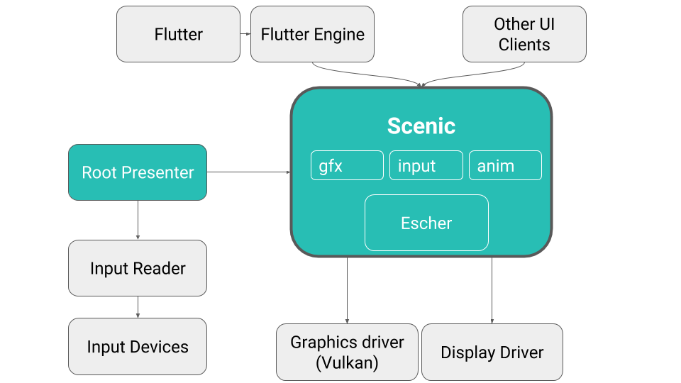
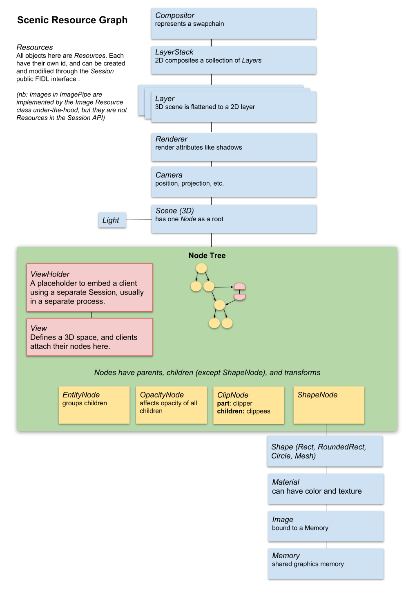
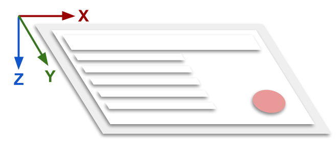
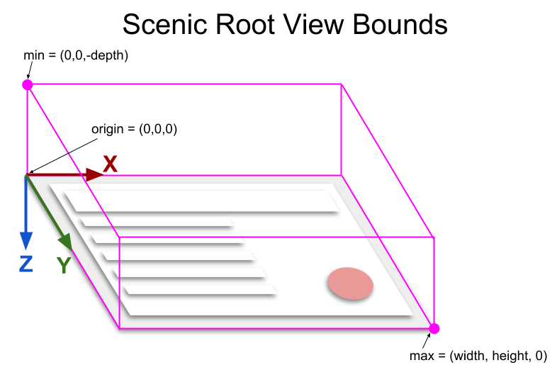

<!-- # Scenic, the Fuchsia graphics engine
-->

# Scenic, Fuchsia 的图形引擎

<!-- # Introduction {#introduction} -->

# 简介 {#introduction}

<!-- Scenic is a system service that composes graphical objects from multiple
processes into a shared scene graph.  These objects are rendered within a
unified lighting environment (to a display or other render target); this
means that the objects can cast shadows or reflect light onto each other,
even if the originating processes have no knowledge of each other. -->

Scenic 是一个可以将各进程的图形对象，组合成共享场景图（scene graph）的系统服务。
这些对象会在一个统一的光照环境下渲染（渲染到显示器或其他渲染目标）；这意味着即使
生成图形对象的各进程之间互不了解，它们仍然可以在其他进程的图形对象上投下阴影或反
射光照。

<!-- Scenic's responsibilities are: -->

Scenic 的职责包括：

<!-- - Composition: Scenic provides a retained-mode 3D scene graph that contains
  content that is independently generated and linked together by its
  clients.  Composition makes it possible to seamlessly intermix
  the graphical content of separately implemented UI components.
 -->
- 合成：Scenic 提供一个在其内部保存的三维场景图，其中包含各客户端独立生成并互相
  链接起来的内容。这使得无缝混合各个独立实现的 UI 组件的图形内容成为可能。

<!-- - Animation: Scenic re-evaluates any time-varying expressions within models
  prior to rendering each frame, thereby enabling animation of model
  properties without further intervention from clients.  Offloading
  animations to Scenic ensures smooth jank-free transitions.
 -->
- 动画：在渲染各帧之前，Scenic 会重新计算所有模型内随时间变化的表达式，进而在没
  有客户端干预的情况下，实现模型各属性的动画效果。将动画负载转移到 Scenic 可保
  证无卡顿的过渡效果。

<!-- - Rendering: Scenic renders its scene graph using Escher, a rendering
  library built on Vulkan, which applies realistic lighting and shadows to
  the entire scene.
 -->
- 渲染：Scenic 使用 Escher ，一个基于 Vulkan 的渲染库，来渲染它的 Scene Graph。Escher
  可以将真实的光照与阴影效果应用于整个场景中。

<!-- - Scheduling: Scenic schedules scene updates and animations to anticipate
  and match the rendering target's presentation latency and refresh interval.
 -->
- 调度：Scenic 调度各场景的更新与动画效果，来预测并匹配渲染对象的显示延迟（presentation
  latency）及刷新间隔（refresh interval）。

<!-- - Diagnostics: Scenic provides a diagnostic interface to help developers
  debug their models and measure performance.
 -->
- 诊断：Scenic 提供了一个诊断接口，以帮助开发者调试其模型并衡量性能。

<!-- ## Scenic and Fuchsia {#scenic-and-fuchsia} -->

## Scenic 与 Fuchsia

<!--  -->

<!-- Scenic's API allows any client to insert its UI into the global scene graph.
Processes using the UI framework [_Flutter_](https://flutter.io/) are one
example; the lower layer of Flutter, called [_Flutter Engine_](https://github.com/flutter/engine),
contains code responsible for communicating with Scenic. -->

Scenic 的 API 允许任何客户将其 UI 插入全局场景图（global scene graph）中。
以使用 UI 框架 [_Flutter_](https://flutter.io/) 的进程为例：Flutter 框架
底层，即 [_Flutter 引擎_](https://github.com/flutter/engine)，包含了负责同
Scenic 通讯的代码。

<!-- Scenic has several internal subsystems. _Gfx_ owns the scene graph and is
responsible for rendering. _Input_ is responsible for routing input events to clients,
which also involves coordinating gesture recognition across clients. _Anim_
is a yet-to-be created system for coordinating transitions across clients
as well as offloading animations to Scenic. -->

Scenic 包含若干个子系统：_Gfx_ 持有 Scene Graph，并负责渲染；_Input_ 负责将输入事件
传达到各客户端，也包括协调各客户端间的手势识别；_Anim_ （暂未创建）负责协调客户端
间的过渡，并将动画负载转移到 Scenic。

<!-- [_Escher_](/src/ui/lib/escher/README.md)
is a Vulkan-based rendering library used by the _Gfx_ system. -->

[_Escher_](/src/ui/lib/escher/README.md)
是 _Gfx_ 系统使用的基于 Vulkan 的渲染库。

<!-- _Root Presenter_ is an independent service which is responsible for
_presenting_ the system's UI; using the Scenic API, it creates the root of a
Scenic scene graph, embeds the root process's UI, and reads input events
using its _Input Reader_ library and continually forwards them to Scenic. -->

_Root Presenter（根展示器）_ 是负责 _展示（present）_ 系统 UI 的独立服务；它调用 
Scenic 的 API 来创建 Scenic Scene Graph 的根节点，利用 _Input Reader（输入读取器）_
库读取输入事件并将其转发至 Scenic。

<!-- Scenic is a client of the [_Vulkan graphics driver_](/src/graphics/lib/magma/)
and the system _Display Driver_. -->

Scenic 是 [_Vulkan 图形驱动（Magma）_](/src/graphics/lib/magma/)和系统 _显示驱动_
的客户端。

<!-- # Concepts {#concepts} -->

# 概念 {#concepts}

<!-- ## Scenic {#scenic} -->

## Scenic {#scenic}

<!-- The `Scenic` FIDL protocol is Scenic's front door.  Each instance of the
protocol represents a Scenic instance. Each Scenic instance is an isolated
rendering context with its own content, render targets, and scheduling loop. -->

`Scenic` FIDL 协议是 Scenic 的门户。`Scenic` 协议的每个服务端对应一个 Scenic 
实例（进程）。每个 Scenic 实例是一个独立隔离的渲染环境（rendering context），包含
其自有的内容、渲染对象及调度循环。

<!-- The `Scenic` protocol allows a client to create a [`Session`](#session) which
is the communication channel used to publish graphical content to this instance. -->

`Scenic` 协议允许客户端创建 [`Session（会话）`](#session)。Session 是客户端用来将图形内容
发布到 Scenic 实例的通讯渠道。

<!-- A single Scenic instance can update, animate, and render multiple
`Scenes` (trees of graphical objects) to multiple targets in tandem on the same
scheduling loop.  This means that the timing model for a Scenic instance
is _coherent_: all of its associated content belongs to the same scheduling
domain and can be seamlessly intermixed. -->

一个 Scenic 实例可以在同一个调度循环中，对多个 `Scene（场景）`（即图形对象组成的树结构）
同时进行更新、创建动画及渲染操作。这意味着 Scenic 实例的时序模型是 _并发_ 的：与其
相关的所有内容，隶属于同一个调度域（scheduling domain）并且可以无缝混合。

<!-- In practice, there is one instance of Scenic and one Scene that is rendered to a
target. However, creating separate Scenic instances can be useful for rendering
to targets which have very different scheduling requirements or for running
tests in isolation. Independent Scenic instances cannot share content and are
therefore not coherent amongst themselves. -->

在实际应用中，系统中只会有一个 Scenic 实例与一个渲染到单一渲染对象的 Scene。然而，
如果要将内容渲染到调度需求差异巨大的渲染对象，或要在隔离环境下运行测试，创建单独的
Scenic 实例将会十分有用。各独立的 Scenic 实例不能与其他实例共享内容，因此它们之间
也不会互相干涉。

<!-- When a Scenic instance is destroyed, all of its sessions become
inoperable and its rendering ceases. -->

当 Scenic 实例被销毁时，所有的 Session 将无法操作，渲染也会停止。

<!-- `Views` typically do not deal with the Scenic instance directly; instead
they receive a Scenic `Session` from the view manager. -->

`View（视图）`通常不会直接与 Scenic 实例交互；View 会从视图管理器（view manager）
中获取 Scenic Session。（译注：该段描述已过时。）

<!-- ## Sessions {#sessions} -->

## Session（会话） {#sessions}

<!-- The `Session` FIDL protocol is the primary API used by clients of Scenic to
contribute graphical content in the form of `Resources`.  Each session has
its own resource table and is unable to directly interact with resources
belonging to other sessions. -->

`Session（会话）` FIDL 协议是 Scenic 客户端用于向 Scenic 以 `Resource（资源）`
形式提供图形内容的基本 API。每个 Session 拥有自己的 Resource 表，且不能直接
访问属于其他 Session 的 Resource。

<!-- Each session provides the following operations: -->

各 Session 提供以下操作：

<!-- - Submit operations to add, remove, or modify resources.
- Commit a sequence of operations to be presented atomically.
- Awaiting and signaling fences.
- Schedule subsequent frame updates.
- Form links with other sessions (by mutual agreement). -->

- 提交添加、删除、修改资源操作；
- 提交一系列操作，并使其同时（原子化地）显示。
- 等待及触发 fence（隔离）。
- 调度后续帧的更新。
- 通过双方协定，同其他 Session 建立 Link（链接）。

<!-- When a session is destroyed, all of its resources are released and all of
its links become inoperable. -->

当 Session 被销毁时，所有的 Resource 会被释放，所有的 Link 将无法操作。

<!-- `Views` typically receive separate sessions from the view manager. -->

通常情况下，不同的 `View` 会从视图管理器中获取不同的 Session.

<!-- ## Resources {#resources} -->

## Resource（资源）{#resources}

<!-- `Resources` represent scene elements such as nodes, shapes, materials, and
animations which belong to particular `Sessions`. -->

`Resource（资源）`用于表示场景中属于特定 `Session` 的元素，如节点（node）、形状
（shape）、材质（material）、动画（animation）等。

<!-- The list of Scenic resources is described by the API:
[//sdk/fidl/fuchsia.ui.gfx/resources.fidl](/sdk/fidl/fuchsia.ui.gfx/resources.fidl) -->

Scenic 所使用的资源由该 API 描述：
[//sdk/fidl/fuchsia.ui.gfx/resources.fidl](/sdk/fidl/fuchsia.ui.gfx/resources.fidl)

<!-- Clients of Scenic generate graphical content to be rendered by queuing and
submitting operations to add, remove, or modify resources within their
session. -->

Scenic 的客户端生成图形内容后，要将添加、删除或修改 Resource 的操作提交到客户端的
Session 来让 Scenic 渲染这些内容。

<!-- Each resource is identified within its session by a locally unique id which
is assigned by the owner of the session (by arbitrary means).  Sessions
cannot directly refer to resources which belong to other sessions (even if
they happen to know their id) therefore content embedding between sessions
is performed using `Link` objects as intermediaries. -->

每个 Resource 由各个 Session 内部独立的 ID 进行识别，这些 ID 由 Session 的所有者
任意分配。各 Session 不能引用隶属于其他 Session 的 Resource （即使它们知道对方
Resource 的 ID），因此，如果要将一个 Session 的内容嵌套到其他 Session，要使用
`Link` 对象作为中介手段。（译注：`Link` 对象已废止不用，Session 之间的嵌套须使用
`View/ViewHolder` 实现）

<!-- To add a resource, perform the following steps: -->

要添加 Resource ，须按照下列步骤进行：

<!-- - Enqueue an operation to add a resource of the desired type and assign it a
  locally unique id within the session.
- Enqueue one or more operations to set that resource's properties given its
  id. -->

- 将“添加某一类型的 Resource”操作加入 Session 队列，并在 Session 内为其分配一个
  内部唯一的 ID。
- 将一个或多个设置 Resource 属性的操作加入 Session 队列。

<!-- Certain more complex resources may reference the ids of other resources
within their own definition.  For instance, a `Node` references its `Shape`
thus the `Shape` must be added before the `Node` so that the node may
reference it as part of its definition. -->

某些复杂的 Resource 可能会在其定义中引用其他 Resource 的 ID。例如，一个 `Node`
可能要引用它的 `Shape`，所以需要先添加 `Shape`，再添加 `Node`，这样我们才能将
在 `Node` 的定义中引用 `Shape`。 

<!-- To modify a resource, enqueue one or more operations to set the desired
properties in the same manner used when the resource was added. -->

要修改 Resource，须将一个或多个修改 Resource 属性的对象加入 Session 队列，方法
和添加 Resource 类似。

<!-- The remove a resource, enqueue an operation to remove the resource. -->

要删除 Resource，须将删除 Resource 的操作加入 Session 队列。

<!-- Removing a resource causes its id to become available for reuse.  However,
the session maintains a reference count for each resource which is
internally referenced.  The underlying storage will not be released (and
cannot be reused) until all remaining references to the resource have been
cleared *and* until the next frame which does not require the resource has
been presented.  This is especially important for `Memory` resources.
See also [Fences](#fences). -->

删除 Resource 会使得该 Resource 的 ID 重新变为可用状态。然而，对在 Scenic 内部
被引用的每个 Resource，Session 会维护其引用计数。这样，其内部存储就不会被释放
（也不会被重用），直到所有对该 Resource 的引用都被清除，*并且*不需要该 Resource
的一帧已经被显示为止。这一点对 `Memory` 类型的资源尤其重要。参见 [Fences（隔离）](#fences).

<!-- This process of addition, modification, and removal may be repeated
indefinitely to incrementally update resources within a session. -->

这一添加、修改、删除 Resource 的过程可以无限重复，用以增量更新 Session 内的资源。

<!-- ### Nodes {#nodes} -->

### Node（节点）{#nodes}

<!-- A `Node` resource represents a graphical object which can be assembled into
a hierarchy called a `node tree` for rendering. -->

`Node`（节点）类型的 Resource 代表可以被组合成 `node tree` 层级结构用于渲染的
一类图形对象。

<!-- [Here](scenic_resource_lifecycle.md) is a walk-through on how Scenic internally manages
the lifecycle of Node-like resources and embedded Views. -->

[这篇文章](scenic_resource_lifecycle.md)展示了 Scenic 内部管理 Node 类资源与
嵌入视图 View 的生命周期的机制。

<!-- TODO: Discuss this in more detail, especially hierarchical modeling concepts
such as per-node transforms, groups, adding and removing children, etc. -->

TODO：详细介绍该部分内容，尤其是层级模型的概念，如各 Node 的变形，分组，添加、删除
子节点等。

<!-- ### Scenes {#scenes} -->

### Scene（场景）{#scenes}

<!-- A `Scene` resource combines a tree of nodes with the scene-wide parameters
needed to render it.  A Scenic instance may contain multiple scenes but
each scene must have its own independent tree of nodes. -->

`Scene`（场景）资源整合了 Node 树与 Scene 内适用的渲染参数。一个 Scenic
实例可能会包含若干个 Scene，但每个 Scene 一定含有其独立的 Node 树。

<!-- A scene resource has the following properties: -->

Scene 类型的资源包含下列属性：

<!-- - The scene's root node.
- The scene's global parameters such as its lighting model. -->

- Scene 的根节点。
- Scene 的全局参数（如光照模型等）。

<!-- In order to render a scene, a `Camera` must be pointed at it. -->

要渲染一个 Scene，必须有指向该 Scene 的 `Camera`（相机）。

<!-- ### Compositors {#compositors} -->

### Compositor（合成器）{#compositors}

<!-- Compositors are resources that come in two flavors: `DisplayCompositor` and
`ImagePipeCompositor`; their job is to draw the content of a `LayerStack`
into their render target.  For `DisplayCompositor`, the target display may
have multiple hardware overlays; in this case the compositor may choose
associate each of these with a separate layer, rather than flattening the
layers into a single image. -->

`Compositor` 类型的资源分为两种：`DisplayCompositor`（显示合成器）与`ImagePipeCompositor`
（图像管道合成器）。它们的工作是把 `LayerStack` 渲染到渲染对象。对于 `DisplayCompositor`，
其目标显示设备可能有多个硬件叠加层；这时 Compositor 可以选择将不同的 Layer
关联到不同的叠加层中，无需将各层拼合成单一图象。

<!-- A `LayerStack` resource consists of an ordered list of `Layers`.  Each layer
can contain either an `Image` (perhaps transformed by a matrix), or a
`Camera` that points at a `Scene` to be rendered (as described above). -->

`LayerStack` 类型的资源包含由 `Layer`（图层）组成的有序列表。每个 Layer 可以容纳一个
`Image`（图象）（可能有矩阵变换），或一个 `Camera` 对象，该 `Camera` 指向要被渲染的
`Scene`（如上文所述）.

<!-- ### Scenic Resource Graph {#scenic-resource-graph} -->

### Scenic 资源图

<!--  -->

<!-- ### TODO: More Resources {#todo-more-resources} -->

### TODO: 其他资源 {#todo-more-resources}

<!-- Add sections to discuss all other kinds of resources: shapes, materials,
links, memory, images, buffers, animations, variables, renderers etc. -->

添加其他章节，讨论其他类型的资源：`Shape`、`Material`、`Link`、`Memory`、
`Image`、`Buffer`、`Animation`、`Variable`、`Renderer` 等。

<!-- ## Coordinate Frames and Units {#coordinate-frames-and-units} -->

## 坐标系与单位

<!-- Scenic manages a global scene graph in a three dimensional space. Some of the characteristics of
this space are defined by Scenic itself, whereas some are defined by the root presenter or even
other clients. -->

Scenic 管理一个三维空间下的全局场景图（scene graph）。空间中的一部分特性是由 Scenic 定义的，
其他特性由 Root Presenter 或其他客户端定义。

<!--  -->

<!-- ### Units {#units} -->

### 单位 {#units}

<!-- Units are configured by the root presenter. The default root presenter uses a device-independent
scalable unit called "pips" for the root space. See [Units and Metrics](units_and_metrics.md) for
details. What units are used for your view space depends on what transforms are applied to your
view by your parent. -->

单位由 Root Presenter 定义。默认情况下，Root Presenter 在根空间（root space）中使用一个设备无关的
可缩放单位——“pip”。详细请参见[单位与度量](units_and_metrics.md)。View 的视图空间使用的单位，取决于
View 的父节点施加的变换操作。

<!-- ### World Space {#world-space} -->

### 世界空间 {#world-space}

<!-- The Scenic world space is a right handed Cartesian space. It is configured by the root presenter
which configures the view and projection parameters of the camera. The default root presenter
will put the origin at the top left of the screen and make +X point right, +Y point down, and
+Z point into the screen. -->

Scenic 的世界空间（world space）是右手直角坐标系。该坐标系由 Root Presenter 配置，除此之外它还配置了
视图属性和相机的的投影参数。默认情况下， Root Presenter 会将原点放在屏幕左上角，将 +X 坐标轴指向右， 
+Y 坐标轴指向下，+Z 坐标轴指向屏幕内部。

<!-- ### View Space {#view-space} -->

### 视图空间 {#view-space}

<!-- Ultimately the space of a given view depends on what transforms are applied to it by its parent
View and the parent View's parent and so on. If no rotation transform is applied and all scale
transforms are positive along all axes then the View's axes will align with the axes of the root
presenter and the handedness will match. -->

View（视图）最终的空间属性取决于其父节点施加的变换，祖父节点施加的变换，等等。如果没有旋转变换施加在视图
上，且各坐标轴的缩放参数均为正值，则视图的坐标轴与手性将与 Root Presenter 相匹配。

<!-- The bounds of the root view are defined by a min and a max point as follows: -->

根视图（Root View）的边界由最小点（min）和最大点（max）确定：

<!--  -->

<!-- ## Views and Bounds {#views-and-bounds} -->

## Views（视图）与边界 {#views-and-bounds}

<!-- [View Bounds](view_bounds.md) shows how to set up your view bounds, how to debug
them with wireframe rendering, and explains how view bounds interact with hit testing. -->

[视图边界](view_bounds.md) 展示了怎样设置 View（视图）的边界，怎样利用线框渲染模式进行调试，
并解释了视图边界怎样同点击测试（hit testing）交互。

<!-- ## Fences {#fences} -->

## Fences（隔离）

<!-- TODO(SCN-1228): Talk about synchronization. -->

TODO(SCN-1228): 讨论同步问题。

<!-- # Frame Scheduling {#frame-scheduling} -->

# 帧调度 {#frame-scheduling}

<!-- [Frame scheduling](frame_scheduling.md) explains how the frame scheduling API work and contains
examples of how to use it. -->

[帧调度](frame_scheduling.md)一文解释了帧调度（frame scheduling）API 的工作原理，
并含有 API 的使用范例。

<!-- # Examples of using Scenic {#examples-of-using-scenic} -->

# Scenic 使用范例 {#examples-of-using-scenic}

<!-- * [bouncing_ball](/src/ui/examples/bouncing_ball/README.md): Simple example that doesn't use any wrapper library.
* [simplest_app](/src/ui/examples/simplest_app/README.md): Draws a background color that changes with user input.
* [spinning_square](/src/ui/examples/spinning_square/README.md): Draws a square and animates it.
* [tile](/src/ui/examples/tile/README.md): Simple window-manager-like app that embeds child views.
* Other examples: [`//src/ui/examples`](/src/ui/examples) -->

* [bouncing_ball](/src/ui/examples/bouncing_ball/README.md): 不使用任何封装库的简单范例.
* [simplest_app](/src/ui/examples/simplest_app/README.md): 在屏幕上绘制可随用户输入改变的背景色.
* [spinning_square](/src/ui/examples/spinning_square/README.md): 在屏幕上画一个方形并实现动画.
* [tile](/src/ui/examples/tile/README.md): 简单的可嵌套子视图的窗口管理器.
* 其他范例: [`//src/ui/examples`](/src/ui/examples)

<!-- # API Guide {#api-guide} -->

# API 使用指南 {#api-guide}

<!-- ## Scenic client libraries -->

## Scenic 客户端库

<!-- Scenic has convenience wrapper libraries for some languages. These can be used instead of using the FIDL API directly. -->

在一些语言中，可以调用封装好的 Scenic 库，而无需直接调用 FIDL API。

<!-- * [C++ client library](/sdk/lib/ui/scenic/cpp) (see also examples: [simplest_app](/src/ui/examples/simplest_app/README.md), [spinning_square](/src/ui/examples/spinning_square/README.md), [simplest_embedder](/src/ui/examples/simplest_embedder/README.md), [tile](/src/ui/examples/tile/README.md))
* [Rust client library](/src/lib/ui/fuchsia-scenic) -->

* [C++ 客户端库](/sdk/lib/ui/scenic/cpp) (范例: [simplest_app](/src/ui/examples/simplest_app/README.md), [spinning_square](/src/ui/examples/spinning_square/README.md), [simplest_embedder](/src/ui/examples/simplest_embedder/README.md), [tile](/src/ui/examples/tile/README.md))
* [Rust 客户端库](/src/lib/ui/fuchsia-scenic)

<!-- ## FIDL protocols {#fidl-protocols} -->

## FIDL 协议 {#fidl-protocols}

<!-- The following files define and document the collection of FIDL protocols that
make up Scenic. -->

下列文件包含了组成 Scenic 的一系列 FIDL 协议的定义与文档。

<!-- * [Scenic top-level protocols](/sdk/fidl/fuchsia.ui.scenic) (`fuchsia.ui.scenic`) -->

* [Scenic 顶层协议](/sdk/fidl/fuchsia.ui.scenic) (`fuchsia.ui.scenic`)
  * [scenic.fidl](/sdk/fidl/fuchsia.ui.scenic/scenic.fidl)
  * [session.fidl](/sdk/fidl/fuchsia.ui.scenic/session.fidl)
  * [commands.fidl](/sdk/fidl/fuchsia.ui.scenic/commands.fidl)
  * [events.fidl](/sdk/fidl/fuchsia.ui.scenic/events.fidl)

* [Gfx](/sdk/fidl/fuchsia.ui.gfx) (`fuchsia.ui.gfx`)
  * [commands.fidl](/sdk/fidl/fuchsia.ui.gfx/commands.fidl)
  * [events.fidl](/sdk/fidl/fuchsia.ui.gfx/events.fidl)
  * [resources.fidl](/sdk/fidl/fuchsia.ui.gfx/resources.fidl)
  * [nodes.fidl](/sdk/fidl/fuchsia.ui.gfx/nodes.fidl)
  * [shapes.fidl](/sdk/fidl/fuchsia.ui.gfx/shapes.fidl)
  * [...](/sdk/fidl/fuchsia.ui.gfx)

* [Views](/sdk/fidl/fuchsia.ui.views) (`fuchsia.ui.views`)
  * [commands.fidl](/sdk/fidl/fuchsia.ui.views/commands.fidl)

* [Input](/sdk/fidl/fuchsia.ui.input) (`fuchsia.ui.input`)
  * [commands.fidl](/sdk/fidl/fuchsia.ui.input/commands.fidl)
  * [input_events.fidl](/sdk/fidl/fuchsia.ui.input/input_events.fidl)

* [Policy](/sdk/fidl/fuchsia.ui.policy) (`fuchsia.ui.policy`)
  * [presenter.fidl](/sdk/fidl/fuchsia.ui.policy/presenter.fidl)
  * [presentation.fidl](/sdk/fidl/fuchsia.ui.policy/presentation.fidl)
  * [...](/sdk/fidl/fuchsia.ui.policy)

* [App](/sdk/fidl/fuchsia.ui.app) (`fuchsia.ui.app`)
  * [view_provider.fidl](/sdk/fidl/fuchsia.ui.app/view_provider.fidl)

<!-- ## TODO {#todo} -->

## TODO {#todo}

<!-- Talk about how to get started using Scenic, recommended implementation strategies, etc. -->

怎样开始使用 Scenic，推荐的实现方法，等等。