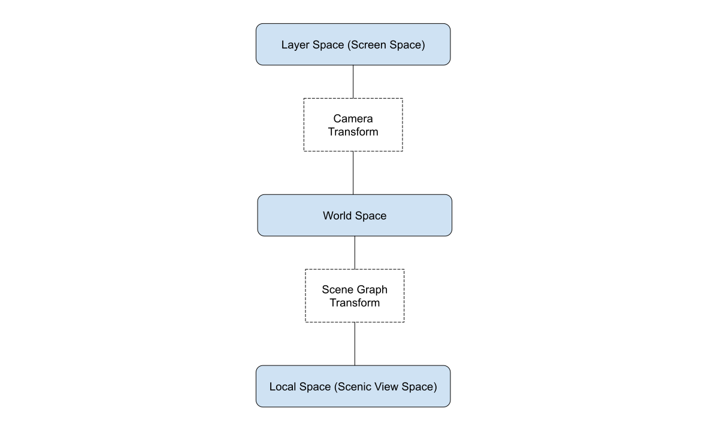
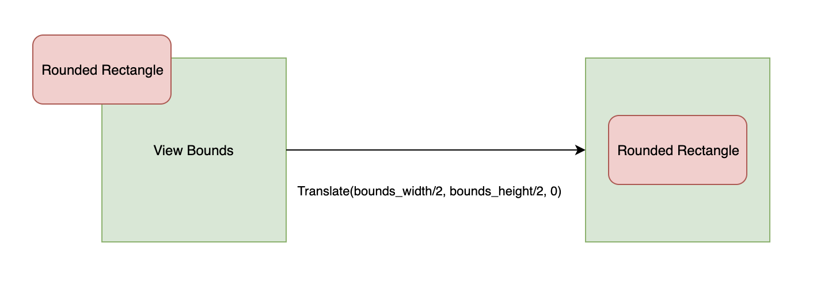
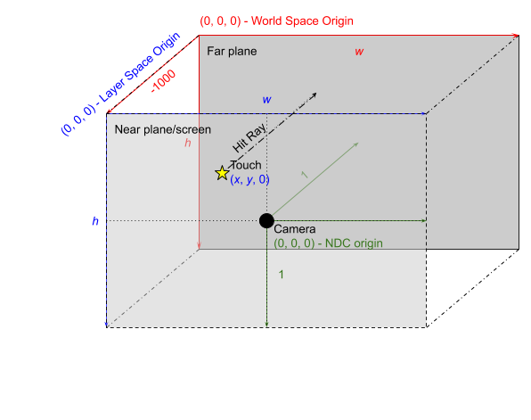

# Views, Bounds, and Clipping

- [Introduction](#introduction)

- [Concepts](#concepts)
  - [Setting View Bounds](#setting-view-bounds)
    - [Bound Extent and Insets](#bound-extent-and-insets)
    - [Example](#example-1)
  - [Coordinate System](#coordinate-system)
    - [Example](#example-2)
  - [Centering Geometry](#centering-geometry)
  - [Debug Wireframe Rendering](#debug-wireframe-rendering)
  - [Ray Casting and Hit Testing](#ray-casting-and-hit-testing)
    - [The Hit Ray](#the-hit-ray)
    - [Rules](#rules)
    - [Edge Cases](#edge-cases)
    - [Pixel Offsets](#pixel-offsets)
      - [Example](#example-3)

# Introduction

This is a guide that explains how view bounds and clipping work in Scenic. This
guide explains how to set view bounds, how to interpret what the commands are
doing, and the effects that the view bounds have on existing Scenic subsystems.

# Concepts

## Setting View Bounds {#setting-view-bounds}

An embedder must create a pair of tokens for a view and view holder, and must
also allocate space within its view for the embedded view holder to be laid out.
This is done by setting the bounds on the view holder of the embedded view. To
set the view bounds on a view, you have to call `SetViewProperties` on its
respective ViewHolder. You can call `SetViewProperties` either before or after
the view itself is created and linked to the ViewHolder, so you do not have to
worry about the order in which you do your setup. The bounds themselves are set
by specifying their minimum and maximum points (xyz) in 3D space.

### Bound Extent and Insets {#bound-extent-and-insets}

The `bounding_box` property in `ViewProperties` struct set is used to set the
bounds of a view. The minimum and maximum bounds represent the minimum and
maximum coordinate points of an axis-aligned bounding box.

The `insets_from_min` and `insets_from_max` properties provide a hint
that the region between the bounding box and the inset may be obscured.
Scenic does not use the inset values to determine the bounding box,
but anything drawn outside of

```cpp
{ bounding_box.min + inset_from_min, bounding_box.max - inset_from_max }
```

may be obscured by its ancestor view. The reason for obscuring, and the rules
surrounding it, is specific to each product.

### Example {#example-1}

```cpp
// Create a pair of tokens to register a view and view holder in
// the scene graph.
auto [view_token, view_holder_token] = scenic::ViewTokenPair::New();

// Create the actual view and view holder.
scenic::View view(session, std::move(view_token), "View");
scenic::ViewHolder view_holder(session, std::move(view_holder_token),
                               “ViewHolder");
// Set the bounding box dimensions on the view holder.
view_holder.SetViewProperties({.bounding_box{.min{0, 0, -200}, .max{500, 500, 0}},
                               .inset_from_min{20, 30, 0},
                               .inset_from_max{20, 30, 0}});
```

The above code creates a View and ViewHolder pair whose bounds start at `(0,
0, -200)` and extend out to `(500, 500, 0)`. The bounds themselves are always
axis-aligned.

## Coordinate System {#coordinate-system}

The 3D system of Scenic consists of a number of coordinate spaces. They can
roughly be categorized as: Layer Space, World Space and Local space. A spatial
point has independent coordinates in each coordinate system. A transformation
matrix describes how to map a spatial point between two coordinate spaces; the
point's coordinates in system A is multipled by a transformation matrix to
obtain its coordinates in system B (or the matrix's inverse for the opposite
direction).

All Scenic coordinate systems are right handed.



#### Layer Space (Screen Space)

Layer Space is a 2D coordinate space corresponding to an area on the screen. 
- Origin: Top left corner, X-axis pointing to the right and Y-axis pointing down. Axis-aligned 
    with display. 
- Dimensions: Typically equal to the display dimensions (a full screen layer).

#### Camera Transform

The camera transform matrix transforms a coordinate from World Space to Layer
Space.

This transformation actually consists of a few steps.

First we transform from World Space to an intermediate space known as Camera
Space. This is a normalized three dimensional coordinate system from -1 to 1 in
every direction. This coordinate system is right handed, with the X-axis
pointing to the right, Y-axis pointing down and Z-axis pointing “into the
screen”. The camera's location and direction in World Space define the
transform.

Next the projection transformation matrix decides how to flatten the Camera
Space into the two dimensional space of Layer Space. This transformation
dictates the type of projection to perform: either orthographic or perspective
projection. The common choice is orthographic, in which the world is essentially
flattened in the Z-direction while maintaining the X- and Y-axes.

Finally, a clip space transform might be applied that scales and translates the
2D space in order to enable magnification.[^1]

[^1]: A better solution for handling magnification would have been to simply insert a scale node into the graph and then manipulate that directly. This approach caused some issues with applications being confused about how big they are and how much memory they should allocate (because metrics events are issued with scaling), and the clip space transform was introduced as a workaround. And because input is currently handled in camera space, this comes with the unfortunate side effect that swipe gestures can appear smaller under magnification.

#### World Space

World Space is where the Scene Graph's root view is positioned, and also where
the camera is positioned. The entire Scene Graph is thus embedded in this space,
and how we relate Camera Space to the scene is defined in this space.

#### Transform Nodes

Each node in the Scene Graph has a Local Space associated with it. This space is
defined by that node's transformation matrix, which transforms a coordinate from
the node's Local Space to the Local Space of its parent. This matrix is
dependent on the position, rotation and scale of the node as defined by its
parent.

The Local Space of each node can be related to World Space by multiplying every
transform matrix up the Scene Graph, terminating at the Scene Graph's root
(whose transformation matrix is the transform from the root's Local Space to
World Space). This multiplied matrix is known as the node's "global transform".

The transform matrix of a node is the combination of the translation, scale and
rotation of that node. Application order is scale, then rotation, then
translation. Because each of these values can be written as their own
transformation matrices, and the order of multiplication for matrices matter, we
can then write the full transform as:

```
parent_local_point = translation matrix * rotation_matrix * scale_matrix * local_point
```

### Example

We have a Scene Graph made up of two nodes, Node1 and Node2.
Node1 is a child of Node2, and P1 is a point in Node1's Local Space,
Node1 and Node2 both have a rotation, scale and translation.
To get the World Space coordinates of P1 you then combine, in order, the transforms of all parents:
```
p1_world_position = (translation_node2 * rotation_node2 * scale_node2) * (translation_node1 * rotation_node1 * scale_node1) * p1_local_position
```

#### Local Space (Scenic View Space) [^2]

Since not every Session has full knowledge of the full Scene Graph they instead
all act in the local coordinate space of their View. This is the space a Session
defines the transforms of its nodes in and the space that input coordinates are
delivered in.

-   Origin: "Back corner" of View. The Z dimension of the View is usually set up
    as -1000 to 0 (as a side effect of starting out as a left handed coordinate
    system that only later became right handed), so the View's origin is at the
    maximal Z value, but at minimal X and Y values. Usually axis-aligned with
    world space.

[^2]: Not to be confused with the View Space from the common Model-View-Projection notation of 3D graphics, which we here called Camera Space.

### View Bounds

View bounds are specified in local coordinates, and their World Space position
is determined by the global transform of the view node.

Input coordinates originate from Layer Space, which usually corresponds to pixel
coordinates with an origin at the upper left of the screen. The input system
works with the compositor and camera to map from input device coordinates to
World Space by way of
[Ray Casting and Hit Testing](#ray-casting-and-hit-testing).

### Example {#example-2}

```cpp
// Create a view and view-holder token pair.
auto [view_token, view_holder_token] = scenic::ViewTokenPair::New();
scenic::View view(session, std::move(view_token), "View");
scenic::ViewHolder view_holder(session, std::move(view_holder_token),
                               "ViewHolder");

// Add the view holder as a child of the scene.
scene.AddChild(view_holder);

// Translate the view holder and set view bounds.
view_holder.SetTranslation(100, 100, 200);
view_holder.SetViewProperties({.bounding_box{.max{500, 500, 200}}});
```

In the above code, the view bounds in Local Space have a min and max value of
`(0, 0, 0)` and `(500, 500, 200)`, but since the parent node is translated by
`(100, 100, 200)` the view bounds in World Space will actually have a World
Space bounds min and max of `(100, 100, 200)` and `(600, 600, 400)`
respectively. However, the view itself doesn’t see these world-space bounds, and
only deals with its bounds in its own Local Space.

## Centering Geometry {#centering-geometry}

The center of mass for a piece of geometry such as a `RoundedRectangle` is its
center, whereas for a view, the center of mass for its bounds is its minimum
coordinate. This means that if a view and a rounded-rectangle that is a child of
that view both have the same translation, the center of the rounded-rectangle
will render at the minimum-coordinate of the view’s bounds. To fix this, apply
another translation on the shape node to move it to the center of the view’s
bounds.



## Debug Wireframe Rendering {#debug-wireframe-rendering}

To help with debugging view bounds, you can render the edges of the bounds in
wire-frame mode to see where exactly your view is located in World Space. This
functionality can be applied per-view using a Scenic command:

```cpp
// This command turns on wireframe rendering of the specified
// view, which can aid in debugging.
struct SetEnableDebugViewBoundsCmd {
    uint32 view_id;
    bool display_bounds;
};
```

This command takes in a `view id`, and a `bool` to toggle whether or not the
view bounds should be displayed. The default display color is white, but you can
choose different colors by running the `SetViewHolderBoundsColorCmd` on the
specified view holder:

```cpp
// This command determines the color to be set on a view holder’s debug
// wireframe bounding box.
struct SetViewHolderBoundsColorCmd {
    uint32 view_holder_id;
    ColorRgbValue color;
};
```

## Ray Casting and Hit Testing {#ray-casting-and-hit-testing}

Hit testing by ray casting maps Layer Space coordinates to scene geometry and
coordinates. Ultimately, inputs are delivered to views with View-local
coordinates. As described in the [Coordinate System](#coordinate-system)
section, View-local coordinates are determined by the global transform of the
View node, which maps from World Space to Local Space.

### The Hit Ray {#the-hit-ray}

When injecting touch input events we need to know two things: 1. Which client(s)
are we sending the input event to? 2. What is the coordinate of the input event
in the client’s local coordinate system?

The conversion of input coordinates from Layer Space to World Space involves the
input system, compositor layer, and camera.



To find which client we are sending the event to we perform a hit test. This is
done by projecting a ray (in World Space) into the scene to see what objects it
intersects and then sending the input to the closest hit object. When we hit
something we note where in the scene that hit point is. We then compute the
World Space to Local Space transform of the owning view of the hit object, and
use that to send the input event to the client in their local coordinates.

The original input coordinate is a two-dimensional coordinate in screen pixels.
The input system and compositor agree on a convention, illustrated above as
device coordinates in 3 dimensions (blue), where the viewing volume has depth 1,
the near plane is at z = 0, and the far plane is at z = -1. With this in mind,
the input system constructs a hit ray by computing the World Space coordinates
of the touch coordinate (by inverting the camera transform), sets those as the
origin, with Z at 0 and direction `(0, 0, 1)`, towards the scene.

In World Space then, the hit ray described above originates at `(x, y, -1000)`
with direction `(0, 0, 1000)`.

### Rules {#rules}

When performing hit tests, Scenic runs tests against the bounds of a `ViewNode`
before determining whether the ray should continue checking children of that
node.

*   If a ray completely misses a view’s bounding box, nothing that is a child of
    that view will be hit.

*   If a ray does intersect a bounding box, only geometry that exists within the
    range of the ray’s entrance and exit from the bounding box will be
    considered for a hit. For example, clipped geometry cannot be hit.

If you forget to set the bounds for a view, any geometry that exists as a child
of that view cannot be hit. This is because the bounds would be null and
therefore infinitely small, which also means that there would be no geometry
rendered to the screen.

In debug mode, a null bounding box will trigger an `FXL_DCHECK` in the
`escher::BoundingBox` class stating that the bounding box dimensions need to be
greater than or equal to 2.

### Edge Cases {#edge-cases}

Situations where a ray is perpendicular to a side of a bounding box and just
grazes its edge will not count as a hit. Since the six planes that constitute
the bounding box are themselves the clip planes, it follows that anything that
is directly on a clip plane would also get clipped.

### Collisions {#collisions}

A collision occurs when a ray cast detects two or more hits at the same
distance. A collision indicates that hittable targets are overlapping and
occupying the same position in the scene. This is considered incorrect behavior
and Scenic does not provide hit test ordering guarantees in case of collisions.
The client must prevent collisions.

There are two ways collisions can occur:

*   Collision between nodes in the same view. The owning view must ensure the
    proper placement of elements within a view.

*   Collision between nodes in separate views. The parent view must prevent any
    intersection between the clip bounds of its children.

It is also best practice to follow these rules to avoid Z-fighting for visual
content.

When a collision is detected, a warning is logged of the colliding nodes by
session id and resource id.
