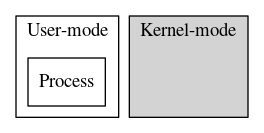
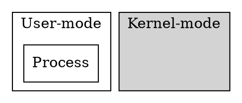
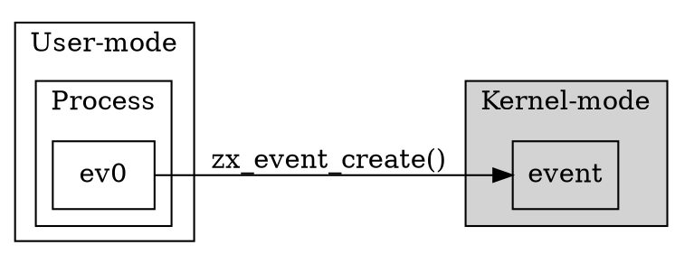
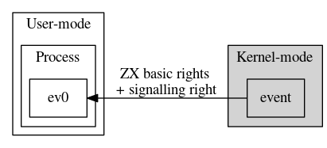
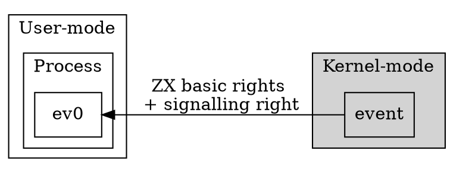
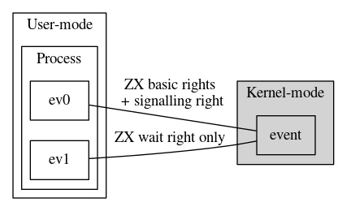
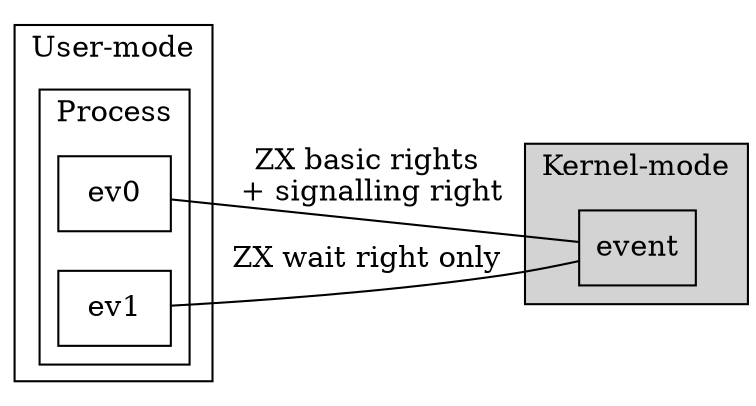

# Zircon Handles

[TOC]

## Basics
Handles are kernel constructs that allow user-mode programs to
reference a kernel object. A handle can be thought of as a session
or connection to a particular kernel object.

It is often the case that multiple processes concurrently access
the same object via different handles. However, a single handle
can only be either bound to a single process or be bound to the
kernel.

When it is bound to the kernel we say it's 'in-transit'.

In user mode a handle is simply a specific number returned by
some syscall. Only handles that are not in-transit are visible
to user-mode.

The integer that represents a handle is only meaningful for that
process. The same number in another process might not map to any
handle or it might map to a handle pointing to a completely
different kernel object.

The integer value for a handle is any 32-bit number except the value
corresponding to **ZX_HANDLE_INVALID** which will always have the
value of 0.  In addition to this, the integer value of a valid handle
will always have two least significant bits of the handle set.  The
mask representing these bits may be accessed using
**ZX_HANDLE_FIXED_BITS_MASK**

For kernel mode, a handle is a C++ object that contains three
logical fields:

* A reference to a kernel object
* The rights to the kernel object
* The process it is bound to (or if it's bound to the kernel)

The '[rights][rights]' specify what operations on the kernel object
are allowed. It is possible for a single process to have two different
handles to the same kernel object with different rights.

**Figure 1.** A user process starts the creation of a handle.

<!--- handle-creation1.png

-->

**Figure 2.** The user process creates the kernel object (for example, an
event) with a system call and holds an integer reference to the object.

<!--- handle-creation2.png

-->

**Figure 3.** Handles are created with a set of basic rights and any additional
rights applicable to the kernel object type.

<!--- handle-creation3.png

-->

**Figure 4.** Handles can be duplicated. Rights can be dropped during this
process.

<!--- handle-creation4.png

-->

## Using Handles

There are many syscalls that create a new kernel object
and that return a handle to it. To name a few:

* <code>[zx_event_create()][zx-event-create]</code>
* <code>[zx_process_create()][zx-process-create]</code>
* <code>[zx_thread_create()][zx-thread-create]</code>

These calls create both the kernel object and the first
handle pointing to it. The handle is bound to the process that
issued the syscall and the rights are the default rights for
that type of kernel object.

There is only one syscall that can make a copy of a handle,
which points to the same kernel object and is bound to the same
process that issued the syscall:

* <code>[zx_handle_duplicate()][zx-handle-duplicate]</code>

There is one syscall that creates an equivalent handle (possibly
with fewer rights), invalidating the original handle:

* <code>[zx_handle_replace()][zx-handle-replace]</code>

There is one syscall that just destroys a handle:

* <code>[zx_handle_close()][zx-handle-close]</code>

There is one syscall that takes a handle bound to the calling
process and binds it into the kernel (puts the handle in-transit):

* <code>[zx_channel_write()][zx-channel-write]</code>

There are two syscalls that take an in-transit handle and
bind it to the calling process:

* <code>[zx_channel_read()][zx-channel-read]</code>
* <code>[zx_channel_call()][zx-channel-call]</code>

The channel and socket syscalls above are used to transfer a handle from
one process to another. For example it is possible to connect
two processes with a channel. To transfer a handle the source process
calls `zx_channel_write` or `zx_channel_call` and then the destination
process calls `zx_channel_read` on the same channel.

Finally, there is a single syscall that gives a new process its
bootstrapping handle, that is, the handle that it can use to
request other handles:

* <code>[zx_process_start()][zx-process-start]</code>

The bootstrapping handle can be of any transferable kernel object but
the most reasonable case is that it points to one end of a channel
so this initial channel can be used to send further handles into the
new process.

## Garbage Collection

If a handle is valid, the kernel object it points to is guaranteed
to be valid. This is ensured because kernel objects are ref-counted
and each handle holds a reference to its kernel object.

The opposite does not hold. When a handle is destroyed it does not
mean its corresponding kernel object is destroyed. There could be other
handles pointing to the object or the kernel itself could be holding
a reference to the kernel object.

When the last reference to a kernel object is released, the kernel
object is either destroyed or the kernel marks the object for
garbage collection; the object will be destroyed at a later time
when the current set of pending operations on it is completed.

More detail in the [kernel object lifetimes][lifetime] page.

## Special Cases

* When a handle is in-transit and the channel or socket it was written
to is destroyed, the handle is closed.

* Debugging sessions (and debuggers) might have special syscalls to
get access to handles.

## Invalid Handles and handle reuse

It is an error to pass to any syscall except for `zx_object_get_info`
the following values:

* A handle value that corresponds to a closed handle
* The **ZX_HANDLE_INVALID** value, except for `zx_handle_close` syscall

The kernel is free to re-use the integer values of closed handles for
newly created objects. Therefore, it is important to make sure that proper
handle hygiene is observed:

* Don't have one thread close a given handle and another thread use the
  same handle in a racy way. Even if the second thread is also closing it.

* Don't ignore **ZX_ERR_BAD_HANDLE** return codes. They usually mean the
  code has a logic error.

Detecting invalid handle usage can be automated by using the
**ZX_POL_BAD_HANDLE** Job policy with **ZX_POL_ACTION_EXCEPTION** to
generate an exception when a process under such job object attempts any of
the mentioned invalid cases.

## See Also

* [Objects][objects]
* [Rights][rights]

<!-- Reference links -->

[rights]: concepts/kernel/rights.md
[objects]: reference/kernel_objects/objects.md
[zx-event-create]: reference/syscalls/event_create.md
[zx-process-create]: reference/syscalls/process_create.md
[zx-thread-create]: reference/syscalls/thread_create.md
[zx-handle-duplicate]: reference/syscalls/handle_duplicate.md
[zx-handle-replace]: reference/syscalls/handle_replace.md
[zx-handle-close]: reference/syscalls/handle_close.md
[zx-channel-write]: reference/syscalls/channel_write.md
[zx-channel-read]: reference/syscalls/channel_read.md
[zx-channel-call]: reference/syscalls/channel_call.md
[zx-process-start]: reference/syscalls/process_start.md
[lifetime]: reference/kernel_objects/objects.md#kernel-object-lifetime
