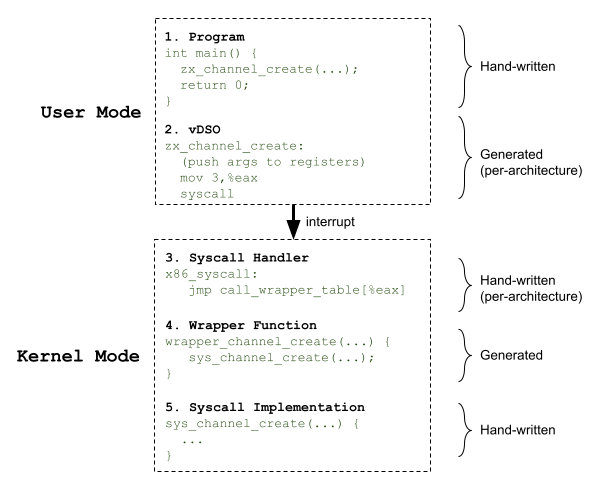
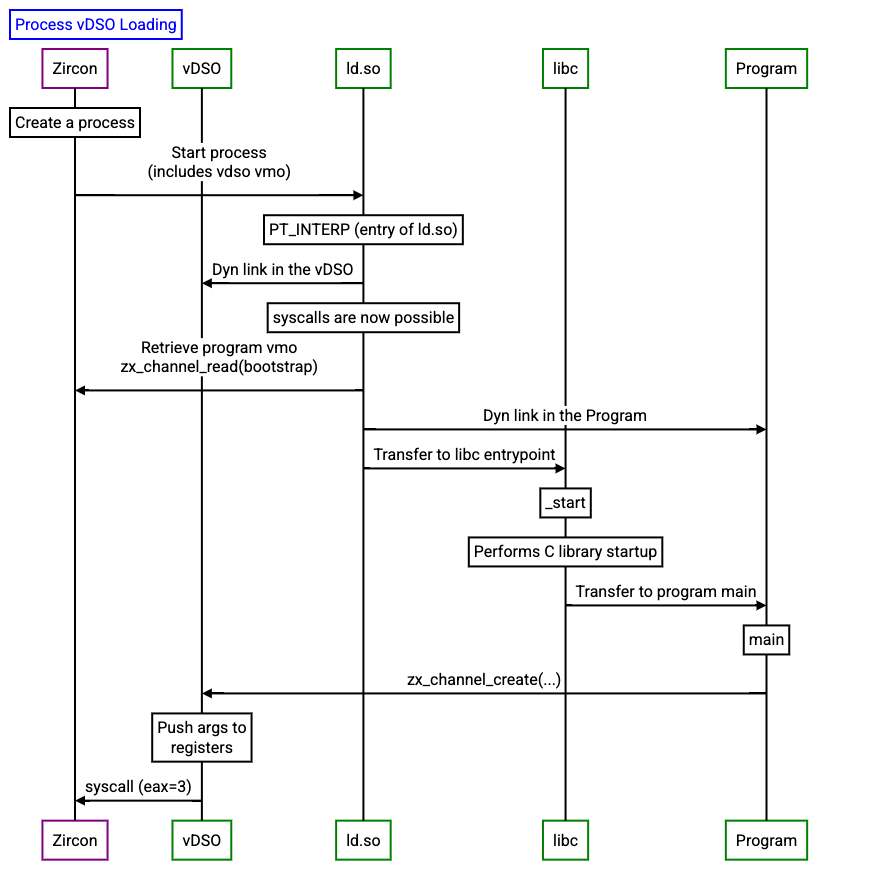

# Life of a Fuchsia syscall

## Overview

When a syscall is invoked by an application, execution passes through several stages.
In order to reduce boilerplate code, syscall-specific logic is generated with the
[kazoo](https://cs.opensource.google/fuchsia/fuchsia/+/main:zircon/tools/kazoo/)
tool. Before diving into how each of the above stages works, it is best to understand
how this code is generated.



## Code generation with kazoo

Fuchsia syscalls are declared in FIDL files in [//zircon/vdso](/zircon/vdso).

Example declaration of `zx_channel_create`:

```
library zx;

[Transport = "Syscall"]
protocol channel {
  channel_create(uint32 options) -> (status status, handle out0, handle out1);
}
```

When the kernel is built,
[fidlc](/docs/reference/fidl/language/fidlc.md) (the FIDL
front-end) takes these FIDL files and generates FIDL Intermediate Representation
(IR) JSON files. The IR file is generated at `//out/default/gen/zircon/vdso/zx.fidl.json`.

Kazoo reads this IR file, and generates source files that invoke C++ macros
with the inputs and outputs of each syscall. These macros are defined
per-architecture to allow Kazoo to output architecture-agnostic source.

Example Kazoo output:

```
KERNEL_SYSCALL(channel_create, zx_status_t, /* no attributes */, 3,
    (options, out0, out1), (
    uint32_t options,
    _ZX_SYSCALL_ANNO(acquire_handle("Fuchsia")) user_out_handle* out0,
    _ZX_SYSCALL_ANNO(acquire_handle("Fuchsia")) user_out_handle* out1))
```

Example x86 implementation:

```
#define KERNEL_SYSCALL(name, type, attrs, nargs, arglist, prototype) \
  m_syscall zx_##name, ZX_SYS_##name, nargs, 1

.macro m_syscall name, num, nargs, public
syscall_entry_begin \name
    .cfi_same_value %r12
    .cfi_same_value %r13
.if \nargs <= 3
    zircon_syscall \num, \name, \name
    ret
.endif

.macro zircon_syscall num, name, caller
    mov $\num, %eax
    syscall
// This symbol at the return address identifies this as an approved call site.
    .hidden CODE_SYSRET_\name\()_VIA_\caller
CODE_SYSRET_\name\()_VIA_\caller\():
.endm
```

This pattern of interfacing kazoo-generated source with C++ macros and
assembly routines is found throughout the syscall stages.

## Program

In order to use a syscall, you should include the
`<zircon/syscalls.h>` header from the Fuchsia SDK, which is generated by kazoo.
While the header is available to the program during compilation, the
implementation is only available during runtime inside the vDSO.

## vDSO

The virtual Dynamic Shared Object
([vDSO](/docs/concepts/kernel/vdso.md)) is an ELF file
containing the user-space implementation of each syscall. The assembly routines
in the vDSO are mostly generated by Kazoo, but all have this same structure:

1. Save user-provided arguments to architecture-specific registers
1. Store the syscall number to an architecture-specific register (`%eax` for x86)
1. Switch context to the kernel (`syscall` for x86)

The routines in the vDSO can be viewed with:

```
$ objdump -d `find out/default.zircon -name libzircon.so.debug` | less
```

x86 implementation of `zx_channel_create`:

```
0000000000007a70 <_zx_channel_create>:
    7a70:       b8 03 00 00 00          mov    $0x3,%eax
    7a75:       0f 05                   syscall

0000000000007a77 <CODE_SYSRET_zx_channel_create_VIA_zx_channel_create>:
    7a77:       c3                      retq
```

When the kernel is built, the vDSO is linked as a
[char array in the kernel](/zircon/kernel/lib/userabi/vdso.cc#28),
and then loaded into a
[vmo](/docs/reference/kernel_objects/vm_object.md).
During boot-up, some constants are written into the vDSO to allow user-space
programs to query these constants without doing a hop to the kernel.

Before your program's entrypoint is called, `ld.so` maps the vDSO into memory.
To prevent [return-to-libc](https://en.wikipedia.org/wiki/Return-to-libc_attack)
attacks, the vDSO is placed at a random location in the process' address space,
and the base address is provided to the first thread in a specific register.

The vDSO is dynamically linked to the user's program in the entrypoint provided
by [libc](/docs/development/languages/c-cpp/libc.md)



## Syscall handler

In order to receive the syscall in privileged mode, the kernel registers the
syscall handler at startup. When this routine is called, the syscall
number is used to index into a map of dispatch routines.

x86 implementation: [//zircon/kernel/arch/x86](/zircon/kernel/arch/x86)

```
write_msr(X86_MSR_IA32_LSTAR, (uint64_t)&x86_syscall);

FUNCTION_LABEL(x86_syscall)
  leaq    .Lcall_wrapper_table(%rip), %r11
  movq    (%r11,%rax,8), %r11
  jmp     *%r11
END_FUNCTION(x86_syscall)
```

The dispatch routines are responsible for moving the syscall args to appropriate
registers to be picked up as C function arguments, and calling the wrapper
function. The routines are generated at build-time using the `syscall_dispatch`
macro and a Kazoo-generated source file.

```
#define KERNEL_SYSCALL(name, type, attrs, nargs, arglist, prototype) \
  syscall_dispatch nargs, name

KERNEL_SYSCALL(channel_create, zx_status_t, /* no attributes */, 3,
    (options, out0, out1), (
    uint32_t options,
    _ZX_SYSCALL_ANNO(acquire_handle("Fuchsia")) user_out_handle* out0,
    _ZX_SYSCALL_ANNO(acquire_handle("Fuchsia")) user_out_handle* out1))

.macro syscall_dispatch nargs, syscall
  LOCAL_FUNCTION(.Lcall_\syscall\())
    // move args around
    pre_\nargs\()_args
    // calls wrapper
    call wrapper_\syscall
    // cleans up
    post_\nargs\()_args
  END_FUNCTION(.Lcall_\syscall\())
.endm
```

## Syscall wrapper

The syscall wrapper functions are generated by Kazoo, and are responsible for
calling the syscall implementation, then copying any handles back to the client.
These wrappers have the naming convention `wrapper_<syscall>`.

```
syscall_result wrapper_channel_create(uint32_t options, zx_handle_t* out0, zx_handle_t* out1, uint64_t pc) {
    return do_syscall(ZX_SYS_channel_create, pc, &VDso::ValidSyscallPC::channel_create, [&](ProcessDispatcher* current_process) -> uint64_t {
        user_out_handle out_handle_out0;
        user_out_handle out_handle_out1;
        auto result = sys_channel_create(options, &out_handle_out0, &out_handle_out1);
        if (result != ZX_OK)
            return result;
        if (out_handle_out0.begin_copyout(current_process, make_user_out_ptr(out0)))
            return ZX_ERR_INVALID_ARGS;
        if (out_handle_out1.begin_copyout(current_process, make_user_out_ptr(out1)))
            return ZX_ERR_INVALID_ARGS;
        out_handle_out0.finish_copyout(current_process);
        out_handle_out1.finish_copyout(current_process);
        return result;
    });
}
```

## Syscall implementation

The syscall implementation is a hand-written function with the naming convention
`sys_<syscall>`. These functions contain the core logic of the syscall, and are
architecture-agnostic.

[//zircon/kernel/lib/syscalls/channel.cc](/zircon/kernel/lib/syscalls/channel.cc)

```
zx_status_t sys_channel_create(...) {
   ...
}
```

## Appendix

[Example commit](https://fuchsia-review.googlesource.com/c/fuchsia/+/431659) for
creating a new syscall.
