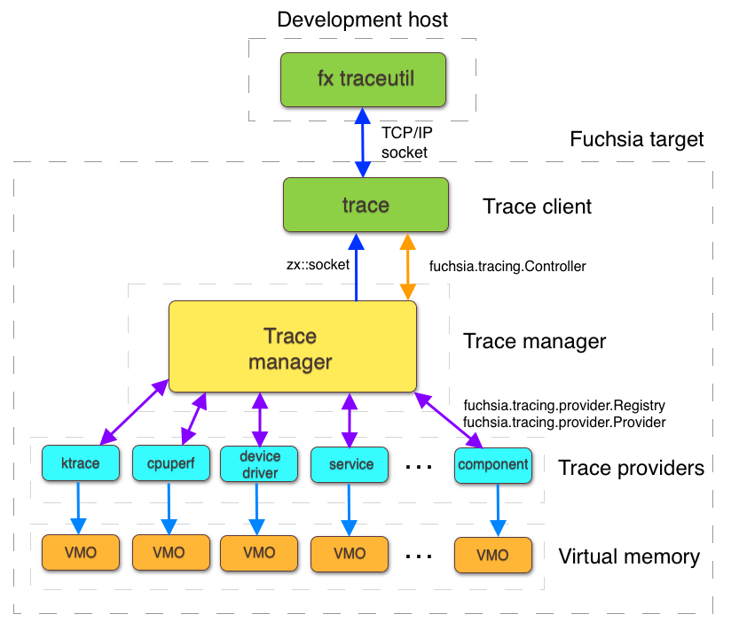

# Fuchsia tracing system

The purpose of Fuchsia tracing is to provide a means to collect, aggregate,
and visualize diagnostic tracing information from Fuchsia user space
processes and the Zircon kernel.

For more information on using tracing in Fuchsia, see the following guides:

* [Registering a trace provider](/development/tracing/tutorial/registering-a-trace-provider.md)
* [Adding tracing in your code](/development/tracing/tutorial/adding-tracing-in-code.md)
* [Recording a Fuchsia trace](/development/tracing/tutorial/recording-a-fuchsia-trace.md)
* [Converting and visualizing a trace](/development/tracing/tutorial/converting-visualizing-a-trace.md)

By default, tracing in Fuchsia is turned off. When an event occurs, such as a
system problem or the initiation of a debugging sessions, tracing can be
turned on for an arbitrary period. Not only can tracing be turned on or off,
but specific tracing categories can be individually selected.

## Parts of the Fuchsia tracing system

In the Fuchsia tracing system, the following
[components][glossary.component] work in a distributed manner:

- [Trace providers](#trace-providers)

  A component that generates trace data.

- [Trace client](#trace-client)

  A component that consumes trace data.

- [Trace manager](#trace-manager)

  A component that manages the overall tracing system.

### Trace providers {#trace-providers}

When you write a component that creates tracing data, the component becomes
a tracing provider. A system can have multiple trace providers.

Fuchsia uses a distributed implementation for its tracing system, which lets
the trace provider write tracing data directly into a Zircon Virtual Memory
Object (VMO), which is a shared memory segment. The tracing data is stored
in memory as it is generated and isn't copied to any other location. For more
information on VMOs, see
[Virtual Memory Object](/reference/kernel_objects/vm_object.md).

When you specify trace statements in your code, categories give you
control over what tracing data is recorded. Then, when you run a
trace client and specify certain categories, the trace client only records
the specified categories from the trace providers.

Components, which can be traced or offer tracing information to the system,
implement the `TraceProvider` FIDL protocol and register the trace provider
with the `Registry`. Once registered, trace providers receive messages whenever
tracing is started or stopped and have the opportunity to provide
trace data encoded in the [Fuchsia trace format](/reference/tracing/trace-format.md).
See [`fuchsia.tracing.provider`](https://fuchsia.dev/reference/fidl/fuchsia.tracing.provider).

Trace providers (components being traced) only write to trace buffers.
If a trace provider's trace buffer becomes full while a trace is running, the
buffering mode determines the behavior for the trace provider. For more
information on buffering modes, see
[tracing provider buffering modes](/concepts/kernel/tracing-provider-buffering-modes.md).

### Trace client {#trace-client}

Note: There can be multiple trace clients in the Fuchsia tracing system.

The trace client is a component that processes the data that trace providers
generate. A system can have multiple trace providers and trace clients. A trace
client contacts the trace manager to request that tracing should either start
or stop. A trace client can also request to save collected trace data. The
trace manager gathers the data and sends it over a socket to the trace client.

The trace client cannot directly affect the operation of the trace provider.
In the Fuchsia tracing system, trace providers write data to a VMO, then the
trace manager reads data from the VMO, and finally the trace client reads
tracing data from a socket.

Fuchsia uses a single trace client that consists of these utilities:

* `trace`: This utility runs on the Fuchsia target.
  `trace` controls tracing and sends the commands to the trace
   manager to start and stop tracing, and it gathers the trace data. It also
   supports converting Fuchsia trace archives into other formats, such as
   Catapult JSON records.
* [`ffx trace`][ffx-trace]: This utility runs on the development host.
   `ffx trace` communicates with the `trace` utility. Trace data can then be
   streamed from `trace` to the development host as an output file.

You can collect trace information directly with the `Controller` FIDL protocol.
See [`fuchsia.tracing.controller`](https://fuchsia.dev/reference/fidl/fuchsia.tracing.controller).

### Trace manager {#trace-manager}

The trace manager is a system service that coordinates registration of
trace providers and locates the data from each trace provider. There is
only one trace manager in Fuchsia. It ensures that tracing proceeds in
an orderly manner and isolates components that offer trace providers
from trace clients. The trace manager assigns a VMO for every registered
trace provider.

The trace manager implements the following FIDL protocols:

- `Controller`: Provides trace clients with the ability to enumerate
  trace providers and collect trace data. See
  [`fuchsia.tracing.controller`](https://fuchsia.dev/reference/fidl/fuchsia.tracing.controller).
- `Registry`: Provides trace providers with the ability to register
  themselves at runtime so that they can be discovered by the tracing system.
  See [Registry](https://fuchsia.dev/reference/fidl/fuchsia.tracing.provider#Registry).

A first in, first out (FIFO) method notifies the trace manager of the start
and shutdown of a trace provider. The FIFO handle is passed from the trace
manager to each trace provider as part of the initial start tracing
request. For more information on the FIFO packets that the Fuchsia
tracing system uses, see
[FIFO packets](/reference/tracing/FIFO-packets.md).

## Cross-process communication {#cross-process-communication}

The following are important characteristics of the cross-process
communication for Fuchsia tracing:

- Trace providers and the trace manager do not have synchronization points
  other than starting or stopping collection.
- Trace providers (components being traced) only write to trace buffers,
  they never read from them.
- The trace manager only reads from trace buffers, it never writes to them.
- Trace clients receive trace archives over a socket from the trace manager
  and never read the original trace buffers. This protects trace providers
  from manipulation by trace clients.

When you initiate tracing, the trace manager asks all relevant
trace providers to start tracing and provides each provider with a trace buffer
VMO into which they should write their trace records. While a trace is running, the
trace manager watches for newly registered trace providers and activates them
as needed.

When tracing finishes, the trace manager makes all of the active trace providers
stop tracing. Then the trace manager waits for each trace provider to
acknowledge that they have finished writing out their trace events. The trace
manager then reads and validates trace data written into the trace buffer
VMOs and creates a trace archive.

The trace manager can often recover partial data even when trace providers
terminate abnormally as long as they managed to store some data into their
trace buffers. If a trace provider's trace buffer becomes
full while a trace is running, the buffering mode determines the behavior for
the trace provider. For more information, see
[Tracing provider buffering modes](/concepts/kernel/tracing-provider-buffering-modes.md).

The trace manager delivers the resulting trace archive to its client through
a socket. This data is formed according to the
[Fuchsia trace format](/reference/tracing/trace-format.md),
but it may contain nonsensical data if trace providers deliberately emit garbage data.

Figure 1 shows the components of the Fuchsia tracing system and the way how the
components communicate with one another.

Note: `fx traceutil` is being deprecated. Replace `fx traceutil` with `ffx
trace` in the diagram below.

**Figure 1**. The Fuchsia tracing system

<!-- Reference links -->

[glossary.component]: /glossary/README.md#component
[ffx-trace]: https://fuchsia.dev/reference/tools/sdk/ffx#trace
