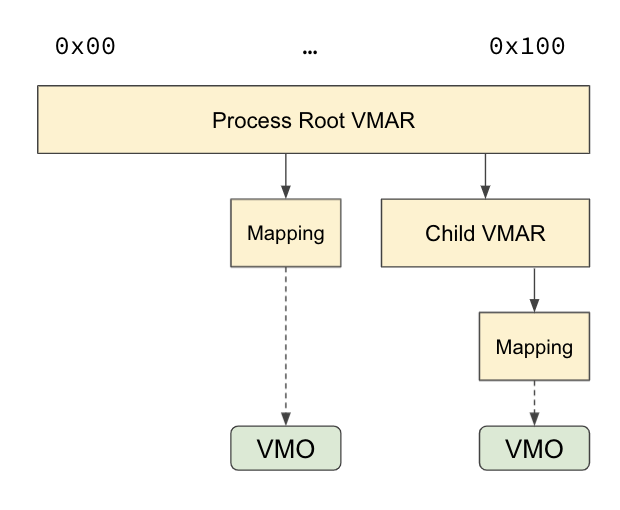
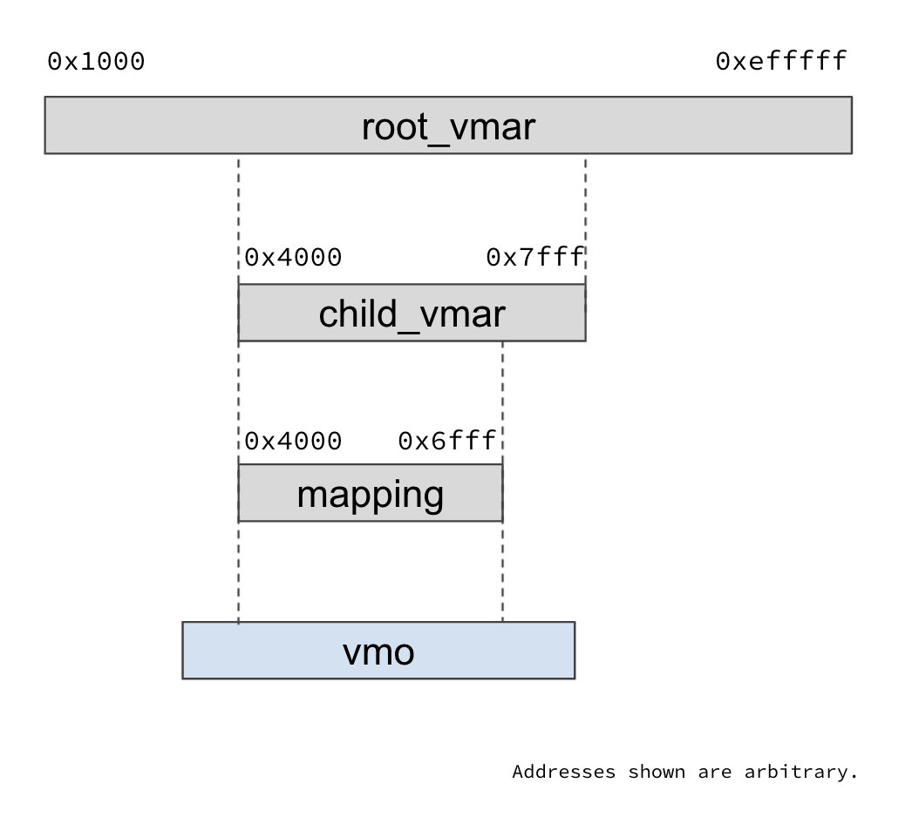
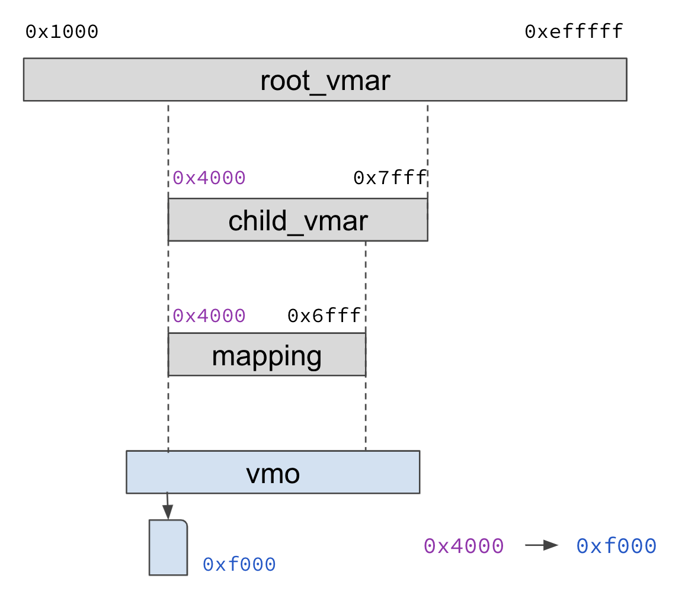

# Address spaces

In operating systems,
[memory management](https://en.wikipedia.org/wiki/Memory_management)
provides ways to dynamically allocate portions of memory to processes and
free it for reuse when no longer needed.
Modern operating systems use address spaces to isolate process memory.

[An address space](https://en.wikipedia.org/wiki/Virtual_address_space)
represents the set of virtual addresses that a process uses to reference memory.
Virtual addresses map directly to physical addresses. Fuchsia uses
[VMARs](/docs/reference/kernel_objects/vm_address_region.md)
(Virtual Memory Address Regions) to represent address spaces.

## VMARs, Mappings, and VMOs

In Fuchsia, every process has a root VMAR, and can partition into a hierarchy of
VMARs and mappings. Mappings point to an underlying
[VMO (Virtual Memory Object)](/docs/reference/kernel_objects/vm_object.md):



### VMAR and VM mappings

The
[VMAR](/docs/reference/kernel_objects/vm_address_region.md)
is a contiguous range of virtual addresses in a particular process' address
space:

+   VMARs can have child VMARs and/or VM mappings for non-overlapping
    subregions
+   They apply protection bits to a section of memory (Readwrite,
    Executable, etc.)
+   They have a [WAVL tree](https://en.wikipedia.org/wiki/WAVL_tree) of
    children for efficient search

VM mappings represent "mapped" ranges in the address space, i.e., virtual
addresses which are backed by physical pages:

+   VM mappings have no children
+   They map a range of pages from a VMO
+   Successful page search ends here

The following are available VMAR and VM mapping syscalls:

 + [`zx_vmar_allocate()`](/docs/reference/syscalls/vmar_allocate.md) - create a new child VMAR
 + [`zx_vmar_map()`](/docs/reference/syscalls/vmar_map.md) - map a VMO into a process
 + [`zx_vmar_unmap()`](/docs/reference/syscalls/vmar_unmap.md) - unmap a memory region from a process
 + [`zx_vmar_protect()`](/docs/reference/syscalls/vmar_protect.md) - adjust memory access permissions
 + [`zx_vmar_destroy()`](/docs/reference/syscalls/vmar_destroy.md) - destroy a VMAR and all of its children

See also the [Virtual Memory Address Region reference](/docs/reference/kernel_objects/vm_address_region.md).

### VMOS

[VMOs](/docs/reference/kernel_objects/vm_object.md)
are containers of bytes of memory.
They hold physical pages that can be mapped into address spaces through VM mappings.
The following are VMO syscalls:

 + [`zx_vmo_create()`](/docs/reference/syscalls/vmo_create.md) - create a new VMO
 + [`zx_vmo_create_child()`](/docs/reference/syscalls/vmo_create_child.md) - create a new child VMO
 + [`zx_vmo_create_physical()`](/docs/reference/syscalls/vmo_create_physical.md) - create a new physical VMO
 + [`zx_vmo_get_size()`](/docs/reference/syscalls/vmo_get_size.md) - obtain the size of a VMO
 + [`zx_vmo_op_range()`](/docs/reference/syscalls/vmo_op_range.md) - perform an operation on a range of a VMO
 + [`zx_vmo_read()`](/docs/reference/syscalls/vmo_read.md) - read from a VMO
 + [`zx_vmo_replace_as_executable()`](/docs/reference/syscalls/vmo_replace_as_executable.md) - make an executable version of a VMO
 + [`zx_vmo_set_cache_policy()`](/docs/reference/syscalls/vmo_set_cache_policy.md) - set the caching policy for pages held by a VMO
 + [`zx_vmo_set_size()`](/docs/reference/syscalls/vmo_set_size.md) - adjust the size of a VMO
 + [`zx_vmo_write()`](/docs/reference/syscalls/vmo_write.md) - write to a VMO

See also the [Virtual Memory Object reference](/docs/reference/kernel_objects/vm_object.md).

## Virtual Memory Manager (VMM)

The Virtual Memory Manager (VMM) is responsible for maintaining process address
spaces, including:

+   Providing pointers to backing physical pages for virtual address ranges that
    are mapped.
+   Ensuring that address ranges have the correct access protection bits set.

It does this by managing relationships amongst VMARs, VM Mappings, VMOs, and
hardware page tables. See also the
[VMM source code](https://cs.opensource.google/fuchsia/fuchsia/+/main:zircon/kernel/vm/vmm.cc?q=vmm&ss=fuchsia%2Ffuchsia).

When a process starts off, its entire address space is represented as one VMAR.
As different portions of the address space are mapped, the VMAR hierarchy tree
gets populated. Nodes in the tree get created and destroyed as VMARs and VM
Mappings are created and destroyed.

A node represents either a VMAR or a VM Mapping:

+   A VMAR points to a list of children which are other VMARs and VM
    Mappings that fall within the address range of the parent VMAR.
+   A VM Mapping points to the range within a VMO that is mapped at that
    address range.

Learn more about
[visualizing memory usage from the root VMAR.](/docs/development/kernel/memory/memory.md#visualize_memory_usage)

The VMM uses
[Address space layout randomization](https://en.wikipedia.org/wiki/Address_space_layout_randomization)
to control the address ranges where new VMARs are created within an address space.
The
[`aslr.entropy_bits`](https://source.corp.google.com/fuchsia/zircon/kernel/lib/boot-options/include/lib/boot-options/options.inc;l=21?q=aslr_entropy_bits&sq=package:fuchsia*)
kernel command line option can be used to control the number of bits of entropy
in the randomization. Higher entropy results in a sparser address space with
more spread out VMARs and VM Mappings.

## Physical Memory Manager (PMM)

The
[Physical Memory Manager (PMM) ](https://cs.opensource.google/fuchsia/fuchsia/+/main:zircon/kernel/vm/pmm.cc)
carves up all available physical memory (RAM) on the system into pages and
manages what happens to them.
It is responsible for providing free physical pages to VMOs when
they need them.

VMOs are demand paged, i.e. their pages are populated (committed) on demand.
Pages get committed as they are written to. Until then, uncommitted pages are
represented by a singleton physical zero page on the system. This avoids
needlessly allocating memory for pages that have not been accessed, or are only
ever read from.

VMOs can also be backed by a
[userspace pager](/docs/reference/kernel_objects/pager.md),
which populates specific contents in the VMO on demand,
for example, contents read from a file on disk.
Learn [how to write a user pager](https://cs.opensource.google/fuchsia/fuchsia/+/main:src/storage/docs/paging.md).

## Example: map a VMO

To map a VMO:

1.  Use `zx_vmar_root_self()` to obtain a handle to the root VMAR of the process,
    for example:

    ```cpp
    zx_handle_t vmar = zx_vmar_root_self();
    ```
1.  Use [`zx_vmo_create(...)`](/docs/reference/syscalls/vmo_create.md) to create a VMO.
    This returns the VMO handle, for example:

    ```cpp
    const size_t map_size = zx_system_get_page_size();
    zx_vmo_create(map_size, 0, &vmo);
    ```
1.  Use [`zx_vmar_allocate(...)`](/docs/reference/syscalls/vmar_allocate.md)
    to create a child VMAR within the parent VMAR.
    This returns a VMAR handle and it's start address, for example:

    ```cpp
    const size_t region_size = zx_system_get_page_size() * 10;
    zx_vmar_allocate(vmar, ZX_VM_CAN_MAP_READ | ZX_VM_CAN_MAP_WRITE, 0,
                     region_size, &region, &region_addr);
    ```
    This step is optional; you can also map the VMO directly to the parent.
1.  Use [`zx-vmar_map(...)`](/docs/reference/syscalls/vmar_map.md) to map the VMO within a VMAR.
    This returns the start address of the VMO now mapped to the VMAR, for
    example:

    ```cpp
    zx_vmar_map(region, ZX_VM_PERM_READ | ZX_VM_PERM_WRITE, 0, vmo, 0,
                map_size, &map_addr);
    ```



Note: See [VMAR unit testing code](https://source.corp.google.com/fuchsia/zircon/system/utest/core/vmar/vmar.cc)
for additional examples.

## Example: access a VMO mapping

In the previous example,
let's say `zx_vmar_map()` returned the `map_addr` 0x4000.
To access the mapped address 0x4000,
the code might look something like below:

```cpp
zx_vmar_map(...&addr); // addr = 0x4000
auto arr = reinterpret_cast<int*>(addr);
arr[0] = 1; // page fault
```

The pointer dereference would result in a page fault.
To resolve the page fault, the kernel would do the following:

1.  Search for the address 0x4000 in the VMAR tree of the process starting
    at `root_vmar`, until a VM mapping containing that address is found.
1.  The VM mapping will contain a reference to a VMO,
    and also the offset in the VMO's page list
    that corresponds to the mapping's first address.
    Look up the VMO offset corresponding to the address 0x4000.
1.  If the VMO has no page at that offset, allocate a new page.
    Say the physical address of this page is 0xf000.
1.  Add the translation from virtual address 0x4000 to physical address 0xf000
    to the hardware page tables through the
    [`ArchVmAspace`](https://cs.opensource.google/fuchsia/fuchsia/+/main:zircon/kernel/vm/include/vm/arch_vm_aspace.h),
    which represents the architecture specific page tables
    that track the virtual to physical address mappings used by the
    [MMU](https://en.wikipedia.org/wiki/Memory_management_unit).



