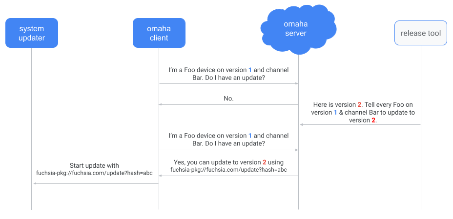
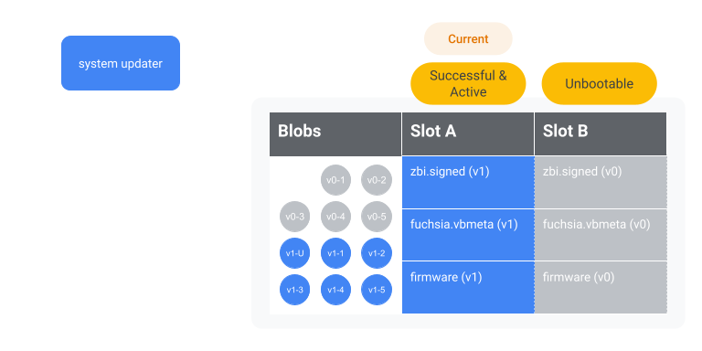
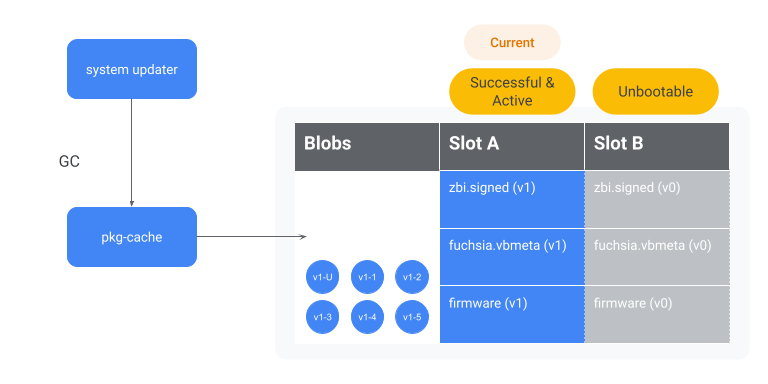
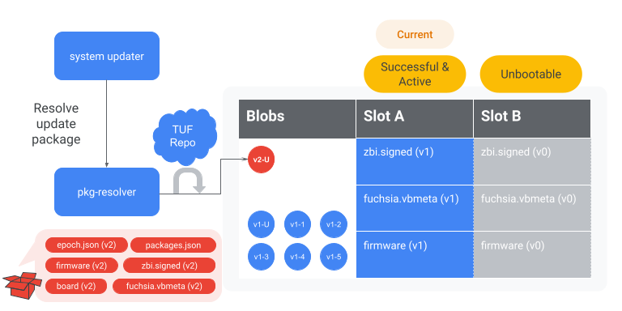
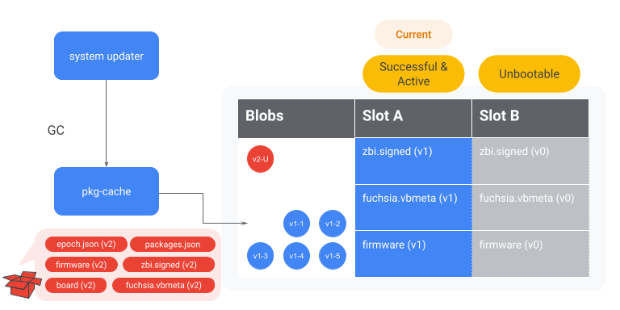
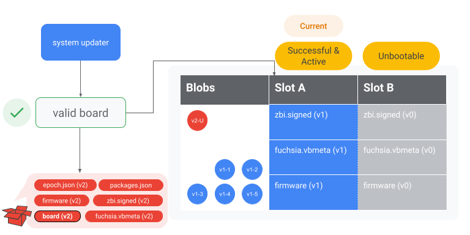
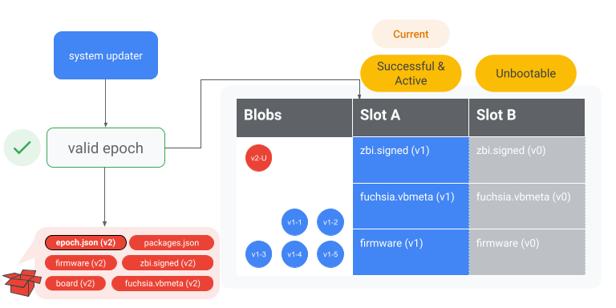
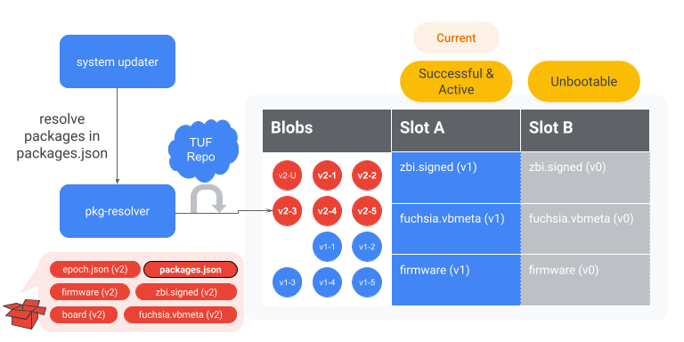
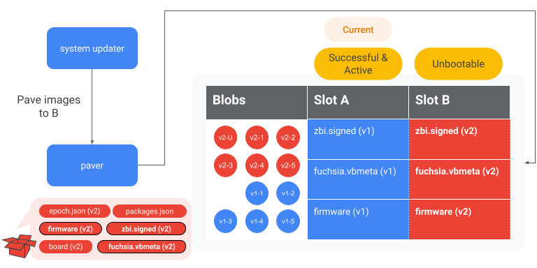
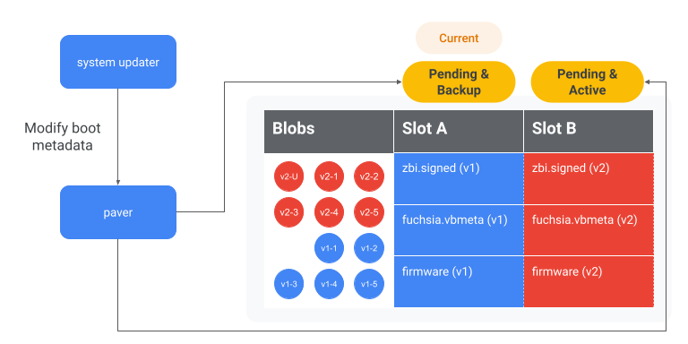

<!-- # OTA updates

Over-The-Air updates (OTAs) are a mechanism for operating system updates on
Fuchsia. This document details how OTA updates work on Fuchsia. -->

# OTA 更新

Over-The-Air（OTA）是更新 Fuchsia 操作系统的一种途径。本文档将描述 Fuchsia 是如何通过 OTA 进行系统更新的。

<!-- The update process is divided into the following phases:

* [Checking for an update](#checking-for-update)
* [Staging an update](#staging-update)
* [Verifying an update](#verifying-update) -->

升级过程被分为下列几个步骤：

* [检查是否需要更新](#checking-for-update)
* [进行更新](#staging-update)
* [验证更新](#verifying-update)

<!-- ## Checking for an update {#checking-for-update}

The two entry points for the operating system update process are the `omaha-client`
and the `system-update-checker` components.

Both the `omaha-client` and `system-update-checker` serve the same
purpose, to find out if there is an operating system update and start the update. -->

## 检查是否需要更新 {#checking-for-update}

系统更新的入口有两个，`omaha-client` 和  `system-update-checker`。这两个组件目的相同，都是为了检查是否有系统更新并启动更新进程。

<!-- Note: Omaha is an update availability management protocol. For more
information about Omaha, see [Omaha](https://github.com/google/omaha). -->

注意：Omaha 是一个更新可用性管理协议。若要了解更多 Omaha 相关，详见 [Omaha](https://github.com/google/omaha)。

<!-- Generally, products should use `omaha-client` if they want to
use Omaha to determine update availability. Products should use
`system-update-checker` if they don’t want to use Omaha and instead
want to check for updates directly from package repositories. -->

一般来说，如果设备想要使用 Omaha 来决定更新是否可用，此时就需要使用 `omaha-client`。

<!-- On any given Fuchsia system, only one of these components may be running:

* [Update checks with omaha-client](#update-omaha)
* [Update checks with system-update-checker](#update-system) -->

在任何 Fuchsia 设备上，以下两个组件只会有一个在运行：

* [使用 omaha-client 检查更新](#update-omaha)
* [使用 system-update-checker 检查更新](#update-system)

<!-- ### Update checks with omaha-client {#update-omaha}

During the boot process, `omaha-client` starts up and begins periodic update
checks. During these checks, `omaha-client` polls the Omaha server to check for
updates. -->

### 使用 omaha-client 检查更新 {#update-omaha}

在系统启动时，`omaha-client` 就开始运行并开始周期性检查更新。在检查的过程中，`omaha-client` 会轮询 Omaha 服务器来检查是否存在可用更新。

<!-- The benefits of using Omaha are:

Note: Omaha is an update availability management protocol. For more
information about Omaha, see [Omaha](https://github.com/google/omaha). -->

<!-- * It allows for a fractional rollout of system updates across a fleet of
  Fuchsia devices. For example, it can be configured that only 10% of the
  fleet of devices gets updated. This means that only 10% of these devices
  will see that there is an available update while polling Omaha. The
  remaining 90% of devices would not see an update available.
* It allows for different update channels. For example, test devices can get
  updates from the test channel and get the newest (possibly unstable)
  software. This allows production devices to get updates from the production
  channel and get the most stable software. Channel information can
  be optionally given to Omaha along with product and version.

 -->

使用 Omaha 的好处在于：

* 它可以只允许一部分 Fushsia 设备更新。例如，它能够被配置为只允许 10% 的设备能够更新。这表示只有 10% 的设备在 Omaha 轮询时能够看到有可用更新，而剩余的 90% 设备则无法得知存在更新。
* 它允许不同渠道的更新。例如，测试用设备能从测试渠道获取到最新（也最不稳定）的更新。同样，也可以通过生产渠道获取最稳定的版本。渠道信息可以选择性地与产品和版本一起提供给 Omaha。


<!-- **Figure 1**. A simplified version of the update check process with `omaha-client`. There are
policies that gate whether `omaha-client` can check for an update or apply an update. -->

**图 1**。简化后的 `omaha-client` 的更新流程图。图中给出了 `omaha-client` 是否检查更新或是否应用更新的限制策略。

<!-- Once `omaha-client` gets the update package URL from the Omaha server, `omaha-client`
tells the `system-updater` to start an update. -->

一旦 `omaha-client` 从 Omaha 服务器获取到了更新包的 URL，`omaha-client` 将会通知 `system-updater` 启动更新进程。

<!-- ### Update checks with system-update-checker {#update-system}

Devices that don’t use `omaha-client` use the `system-update-checker`. Depending
on how it is [configured], the `system-update-checker` regularly polls for
an update package. These checks default to disabled if no `auto_update` is
specified. -->

### 使用 system-update-checker 检查更新 {#update-system}

那些不使用 `omaha-client` 的设备就需要使用 `system-update-checker` 来进行更新检查。`system-update-checker` 会按照其 [配置]，周期性检查是否存在可用更新。如果没有指定 `auto_update`，这些检查默认为禁用状态。

<!-- To check if an update is available, the `system-update-checker` checks the
following conditions: -->

`system-update-checker` 会根据以下条件来确认是否存在可用更新：

<!-- * Is the hash of the currently running system image (located in `/pkgfs/system/meta`) different from
  the hash of system image (found in `packages.json`) in the update package?
* If the system image isn’t different, is the vbmeta that’s currently running on the system
  different from the vbmeta of the update package?
* If there is no vbmeta, is the ZBI that’s currently running on the system different from the ZBI
  of the update package? -->

* 当前运行中的系统镜像的哈希值（位于 `/pkgfs/system/meta`）是否与更新包镜像的哈希值（位于 `packages.json`）不一致？
* 如果系统镜像相同，当前系统的 vbmeta 是否与更新包 vbmeta 不一致？
* 如果不存在 vbmeta，当前系统的 ZBI 是否与更新包 ZBI 不一致？

<!-- If any of these answers are yes, then the `system-update-checker` knows the
update package has changed. Once the system-update-checker realizes the update
package has changed, the `system-update-checker` triggers the `system-updater`
to start an update using the default update package (fuchsia-pkg://fuchsia.com/update). -->

如果上述问题中有一个答案为不一致，`system-update-checker` 便会得知更新包已经被改变。一旦获知更新包改变，`system-update-checker` 会便触发 `system-updater` 来使用默认更新包（fuchsia-pkg://fuchsia.com/update）进行系统更新。


<!-- **Figure 2**. A simplified version of the update check process with the `system-update-checker`. -->

**图 2**。简化后的 `system-update-checker` 的更新流程图。

<!-- Note: There is currently no way to check bootloader-only updates because
there is no [paver API] to read the firmware. An update is not triggered
even though the update package has changed. Until this is fixed, you
should use `update force-install <update-pkg-url>` to force an update. -->

注意：目前还无法检测仅针对 bootloader 的更新，因为没有 [paver API] 能读取固件。在修正这项之前，即使有可用更新也不会触发更新。你需要使用 `update force-install <update-pkg-url>` 来强制更新。

<!-- If no update is required, the update checker saves the last known update
package hash. On subsequent checks for an update, the hash
of the update package that is fetched is checked against the last known
hash. If the hashes are the same, no update is triggered. If the hashes
are different, the vbmeta and ZBI are  checked for changes to determine
if an update is necessary. -->

如果不需要更新，`system-update-checker` 会保存已知的上次更新包的哈希值，在后来的更新检查中，`system-update-checker` 会首先获取更新包的哈希值并与上次保存的哈希值进行对比。如果哈希值相同，则不存在更新也不会触发更新进程。如果不一致，将会继续检查 vbmeta 和 ZBI 来确认该更新的必要性。

<!-- ## Staging an update {#staging-update} -->

<!-- Regardless if an update was triggered by `omaha-client` or `system-update-checker`,
or even a forced update check, an update needs to be written to disk. -->

## 进行更新 {#staging-update}

不论是 `omaha-client`、`system-update-checker`，还是是强制更新，最终该升级都需要被写进设备硬盘中。

<!-- The update process is divided in the following steps:

* [Initial garbage collection](#initial-garbage-collection)
* [Fetch update package](#fetch-update-package)
* [Secondary garbage collection](#secondary-garbage-collection)
* [Verify board matches](#verify-board)
* [Verify epoch is supported](#verify-epoch)
* [Fetch remaining packages](#fetch-reamaining-packages)
* [Write images to block device](#write-images-block-device)
* [Set alternate partition as active](#set-alternate-active)
* [Reboot](#reboot) -->

更新进程被分为如下几步：

* [初始化垃圾回收](#initial-garbage-collection)
* [获取更新包](#fetch-update-package)
* [第二轮垃圾回收](#secondary-garbage-collection)
* [确认主板匹配](#verify-board)
* [确认 epoch 受支持](#verify-epoch)
* [获取附加软件包](#fetch-reamaining-packages)
* [将镜像写入块设备](#write-images-block-device)
* [将备份分区设为活动分区](#set-alternate-active)
* [重启](#reboot)

<!--  -->


 
<!-- **Figure 3**. The device is currently running hypothetical OS version 1 (on slot A) and begins to
update to hypothetical OS version 2 (to slot B). *Warning*: this may not be how the disk is
partitioned in practice. -->

**图 3**。假设目前该设备正运行在 v1 版本的系统上（Slot A），并即将更新到 v2 版本（Slot B）。*注意*：实际中的硬盘分区可能并非如此。

<!-- ### Initial garbage collection {#initial-garbage-collection}

Note: This does not garbage collect the old update package because the old
update package is referenced in the dynamic index. -->

### 初始化垃圾回收 {#initial-garbage-collection}

注意：此时并不会回收旧的更新包，因为旧更新包正被动态索引引用。

<!-- The `system-updater` instructs `pkg-cache` to perform garbage collection
which deletes all BLOBs that aren’t referenced in either the static or dynamic
indexes. This cleans up most of the BLOBs referenced by the old system. -->

`system-updater` 指示 `pkg-cache` 来进行垃圾回收。垃圾回收会删除不被静态以及动态索引引用的全部 BLOB。这会清理掉被旧系统使用的绝大多数 BLOB。

<!--  -->


<!-- **Figure 4**. The `system-updater` instructs `pkg-cache` to garbage collect all the blobs referenced
by slot B. Since slot B currently references version 0, all of the version 0 blobs are garbage
collected. -->

**图 4**。`system-updater` 指示 `pkg-cache` 来回收 Slot B 引用的所有 BLOB。由于 Slot B 目前引用着 v0 的系统，因此 v0 版本的所有 BLOB 都被回收了。

<!-- ### Fetch update package {#fetch-update-package}

The `system-updater` fetches the [update package], using the provided update package URL.
The dynamic index is then updated to reference the new update package. A sample update package may
look like this: -->

### 获取更新包 {#fetch-update-package}

`system-updater` 会按照提供给它的 URL 来获取 [更新包]。之后，动态索引会被更新以指向新的更新包。简化后的更新包结构如下所示：

```
/board
/epoch.json
/firmware
/fuchsia.vbmeta
/meta
/packages.json
/recovery.vbmeta
/version
/zbi.signed
/zedboot.signed
```

<!--  -->


<!-- **Figure 5**. The `system-updater` instructs the `pkg-resolver` to resolve the version 2
update package. -->

**图 5**。`system-updater` 指示 `pkg-resolver` 来解析版本为 2 的更新包。 

<!-- Optionally, update packages may contain an `update-mode` file. This file
determines whether the system update happens in Normal or ForceRecovery
mode. If the update-mode file is not present, the `system-updater`
defaults to the Normal mode. -->

可选地，更新包可能会包含一个 `update-mode` 文件。这个文件决定了此次系统更新是在 Normal 还是 ForceRecovery 模式下进行。如果没有这个文件，则 `system-updater` 默认使用 Normal 模式。

<!-- When the mode is ForceRecovery, the `system-updater` writes an image to recovery,
marks slots A and B as unbootable, then boots to recovery. For more information,
see the [implementation of ForceRecovery][recovery-mode-code]. -->

当处于 ForceRecovery 模式下时，`system-updater` 会将镜像写入到恢复分区，并标记 Slot A 与 B 为不可启动，之后启动到恢复模式。获取更多信息，请查看 [ForceRecovery 的实现][recovery-mode-code]。

<!-- ### Secondary garbage collection {#secondary-garbage-collection}

After the old update package is no longer referenced by the dynamic index,
another garbage collection is triggered to delete the old update package.
This step frees up additional space for any new packages. -->

### 第二轮垃圾回收 {#secondary-garbage-collection}

当旧更新包不再被动态索引引用时，会启动另一轮垃圾回收来删除旧更新包。这一步骤为新软件包腾出来额外的空间。

<!--  -->


<!-- **Figure 6**. The `system-updater` instructs `pkg-cache` to garbage collect the version 1
update package to free up space. -->

**图 6**。`system-updater` 指示 `pkg-cache` 回收 v1 的更新包以腾出空间。

<!-- ### Verify board matches {#verify-board}

The current running system has a board file located in `/config/build-info/board`.
The `system-updater` verifies that the board file on the system matches the board
file in the update package. -->

### 确认主板匹配 {#verify-board}

当前系统的主板信息文件位于 `/config/build-info/board`。`system-updater` 会确认更新包中主板文件与当前系统的主板文件是否一致。

<!-- 

**Figure 7**. The `system-updater` verifies the board in the update package matches the board
on slot A. -->


**图 7**。`system-updater` 校验更新包中的主板信息与 Slot A 中的是否匹配。

<!-- ### Verify epoch is supported {#verify-epoch}

Update packages contain an epoch file (`epoch.json`). If the epoch of the update
package (the target epoch) is less than the epoch of the `system-updater`
(the source epoch), the OTA fails. For additional context,
see [RFC-0071](/docs/contribute/governance/rfcs/0071_ota_backstop.md). -->

### 确认 epoch 受支持 {#verify-epoch}

更新包包含一个 epoch 文件（`epoch.json`）。如果更新包的 epoch （目标 epoch）小于 `system-updater`（源 epoch），OTA 更新会失败。更多内容详见 [RFC-0071](/docs/contribute/governance/rfcs/0071_ota_backstop.md)。

<!-- 

**Figure 8**. The `system-updater` verifies the epoch in the update package is supported by
comparing it to the epoch of the current OS. -->


**图 8**。`system-updater` 对比当前系统与更新包的 epoch，以此确认更新包 epoch 是否受支持。

<!-- ### Fetch remaining packages {#fetch-reamaining-packages}

The system-updater parses the `packages.json` file in the update package.
The `packages.json` looks like the following: -->

### 获取附加软件包 {#fetch-reamaining-packages}

`system-updater` 解析更新包中的 `packages.json` 文件。`packages.json` 的结构如下所示：

```json
{
  "version": “1”,
  "content": [
    "fuchsia-pkg://fuchsia.com/sshd-host/0?hash=123..abc",
    "fuchsia-pkg://fuchsia.com/system-image/0?hash=456..def"
    ...
  ]
}
```

<!-- The `system-updater` instructs the `pkg-resolver` to resolve all the package URLs.
When fetching packages, the package management system only fetches BLOBs that
are required for an update. This means that only BLOBs that don't exist or need
to be updated on the system. The package management system fetches entire BLOBs,
as opposed to a diff of whatever might currently be on the system. -->

`system-updater` 指示 `pkg-resolver` 解析所有包的 URL。在获取包时，包管理系统只会下载此次更新所需要的 BLOBs。这表示包管理系统只会下载系统中不存在或需要被更新的 BLOBs。其它包即使与当前系统中的 BLOBs 不一致，但只要与系统更新无关也不会被下载。

<!-- Once all packages have been feteched, a BlobFS sync is triggered to flush the
BLOBs to persistent storage. This process ensures that all the necessary BLOBs
for the system update are available in BlobFS. -->

一旦所有包都下载完成，会触发一次 BlobFS 同步来将 BLOBs 刷新到持久储存中。这一步骤确保了系统更新所必须的全部 BLOBs 都能通过 BlobFS 访问。

<!-- 

**Figure 9**. The `system-updater` instructs the pkg-resolver to resolve the version 2
packages referenced in `packages.json`. -->


**图 9**。`system-updater` 指示 `pkg-resolver` 解析 v2 版本的 `packages.json` 中引用的包。

<!-- ### Write images to block device {#write-images-block-device}

The `system-updater` determines which images need to be written to the block
device. There are two kinds of images, assets and firmware. -->

### 将镜像写入块设备 {#write-images-block-device}

哪个镜像将被写入块设备由 `system-updater` 决定。有两种镜像，一是资源二是固件。

<!-- Note: For more information on how this works, see the [`update.rs`][update-rs] file.
To see the difference between assests and firmware images, see the [`paver.rs`][image-types] file. -->

注意：如要了解更多信息，可参阅 [`update.rs`][update-rs] 文件。要了解资源与固件镜像的差异，请查阅 [`paver.rs`][image-types] 文件。

<!-- Then, the `system-updater` instructs the paver to write the bootloader and
firmware. The final location of these images does not depend on whether
the device supports [ABR](/docs/glossary.md#ABR). To prevent flash wear,
the image is only written to a partition if the image is different from the
image that already exists on the block device. -->

之后，`system-updater` 指示铺设程序对 bootloader 和固件进行写入。这些镜像最终的位置与该设备是否支持 [ABR](/docs/glossary.md#ABR) 无关。为了防止闪存损耗，只有当映像与块设备上已经存在的映像不同时，才会将映像写入分区

<!-- Note: To see more information on how the Fuchsia paver works for the bootloader,
see [`fuchsia.paver`][fuchsia-paver-booloader]. -->

注意：欲了解更多有关 Fuchsia 铺设程序是如何为 bootloader 工作的，请查阅 [`fuchsia.paver`][fuchsia-paver-booloader]。

<!-- Then, the `system-updater` instructs the paver to write the Fuchsia ZBI and its
vbmeta. The final location of these images depends on whether the device
supports [ABR](/docs/glossary.md#ABR). If the device supports
[ABR](/docs/glossary.md#ABR), the paver writes the Fuchsia ZBI and
its vbmeta to the slot that’s not currently booted (the alternate slot).
Otherwise, the paver writes them to both the A and B partitions (if a B
partition exists). -->

其后，`system-updater` 指示铺设程序写入 Fuchsia ZBI 以及它的 vbmeta。这些镜像的最终位置由该设备是否支持 [ABR](/docs/glossary.md#ABR) 决定。如果设备支持 [ABR](/docs/glossary.md#ABR)，铺设程序会将 Fuchsia ZBI 及其 vbmeta 写入到目前没有启动的分区上（备份分区）。否则，铺设程序会将它们同时写入 A、B 两个Slot（如果存在Slot B 的话）。

<!-- Note: To see more information on how the Fuchsia paver works for assets,
see [`fuchsia.paver`][fuchsia-paver-assets]. -->

注意：欲了解 Fuchsia 铺设程序是如何为资源镜像工作的，请查阅 [`fuchsia.paver`][fuchsia-paver-assets] 以了解更多。

<!-- Finally, the `system-updater` instructs the paver to write the recovery
ZBI and its vbmeta. Like the bootloader and firmware, the final
location does not depend on if the device supports [ABR](/docs/glossary.md#ABR). -->

最终，`system-updater` 指示铺设程序写入 recovery ZBI 及其 vbmeta。与 bootloader 和固件相似，其最终位置与设备是否支持 [ABR](/docs/glossary.md#ABR) 无关。

<!-- 

**Figure 10**. The `system-updater` writes the version 2 images to slot B via the paver. -->


**图 10**。`system-updater` 通过铺设程序将 v2 版本的镜像写入Slot B。

<!-- ### Set alternate partition as active {#set-alternate-active}

If the device supports ABR, the `system-updater` uses the paver to set the
alternate partition as active. That way, the device boots into the alternate
partition on the next boot. -->

### 将备份分区设为活动分区 {#set-alternate-active}

如果设备支持 ABR，`system-updater` 会使用铺设程序将备份分区设置为活动分区。由此，设备下次启动时将会启动到备份分区当中。

<!-- There are a several ways to refer to the slot state. For example, the internal
paver uses `Successful` while the [FIDL service] uses `Healthy`, while other
cases may use Active, Inactive, Bootable, Unbootable, Current, Alternate, etc... -->

有很多种方法来表示分区状态。例如，内置的铺设程序使用 `成功`， [FIDL service] 使用 `健康`，还有诸如活动、非活动、可启动的、不可启动的、可选的等众多表示方法。

<!-- Note: For more information on how this is implemented, see
[`data.h`][abr-slot-data]. -->

注意：可查阅 [`data.h`][abr-slot-data] 了解更多有关上述表示方法的实现方式。

<!-- The important metadata is 3 pieces of information that is stored for each kernel
slot. This information helps determine the state of each kernel slot. For
example, before slot B is marked as active, the metadata might look like: -->

每个分区都储存着一份重要的元数据，它被分为三个部分。这些信息帮助决定每个分区的状态。例如，在 Slot B 被标注为活动之前，元数据大致如下：

<!-- |     Metadata    | Slot A | Slot B |
|:---------------:|:------:|:------:|
|     Priority    |   15   |    0   |
| Tries Remaining |    0   |    0   |
|     Healthy*    |    1   |    0   | -->

|     元数据    | Slot A | Slot B |
|:---------------:|:------:|:------:|
|     优先级    |   15   |    0   |
| 剩余尝试次数 |    0   |    0   |
|     健康*    |    1   |    0   |

<!-- After slot B is marked as active, the metadata would look like:

|     Metadata    | Slot A | Slot B |
|:---------------:|:------:|:------:|
|     Priority    | **14** |**15****|
| Tries Remaining |    0   |**7**** |
|     Healthy     |    1   |    0   | -->

在 Slot B 设置为活动之后，元数据如下：

|     元数据    | Slot A | Slot B |
|:---------------:|:------:|:------:|
|     优先级    |   **14**   |    **15****   |
| 剩余尝试次数 |    0   |    **7****   |
|     健康    |    1   |    0   |

<!-- Note: These numbers are based on hardcoded values for priority and remaining
tries which are defined in [`data.h`][kAbrMaxPriority]. -->

注意：这些有关优先级以及剩余尝试次数的数字都是基于 [`data.h`][kAbrMaxPriority] 中硬编码的值。

<!-- If the device doesn’t support ABR, this check is skipped since there is no alternate partition. Instead,
there is an active partition that is written to for every update. -->

如果设备不支持 ABR，在没有备份分区时，这些检查都会被跳过。除此之外，每次更新都有一个活动分区被写入。

<!-- 

**Figure 11**. The `system-updater` sets slot B to Active, so that the device boots into slot B
on the next boot. -->


**图 11**。`system-updater` 将 Slot B 设置为活动分区，因此设备下次启动将会进入 Slot B。

<!-- ### Reboot {#reboot}

Depending on the update configuration, the device may or may not reboot. After the device
reboots, the device boots into the new slot.


**Figure 12**. The device reboots into slot B and begins running version 2. -->

### 重启 {#reboot}

基于更新的配置信息，设备可能重启也可能不会。重启之后，设备会进入新的分区。


**图 12**。设备重启到 Slot B，并开始运行 v2 版本的系统。

<!-- ## Verifying an update {#verifying-update}

The system commits an update once that update is verified by the system.

The system verifies the update in the following way:

* [Rebooting into the update version](#reboot-update)
* [Committing the update](#commiting-update) -->

## 验证更新

当更新被系统验证之后，系统将会提交一次更新。

系统按以下路径验证更新：

* [重启进入新的版本](#reboot-update)
* [提交更新](#commiting-update)

<!-- ### Rebooting into the updated version {#reboot-update}

Note: In this example, it is assumed that the update is written to partition B. -->

### 重启进入新的版本 {#reboot-update}

注意：在本例中假设更新被写入了 Slot B。

<!-- On the next boot, the bootloader needs to determine which slot to boot into.
In this example, the bootloader determines to boot into slot B because
slot B has a higher priority and more than 0 tries remaining (see
[Set alternate partition as active](#set-alternate-active)). Then, the
bootloader verifies the ZBI of B matches the vbmeta of B, and finally boots into
slot B. -->

在下一次启动时，bootloader 需要决定从哪个分区启动。在本例中，bootloader 决定从 Slot B 启动，因为它有更高的优先级并且有多于 0 次的剩余尝试次数。（详见 [将备份分区设为活动分区](#set-alternate-active)）。之后，bootloader 验证 B 的 ZBI 与 B 的 vbmeta 匹配，并最终启动进入 Slot B。

<!-- Note: For more information on how the bootloader determines the slot to boot
into, see [`flow.c`][flow-c]. -->

注意:更多有关 bootloader 是如何决定启动至哪个分区的细节,请查阅 [`flow.c`][flow-c]。 

<!-- After early boot, `fshost` launches `pkgfs` using the new system-image package.
This is the system image package that is referenced in the `packages.json`
while staging the update. The system-image package has a `static_packages` file
in it that lists the base packages for the new system. For example: -->

在早先的启动中，`fshost` 使用新的系统镜像包加载了 `pkgfs`。这是进行更新时，由 `packages.json` 中所引用的系统镜像包。在系统镜像包中有一个 `static_packages` 文件，列出了新系统所需的基础包。例如：

<!-- ```
pkg-resolver/0 = new-version-hash-pkg-resolver
foo/0 = new-version-hash-foo
bar/0 = new-version-hash-bar
...
// Note the system-image package is not referenced in static_packages
// because it's impossible for it to refer to its own hash.
``` -->

```
pkg-resolver/0 = new-version-hash-pkg-resolver
foo/0 = new-version-hash-foo
bar/0 = new-version-hash-bar
...
// 注意：系统镜像包并未在 `static_packages` 中引用，
// 因为它不可能引用它自己的哈希。
```

<!-- `pkgfs` then loads all these packages as base packages. The packages appear in
`/pkgfs/{packages, versions}`, which indicate that the packages are installed
or activated. Then, `appmgr` starts which then starts the `pkg-resolver`,
`pkg-cache`, `netstack`, etc... -->

`pkgfs` 之后会将这些包当作基础包全部加载。这些包会出现在 `/pkgfs/{packages, versions}` 中，这表示这些包已经被安装或激活。其后，`appmgr` 启动，并相继启动 `pkg-resolver`、`pkg-cache`、`netstack` 等组件。

<!-- ### Committing the update {#commiting-update}

The `system-update-committer` component runs various checks to verify if the
new update was successful. For example, it instructs BlobFs to arbitrarily
read 1MiB of data. If the system is already committed on boot, these checks are
skipped. If the check fails and depending on how the system is configured, the
`system-update-committer` may trigger a reboot. -->

### 提交更新 {#commiting-update}

`system-update-committer` 组件会运行各种检查以验证新更新是否成功。例如，它指示 BlobFS 任意读取 1 MiB 数据。如果系统已经提交了更新，这些检查会被跳过。如果这些检查失败，基于系统的配置，`system-update-committer` 可能会触发一次重启。

<!-- After the update is verified, the current partition (slot B) is marked as
`Healthy`. Using the example described in
[Set alternate partition as active](#set-alternate-active), the boot
metadata may now look like: -->

在更新被验证之后，当前的分区会被标注为 `健康`。使用 [将备份分区设为活动分区](#set-alternate-active) 中的例子，启动的元数据可能是如下的样子：

<!-- |     Metadata    | Slot A | Slot B |
|:---------------:|:------:|:------:|
|     Priority    |   14   |   15   |
| Tries Remaining |  **7** |  **0** |
|     Healthy     |  **0** |  **1** | -->

|     元数据    | Slot A | Slot B |
|:---------------:|:------:|:------:|
|     优先级    |   14   |   15   |
| 剩余尝试次数 |  **7** |  **0** |
|     健康    |  **0** |  **1** |

<!-- Then, the alternate partition (slot A) is marked as unbootable. Now, the
boot metadata may look like:

|     Metadata    | Slot A | Slot B |
|:---------------:|:------:|:------:|
|     Priority    |  **0** |   15   |
| Tries Remaining |  **0** |    0   |
|     Healthy     |    0   |    1   | -->

然后，备份分区（Slot A）会被标注为不可启动。现在，其元数据可能如下：

|     元数据    | Slot A |Slot B |
|:---------------:|:------:|:------:|
|     优先级    |  **0** |   15   |
| 剩余尝试次数 |  **0** |    0   |
|     健康    |    0   |    1   |

<!-- After this, the update is considered committed. This means:

* The system always boots into slot B until the next system update.
* The system gives up booting into slot A until the next system update
  overwrites slot A.
* The BLOBs referenced by slot A are now able to be garbage collected.
* Subsequent system updates are now allowed. When the update checker
  discovers a new update, the whole update process starts again. -->

在此之后，更新被认为已经提交。这表示：

* 在下次更新之前，系统将永远从 Slot B 启动。
* 除非下次更新时重写了 Slot A，系统将永远放弃从 Slot A 启动。
* 被 Slot A 引用的 BLOBs 现在允许被垃圾回收。
* 允许后续更新。只要 `update checker` 发现了新的更新，以上更新流程会被再次启动。

<!-- [configured]: https://cs.opensource.google/fuchsia/fuchsia/+/main:src/sys/pkg/bin/system-update-checker/BUILD.gn;l=114;drc=50245a9ce68f3b877e165b004175e2a4fc12eaef -->
[配置]: https://cs.opensource.google/fuchsia/fuchsia/+/main:src/sys/pkg/bin/system-update-checker/BUILD.gn;l=114;drc=50245a9ce68f3b877e165b004175e2a4fc12eaef
[paver API]: https://fuchsia.dev/reference/fidl/fuchsia.paver#DataSink
<!-- [update package]: /docs/concepts/packages/update_pkg.md -->
[更新包]: /docs/concepts/packages/update_pkg.md
[recovery-mode-code]: https://cs.opensource.google/fuchsia/fuchsia/+/main:src/sys/pkg/bin/system-updater/src/update.rs;l=429;drc=202c37fa01f75c431f61ca824b4d2f7c2ec82178
[need]: https://cs.opensource.google/fuchsia/fuchsia/+/main:src/sys/pkg/bin/pkg-resolver/src/cache.rs;l=275;drc=c557680c2d1d59f4ec4f31981b08610bec7c8514
[update-rs]: https://cs.opensource.google/fuchsia/fuchsia/+/main:src/sys/pkg/bin/system-updater/src/update.rs;l=507;drc=202c37fa01f75c431f61ca824b4d2f7c2ec82178
[image-types]: https://cs.opensource.google/fuchsia/fuchsia/+/main:src/sys/pkg/bin/system-updater/src/update/paver.rs;l=200;drc=216f7ea082148714bac1e95299c1bc8b087dc1d8
[fuchsia-paver-booloader]: https://fuchsia.dev/reference/fidl/fuchsia.paver#fuchsia.paver/DynamicDataSink.WriteBootloader
[fuchsia-paver-assets]: https://fuchsia.dev/reference/fidl/fuchsia.paver#fuchsia.paver/DynamicDataSink.WriteAsset
[abr-slot-data]: https://cs.opensource.google/fuchsia/fuchsia/+/main:src/firmware/lib/abr/include/lib/abr/data.h;l=32;drc=bea16aa2d8a0bbc293a82ed44e03525ebe13bc94
[Successful]: https://cs.opensource.google/fuchsia/fuchsia/+/main:src/firmware/lib/abr/include/lib/abr/data.h;l=43;drc=bea16aa2d8a0bbc293a82ed44e03525ebe13bc94
[FIDL service]: https://fuchsia.dev/reference/fidl/fuchsia.paver#fuchsia.paver/BootManager.SetActiveConfigurationHealthy
[kAbrMaxPriority]: https://cs.opensource.google/fuchsia/fuchsia/+/main:src/firmware/lib/abr/include/lib/abr/data.h;l=28;drc=bea16aa2d8a0bbc293a82ed44e03525ebe13bc94
[flow-c]: https://cs.opensource.google/fuchsia/fuchsia/+/main:src/firmware/lib/abr/flow.c;l=197;drc=bea16aa2d8a0bbc293a82ed44e03525ebe13bc94