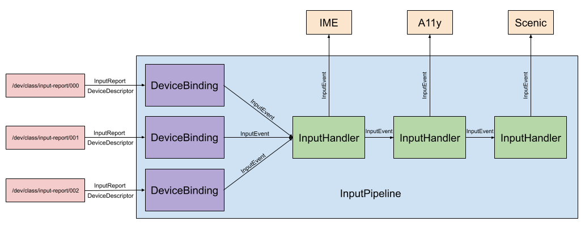

# Input pipeline library {#input-pipeline-library}

## Overview {#overview}

The input pipeline library tracks available input devices, manages device state, and
allows the session to register handlers for events.

An input pipeline runs alongside session. It is preconfigured to support a
set of input devices. This will be configurable by the session in the future.

The input pipeline library provides implementations for common input handlers, such as
Scenic and input method editors (IME). After the session instantiates components
that consume input, the input pipeline directly sends input events to those
components through the registered input handlers.

## Input pipeline {#input-pipeline}

An input pipeline manages [InputDeviceBindings][glossary.InputDeviceBinding]
and [InputHandlers][glossary.InputHandler].

* An `InputDeviceBinding` represents a connection to a physical input device
  (e.g. mouse, keyboard).
* An `InputHandler` represents a client of [InputEvents][glossary.InputEvent].

An input pipeline routes input from physical devices to various clients by doing
the following:

1. Detects and binds to new input devices as they appear in
   `/dev/class/input-report`.
2. Propagates `InputEvent`s through `InputHandler`s.

Session authors are responsible for setting up input pipelines. More details on
how can be found in [input_pipeline.rs].

### InputDeviceBinding {#input-device-binding}

An `InputDeviceBinding` does the following:

1. Connects to an [InputReport][glossary.InputReport] file located at `/dev/class/input-report/XXX`.
2. Generates `InputEvent`s from the [InputDeviceDescriptor][glossary.InputDeviceDescriptor] and incoming
   `InputReport`s.

The input pipeline creates and owns `InputDeviceBinding`s as new input
peripherals are connected to a device.

### InputHandler {#input-handler}

When an `InputHandler` receives an `InputEvent`, it does at least one of the
following:

* Forwards the `InputEvent` to the relevant client component.
* Outputs a vector of `InputEvent`s for the next `InputHandler` to process.

`InputHandler`s must satisfy at least one of these conditions, but otherwise
their implementation details can vary.

The developer guide includes an
[example implementation of an `InputHandler`][example-input-handler].

[glossary.InputDeviceBinding]: glossary/README.md#InputDeviceBinding
[glossary.InputHandler]: glossary/README.md#InputHandler
[glossary.InputEvent]: glossary/README.md#InputEvent
[glossary.InputReport]: glossary/README.md#InputReport
[glossary.InputDeviceDescriptor]: glossary/README.md#InputDeviceDescriptor
[input_pipeline.rs]: /src/ui/lib/input_pipeline/src/input_pipeline.rs
[example-input-handler]: development/sessions/roles-and-responsibilities.md#handling-input
