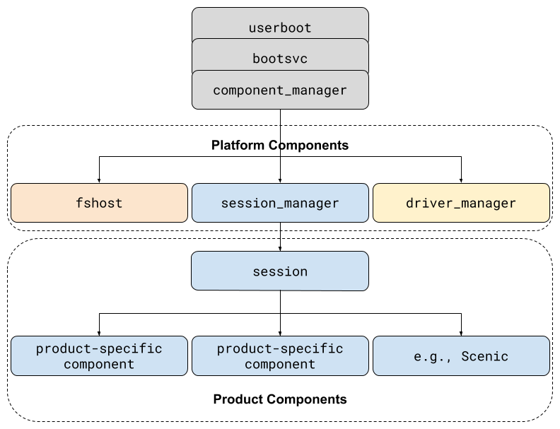
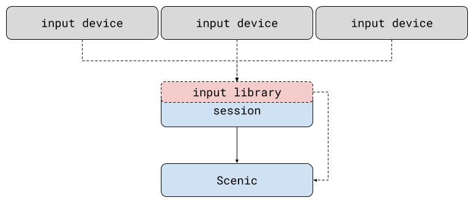
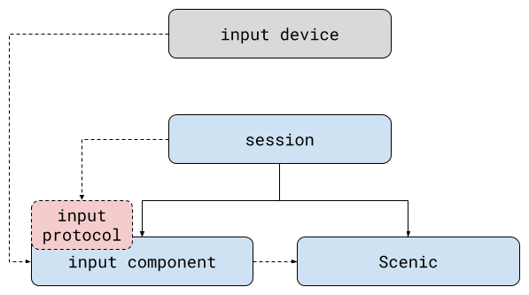
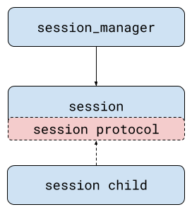
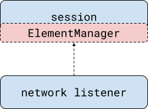

# Session framework

A session is a [component][doc-component] that encapsulates a product’s user
experience. It is the first product-specific component started  on boot. There
is only one session component, but it can be composed of many sub-components.
For example, the session for a graphical product instantiates Scenic (graphics)
as a child component.

At runtime, the session manager (the component that starts the session) offers
[component capabilities][doc-capability] (e.g., storage, network access,
and hardware protocols) to the session, which the session uses to construct the
product experience, including:

* Management of user "apps" and their composition into a user experience
* Handling of user input data flow
* Common configuration between the [compositor][doc-compositors] and a11y
  subsystems

## From collection of components to cohesive product

The session manager serves as the boundary between **platform components** that
are present on all Fuchsia products, and **product components** that are
present only on a subset of Fuchsia products.

The diagram above depicts a running Fuchsia product. The
[`component_manager`][doc-component-manager]
instantiates several different platform components, including
`session_manager`. `session_manager` then launches the session for the given
product configuration, and the session instantiates its own, product-specific,
component hierarchy.

Even for simple products, the session ends up with a lot of responsibilities.
For example, it configures the scene graph, wires up input, integrates
accessibility, and so on. The session framework helps the session fulfill these
responsibilities by:

* Providing client libraries that implement functionality common across
  sessions.
* Building components that expose said libraries as [FIDL][doc-fidl] protocols,
  for sessions not written in languages supported by client libraries.
* Defining FIDL protocols to standardize communication between sessions and
  components that are present on a wide range of products.

### Providing client libraries

Client libraries implement common functionality across sessions. For example,
`input` tracks available input devices, maintains device state, and allows
sessions to register handlers for events. In the diagram below, the session
includes an input library that talks to the available input devices. The
session instantiates Scenic as a child component, and adds an input handler to
the input pipeline that sends events to Scenic directly.

Another example is the `scene_management` library. This library provides
utilities for managing a scene graph. For example, a session that displays
views from different components can use `scene_management` to set up an
appropriately configured scene and present the component views.

### Building components

Not all sessions are written in a language supported by the session framework’s
client libraries. In these cases, the session can instantiate components
(provided by the session framework) that wrap the library and expose FIDL
protocols with an API surface similar to the wrapped library.

In the diagram above, the session instantiates an input component and speaks to
it via an input protocol. The session also instantiates Scenic, and makes sure
that Scenic and the appropriate services are routed between Scenic and the
input component.

### Defining FIDL protocols

FIDL Protocols defined by the session framework help sessions consistently
integrate content from different runtimes (e.g., Flutter, web). Additionally,
these protocols help reduce the burden product owners experience when
integrating new runtimes into their products.

Consider a session child component that displays content to the user when it
receives a ping from the network. The session offers the network-listening
component the `ElementManager` FIDL protocol. The `ElementManager` protocol
allows components to add other components ([`Elements`][doc-element]) as
children of the session at runtime. The network listener then calls
`ElementManager.proposeElement` to add the `Element` to the session.

If the session accepts the request, the component is instantiated:

Since the element proposer and the session use a protocol that is defined by
the session framework, the same element proposer can be used across all sessions
that implement the `ElementManager` protocol.

[doc-capability]: /docs/concepts/components/v2/capabilities
[doc-component]: /docs/concepts/components/v2/introduction.md
[doc-component-manager]: /docs/concepts/components/v2/component_manager.md
[doc-compositors]: /docs/concepts/ui/scenic/index.md#compositors
[doc-fidl]: /docs/concepts/fidl/overview.md
[doc-element]: /docs/concepts/session/element.md