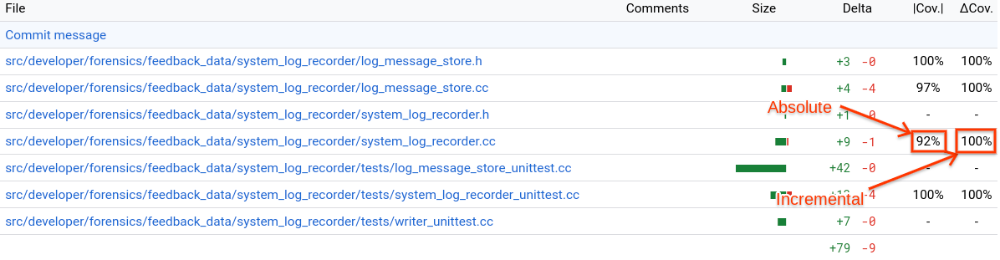

# Test coverage

## Motivation

Software testing is a common practice that helps teams continuously deliver
quality code. Tests exercise invariants on the software's behavior, catch and
prevent regressions in functionality or other desired properties, and help
scale engineering processes.

Measuring test coverage in terms of source code line coverage helps engineers
identify gaps in their testing solutions. Using test coverage as a metric
promotes higher-quality software and safer development practices. Measuring test
coverage continuously helps engineers maintain a high bar of quality.

Test coverage does not guarantee bug-free code. Testing should be used along
with other tools such as [fuzz testing][fuzz-testing], static and dynamic
analysis, etc.

## Absolute test coverage

Absolute test coverage is a measure of all lines of source code that are covered
by the complete set of tests. Fuchsia's Continuous Integration (CI)
infrastructure produces absolute coverage reports, and continuously refreshes
them. Coverage reports are typically at most a couple of hours stale.

### Absolute coverage dashboard

The latest absolute coverage report is available [here][coverage-dashboard].
This dashboard shows a tree layout of all code that was found to have been
covered by all tests that were exercised, as a subset of the source tree. You
can navigate the tree by the directory structure and view total coverage metrics
for directories or individual line coverage information for files.

In addition, coverage information is also available as a layer in Google's
internal code search.

## Incremental test coverage

Incremental test coverage is shown in the context of a change on the [Gerrit
code review web UI][gerrit]. Incremental coverage shows, specifically in the
context of a given change, which modified lines are covered by tests and which
modified lines are not.

Incremental test coverage is collected by Fuchsia's Commit Queue (CQ)
infrastructure. When sending a change to CQ (Commit-Queue+1), you can click
"show experimental tryjobs" to reveal a tryjob named `fuchsia-coverage`. When
this tryjob is complete, your patch set should have absolute coverage (|Cov.|)
and incremental coverage (ΔCov.)

See for instance the following example:
[499602: [forensics] No write limit for the first 1 minutes of log recording][fxr499602]

Maintaining high incremental test coverage for changes affecting a project helps
keep test coverage high continuously. Particularly, it prevents introducing new
untested code into a project. Change authors can review incremental coverage
information on their changes to ensure that their test coverage is sufficient.
Code reviewers can review incremental test coverage information on changes and
ask authors to close any testing gaps that they identify as important.

## Limitations

Currently, test coverage is collected only if:

*   The code is written in C, C++, or Rust.
*   The code either runs on Fuchsia devices in usermode, or is exercised by a
    host test.
*   The test is exercised under the `core.x64` or `core.arm64` configuration on
    qemu. Tests that only run in other configurations, such as on hardware
    targets, are not supported at this time.
*   System tests, aka end-to-end (e2e) tests, are _excluded_.

On that last note, e2e tests exercise a lot of code throughout the system, but
they do so in a manner that's inconsistent between runs (or "flaky"). To
achieve higher test coverage for code, it is possible and in fact recommended
to do so using unit tests and integration tests.

Support for the following additional use cases is currently under development:

*   Kernel code coverage.
*   Coverage on product configurations other than `core`, for instance
    `bringup` or `workstation`.
*   Coverage on hardware targets, that is collecting from tests that don't
    run on qemu.

## Troubleshooting

### Unsupported configuration / language / runtime

If you are not seeing absolute or incremental coverage information for your
code, first review the [limitations](#limitations) and ensure that your code is
expected to receive coverage support in the first place.

### Stale reports / latency

Absolute coverage reports are generated after the code is merged and may take a
few hours to fully compile. The dashboard shows the commit hash for the
generated report. If you're not seeing expected results on the dashboard,
ensure that the data was generated past any recent changes that would have
affected coverage. If the data appears stale, come back later and refresh the
page.

Incremental coverage reports are generated by CQ. Ensure that you are looking
at a patch set that was sent to CQ. You can click "show experimental tryjobs" to
reveal a tryjob named `fuchsia-coverage`. If the tryjob is still running, come
back later and refresh the page.

## How test coverage works

Fuchsia's code coverage build, test runtime support, and processing tools use
[LLVM source-based code coverage][llvm-coverage]{:.external}. The Fuchsia
platform is supported by compiler-rt profile runtime.

Profile instrumentation is activated when the `"coverage"` build variant is
selected. The compiler will then generate counters that each correspond to a
branch in the code's control flow, and emit instructions on branch entry to
increment the associated counters. In addition, the profile instrumentation
runtime library is linked into the executable.

For more implementation details see
[LLVM Code Coverage Mapping Format][llvm-coverage-mapping-format]{:.external}.

Note that the instrumentation leads to increased binary size, increased memory
usage, and slower test execution time. Some steps were taken to offset this:

*   Tests in profile variants are afforded longer timeouts.
*   Tests in profile variants are compiled with some optimizations.
*   Coverage currently runs on emulators, where storage is less constrained.
*   For incremental coverage, only binaries affected by the change are
    instrumented.

The profile runtime library on Fuchsia stores the profile data in a [VMO][vmo],
and publishes a handle to the VMO using the
[`fuchsia.debug.DebugData`][debugdata] protocol. This protocol is made available
to tests at runtime using the [Component Framework][cfv2] and is hosted by the
[Test Runner Framework][trf]'s on-device controller, Test Manager.

The profiles are collected after the test realm terminates, along with any
components hosted in it. The profiles are then processed into a single summary
for the test. This is an important optimization that significantly reduces the
total profile size. The optimized profile is then sent to the host-side test
controller.

The host uses the [`covargs`][covargs] tool, which itself uses the
[`llvm-profdata`][llvm-profdata]{:.external} and
[`llvm-cov`][llvm-cov]{:.external} tools, to convert raw profiles to a summary
format and to generate test coverage reports. In addition, `covargs` converts
the data to protobuf format which is used as an interchange format with various
dashboards.

[coverage-dashboard]: https://analysis.chromium.org/p/fuchsia/coverage
[cfv2]: /docs/concepts/components/v2/
[covargs]: /tools/debug/covargs/
[debugdata]: https://fuchsia.dev/reference/fidl/fuchsia.debugdata
[fuzz-testing]: /docs/concepts/testing/fuzz_testing.md
[fx-smoke-test]: https://fuchsia.dev/reference/tools/fx/cmd/smoke-test
[fxr499602]: https://fuchsia-review.googlesource.com/c/fuchsia/+/499602/12
[gerrit]: https://fuchsia-review.googlesource.com/
[llvm-cov]: https://llvm.org/docs/CommandGuide/llvm-cov.html
[llvm-coverage]: https://clang.llvm.org/docs/SourceBasedCodeCoverage.html
[llvm-coverage-mapping-format]: https://llvm.org/docs/CoverageMappingFormat.html
[llvm-profdata]: https://llvm.org/docs/CommandGuide/llvm-profdata.html
[trf]: /docs/concepts/testing/v2/test_runner_framework.md
[vmo]: /docs/reference/kernel_objects/vm_object.md