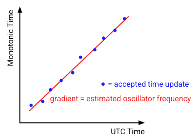

# UTC synchronization algorithms

## Introduction

This page defines and explains the algorithms that
[Timekeeper](/src/sys/time/timekeeper) uses to fulfil its central role in the
[UTC Architecture](architecture.md).

This information may be of interest if you are working on the time system or
need a detailed understanding of the internals of UTC on Fuchsia. If you simply
wish to develop components on Fuchsia that use UTC, consider reading the much
shorter and simpler [UTC Overview](overview.md) and [UTC Behavior](behavior.md)
pages instead.

Time source components such as
[HTTPSDate time source](/src/sys/time/httpsdate_time_source) also use a range of
protocol-specific algorithms to compute their time samples; refer to the
README.md in each time source component for further details.

## Overview

The operation of Timekeeper is split into answering seven separate questions:

1. **Should a time sample be accepted?** Each time a sample is received from a
   time source Timekeeper decides whether it should be accepted (in which case
   it may lead to a change in the system’s understanding of UTC) or rejected (in
   which case it is discarded).
2. **Which time source should be used?** Timekeeper
   maintains a primary UTC estimate that may be influenced by time samples from
   the Primary, Fallback, or Gating time sources. When more than one of these
   sources is installed Timekeeper decides which source should be used at each
   point in time.
3. **How should a time sample change the estimated UTC?** Timekeeper
   maintains an estimate of the most probable UTC at all times, along with the
   uncertainty of this estimate. Timekeeper updates both this estimate and the
   uncertainty each time a sample is accepted from a time source.
4. **What strategy should be used to converge the reported UTC?** Each time the
   estimated UTC changes as the result of a time sample, Timekeeper chooses how
   to converge the UTC reported to clients with this new estimate. One option is
   to immediately step the reported time. Another option is to slew the reported
   time at some rate for some duration.
5. **How should a sequence of time samples change the estimated frequency?** A
   sequence of time samples may be used to estimate errors in a device’s
   oscillator. Correcting for these frequency errors increases the accuracy of
   the system.
6. **How can clock error be bounded?** The time reported by the UTC clock is
   unlikely to perfectly match the true UTC. Although the exact error is not
   known, Timekeeper may estimate and publish a bound on the error.
7. **What clock updates should be made?** Once a convergence strategy has been
   selected it must be implemented by making one or more updates to the UTC
   clock object. Estimated frequency and error bound changes should also update
   the UTC clock object.

In some other time synchronization systems (for example NTP) the same algorithm
is used to answer more than one of these questions. This can make it difficult
to clearly reason about the behavior of a particular feature, to avoid
unintentional interactions between features, or to adjust components of the
algorithm in response to new requirements. Timekeeper intentionally uses
separate algorithms to answer each question. This leads to a system that is
simpler to develop, analyze, and debug and provides greater flexibility to
change or reconfigure individual algorithms when supporting a wide range of
different products.

The interactions between these algorithms are summarized in Figure 1, where
black elements are present in all configurations and grey elements are only
present when an optional time source role is present.


## Notation

The following sections sometimes use equations to define portions of the
algorithms. These equations are formatted in `code font` for ease of
identification and use the following notation:

* `|x|` The absolute value of x.
* `sign(x)` The sign of x. Returns -1 if x if negative and +1 if x if zero or
  positive.
* `sqrt(x)`	The square root of x.
* `sum(x)` The sum of property x over all points within some dataset.
* `clamp(x,y,z)` The value x limited to be no less than y and no greater than z,
	i.e. `clamp(x, y, z) = min(z, max(y, x))`

Text in UPPER_CASE_SNAKE_CASE refers to configurable parameters that control the
behavior of the algorithms. These parameters and their default values are
discussed in [configurable parameters](#configurable_parameters).


## Details

### Should a time sample be accepted? {#sample_validation}

Time samples are subjected to simple validity tests before being accepted:

1. Any time sample received less than MIN_SAMPLE_INTERVAL after the previous
   accepted time sample from the same source is rejected. This limits the
   maximum resource utilization in Timekeeper as a result of time source bugs.
2. Any time sample with a UTC earlier than backstop time is rejected. Accepting
   a sample before backstop time could cause Timekeeper to place its estimate
   of UTC earlier than backstop time.
3. Any time sample with a monotonic time far from the current monotonic time is
   an indication of an error. Time samples where monotonic time is in the future
   or greater than MIN_SAMPLE_INTERVAL in the past will be rejected.
4. When Timekeeper is configured with a gating source, any time sample from a
   non-gating source where `|sample_utc - (gating_utc + 1/estimated_frequency *
   (sample_monotonic - gating_monotonic))| > GATING_THRESHOLD` is rejected. In
   this expression gating_utc and gating_monotonic refer to the UTC and
   monotonic times in the most recently accepted sample from the gating source.
   This check ensures that all other sources remain consistent with the gating
   source.

The algorithms designers considered whether to reject time samples that were
inconsistent with current estimated UTC (either by being before current UTC or
significantly after current UTC) but concluded this was undesirable. Any system
that rejects new inputs based on the current estimate is vulnerable to permanent
failure if its estimate becomes erroneous and in the case of two mismatched
inputs there is no reason to believe the first is more reliable than the second.
A system that can recover from an error, even at the cost of a significant jump
in time, is preferable to one that cannot.

### Which time source should be used? {#source_selection}

As introduced in [UTC architecture](architecture.md), Timekeeper may be
configured to use four different time source roles although it is unlikely that
any given product will require more than two.

The primary source, fallback source, and gating source (if these exist) may each
be used to drive the primary time estimate and the externally visible clock.
These sources are listed in decreasing order of preference; generally a primary
time source would be more accurate but less available than a fallback source
which in turn would be more accurate but less available than a gating source. A
monitor source is subject to consistency checks against a gating source (if one
exists) but is otherwise completely independent, driving a separate time
estimate and an internal userspace clock that can be compared against the
externally visible clock to assess the performance of the monitor time source.

Time sources may take many minutes or hours to converge on an accurate solution
so time sources are always launched when Timekeeper is initialized rather than
only after the failure of some other time source.

Timekeeper selects the time source based on reported status and the presence of
time samples:

1. The primary time source is used if its most recent status is healthy and its
   most recent valid sample was within SOURCE_KEEPALIVE;
2. Otherwise, the fallback time source is used if its most recent status is
   healthy and its most recent valid sample was within SOURCE_KEEPALIVE;
3. Otherwise, the gating time source is used if its most recent status is
   healthy.

*Note: As of Q4 2020 gating and fallback sources are not yet supported and
therefore the time source selection algorithm has not yet been implemented.*

The algorithm designers considered whether to include hysteresis or failure
counting in the time source selection algorithm but concluded this would not add
sufficient value to compensate for the additional complexity. Many failure modes
are accommodated internal to the time sources so complete time source failures
should be rare events.

### How should a time sample change the estimated UTC? {#update_estimate}

Each valid sample received from the selected time source should be used to
update Timekeeper’s estimate of UTC. Each of these samples contains some error
and the size of this error varies between samples. The UTC estimate must
therefore combine information from multiple samples rather than blindly
following the most recent sample.

This state estimation problem is commonly and efficiently solved using a [Kalman
filter][1] in other domains. Timekeeper defines a simple two dimensional Kalman
filter to maintain the UTC estimate where the two states are UTC time and
oscillator frequency. Note that frequency is maintained external to the filter
through the [frequency correction algorithm](#frequency_estimation); filter
frequency is excluded from the Kalman filter’s measurement model and has a
covariance of zero.

The parameters in the Kalman filter are presented in Figure 2.


Note that, as a result of the fixed frequency estimate and the spare process
covariance matrix, only the upper left element of the state covariance matrix is
ever non-zero. This value is limited to a lower limit of MIN_COVARIANCE to
prevent the filter from over-indexing on its internal state and rejecting new
inputs.

### What strategy should be used to converge the reported UTC? {#convergence_strategy}

After each update to the estimated UTC, Timekeeper decides whether to
immediately step the userspace clock to the new estimate or apply a rate
correction to gradually slew the userspace clock to the new estimate. These
options are illustrated in Figure 3.


Step changes in time can be disruptive for time clients and can lead to errors
in their calculations so slewing is preferred whenever possible. Slewing is
constrained to a maximum rate because slewing at a substantially unrealistic
rate could also induce errors in clients; for example, slewing at double real
time would be undesirable. Each slew operation is constrained to a maximum
duration to bound the time over which the clock is known to be inaccurate; for
example, slewing away an error of multiple hours over a period of two weeks
would be undesirable.

For small corrections a slew is applied using a fixed small rate for as long as
is necessary to achieve the correction. For larger corrections, once the slew
duration would reach some maximum, a slew is applied for a fixed duration using
whatever rate is necessary to achieve the correction. Once the rate would exceed
some maximum Timekeeper resorts to using a time step instead of a slew.

In summary:

1. If `|estimated_utc - clock_utc| > MAX_RATE_CORRECTION * MAX_SLEW_DURATION`,
   make a step change to the clock;
2. Otherwise, if `|estimated_utc - clock_utc| > PREFERRED_RATE_CORRECTION * MAX_SLEW_DURATION`,
   apply a rate correction of `(estimated_utc - clock_utc)/MAX_SLEW_DURATION`
   for a duration of `MAX_SLEW_DURATION`;
3. Otherwise, apply a rate correction of
   `sign(estimated_utc - clock_utc) * PREFERRED_RATE_CORRECTION` for a duration
   of `|estimated_utc - clock_utc|/PREFERRED_RATE_CORRECTION`.

### How should a sequence of time samples change the estimated frequency? {#frequency_estimation}

A device’s oscillator is likely to have some inherent frequency error due to
manufacturing imperfections. Estimating the oscillator frequency to account for
this error can increase the accuracy of the UTC clock or reduce the frequency at
which clock corrections must be made.

Oscillator errors are bounded by specification to some small value (typically
tens of parts per million) hence the UTC estimate algorithm above is stable and
reliable even when a frequency estimate is unavailable; the frequency estimate
is an enhancement that is beneficial to performance but not necessary.

The frequency estimate is refined over a much longer time period than the UTC
estimate. This places the time constants of the two algorithms far apart to
avoid potential interactions and ensures the frequency algorithm will not track
transient errors such as a temperature driven error while a device is under
heavy use. This high time constant means frequency errors would remain in the
system for a long time and. As a design philosophy, Timekeeper favors making
no improvement in the frequency estimate to introducing an error in the
frequency estimate.

Timekeeper estimates a period frequency for each FREQUENCY_ESTIMATION_WINDOW
period providing all of the following conditions are met:

1. At least FREQUENCY_ESTIMATION_MIN_SAMPLES time samples were accepted during
   the period. This avoids placing an excessive weight on a small number of
   samples if time was unavailable for most of the period.
2. No step changes in time occurred during the period. A step change is evidence
   of a significant error either before or after the step. These periods are not
   used to avoid incorporating this error.
3. No part of the period falls within 12 hours of the UTC time at which a leap
   second may have occurred. Some time sources indulge in leap second smearing
   where they introduce a significant frequency error for a 24 hour period
   rather than a step change. These periods are not used to avoid incorporating
   this frequency error. This affects a maximum of two 24 hour periods a year,
   fewer if the system tracks whether the next leap second is scheduled.

The period frequency is calculated as the gradient of a least squares linear
regression over the (monotonic, utc) tuples for all time samples accepted in the
period as illustrated in Figure 4.



This is implemented using the following equation:

```
period_frequency = {sum(utc * monotonic) - sum(utc)*sum(monotonic)/n}
                   / {sum(utc^2) - sum(utc)^2/n}
```

Where n is the number of accepted samples within the period. Note that
MIN_SAMPLE_INTERVAL places an upper bounds on this value. The overall frequency
estimate is calculated as the exponentially weighted moving average (EWMA) of
the period frequencies. In all cases the final estimated frequency is
constrained to be within double the standard deviation of the oscillator error
such that no combination of the events could cause the frequency error to be
wildly inaccurate to the point where it could impact the correctness of the
Kalman filter. i.e.

```
estimated_frequency = clamp(
    period_frequency * FREQUENCY_ESTIMATION_SMOOTHING +
       previous_estimated_frequency * (1 - FREQUENCY_ESTIMATION_SMOOTHING),
    1 - 2 * OSCILLATOR_ERROR_SIGMA,
    1 + 2 * OSCILLATOR_ERROR_SIGMA)
```

EWMA provides a simple way to blend data across multiple periods while retaining
minimal state.

*Note: As of Q4 2020 the frequency estimation algorithm has not yet been
implemented.*

### How can clock error be bounded? {#error_bound}

For the UTC clock, the error bound is defined as half of a 95% confidence
interval. In other words, for a randomly selected time on a randomly selected
Fuchsia device, there is a ≥95% probability that the true value of UTC is
between `reported_utc - error_bound` and `reported_utc + error_bound`.
Attempting to report any higher level of confidence would imply a level of
certainty that Timekeeper cannot provide because some time failure modes are
invisible to Timekeeper. For example, the local oscillator could be running
outside its specified tolerance due to a defect or a remote time source could
send an incorrect time due to a bug.

The error in the UTC clock is composed of three components:

1. **A known difference between the reported clock time and the Kalman filter
   UTC estimate while a slew is in progress.**

   The current clock value and the UTC estimate are easily calculated at any
   point therefore calculating the difference is trivial. The error bound
   includes the complete difference, however, this is overly pessimistic.

1. **An unknown difference between the Kalman filter UTC estimate and the time
   standard used by the remote time source.**

   Each time source supplies error standard deviations with its time samples.
   The probability distribution of these errors is not known and may differ
   between time sources. However, based on the [central limit theorem][2], the
   normalized sum of independent random variables approaches a normal
   distribution even if the original random variables were not normally
   distributed. Since the Kalman filter is averaging the input samples (albeit
   not equally), it is expected that the error distribution of the Kalman filter
   approaches a normal distribution as the filter accumulates a large number of
   samples, with a standard deviation that is determined by the covariance. This
   error bound includes a term of [twice the square root of covariance][3] in
   the error bound to account for this error component. This this may either be
   optimistic or pessimistic for early time samples while the filter error is
   dominated by the unknown probability distribution received from the time
   source.

1. **A known difference between the time standard used by the remote time source
   and true UTC.**

   Some sources, such as Google, "smear" leap seconds by deliberately
   introducing an error of up to 500ms to the reported time during the 24 hours
   surrounding a leap second. This algorithm does not document this error in the
   error bound, reasoning that the complexity and computational cost of
   documenting smearing error is not worth the benefit to time clients. Leap
   seconds occurred five times between 2000 and 2020 causing a smearing error on
   0.07% of all days in this range. It is unlikely this can cause the final
   bound to fail the 95% confidence criteria.

In summary, the error bound is calculated in the following way:
`error_bound = 2 * sqrt(covariance[0,0]) + |estimated_utc - clock_utc|`

Until the Kalman filter has been initialized by receipt of the first time
sample, the error bound is set to `ZX_CLOCK_UNKNOWN_ERROR`. This includes the
case where the clock has been initialized from the real-time clock (RTC) but the
network time is not yet available.

The error bound calculation is summarized in Figure 5:


### What clock updates should be made? {#clock_updates}

Changes to the rate and offset of the clock follow directly from selecting a
convergence strategy and estimating the oscillator frequency as discussed in
earlier algorithms. The error bound defined by the previous algorithm
is a continuously changing value that must be periodically published in the
clock.

While a large slew is in progress the clock is continually approaching the
Kalman filter estimate and therefore the error bound is continuously decreasing.
To limit resource utilization Timekeeper only updates
`zx_clock_details_v1.error_bound` during a slew when either some other clock
update is required or when the error in the last reported value exceeds
ERROR_BOUND_UPDATE.

While a slew is not in progress, the error bound is continuously and slowly
increasing as the oscillator frequency error accumulates. Outside a slew,
timekeeper updates `zx_clock_details_v1.error_bound` at some conveniently low
frequency, ensuring that the error in the last reported value never exceeds
ERROR_BOUND_UPDATE.

In summary, Timekeeper makes updates to the UTC clock as follows:

* Step changes to the clock are always implemented as a single clock update.
* Clock slews are usually implemented as two clock updates: a rate change to
  `1/estimated_frequency + rate_correction` when the slew is started followed
  by a rate change to `1/estimated_frequency` after a delay of `slew_duration`.
  If a subsequent update is accepted before this second clock change, the
  second clock change is discarded.
* If a new frequency estimate is calculated while no clock slew is in progress,
  the clock rate is changed to `1/estimated_frequency` (if a clock slew is in
  progress, the clock update at the end of the slew picks up the new frequency
  update).
* If `|last_set_error_bound - error_bound| > ERROR_BOUND_UPDATE`, the error
  bound is updated.

## Configurable Parameters

The previous sections introduced a number of parameters that may be used to
configure the behavior of the algorithms. The following tables provide more
information about each of these parameters and justify the initial value that
is used.

### GATING_THRESHOLD

The gating threshold limits how close time samples from non-gating sources must
be to the UTC that the gating source indicates. This may be used to ensure less
trusted sources are broadly consistent with a cryptographically verifiable time
source.

Units | Value | Rationale
------|-------|-----------
Nanoseconds | Not Yet Implemented | Not Yet Implemented

### MIN_SAMPLE_INTERVAL

The minimum sample interval bounds the maximum rate at which Timekeeper is
willing to accept new samples from a time source in order to limit the
Timekeeper resource utilization. Note this is relevant since in the
`fuchsia.time.external.PushSource` protocol it is the time source that
determines when time samples should be generated. This value is also used to
apply an upper limit on the monotonic age of time samples.

Units | Value | Rationale
------|-------|-----------
Nanoseconds | 60,000,000,000 (i.e. 1 minute) | In general we expect time sources to reduce the frequency of time samples as they converge on an accurate time, with time samples in a well calibrated system arriving tens of minutes apart. Accepting a sample every minute is much faster than the rate needed after convergence and roughly reflects the fastest rate we expect shortly after initialization. Processing one time sample per minute per time source would still mean Timekeeper was using a very small fraction of the overall resources and was not frequently spamming the log.

### SOURCE_KEEPALIVE

The source keepalive determines how frequently a source that declares itself to
be healthy needs to produce samples in order to remain selected. If a time
source fails to generate any time samples for this period and a source lower in
the primary > fallback > gating hierarchy is available that other source will be
used instead. This parameter is not used unless either a fallback or gating time
source is configured.

Units | Value | Rationale
------|-------|-----------
Nanoseconds | 3600,000,000,000 (i.e. 1 hour) | Time sources should mark themselves as unhealthy when there is some persistent reason they cannot supply time. This parameter should be viewed as a last resort that enables recovery in the event of time source lifecycle bugs. We pick a value that is longer than we expect the slowest time source will use for samples while healthy (and in doing so place a minimum rate requirement on time sources), but short enough that the system clock will not have diverged significantly by the time the error is detected. Over one hour a 25ppm oscillator might have diverged by 90ms, hence we use this as a reasonable initial value.

### OSCILLATOR_ERROR_SIGMA

The standard deviation of the system oscillator frequency error, used to control
the growth in uncertainty during the prediction phase of the Kalman filter.

Units | Value | Rationale
------|-------|-----------
Dimensionless | 0.000015 (i.e. 15 ppm) | Eventually this should be configurable per board to reflect the hardware specification. For now we default to a value that is typical for low end consumer hardware.

### MIN_COVARIANCE

Minimum covariance bounds the minimum uncertainty of the UTC estimate in the
Kalman filter. This helps the filter not drink its own bathwater after receiving
very low uncertainty samples from a time source.

Units | Value | Rationale
------|-------|-----------
Nanoseconds squared | 1e12 (i.e. 1e-6 s^2) | This value represents a post-correction standard deviation of one millisecond. This value is lower than the filter achieves naturally with network time sources and therefore does not often come into play. If very high accuracy time sources such as GPS were used in the future it may be appropriate to lower the value somewhat.

### MAX_RATE_CORRECTION

Max rate correction bounds the fastest rate at which Timekeeper will
deliberately adjust the clock frequency in order to slew away a UTC error. This
is in addition to any clock frequency adjustment used to compensate for an
oscillator frequency error.

Units | Value | Rationale
------|-------|-----------
Dimensionless | 0.0002 (i.e. 200ppm) | 200ppm represents approximately one order of magnitude above the error rate that could be expected from a typical oscillator error. We believe this magnitude should be accommodated correctly by most clients and it is comfortably within the 1000ppm limit imposed by the kernel. When combined with MAX_SLEW_DURATION this value ensures a 1 second error may be removed by slewing. This is desirable to elegantly handle leap seconds and potential artifacts from time sources that only receive integer seconds.

### MAX_SLEW_DURATION

Max slew duration bounds the longest duration for which Timekeeper will apply a
clock frequency adjustment in response to a single time sample. Consecutive time
samples may introduce errors that each trigger a slew and therefore this
per-sample duration does not constrain the total time over which Timekeeper may
be in the process of slewing.

Units | Value | Rationale
------|-------|-----------
Nanoseconds | 5400,000,000,000 (i.e. 1.5 hours) | The typical interval between time samples is tens of minutes. A 90 minute maximum implies a correction received in one time sample may result in a slew that spans the next handful of samples (each of these samples could also cause a modification of the slew), which feels appropriate. 90 minutes is long enough to achieve meaningful time corrections but short enough that any user-visible abnormalities associated with a slew or time error are not present over multiple hours. When combined with MAX_RATE_CORRECTION this value ensures a 1 second error may be removed by slewing. This is desirable to elegantly handle leap seconds and potential artifacts from time sources that only receive integer seconds.

### PREFERRED_RATE_CORRECTION

The rate at while Timekeeper adjusts the clock frequency to slew away small
errors.This is in addition to any clock frequency adjustment used to compensate
for an oscillator frequency error.

Units | Value | Rationale
------|-------|-----------
Dimensionless | 0.00002 (i.e. 20ppm) | 20ppm is consistent with the error that might be observed from a typical oscillator and therefore must be accommodated by all time clients; there is little value in using a lower rate. 20ppm is high enough to correct typical moderate errors in a handful of minutes - a 10ms error would take 50 seconds to remove.

### FREQUENCY_ESTIMATION_WINDOW

The time period over which a set of time samples are collected to update the
frequency estimate.

Units | Value | Rationale
------|-------|-----------
Nanoseconds | 86,400,000,000,000 (i.e. 24 hours) | The value should be a multiple of 24 hours to avoid a bias from different temperatures in the diurnal cycle. Longer periods would lead to more opportunities to exclude or fail to complete a time period and therefore a less reliable frequency estimation process. 24 hours provides a sufficiently large number of samples to average and is sufficiently distant from the time constants in UTC estimation.

### FREQUENCY_ESTIMATION_MIN_SAMPLES

The minimum number of samples that must be received in a frequency estimation
window for it to be eligible for a frequency estimate.

Units | Value | Rationale
------|-------|-----------
Dimensionless | 12 | SOURCE_KEEPALIVE and FREQUENCY_ESTIMATION_WINDOW bound the minimum number of expected time samples to 24 for a device whose time source was healthy for the entire window. We require that half this number be received, meaning a device operating at the slowest legal sample rate must be online for half of the 24 hour window. This value ensures that each time sample has a limited contribution to the final average and therefore a small number of outliers may be accommodated.


### FREQUENCY_ESTIMATION_SMOOTHING

The factor applied to the current period during the exponentially weighted
moving average calculation of frequency.

Units | Value | Rationale
------|-------|-----------
Dimensionless | 0.25 | 0.25 sets a moderate (and somewhat arbitrary) bias towards the history during the EWMA calculation, with the historic frequency being weighted three times higher than the current period frequency. This damps the impact of any abnormal frequency periods and encourages a stable long term average.

### ERROR_BOUND_UPDATE

The minimum change in value that causes the error bound in UTC clock details to
be updated even when no rate or offset changes are required. This parameter
controls how frequently the clock must be updated while a significant slew is in
progress.

Units | Value | Rationale
------|-------|-----------
Nanoseconds | 100,000,000 (i.e. 100ms) | An error bound update of 100ms combined with an error bound growth of 30ppm from OSCILLATOR_ERROR_SIGMA means one error bound correction is required every 10 minutes during a maximum rate slew. This seems to be an appropriately low burden to maintain error bounds.


[1]: https://www.cs.unc.edu/~welch/media/pdf/kalman_intro.pdf
[2]: https://en.wikipedia.org/wiki/Central_limit_theorem
[3]: https://en.wikipedia.org/wiki/68%E2%80%9395%E2%80%9399.7_rule