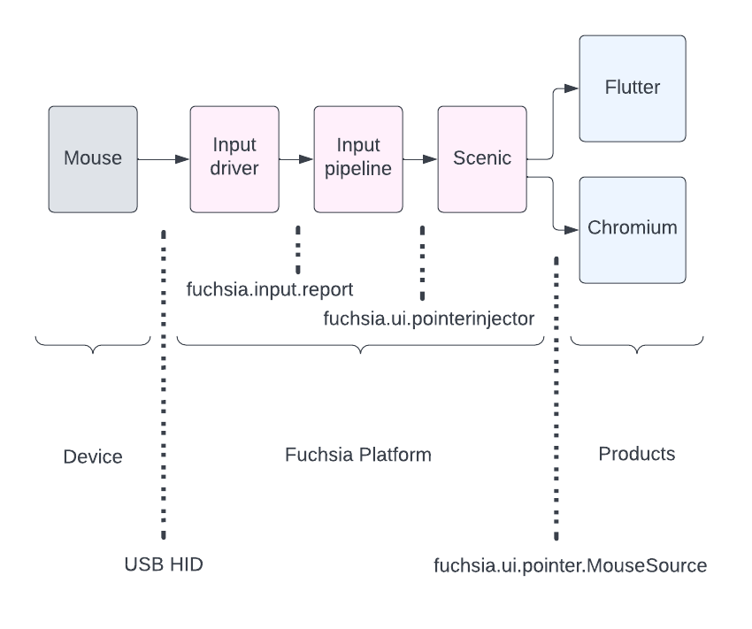

# Mouse scroll

This guide describes the high-level event plumbing and policy knobs for
conveying a mouse device's scroll wheel data to a User Interface (UI) client. A
more general description of mouse is provided in the
[Mouse guide](/docs/concepts/ui/input/mouse.md).

## Background

A mouse device typically has a physical
[scroll wheel](https://en.wikipedia.org/wiki/Scroll_wheel){:.external}, used to manipulate
graphical content. For example, wheel movement can page content up and down, or
control display magnification. A wheel typically has a number of
[detents](https://en.wikipedia.org/wiki/Detent){:.external} to indicate discrete steps in a
tactile manner. A single wheel is usually a vertical scroll wheel, but some mice
have both a vertical and horizontal scroll wheel.

The interpretation of physical scroll wheel movement, and user-visible range of
effect, is dependent on a number of components that handle scroll wheel events.

## Protocols and event flow

### Input driver

The input driver reads how many detents have moved on the scroll wheel via the
USB HID protocol. The protocol specifics for scroll are defined in a
[HID usage table](https://www.usb.org/hid){:.external}. The default interpretation is for
wheel movement away from the user's body to have positive vertical scroll
values.

The driver packs this scroll data into
[`MouseInputReport`](https://fuchsia.dev/reference/fidl/fuchsia.input.report#MouseInputReport)
`scroll_v` (vertical) and `scroll_h` (horizontal) fields.

### Input pipeline

The Input Pipeline component reads `scroll_v` and `scroll_h` data from the input
driver's `MouseInputReport` and injects them into Scenic as a
[`PointerSample`](https://fuchsia.dev/reference/fidl/fuchsia.ui.pointerinjector#PointerSample).

This component implements centralized policy decisions for scrolling, for
example:

*   The amount of text lines of movement for each detent.
*   The application of a non-linear multiplier (sometimes called "acceleration")
    for faster scrolling. For example, a high detent count in a
    `MouseInputReport` could result in super-linear line movement, instead of
    multiplying detents with a fixed line-movement constant.
*   Offering a centralized pixel-distance interpretation for scroll values,
    instead of delegating that interpration to each UI client. This is work in
    progress, see [fxb/85388](https://fxbug.dev/85388).

Generally, these fields may be extended in the future, to support a richer or
more precise interpretation of scroll movement. Pixel-distance interpretation is
one such example, which complements (not replace) previously introduced
interpretations.

### Scenic

The Scenic component accepts scroll data from Input Pipeline and merely forwards
it to UI clients. Scroll data is dispatched to UI clients on the
[`MouseSource`](https://fuchsia.dev/reference/fidl/fuchsia.ui.pointer#MouseSource)
API, over the same channel with other mouse data, such as cursor movement and
button presses.

### UI clients and UI frameworks

A UI client can freely make use of the scroll data it received from Scenic. A
cooperating client will accept the line-count interpretation offered by Input
Pipeline in a textual context, but otherwise is free to make up its own
interpretation of scroll distance, scroll direction, usage, etc.

If the UI client is implemented on top of a UI framework, such as Flutter or
Chromium, the framework code is responsible for correctly matching up Fuchsia's
scroll data to the framework-specific format and modality expected by UI
clients. For example, Flutter internally expects *only* pixel-precise scroll
data from an operating system, so in the absence of a centralized
interpretation, Flutter creates its own interpretation based on detent count.
