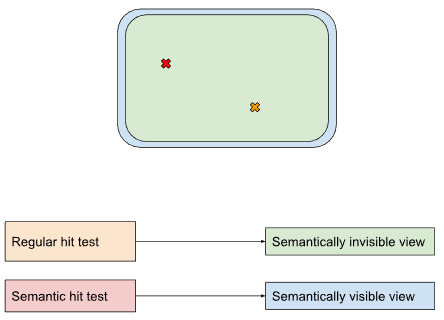
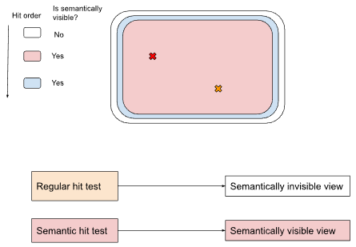

# Semantic Visibility

## Background

When a user interacts with a part of the screen, a hit test is performed to determine which view to
route that interaction to. Currently, there are two types of
[`hit regions`](https://fuchsia.dev/reference/fidl/fuchsia.ui.composition#HitRegion): semantically
visible and semantically *in*visible ones.

The [`HitTestInteraction`](https://fuchsia.dev/reference/fidl/fuchsia.ui.composition#HitTestInteraction)
enum designates if a semantic (accessibility) hit test should interact with them or not.

Semantically visible hit regions interact with both regular hit testing and
[`accessibility hit testing`](/docs/concepts/accessibility/semantics.md#hit_testing),
whereas semantically invisible hit regions interact only with regular hit testing, such as from a
mouse or touch event.

## Smart Display Case Study

To better understand why we need semantic visibility as a property, it can help to look at a
motivating example. For instance, consider the Smart Display product, which is essentially a Flutter
app that can sometimes launch child apps, such as a web view.

The parent Flutter application can launch a child web view containing, say, a YouTube player. The
situation arises where some hits should go to YouTube (e.g. playing or pausing the video), while
others should be handled by the parent process instead, for instance a gesture to dismiss the player
altogether. Since both views are full screen, this is not so straightforward.

One solution is for the parent Flutter process to place a full screen, transparent, and semantically
invisible hit region as the top most view. Let's call this view the **input shield**. With the input
shield, Flutter can intercept all input, even those intended for the YouTube player, and then
consume or redirect the input as necessary.

In order to better understand why this input shield needs to be semantically invisible, let's
consider what would happen if it weren't by looking at accessibility's explore mode. This mode is
when the user is dragging their finger across the screen, and the a11y manager reads out whatever
content is under the user's finger. These accessibility hit tests want to ignore the input shield,
and instead read out what the "real" content is underneath it.

By making the input shield semantically invisible, that's exactly what happens. The accessibility
hits only interact with semantically _visible_ hit regions, which in this case is the YouTube
player.

## Examples

### Simple case

The green, semantically invisible, view is overlaid on top of the blue, semantically visible view.
Semantic hit tests will not see the green, semantically invisible view, and therefore go to the blue
view.

_Image Description: The semantically invisible view is overlaid on top of the semantically visible
one. Regular hit tests, which interact with all views, therefore hit the top, semantically invisible
view. Semantic hit tests ignore it, and therefore hit the bottom, semantically visible one instead._

### Smart Display Case

From top to bottom there is a transparent view, a red view, and a blue view. The transparent
view is semantically invisible and full screen, and the red and blue views represent different
content a user may want to interact with, such as a web page or an application, ran by Flutter, say.
The Flutter content does not receive regular hits directly, as those will be handled by the top
level view, but the Flutter content will receive semantic hits, such as those performed by
accessibility services, as the semantic hits ignore the semantically invisible (and visually
invisible) top level view.

_Image Description: There are three views, and in order from top to bottom they represent the
invisible semantic shield, the YouTube player, and the Flutter view. Regular hit tests go to the top
most view regardless of semantic visibility, so the transparent "input shield" receives them.
Semantic hit tests ignore this top most input shield, and therefore go to the highest Z-order,
semantically visible view: the YouTube player._
