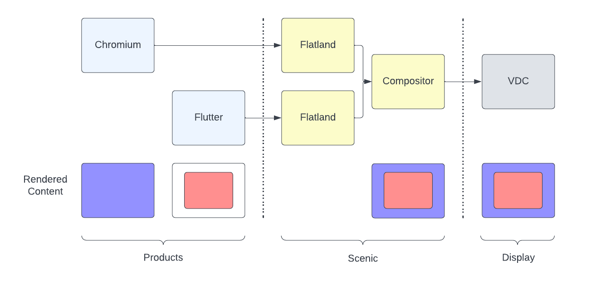

# Flatland

Flatland is Scenic’s 2D composition API. Flatland offers functionality for Fuchsia’s graphics
clients to construct their scene graph and submit to Scenic. Scenic then composes these into a
united scene graph that is presented on the display.

* 2D API for composition of buffer content
* Retained mode
* Global scene graph, content distributed between components
* Focus on efficiency and control

## Background

Scenic provided graphics clients with a 3D API under the `fuchsia.ui.gfx` namespace (the "Gfx api").
However, Fuchsia's current customers are fundamentally 2D products. This led to a mismatch between
Scenic's 3D scene representation and the 2D representation experienced by the user. Fuchsia decided
that Gfx API is no longer suitable for the demands being placed on Scenic, both from a product
standpoint and a performance standpoint. See
[Flatland roadmap entry](contribute/roadmap/2021/flatland.md) for details on this decision.
All of Fuchsia's graphics clients are [being migrated](http://fxbug.dev/93979) to Flatland API.

## Design

Flatland aims to provide a lightweight composition API optimized for 2D rectangular layers only.

Flatland clients create content with rectangular layers that are positioned in X/Y. They submit
their contents with the goal of reaching the display in a future vsync. Each Flatland client's
content is submitted to Scenic independently.

Scenic, as the system compositor, processes these scene graphs to produce a united scene graph.
Scenic may pass these graphical layers directly to the display. If not, Scenic may use Vulkan to
render these graphical content to a single layer that is submitted to the display.

Here are some high level design decisions made around Flatland API:

 * Flatland API usage is structured as commands that are enqueued on the server, followed by a
 commit call (Present()). As a departure from GFX, it does not offer a command union pattern or
 client-side enqueueing.
 * Flatland is stateful. Clients can make incremental changes to their scene graph between Present()
 calls.
 * Flatland aims to delegate composition work to Video Display Controller (VDC) hardware where
 possible. Doing this lowers Scenic’s GPU usage and makes HW available to the rest of the system.
 Flatland closely follows and provides functionality similar to VDC, which operates in a strictly 2D
 paradigm.
 * Flatland aims to offer deterministic CPU cost to the clients. There is one deadline-scheduled
 render thread. Each Flatland session runs on their own dispatchers, which prevents them from
 affecting each other's submissions.
 * Image allocations are enforced to be done through Scenic's Allocator protocol defined under
 [`fuchsia.ui.composition/Allocator`](https://fuchsia.dev/reference/fidl/fuchsia.ui.composition#Allocator).
 No copies are made when transferring Image resources.

## Protocols

### Flatland

The main protocol for creating and submitting a 2D scene graph. Connecting to Flatland protocol does
not mean the submitted content can reach display. Flatland instance is still expected to connect to
the global [View Tree](concepts/ui/scenic/view_tree.md) by creating its own View.

### ViewBoundProtocols

The input protocols that operate on the View that is created in this Flatland instance.

### ParentViewportWatcher
The protocol that provides information about the parent Flatland instance to the child Flatland
instance.

### ChildViewWatcher
The protocol that provides information about the child Flatland instance to the parent Flatland
instance.
