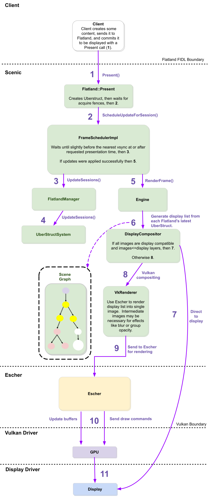

# Life of a pixel

A client requests a set of commands to be Presented as part of a future Scenic
frame. A single Scenic frame can have multiple client "Presents", where each
Present represents a Flatland instance's update to the global scene graph.
This doc describes the architecture internal to Scenic for how a request
becomes pixels.

The diagram below shows the steps a client Present follows when it is
requested. Flatland is a multi-threaded system, with Flatland instances each
living on its own thread, in addition to a central render thread which
handles compositing.

1. Client makes various calls to the Flatland API to modify its scene graph,
creating transforms and rectangles, and adding images. When a client creates an
image, the image is registered with several implementations of the
`BufferCollectionImporter` API, which include Vulkan and Display Controller
implementations. Each one creates an internal representation of the image to be
used for its domain (e.g. Vulkan image for Vulkan) backed by sysmem (this
becomes important later -- see step 8). When ready, the client then calls
`Present()` to commit them.

2. The `FrameScheduler` decides when the `Present()` call will be applied. It
uses its own internal policy to wake up early enough to present the frame
before the next vsync.

3. Each Flatland instance is associated with its own `UberStruct` --
a collection of data local to a particular Flatland instance representing the
most recent commit of that instance's presented state. The `UberStruct`
represents a snapshot of the local state of a Flatland instance. As such, it
contains only data and no references to external resources. The `UberStruct`
for the Flatland instance is updated at this time after `Present()` is called.

4. Next the `UberStruct` data needs to be compiled by the `UberStructSystem`.
The `UberStructSystem` is the central manager of all the uberstructs and is
a system for aggregating the local data (uberstructs) from Flatland instances
into a snapshot of the entire scene graph to be consumed by the render loop.
To be more specific, the `UberStructSystem` takes an atomic snapshot of all
of the Uberstructs whose acquire fences have been signaled. The intent is for
separate worker threads to own each Flatland instance, compute local data
(such as topology vectors) in their local thread, and then commit those
vectors to the `UberStructSystem` in a concurrent manner.

5. Here, the `UberStructSystem` data is sent to the `Engine` which flattens
the data which comes from multiple Flatland instances into long 1-dimensional
arrays of data which are suitable for low-level graphics and display processing.
The engine is also where we perform occlusion culling on the rectangle
renderable data.

6. At this point the rendering process diverges into two possible options.
Flatland is capable of doing both direct-to-display compositing as well as
Vulkan-based GPU compositing. The `DisplayCompositor` is responsible for
managing these two rendering paths, and choosing which to use for the set
of render data for a particular frame. The direct-to-display render path is
preferred, as it allows content to be directly composited onto device
hardware layers, skipping costly rendering computations. However, there are
only a limited number of layers (varying depending on the specific device)
along with device specific rules as to how images can be applied to the
layers. If these conditions are met, we skip directly to step 7. Otherwise
we go to step 8.

7. During direct-to-display compositing, the `DisplayCompositor` will take
the `RectangleRenderable` data and decompose each rectangle into `source`
and `dest` data for the layer it will be applied to. `Source` data refers
to the cropping dimensions in texels of the image to be composited. `Dest`
data refers to the dimensions in screen-space pixels that the image will
occupy on the display. We also attempt direct-to-display color conversion
here.

8. If we are unable to do direct-to-display compositing, we fallback to GPU
compositing. The render data is sent from the `DisplayCompositor` to the
`VkRenderer`. Prior to any of these steps listed here, when the client is
setting images as content in their Flatland instance, those images are
registered with the `VkRenderer` (step 1) which creates Vulkan textures out
of them that are backed by sysmem. So once we reach this step here, the work
of creating Vulkan textures is already complete. This means that all the
`VkRenderer::Render()` function needs to do before passing the render data
along to the `RectangleCompositor` (step 9 below) is create a new `Escher`
frame, prepare the textures to be rendered by transitioning their image layouts
and calculating their proper normalized UV coordinates, and setting up the
Vulkan semaphores to signal when rendering has been completed.

9. The data gets passed from the `VkRenderer` down to the `RectangleCompositor`.
The `RectangleCompositor` is a generic 2D Vulkan compositor, which makes use of
Escher, to render arrays of image data onto an output image (framebuffer).
For efficiency, opaque and transparent data is handled separately. Opaque data
is looped over front-to-back and transparent data back-to-front, with the
Vulkan CommandBuffers being updated along the way, along with other data
necessary for rendering such as push constants.

10. Once all the commands have been pushed to the Vulkan command buffer, we go
down into the GPU level, where the render data is being processed by our
Flatland-specific vertex and fragment shaders. Additionally, if color conversion
was not successfully applied when attempting direct-to-display rendering, the
Flatland color-conversion shaders will also be invoked here, and will calculate
the color correction values directly as a subpass after the main render pass.

11. Once all data has been applied to the display controller config, we call
`ApplyConfig` which commits the changes. Once this is done, all of the rendered
data will become visible on the display.
