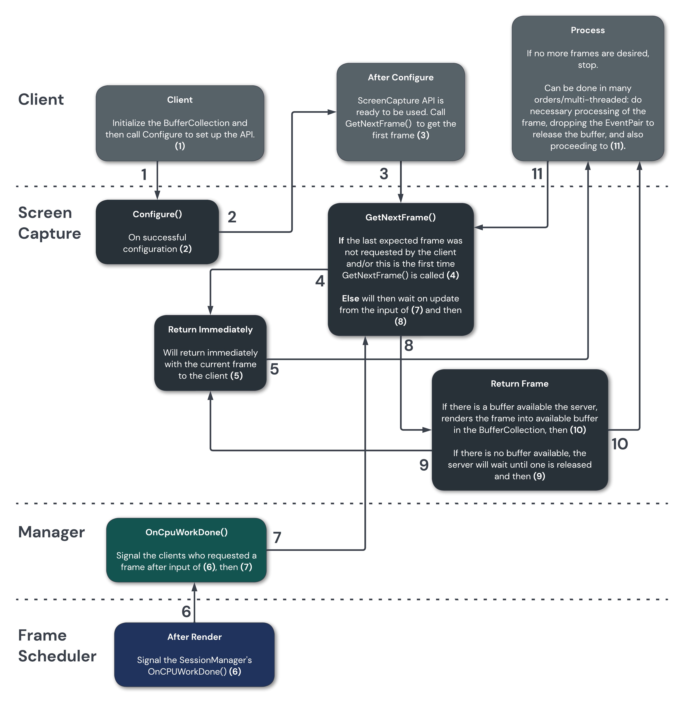

# Screen Capture

Screen capturing is the process of capturing graphical content that will be on the display for
clients.

## Background

Scenic provided clients with an initial Screen Capture API that rendered and presented a frame to a
client immediately. The client did not have any information on when content was produced or when to
get the next frame. The solutions to this problem still provided inefficiencies and is not optimal
for steady state capture, like in the case of using an application like Meet.

In the new Screen Capture API, Scenic absorbs the complexities the original API gave clients and
offers clients an easier interface.

## Design

Screen Capture aims to offload the work of scheduling when to return the next frame to Scenic
instead of the client. This is done by using the
[`Frame Scheduler`](../frame_scheduling.md), which currently knows when
the VSYNC and latch points are. Instead of rendering and giving back a frame immediately after a
client requests the next frame, a call to GetNextFrame() from the client will be a hanging-get request.
The frame scheduler and Flatland will do its work and contact the API when it has rendered the
next frame. Screen Capture will then give the renderables to any clients who called GetNextFrame().

The Screen Capture Manager will keep state for each client. When a client requests the next frame,
if they have received the last frame that was produced, the manager will wait until receiving a
signal from the Frame Scheduler and then return the frame.

If the client has not received the last frame that was produced, Screen Capture will return the
most current frame immediately. This happens during the client’s first call to Screen Capture, as
they have not received the previous frame, and any call after the client misses a frame. The client
now receives the most-recently produced frame.

## API Design

### Configure()
The main protocol for configuring the Screen Capture API. Clients should first use the Flatland
Allocator to register a BufferCollection to be used. They then should call Configure() as this will
configure the settings, buffers, and images to be used during screen capturing.

### GetNextFrame()
GetNextFrame() returns the latest unseen frame to the client as soon as possible. If the client has 
not recieved the last displayed frame, this will be returned immediately. If they have, this will 
be the next frame to be rendered.

### Dropping a buffer
When the client is done with the buffer they should drop the event pair that is included in the
GetNextFrame() callback.
