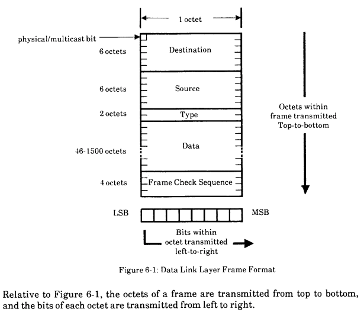



# {{ rfc.name }}: {{ rfc.title }}
<!-- SET the `rfcid` VAR ABOVE. DO NOT EDIT ANYTHING ELSE ABOVE THIS LINE. -->

Note: Formerly known as [FTP](../deprecated-ftp-process.md)-030.

## Summary

Declare that FIDL is little endian.

## Motivation

Moves FIDL closer to being a persistable format by having a specified, and
portable, endianness.

The initial design specifically chose host memory order (and representations)
to avoid any need to swizzle memory during transfer.
This is key to safely represent FIDL messages as C structs.
However, we recognize that the likelihood of running Fuchsias on a big-endian
machine anytime soon is small, and hence it is a practical decision to set
FIDL to being little-endian.

## Design

Currently FIDL is documented to use host-endianness, however all extant hosts
are little-endian.
In order to move towards a subset of FIDL that is serializable, it's proposed
that we declare that FIDL is little endian for now (this amounts to documentation
cleanup).

Should we ever need to support a big endian platform many other pieces of code
and documentation will need to be updated, and it's proposed that any changes
to FIDL be dealt with at that time.

## Implementation strategy

Prepare a CL to change FIDL documentation.

Capture the expectation that bindings are only used on little-endian machines
as asserts in code.

## Ergonomics

No change to ergonomics.

## Documentation and examples

Spec changes only.

## Backwards compatibility

No change currently.
Will limit FIDL on a potential future big endian device to need to do some
swizzling (minimally for persisted data structures).

## Performance

No change to current performance.
A FIDL revision may be needed should we ever support big-endian platforms.

## Security

No change to security.

## Testing

No change to testing.

## Drawbacks, alternatives, and unknowns

There are two big alternatives:

1. Not providing serializability &mdash; but this limits FIDL's applicability
   in some use cases.
2. Providing a separate persistable format &mdash; but this results in a secondary
   serialization path needing to be supported everywhere.

## Addendum

While the technical decision to fix FIDL to be little-endian was not
particularly controversial, as with many things, a long thread ensued. In it,
we learned:

* MIPS used to do both BE and LE depending on the init vector you clocked into
  the processor as it came out of reset (a long time ago when MIPS mattered, and
  when you could buy discrete MIPS CPUs).
  Some products even switched endianness upon reboot (don't ask why).

  While MIPS is not really much of a thing anymore, we would expect that the
  gates are embedded in a SoC, and that the endianness is probably fixed (and
  probably fixed to be little).

* All ARM cores implement both big and little endian.

  arm64 can select it per EL in the SCTLR.
  You can switch endian mode at exception level transitions.

  arm(32) selects via the SETEND instruction.
  It can switch endianness at any point during runtime.
  Your compiler is unlikely to support this, but it can be useful for some
  hand-coded assembly.

* IEEE 802.11 is little endian: the management and control planes for 802.11
  traffic use little endian in their fields.
  All the encapsulated protocols are still big endian, which the 802.11 stack
  barely touches.

  History goes up to year 1982, when Xerox invented Ethernet.
  WLAN mostly inherits that decision.
  The reason to choose the Little Endian? It was an *arbitrary* choice:

    > "The Ethernet itself is also totally insensitive to the interpretation
    > of bits within an octet as constituting the digits of an 8-digit binary
    > numeric value.
    > Since some uniform convention is helpful, however, in avoiding needless
    > incompatibility among different station types, the interpretation is
    > *arbitrarily defined* to be that ETHERNET SPECIFICATION: Data Link Layer
    > the left-most bit (first transmitted) is the low-order (2^0) digit and
    > the right-most bit (last transmitted) is the high-order (2^7) digit"

* USB is little endian.

* Trivia: MAC addresses aren't impacted by byte ordering but you can definitely
  shave a few cycles in your IP routing routine if addresses are big-endian...
  and perhaps even initiate a lower-latency "cut-through" routing of the packet
  as it trickles its way in, byte by byte, on an ancient ~1 Mbps link (~128 bytes
  per millisecond).

* Fun fact: FAT file systems use little-endian for most, but not all entries in
  the header.
  If the checksum over the entire FAT boot sector, read as big-endian, is 0x1234,
  then the FAT filesystem can be used as a bootable device for an m68k processor
  on your Atari ST, which implies that the current year is actually still 1985.

* Fun fact: There is also
  [middle-endian](https://en.wikipedia.org/wiki/Endianness#Middle-endian),
  which standard GCC
  [defines](https://gcc.gnu.org/onlinedocs/cpp/Common-Predefined-Macros.html),
  and notes:

    > "If `__BYTE_ORDER__` is equal to `__ORDER_PDP_ENDIAN__`, then bytes in 16-bit
    > words are laid out in a little-endian fashion, whereas the 16-bit subwords of a
    > 32-bit quantity are laid out in big-endian fashion."

