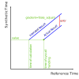
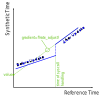



# {{ rfc.name }}: {{ rfc.title }}
<!-- SET the `rfcid` VAR ABOVE. DO NOT EDIT ANYTHING ELSE ABOVE THIS LINE. -->

## Summary

The [`zx_clock_update`](/docs/reference/syscalls/clock_update.md) syscall is
used to set the time in a kernel clock object but the current API design limits
the accuracy that may be achieved. This RFC describes changes to
`zx_clock_update` that let clock maintainers opt in to supplying more
information and achieving higher accuracy.

## Motivation

Kernel clock objects are updated using the `zx_clock_update` syscall. Clock
maintainers may request a step change in a clock by setting
`ZX_CLOCK_UPDATE_OPTION_VALUE_VALID` and placing the new time in
`zx_clock_update_args_v1_t.value`.

This API design is simple to use but limits the accuracy that may be achieved
when setting a new clock value: a userspace process may be preempted between
calculating `zx_clock_update_args_v1_t.value` and calling `zx_clock_update` and
every 1ms delay between these two events will lead to a 1ms error in the clock.
This error has been problematic for UTC integration and has led to many test
flakes, particularly on emulators where the error can be hundreds of
milliseconds. Note that `zx_clock_update` also supports changing a clock's rate
without setting a new value and these rate-only updates are much less
susceptible to error.

This RFC defines a new option for `zx_clock_update`, enabling a more accurate
clock for UTC and for other future users of kernel clocks.

## Design

### Overview

A [clock](/docs/reference/kernel_objects/clock.md) is a
[one dimensional affine transformation](/docs/concepts/kernel/clock_transformations.md)
of the
[clock monotonic](/docs/reference/syscalls/clock_get_monotonic.md) reference
timeline, defining how the "reference" time (i.e. the device's monotonic clock)
should be translated to the "synthetic" time output by the clock. When a clock
maintainer requests a change to the clock they are effectively supplying a new
line segment in this transform as illustrated in Figure 1.

**Figure 1 - A clock as a transform from reference to synthetic time**  

In the existing design a clock maintainer supplies the gradient of this line
segment using `zx_clock_update_args_v1_t.rate_adjust` and the y-coordinate at
the start of the segment using `zx_clock_update_args_v1_t.value`. The kernel
sets the x-coordinate at the start of the segment to the monotonic time when it
handles the syscall.

This definition of the segment start, with two coordinates set by different
entities, is the root cause of the clock error as illustrated in Figure 2.

**Figure 2 - Delays between calculation and handling lead to clock error**  

We propose a change to the `zx_clock_update` arguments that lets
a clock maintainer fully specify its intended line, while the kernel determines
the reference time at which the change is applied, i.e. the start position on
this line.

### API Changes

We introduce a new `zx_clock_update_args_v2_t` struct containing all the fields
currently in
[`zx_clock_update_args_v1_t`](https://cs.opensource.google/fuchsia/fuchsia/+/main:zircon/system/public/zircon/syscalls/clock.h;drc=0e009aa7aba824273eddb42f0e526f98afa6c692;l=83)
plus an additional `reference_value` field. We also add a new
`ZX_CLOCK_UPDATE_OPTION_REFERENCE_VALUE_VALID` option.

For naming consistency we rename the `value` field in
`zx_clock_update_args_v1_t` to `synthetic_value` in `zx_clock_update_args_v2_t`
and rename `ZX_CLOCK_UPDATE_OPTION_VALUE_VALID` to
`ZX_CLOCK_UPDATE_OPTION_SYNTHETIC_VALUE_VALID`.

For convenience we also define a
`ZX_CLOCK_UPDATE_OPTION_BOTH_VALUES_VALID` that may be used to set both
`ZX_CLOCK_UPDATE_OPTION_REFERENCE_VALUE_VALID` and
`ZX_CLOCK_UPDATE_OPTION_SYNTHETIC_VALUE_VALID`.

### Behavior Changes

For readability throughout this section and the next, we abbreviate
`ZX_CLOCK_UPDATE_OPTION_X_VALID` to simply `X_VALID`.

When `REFERENCE_VALUE_VALID`, `SYNTHETIC_VALUE_VALID`, and `RATE_ADJUST_VALID`
are all set, `zx_clock_update` starts a new line segment at the current
reference time, intersecting a point (
`reference=zx_clock_update_args_v2_t.reference_value`,
`synthetic=zx_clock_update_args_v2_t.synthetic_value`) with a gradient
determined by `zx_clock_update_args_v2_t.rate_adjust` as illustrated in
Figure 3.

**Figure 3 - Updating both the value and rate of a clock**  

When `REFERENCE_VALUE_VALID` and `SYNTHETIC_VALUE_VALID` are set but
`RATE_ADJUST_VALID` is not set, `zx_clock_update` starts a new line segment at
the current reference time, intersecting a point
(`reference=zx_clock_update_args_v2_t.reference_value`,
`synthetic=zx_clock_update_args_v2_t.synthetic_value`) with a gradient
determined by the prior clock rate as illustrated in Figure 4.

**Figure 4 - Updating only the clock value**  

When `REFERENCE_VALUE_VALID` and `RATE_ADJUST_VALID` are set but
`SYNTHETIC_VALUE_VALID` is not set, `zx_clock_update` starts a new line
segment at the current reference time, intersecting a point on the prior line
segment at `reference=zx_clock_update_args_v2_t.reference_value` with a gradient
determined by `zx_clock_update_args_v2_t.rate_adjust` as illustrated in
Figure 5.

**Figure 5 - Updating only the clock rate**  

When `REFERENCE_VALUE_VALID` is set but neither `RATE_ADJUST_VALID` nor
`SYNTHETIC_VALUE_VALID` are set, `zx_clock_update` returns an
`ZX_ERR_INVALID_ARGS` error.

When `REFERENCE_VALUE_VALID` is not set, `zx_clock_update` follows its existing
behavior, starting a new line segment at the current reference time, changing
the synthetic time to `zx_clock_update_args_v2_t.synthetic_value` if
`SYNTHETIC_VALUE_VALID` is set and changing the gradient based on
`zx_clock_update_args_v2_t.rate_adjust` if `RATE_ADJUST_VALID` is set.

### Continuous and Monotonic Clocks

A clock may have the `ZX_CLOCK_OPT_MONOTONIC` and/or `ZX_CLOCK_OPT_CONTINUOUS`
options set at creation, limiting the updates that can be applied.

A `ZX_CLOCK_OPT_CONTINUOUS` clock will not accept any step changes in time. From
Figures 4, 5, and 6 it can be seen that `REFERENCE_VALUE_VALID` always
introduces a discontinuity in the synthetic value and therefore setting
`REFERENCE_VALUE_VALID` for a `ZX_CLOCK_OPT_CONTINUOUS` clock will always lead
to a `ZX_ERR_INVALID_ARGS` error.

A clock with `ZX_CLOCK_OPT_MONOTONIC` but not `ZX_CLOCK_OPT_CONTINUOUS` will
accept step changes in time if and only if they cause an increase in the
synthetic value. Some clock updates could lead to a race condition where the
request might either be accepted or rejected depending on when it reaches the
kernel. For example, before this RFC a request to set a monotonic clock 5ms in
the future would be rejected if the calling process was preempted for more than
5ms between calculating `zx_clock_update_args` and calling `zx_clock_update`.

This non-determinism is undesirable and therefore the following
`zx_clock_update` requests will fail with an `ZX_ERR_INVALID_ARGS` error when
made on a `ZX_CLOCK_OPT_MONOTONIC` clock:

1. `SYNTHETIC_VALUE_VALID` is set but `REFERENCE_VALUE_VALID` is not set;
2. `RATE_ADJUST_VALID` is set and `REFERENCE_VALUE_VALID` is set.

Note this means it is not possible to change both the rate and the offset of a
`ZX_CLOCK_OPT_MONOTONIC` clock in the same `zx_clock_update` call.

## Implementation

This change will be implemented in four stages:

1. Define `zx_clock_update_args_v2_t`,
   `ZX_CLOCK_UPDATE_OPTION_REFERENCE_VALUE_VALID`, and
   `ZX_CLOCK_UPDATE_OPTION_BOTH_VALUES_VALID`;
2. Update [`clock.cc`](https://cs.opensource.google/fuchsia/fuchsia/+/main:zircon/kernel/lib/syscalls/clock.cc)
   and the associated unit tests to accept `zx_clock_update_args_v2_t`;
3. Update language-specific wrappers such as Rust's `fuchsia-zircon` to use
   `zx_clock_update_args_v2_t` and expose the new functionality.
4. Update Timekeeper to supply a reference value when setting the UTC clock and
   reduce the allowable test error windows.

## Performance

This change has minimal impact on performance since the `zx_clock_update`
syscall is not heavily used and the changes are modest.

`zx_clock_update_args` will increase by 8 bytes and the kernel will perform a
few more integer arithmetic instructions when handling `zx_clock_update` if
`ZX_CLOCK_UPDATE_OPTION_REFERENCE_VALUE_VALID` is set.

## Security considerations

This change does not alter the relationship between clock maintainers and clock
users and therefore does not impact security.

## Privacy considerations

This change does not alter the relationship between clock maintainers and clock
users and therefore does not impact privacy.

## Testing

Unit tests in
[`kernel-clocks.cc`](https://cs.opensource.google/fuchsia/fuchsia/+/main:src/zircon/tests/kernel-clocks/kernel-clocks.cc)
will be expanded to cover this new behavior. Timekeeper will be updated to set
UTC using an explicit monotonic time so the existing UTC unit and integration
tests will provide additional test coverage.

## Documentation

The [`zx_clock_update` reference documentation](/docs/reference/syscalls/clock_update.md)
will be updated to describe this new behavior.

## Drawbacks, alternatives, and unknowns

A simpler alternative would be to retain the existing
`zx_clock_update_args_v1_t` struct but introduce an additional
`ZX_CLOCK_UPDATE_OPTION_ZERO_VALUE_VALID` option that changes its
interpretation. When `ZX_CLOCK_UPDATE_OPTION_ZERO_VALUE_VALID` was set, the
kernel would interpret `zx_clock_update_args_v1_t.value` as the synthetic time
corresponding to monotonic=0 and ensure that the new line segment passes through
a point (`monotonic=0`, `synthetic=zx_clock_update_args_v1_t.value`) as
illustrated in Figure 6.

**Figure 6 - Alternative solution based on synthetic offset**  

This has the effect of fully specifying the new line with a smaller change in
the API. However, it is less intuitive for clock maintainers and requires more
complex calculations to use correctly. Over the life of Fuchsia we believe this
alternative would create more bugs.

## Prior art and references

[kernel_objects/clock](/docs/reference/kernel_objects/clock.md) provides an
overview of the operation of userspace clocks.

[UTC synchronization algorithms](/docs/concepts/kernel/time/utc/algorithms.md)
summarizes the current UTC synchronization design.

"Zircon Syscalls Struct Evolution" is a Google-internal document from May 2019
that discussed the evolution of syscall structs and may be helpful to readers
with access.
