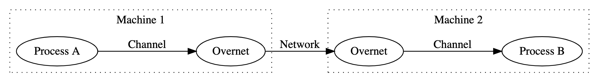
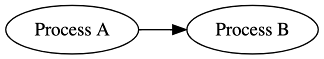
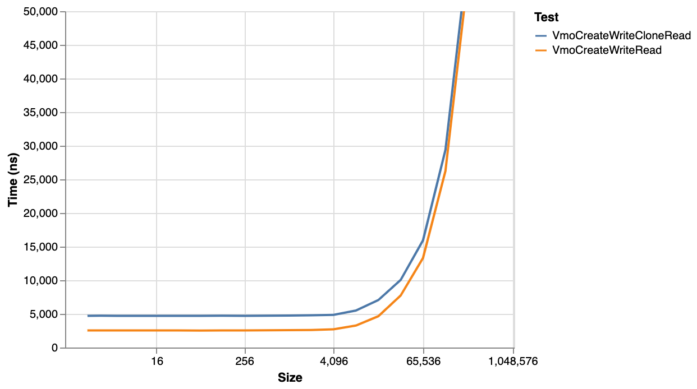



# {{ rfc.name }}: {{ rfc.title }}
<!-- SET the `rfcid` VAR ABOVE. DO NOT EDIT ANYTHING ELSE ABOVE THIS LINE. -->

<!--
*** This should begin with an H2 element (for example, ## Summary).
-->

## Summary

This RFC proposes a new flag `ZX_INFO_VMO_IMMUTABLE` that makes it
possible to determine if a VMO is immutable and has been since creation.

## Motivation

There are three main motivations for adding a mechanism to check for
immutability.

### Improving the safety and security of using shared memory

It is difficult to write secure and correct programs that use shared memory.
Some programs don't need fully mutable VMOs - they might write to a VMO
once and then only read from it.

If it is possible to test for restrictions like immutability on the VMO,
then it is easier to reduce the security surface and verify correctness.

### Large message support in FIDL

An explicit choice was made to limit channel messages to 64k and make it the
responsibility of applications that need larger sizes to find workarounds.

In the future, FIDL might provide support for large messages. One potential
way to handle this is to introduce boxing of messages as out-of-line VMOs.
A FIDL definition that includes `Box<Type>` would have that section of the
message copied to a VMO automatically by FIDL.

Another way to handle it might be to have all FIDL messages above 64k
automatically be sent in a VMO. This is the approach taken in a [withdrawn
RFC](https://fuchsia-review.googlesource.com/c/fuchsia/+/470640).

In both cases, the recipient of the message has no way to verify that the
message won't be mutated as they are reading it. If there was a way to confirm
that the VMO wouldn't be modified, it is easier to verify that the VMO is used
safely and may also lead to optimization opportunities.

### Overnet

Overnet is a channel-level proxy that transports messages over the network.

Overnet is a transparent proxy. Overnet clients send channel messages the same
way they would to a local process. The messages are then serialized by Overnet,
sent over the network, and reconstructed on the other side. The receiving
process receives the message the same way they would any other channel message.

The application using Overnet sees the following:

Overnet doesn't currently support sending messages containing VMOs. This has
been a pain point for several Overnet clients that have needed to send
messages larger than the existing 64k channel limit and would otherwise send
large chunks of data in VMOs (wrapped in the fuchsia.mem.Buffer or
fuchsia.mem.Data FIDL type).

Within a single machine, VMOs are passed by reference regardless of whether
they are mutable or immutable -- that is, sending a VMO in a channel will not
cause Zircon to implicitly copy it. This is simple and efficient to implement.
However, pass by reference between multiple machines over the network would
be inefficient and impractical. Instead, pass by copy is suitable for these
scenarios.

The challenge is that pass by copy is not always safe to use. Because Overnet
is a transparent proxy, remote processes expect references to the same VMO to
be in sync. Pass by copy changes the semantics of VMOs and can subtly break
applications. For example, if a hypothetical media player process sends a VMO
to a remote speaker process and then writes a song to the VMO, the speaker
will never receive the song or be able to play it because the song wasn't
present in the VMO when it was first sent.

Fortunately, there are some cases where pass by copy is safe. One such case
is when the VMO arriving at the Overnet proxy is immutable. The application
has already given up its ability to mutate the data so it is guaranteed that
any copies that are made of the data will remain consistent.

If Overnet is able to detect immutable VMOs, then it can fail fast when it
encounters a mutable VMO. In doing so, it can avoid subtle bugs that would
cause applications to silently break.

## Design

Add a new `ZX_INFO_VMO_IMMUTABLE` flag to the `flags` field of `zx_info_vmo_t`,
indicating if the VMO is immutable in a way that can be guaranteed and
verified.

Today, a VMO is immutable iff it was created with the `zx_vmo_create_child`
syscall with the `ZX_VMO_CHILD_SNAPSHOT` and `ZX_VMO_CHILD_NO_WRITE` flags set
and the `ZX_VMO_RESIZABLE` and `ZX_VMO_DISCARDABLE` flags unset. However, the
formula for determining if a VMO is immutable could change in the future if
new ways of creating immutable VMOs are introduced.

Determining when to make a VMO immutable is left to the application.

## Implementation

The implementation is relatively straightforward. Most of the state needed to
compute the value of `ZX_INFO_VMO_IMMUTABLE` is already stored in the kernel.

The exception to this is a bit indicating that the VMO was not writable at
creation time. This can be stored in `VmObjectDispatcher`.

## Performance

There is no direct performance impact from adding the flag.

However, creating an immutable VMO currently has a non-insignificant cost and
should be used only where strictly needed. In the case of Overnet, the relative
overhead of the immutable clone may be less significant because Overnet is
already doing significant work to send a message, including network
communication.

Two benchmarks were run and compared to further understand the cost of
immutable clones
([CL](https://fuchsia-review.googlesource.com/c/fuchsia/+/487183)):

- Create VMO, Write, Read, Close
- Create VMO, Write, Immutable Clone, Read Cloned VMO, Close

It is important to emphasize that this benchmark is reflective of performance
today, but there is room to optimize clones - particularly for the immutable
clone case.

This benchmark was recorded on an Intel NUC NUC7i5DNHE.

Up until 64 KiB, there is a 2 us cost for performing an immutable clone, after
which it starts to increase. After 2 MiB, the cost increases significantly.

It is worth noting, however, that the relative cost of clone compared to the
overall create-write-clone-read-destroy flow decreases as the size increases:

For a 64k VMO, the immutuable clone adds an extra 20% to the time - a fairly
significant overhead, but with larger sizes the overhead gradually decreases
towards zero.

## Security considerations

It is important to verify that VMOs claimed to be immutable through this
technique are actually immutable. It would be a security bug if a VMO
is falsely identified as immutable.

## Privacy considerations

No impact.

## Testing

The flag implementations will be verified through unit tests.

## Documentation

Today, documentation is missing on the `ZX_INFO_VMO_*` flags and the reader
is referred to the repo. As part of this change, documentation will be written
to describe `ZX_INFO_VMO_*` options.

## Drawbacks, alternatives, and unknowns

### Multiple Flags for Different Properties that Determine Immutability

This RFC proposes using a single `ZX_INFO_VMO_IMMUTABLE` flag to determine
immutability. Instead, several separate flags could be used on the user's end
to determine this:

- `ZX_INFO_VMO_IS_CHILD_SNAPSHOT`
- `ZX_INFO_VMO_IS_INITIALLY_WRITABLE`
- `ZX_INFO_VMO_IS_RESIZABLE`
- `ZX_INFO_VMO_IS_DISCARDABLE`

The benefit of having multiple flags based on underlying state is that a
specialized flag isn't needed for immutability and only base properties are
exposed that can be used in different combinations.

However, it is relatively complex to determine immutability through these flags
and immutability can be thought of as a fundamental property on its own. By
having a dedicated flag for immutability, it is easier to avoid security bugs.
Further, a single flag makes it easier to introduce new methods of creating
immutable VMOs.

### Checking for last-remaining reference

It may be tempting to use ZX_INFO_HANDLE_COUNT to check whether the process
holds the last handle to a VMO and assume that if it does, no other process
can mutate the VMO.  However, that assumption would not be correct, because
handles are only one type of reference in Zircon.  For example, a memory
mapping of a VMO does not contribute towards the ZX_INFO_HANDLE_COUNT value,
so a process cannot use this value to determine whether it has exclusive
access to a VMO.

### Communicating safety to Overnet via FIDL

A change could be made to the FIDL language making it possible to mark that a
VMO is immutable or "Overnet-able". If Overnet is able to tell if a given VMO
has this property, then it can decide whether to send the VMO or reject it.

There are a number of options for communicating this information to Overnet:

- Send it in an unused bit on the handle
- Add a mechanism to store bits on the VMO that Overnet can read
- Reserve 64 bits in the FIDL message header to mark VMO handles as immutable
- Have Overnet communicate with the client via a protocol

Unfortunately, these all have downsides that make them complex and not
preferable to the proposed solution.

## Prior art and references

VMO Sealing [Abandoned RFC](https://fuchsia-review.googlesource.com/c/fuchsia/+/456697)
proposed a mechanism to restrict actions that can be performed on VMOs. This
could be used instead of cloning to create and test for an immutable VMO.
However, VMO Sealing is much more invasive to the VMO implementation than
a simple check for immutability.

Recently, there has been work on safety features for `zx_vmar_map`, for
instance `ZX_VM_ALLOW_FAULTS`. It may be desirable to add features dealing
with immutability to `zx_vmar_map` in the future.
