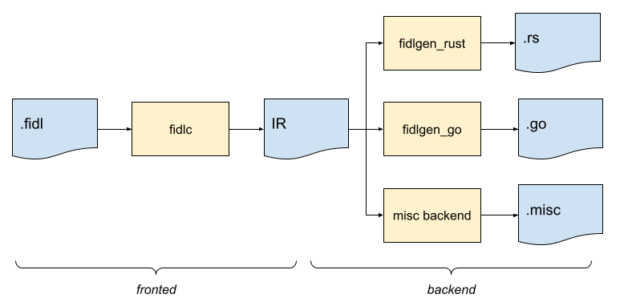
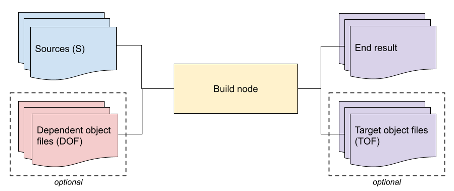
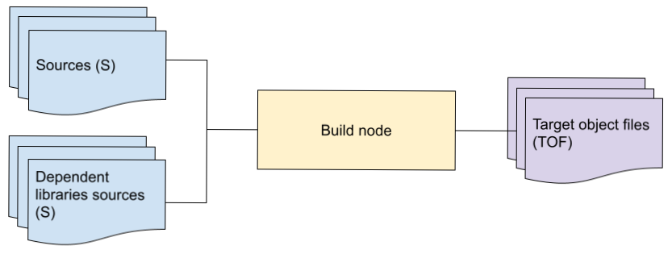



# {{ rfc.name }}: {{ rfc.title }}
<!-- SET the `rfcid` VAR ABOVE. DO NOT EDIT ANYTHING ELSE ABOVE THIS LINE. -->

## Summary

We describe the requirements which a FIDL toolchain needs to meet, and provide
direction for how this problem may be decomposed.

While a specific implementation plan is beyond the scope of this RFC, it is
expected for the tools (e.g. `fidlc`, `fidlgen_go`, `banjo`), and build rules in
the Fuchsia Source Tree (e.g. [fidl_library.gni](/build/fidl/fidl_library.gni))
to evolve to meet the requirements listed here.

Furthermore, FIDL toolchains living outside of the Fuchsia Source Tree should
align to the requirements listed here. (This RFC has no authority beyond
Fuchsia, and we therefore cannot mandate compliance, but can certainly strongly
recommend it.)

## Terminology {#terminology}

Before we start, let's define a few terms. A simplified view of the FIDL
toolchain can be summarized as follows:



The [FIDL language](/docs/reference/fidl/language/language.md) is embodied by
`fidlc`, which represents the **frontend compiler** (or **frontend** for short).
This is where all language validation occurs.

The frontend generates an **Intermediate Representation** (dubbed **JSON IR**)
for each FIDL library compiled. Despite its name, the intermediate
representation does not necessarily need to be represented as a JSON file.

From there, one or multiple **backends** processes the JSON IR in order to
generate outputs. Note that from the perspective of the FIDL toolchain, any
consumer of the JSON IR is a backend.

Most commonly, the generated output is code in a **target language** (say C++,
or Rust) which makes it possible to manipulate types, interact with protocols,
open services, and use constants. This class of backends is called **FIDL
bindings**[^1], and the code they generate should follow the [bindings
specification](/docs/reference/fidl/language/bindings-spec.md). We often use a
shorthand **fidlgen** (or `fidlgen_<suffix>`, e.g. `fidlgen_rust` or
`fidlgen_dart`) to refer to backends generating FIDL bindings. We refer to
**domain objects** as the set of classes and types in the target language used
to represent the FIDL types. As an example, the FIDL enum
[`fuchsia.fonts/Slant`](https://cs.opensource.google/fuchsia/fuchsia/+/master:sdk/fidl/fuchsia.fonts/styles.fidl;drc=f0b4f5b1c6b8941aab4b66138c57cc54693c2533;l=21)
will have a corresponding domain object in C++ (as an `enum class`) or in Go (as
a `type Slant uint32`).

[^1]: Technically, we call **FIDL bindings** the code generation tool, the
    supporting runtime libraries needed to use the generated code, as well as
    the generated code.

There are a wide variety of other backends, each with their own needs and
idiosyncrasies. For instance: [`fidldoc`] produces FIDL
documentation, such as the
[fuchsia.fonts](https://fuchsia.dev/reference/fidl/fuchsia.fonts) page;
[`fidl_api_summarize`] produces an API summary of a
FIDL library; [`fidlcat`] uses the JSON IR in order to provide run-time
introspection. From the perspective of the FIDL toolchain, the `fidlcat` tool is
a backend even though this is a very small part of what this tool actually does.

## Motivation

FIDL has been growing up. The expressibility of its toolchain has been tested.
It has not been able to meet new requirements adequately. A new expanded
toolchain is needed.

We first describe a number of these new requirements, then [follow](#design)
with approaches to support all of them.

### Whole program view {#whole-program-view}

Today, the FIDL toolchain assumes that a backend operates on a per-library
basis, and therefore only needs the JSON IR of this library to operate.

Increasingly, backends require access to more than a single JSON IR to achieve
their needs.

For instance, [`fidldoc`] needs the JSON IR of all the libraries being
documented at once in order to generate global indexes. [`fidlcat`] is in the
same boat, needing a view of all libraries to function. The [`measure-tape`]
needs the JSON IR of the libraries transitively reachable through the target
type for which a measuring tape is generated.

### Percolating metadata {#percolating}

Some backends require special metadata about the library in order to operate.
Often this metadata needs to be calculated iteratively starting from the leaves
of the library dependency tree (the "base libraries"), with the metadata
percolating to the root (the library being compiled).

For instance, [`fidlgen_rust`] [would like to know](http://fxbug.dev/61760)
whether a type may ever contain a floating point number to determine which
traits can be safely derived. A `struct` which does not contain any floating
point number could have an `Eq`, a `strict union` where none of the variants
contain any floating point number could have an `Eq`, but a `flexible table`
which currently has no floating point fields cannot have an `Eq` because
providing one would violate the source compatibility rules.

Another example comes from `fidlgen_cpp` which produces non-owning domain
objects. These domain objects can be copied safely if their inline portion is a
[value, i.e. not a resource][rfc-0057-terminology]. Here again, calculating this
metadata we call "inline resourceness" requires iteratively calculating this
value from the leaves to the root.

Recently, in discussing a new backend generating ABI fingerprints for libraries,
there was
[back-and-forth](https://fuchsia-review.googlesource.com/c/fuchsia/+/480497/40#message-be22177bf9cd5f37c2efaaf98c886d53fe10e2fa)
about where the functionality should exist. The current thinking is to host this
functionality in the `fidlc` compiler for practical reasons, but that answer is
unsatisfactory.

What we are observing is that features requiring metadata percolation are either
put on hold, worked around ([often
hackily](https://cs.opensource.google/fuchsia/fuchsia/+/master:tools/fidl/fidlgen_rust/codegen/ir.go;drc=52bfde2a65504fc962b7845cd5758d9faabf5862;l=1337)),
or turned into new compiler features, typically forcing a generalization
prematurely (e.g. the ABI fingerprints discussed above).

Furthermore, since the Fuchsia FIDL team has the ability to change the compiler
easily, we have an advantage over third-parties in this regard. As a result, we
can say that the state of the tooling hurts our open-source principle which
seeks to have all backends on a level-playing field.

### Per target language and per library backend selection

With the FIDL language used to describe the [Kernel API](/zircon/vdso/), and the
[Driver SDK in the works](/docs/contribute/roadmap/2021/stable_driver_runtime.md)
to follow, FIDL has become increasingly ubiquitous.

Today however, there is a conflation in the toolchain between "the FIDL
language" and "the backend" appropriate to process a specific library. When a
target needs Rust code for the library `fuchsia.fonts`, we invoke
`fidlgen_rust`.

This approach is too simple, and fails to describe that certain libraries need
specialized backends. For instance, `library zx;` is processed by [`kazoo`].
This per-target-per-library fidlgen selection has further ramifications. Take
the enum `zx/clock`, it is our intent for [`kazoo`] to one day generate the
currently hand-written
[zx_clock_t](https://cs.opensource.google/fuchsia/fuchsia/+/master:zircon/system/public/zircon/types.h;drc=be929e769ed3a4315e471fd4a0931fa01490db88;l=43)
typedef, along with the various `#define` materializing the members of the enum.
Should the `fuchsia.fonts` library rely on `zx/clock`, this in turn means that
`fidlgen_cpp` needs to know the API contract such that it can generate
bindings code properly bridging[^2] its code generation and `kazoo`'s.

[^2]: The C-family fidlgens would not want to generate their own domain objects
    for `zx/clock`, instead choosing to `#include` the headers generated from
    `kazoo`. Similarly, the Rust fidlgen would import the `zx` bindings
    generated by `kazoo`, instead of generating their own domain objects based
    on the `zx` library definition.

### Single library per platform {#one-per-platform}

Today, we are not opinionated about multiple definitions of FIDL libraries
having the same name. It is possible, though not advised, to define multiple
libraries `fuchsia.confusing` in various places of the source tree, and use all
these different libraries independently.

It would be more sensible to leverage the [platform identifier
concept](0083_fidl_versioning.md#formalism), which in the
Fuchsia Source Tree defaults to `fuchsia`. We can then guarantee and enforce
that no two definitions of a similarly named library ever exist.

With this restriction in mind, we refer to **a platform** as the set of FIDL
libraries sharing the same platform identifier.

### No late validation

Today, backends are not allowed to be selective about the FIDL libraries they
may or may not succeed on. It is expected that backends process any valid JSON
IR. This restriction has meant that we refrain from doing any late validation in
backends. It would be conceivable to add validation in a backend to identify as
of yet unimplemented FIDL features; another example validation would be checking
the validity of doc comments in `fidldoc` and rejecting to generate reference
documents. (In both examples, graceful degradation is what is expected.)

Allowing late validation invites an unpleasant kind of breakage-at-a-distance
(e.g. [fxbug.dev/65465](http://fxbug.dev/65465)): in a world where FIDL
libraries are provided as SDK artifacts, and integrated into downstream
repositories, the developer running the backend is likely different from the
FIDL library author. As a result, providing warnings or errors to the developer
using a FIDL library when the ability to correct things lies with the FIDL
library author is at best frustrating, and at worst a gating factor to using the
FIDL library.

The policy to disallow late validation has therefore maintained a healthy
pressure on the `fidlc` compiler to "validate all the things", and on backends
to "support all the things". This has largely avoided such
breakage-at-a-distance failures, at the cost of a position ('no validation in
backends') that lacks nuance.

### Limit access to source

Without thinking much about the long term consequences, we gradually allowed the
JSON IR to copy part of the FIDL source it came from. For instance as more
complex expressions have been added, we [exposed resolved
values](http://fxrev.dev/I7e6bb28a4392f0a43be59f236a3222bb662ebb96)
to allow backends to emit constants, while also retaining the expression itself
(the text) in the IR. While having the expression text is useful to generate
meaningful comments in the generated code, it opens the door to reducing privacy
of SDK publishers -- those who publish FIDL artifacts -- since they cannot
readily choose to provide source or not.

It is easy to imagine a future where this path leads to more of the FIDL source
ending up in the IR, which is not a desirable outcome: this is both duplicative,
and can lead to a potential breach of privacy boundaries.

Instead, we aim to design the FIDL toolchain to include no more source than is
necessary. For the rare backends that do need source access (e.g. `fidl-lsp`),
we rely on references to spans. See [details in the design
section](#ir-does-not-contain-source).

Note: We choose to disallow tools or APIs for source manipulation today, though
we keep the door open to revisit this in the future. The source language has
changed and evolved. Keeping the IR and the downstream ecosystem thriving is
already a large amount of scope (pragmatically speaking, i.e. number of people
making changes to support this area). As the source language stabilizes,
allowing tools or APIs to do direct source manipulation is something we might
look at (e.g. [fxbug.dev/75672](http://fxbug.dev/75672)), and work to enable.

### Scaling compilation {#scaling-compilation}

For simplicity reasons, the `fidlc` compiler was initially designed to operate
on sources only, i.e. `.fidl` files. When libraries have dependencies,
compilation of the library requires compilation of all of its dependencies,
transitively.

For instance, when compiling the `fuchsia.fonts` library, we must also compile
the `fuchsia.mem` and `fuchsia.intl` libraries, and such transitively. This
means that today's compilation is wholly inefficient. Core libraries such as
fuchsia.mem are recompiled numerous times. This architectural inefficiency has
never been an issue: there are just over 64K LoC of FIDL source in the SDK
today, and with relatively shallow transitive dependencies, this inefficiency is
not acutely felt.

However, when thinking about our "ideal" FIDL toolchain, we wish to align with
standard practices in compiler design. It is traditional for a compiler to take
in inputs such as source files, and produce outputs, such as x86 assembly. As
code bases grow, there is an additional requirement on compilers to be able to
provide some sort of partitioning of the work, such that small updates to the
inputs do not require a re-compilation of the whole codebase.

Consider for instance the `javac` compiler: if you change the condition of a
`for` loop in some file `SomeCode.java`, it would be unexpected to have to
recompile thousands of files to be able to run the program again. Instead, you
re-compile just that single file, and can re-use all other pre-compiled
sources (as `.class` files).

In order to successfully partition the work, a standard approach is to define a
compilation unit (e.g. a library for FIDL), and produce an intermediary result
(e.g. JSON IR), such that the inputs of the compilation process are both sources
and intermediate results of direct dependencies. This makes it possible to limit
total compilation time (assuming infinite parallelism) to the dependency chain
which is the longest to compile. This also simplifies build rules, a topic [du
jour](http://fxbug.dev/75125).

## Design

We split the design in three parts:

1. First, [guiding principles](#guiding-principles) to inform design choices,
   and anchor the approach and path taken;
1. Description of a [canonical FIDL toolchain](#canonical-toolchain) as an
   example of how to decompose building FIDL to account for all requirements
   described;
1. Lastly, some [specific cleanups](#eating-our-broccoli) which the Fuchsia FIDL
   team will make to align the core tooling with this RFC's guidance.

Note: A key enabler to a saner toolchain as described here is a well structured
IR (see some of the [guiding principles](#guiding-principles) below). The
current IR has organically evolved, experimental features became core (though
not used outside of the Fuchsia Source Tree). While the current IR supports the
use cases we have ([mostly](http://fxbug.dev/64992)), decisions about its shape
have been made in the moment, all the while requirements have grown steadily.

### Guiding principles {#guiding-principles}

#### The IR should readily accommodate common backends {#ir-accommodates-backends}

While complex backends should be possible (e.g. [whole program
view](#whole-program-view)), the IR must be designed such that common backends
can be built by only processing the single IR for the library being processed.

Experience has shown that most backends are somewhat simple. Catering to simple
use cases (as opposed to expert use cases) ensures that we go the extra mile to
simplify the IR where possible, and in so doing, put our best foot forward to
ensure a thriving backend ecosystem.

To exemplify this principle, consider the "type shape" calculation done in
`fidlc`. It would be conceivable to instead move this to a dedicated
[percolating](#percolating) backend. However, this would force all backends
generating target code – the main use case – to rely both on the IR and this
"type shape" backend.

#### The IR should be minimal {#ir-should-be-minimal}

Striving for minimality is an important countermeasure to readily accommodating
common backends, as it would be easy – or tempting – to "include all the things"
and consider the work done.

To exemplify this principle, consider the current anti-pattern of calculating a
"declaration order" in `fidlc`. Only a few backends rely on this order
(C-family, and even less everyday), and it puts undue complexity in the
compiler. It also muddies the water as to why such an order is needed, and has
often caused confusion. This is also inflexible since backends ought to evolve
independently from the core compiler – this has been a [hindrance to progress on
supporting recursive types](http://fxbug.dev/35218) for instance.

#### The IR must not contain source {#ir-does-not-contain-source}

The IR should not contain any more source than is strictly necessary to readily
accommodate common backends (e.g. names). The IR may provide source span
references where appropriate. A source span reference is a triplet:

    (filename, start position, end position)

Where a position is a tuple `(line number, character number)`.

Backends should not rely on access to source to operate. When backends must have
access to source to operate (e.g. `fidl-lsp`), they must clearly state this
requirement and gracefully fail should access to source not be available.

In choosing this decomposition, we are explicitly choosing to provide SDK
publishers – those who publish FIDL artifacts – the choice to include source
FIDL or not. Currently, this choice is not completely theirs since parts of the
source ends up in the IR.

Beyond names, a notable part of the source which is present in the IR are
[documentation comments](0055_documentation_comments.md). These
comments are by specification meant to be part of the API, i.e. FIDL library
authors explicitly opt-into making these comments public. Furthermore, most
backends use these documentation comments (e.g. to emit comments in generated
code), thus falling under the [readily accommodating common
backends](#ir-accommodates-backends) principle. These documentation comments do
not appear in the comment as raw source, but rather are preprocessed a bit
(leading indentation, `///`, and whitespace left trimmed). As [briefly
explored](http://fxrev.dev/I81c480acf89194e0cc0280028932672f606be4b9), we intend
to further process doc comments in the future.

#### Backends are treated equally {#backends-are-equal}

The FIDL language, its implementation as the `fidlc` compiler, and the
definition of the intermediate representation should be designed to allow an
inclusive backends ecosystem, where all backends, whether built as part of the
Fuchsia project or not, are on an equal footing.

In choosing this dividing line, we are explicitly making a choice to avoid
expediency for short term needs of the Fuchsia FIDL team owned backend, instead
focusing on the long term viability of the FIDL ecosystem.

#### Backends are not fallible {#backends-are-not-fallible}

A backend must succeed when processing valid IR. Backends may fail if they
encounter issues in their environment (such as filesystem access error) or if IR
is invalid.  If a backend cannot process IR that conforms to the IR schema, it
must not fail with an error.

In choosing this dividing line, we are explicitly forcing all validation to
occur in the frontend, i.e. validation must be elevated to being a FIDL language
restriction. This is important for two reasons:

1. A corollary of this rule is that given a valid IR, all backends compatible
   with this IR can be used. This means that as an SDK publisher, ensuring
   successful compilation of FIDL libraries guarantees the use of these
   libraries for all consumers who use a version of the FIDL toolchain
   compatible with the one used by the publisher.
1. From a language design standpoint, this very strict requirement is a
   beneficial forcing function to keep language design in check with the needs
   of backends. For instance, a careful backend owner requiring validation for
   some reason would raise this issue (fidl-dev@fuchsia.dev or through an RFC)
   to the Fuchsia FIDL team for possible inclusion in the language
   specification. This could lead to improvements to the language, which all
   would benefit from, or a possible rework of the backend to better align with
   the FIDL toolchain principles.

To exemplify this principle, consider trait derivation in Rust: the `Eq` trait
cannot be derived for types containing floating point numbers. It would be
tempting to add an attribute `@for_rust_has_floats` to types in FIDL containing
floating point numbers (`float32` or `float64`), and then leverage this
attribute in `fidlgen_rust` to both conditionally emit the `Eq` trait, and
verify that the attribute is properly used (in a similar fashion to the
[value-resource
distinction](/docs/contribute/governance/rfcs/0057_default_no_handles.md)). But
this temptation goes against the principle, as it implies `fidlgen_rust` is
fallible. Validating a niche attribute like this in `fidlc` is not desirable
either, since it leads to FIDL being complicated by a myriad of target language
specific concerns.[^3]

[^3]: Currently we cannot justify adding a `@has_floats` attribute (or
    `has_float` modifier) to FIDL because the only use case is in
    `fidlgen_rust`, and even there it's not a significant problem. If those
    things change (e.g. several other backends have an analogous
    `PartialEq`/`Eq` problem), it might be justified.

### Canonical FIDL toolchain {#canonical-fidl-toolchain}

A canonical FIDL toolchain is centered around the library decomposition, and
will have two kinds of build nodes.

#### Percolating build nodes

A **percolating node** is provided sources of the library and object files of
direct dependencies of the library to the tool, and generates an end result and
target object files.



As an example, most fidlgen backends follow this pattern today: their sources
are JSON IR, and their end result is generated code. They do not have dependent
object files (DOF) nor do these tools produce target object files (TOF).

Another example is the planned [ABI
fingerprinting](https://fuchsia-review.googlesource.com/c/fuchsia/+/480497/27#message-be22177bf9cd5f37c2efaaf98c886d53fe10e2fa)
tool which needs to calculate structural properties of types. This tool will
consume JSON IR (source), and will generate both an ABI summary (end result),
and an accompanying target object file (TOF). When operating on a library which
has dependencies, it will consume the TOF of those libraries, i.e. its DOF,
along with the JSON IR to generate the next end result. It may well be that the
end result and TOF differ only in their format, for one is meant to be read by
humans, and the other parsed by tools.

#### Whole view build nodes

A **whole view node** is provided sources, including all transitively reachable
dependent libraries to the tool being invoked, and generates an end result.



As an example, the [`measure-tape`] requires the IR of all transitively
reachable libraries required to define the type being compiled, and would
naturally be expressed as a whole view node. Today, the `fidlc` node operates as
a whole view node since it needs access to all sources to operate (see [scaling
compilation](#scaling-compilation) for details). Both [`fidlcat`] and
[`fidldoc`] need a whole view with a dependency on the whole [fuchsia
platform](#one-per-platform) being compiled.

While it is true that a whole view node is less efficient than a percolating
node, we may not want to restructure all tools to operate in a percolating way,
choosing instead to push some complexity into the build system.

In the Fuchsia Source Tree build, we produce an [all_fidl_json.txt
file](https://cs.opensource.google/fuchsia/fuchsia/+/master:build/fidl/BUILD.gn;drc=0cfc03b2b71fd96d243ae04cdc11e869761b2323;l=17).
With clearer requirements about whole view nodes in mind, we can better
structure this aggregate. For instance, by organizing this aggregate [by
platform](#one-per-platform), recording for each library its sources, JSON IR,
and direct dependencies, we can easily leverage this aggregate to rapidly
produce the inputs needed for whole view tools. This aggregate would also be
leveraged by developer tools such as [`fidl-lsp`] or [`fidlbolt`].

#### Tool selection

Tool selection in a given build node should depend on the target (e.g. "generate
low level c++ code"), as well as the library being compiled (e.g. "library zx").
We define the total function taking a tuple (target gen, library) and returning
a tool (e.g. [`kazoo`] or `fidlgen_cpp`) to be a global configuration of the
toolchain.

For instance, in the Fuchsia Source Tree we would expect the configuration:

```
(*, library zx) → kazoo
(low_level_cpp, not library zx) → fidlgen_llcpp
(high_level_cpp, not library zx) → fidlgen_hlcpp
(rust, not library zx) → fidlgen_rust
(docs, *) → fidldoc
```

With the [unified C++
bindings](/docs/contribute/roadmap/2020/overview.md#unifying-fidl-cpp-bindings),
this configuration would change to:

```
(*, library zx) → kazoo
(cpp, not library zx) → fidlgen_cpp
(rust, not library zx) → fidlgen_rust
(docs, *) → fidldoc
```

#### Impact on incremental compilation

When looking at incremental compilation, i.e. the pursuit of doing the least
amount of work in response to source changes by combining existing compiled
artifacts with newly compiled artifacts, both kinds of nodes described here fare
quite differently.

In general, a node in a compilation graph needs to be invoked when one or more
of its sources (also called its "source set") changes.

Percolating nodes have a much smaller source set than whole view nodes, their
source set are direct 'sources' and target object files (TOF). With that said,
their percolating behavior (if leveraged) will propagate a source change to a
TOF change, which in turn will change the source set of dependent percolating
nodes. As an example, imagine that the `fidlgen_rust` backend is augmented to
also produce a TOF `fuchsia.some.library.fidlgen_rust.tof`. When one library is
changed, if its TOF changes as well, then all dependent libraries will also need
to change thus resulting in more invocations to the `fidlgen_rust` backend (and
so on so forth).

Compared to percolating nodes, whole view nodes have much wider source sets.
There are two broad categories of whole view nodes, the ones depending on all
transitive dependencies (think `measure-tape`) and the ones depending on all
libraries in a platform (think `fidldoc`). As a result, any change will likely
result in these nodes requiring to be invoked.

The incremental compilation cost of whole view nodes is a double whammy, these
nodes need to be ran more often, and they do more work since they look at more
sources. With a bit of work -- someone famously said "a simple matter of
programming" -- any backend requiring a whole view can be evolved to operate as
a percolating node. A healthy pressure to consider such evolution, which
typically comes with much complexity and maintenance burden, is to consider the
speed benefit to incremental compilation, and to venture on that path when the
cost is unbearable.

Beyond the incremental compilation cost of the toolchain itself, there are also
downstream impact to consider. Since most of the toolchain generates source code
(e.g. C++, Rust, Dart), it tends to be closer to the root of the overall build
graph such that any changes to the output of the toolchain (say a change to a
generated C++ header) will have a large impact on downstream compilation (e.g.
all code depending directly or transitively on this generated C++ header).
Minimizing changes to generated sources should therefore be sought. For
instance, canonicalizing the output of generators (by avoiding changes to
non-meaningful whitespace characters), or comparing the output to a cached
version to avoid overwriting content with the same content thus avoiding a
timestamp only change (see [GN outputs for example
details](https://gn.googlesource.com/gn/+/refs/heads/main/docs/reference.md#target-declarations-action_declare-a-target-that-runs-a-script-a-single-time-outputs)).

### Cleaning legacy tech debt, and avoiding more {#eating-our-broccoli}

Following the principles described here, we will be moving the C bindings and
coding table generation out of `fidlc`. Embedding these two generations in the
core compiler was done due to historical build complications.

We also plan to remove the "declaration order" from the IR, instead pushing any
special ordering down to specific backends.

As described in [scaling compilation](#scaling-compilation), the FIDL compiler
`fidlc` will evolve to partition the work by requiring only outputs from direct
dependencies (possibly the JSON IR itself), rather than sources of all
transitive dependencies.

Lastly, we will avoid accruing more technical debt and instead focus on
aligning our work with the direction described here. As an example, the next
backend being considered, ABI fingerprinting, will be a percolating backend
rather than being embedded in the core compiler.

## Prior art

Compare/contrast this to C++ compilation: a C++ compiler typically takes in one
C++ source file and produces one object file. At the final program assembling
stage called "linking", the linker combines all object files into one binary.
This approach works because when compiling one C++ source file in isolation, the
compiler sees function declarations about external functions in other C++ source
files that the current file depends on, through the use of headers. Similarly,
our current JSON IR provides minimal information about foreign library types,
akin to a function declaration.

However, this C++ compilation model fared poorly when deeper optimization is
desired: when the compiler can only look at the declaration, it has to be very
conservative about the actual behavior of the function (e.g. does it always
terminate? does it mutate pointer X? does it retain pointer Y thus letting it
escape?). Similarly in FIDL, our code generation backends might be able to
generate more concise and better code, if it is able to know more about the
referenced foreign types. In the case of [resourceness][rfc-0057-terminology] and source compatibility,
our requirements led to the effect that the backends cannot generate correct
code, unless they know the resourceness of all referenced foreign types.

To address this problem, in C++, various compiler implementations started
injecting more and more auxiliary data into the object files. For example, both
GCC and Clang developed their own serializable IR format expressing more on the
behavior of those C++ functions, and packaged those alongside their assembly.
The linker would consume both the assembly and IR, and generate better code
(called Link Time Optimization). In FIDL, because various backends might need
different knowledge about the foreign types, it can be advantageous to decouple
the "auxiliary data" from the "object files", i.e. generate backend-specific
sidecars next to the main JSON IR. It is true that resourceness is a common
attribute that many backends desire. But in the future, LLCPP for example would
ideally want to also know whether a type transitively contains out-of-line
objects when generating code to close handles (and similarly for encode and
decode); Rust would like to determine whether a type transitively contains
floats to derive Eq in more situations (though a compiler guarantee would be
required to avoid source-compatibility issues).

## Documentation

This RFC serves as the basis for improved documentation of the FIDL toolchain,
and toolchain authors are encouraged to properly document the build rules they
provide.

## Implementation

As noted.

## Performance

No impact to performance, this RFC describes requirements and a problem
decomposition which is already achieved, albeit not as cleanly.

## Ergonomics

Not applicable.

## Backwards Compatibility

Not applicable.

## Security considerations

No security considerations.

## Privacy considerations

Improvement to privacy due to a clearer [separation of source from IR](#ir-does-not-contain-source).

## Testing

Standard testing of the toolchain.

## Drawbacks, alternatives, and unknowns

As noted in text.

<!-- link labels -->
[`fidl_api_summarize`]: /tools/fidl/fidl_api_summarize/
[`fidl-lsp`]: https://fuchsia.googlesource.com/fidl-misc/+/refs/heads/master/fidl-lsp/
[`fidlbolt`]: https://fuchsia.googlesource.com/fidlbolt/
[`fidlcat`]: /tools/fidlcat/
[`fidldoc`]: /tools/fidl/fidldoc/
[`fidlgen_rust`]: /tools/fidl/fidlgen_rust/
[`kazoo`]: https://cs.opensource.google/fuchsia/fuchsia/+/main:zircon/tools/kazoo/;l=1;drc=88b44300a8dde40311094c4db1b1fa061a42dfa2
[`measure-tape`]: /tools/fidl/measure-tape/
[rfc-0057-terminology]: /docs/contribute/governance/rfcs/0057_default_no_handles.md#terminology
