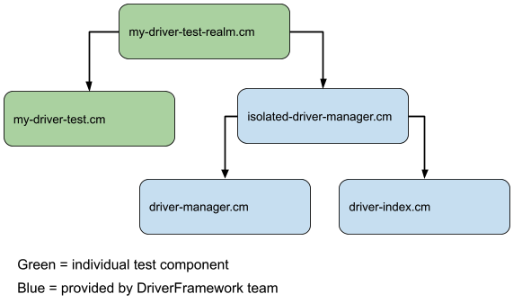
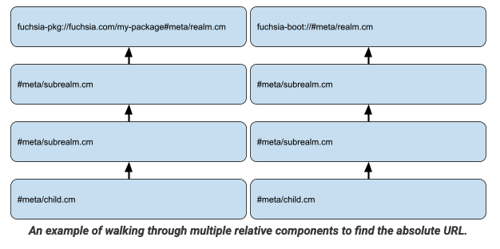

<!-- mdformat off(templates not supported) -->




# {{ rfc.name }}: {{ rfc.title }}

<!-- SET the `rfcid` VAR ABOVE. DO NOT EDIT ANYTHING ELSE ABOVE THIS LINE. -->

<!-- mdformat on -->

<!-- This should begin with an H2 element (for example, ## Summary).-->

## Summary

This is a proposal to add relative component URLs to the Component Framework. A
relative URL follows the
[URL RFC 3986](https://datatracker.ietf.org/doc/html/rfc3986#section-4.2)
specification. The initial relative URL implementation only supports having a
fragment, it will not support a relative URL with a host or package. A relative
URL is relative to the component's closest ancestor with an absolute URL. The
relative URL resolver will resolve relative URLs at runtime to determine the
correct host and package by finding the component's closest ancestor with an
absolute URL.

## Motivation

The lack of relative URLs hurts the re-usability of components. Components
should be able to be included and used in new packages without modification.
However, when a component declares its children using absolute URLs, those
children will always have to be resolved out of the absolute package. This can
cause problems if the parent URL is re-used in a different package, as now the
parent and children are located in different packages. A relative URL says 'I
would always like this component to be resolved out of the same package', which
promotes hermeticity and reuse.

Using relative URLs is especially helpful in testing where hermeticity is
important, and where components are often being re-used in new, test packages.

Another benefit is that relative URLs are convenient. The component author does
not need to repeat the package name multiple times, and there is less room for
errors caused by typos.

### Example: Isolated-Driver-Manager

Let's take a look at a specific use case. The Driver Framework team would like
relative URLs to make it easier to write isolated driver integration tests.

Below is an example topology of such a test:



The Driver Framework needs multiple test components working together for an
integration test. All of these components should be loaded out of the test
package so that they can be updated together, and can access the test drivers
that live within the test package.

Without relative URLs, the `isolated-driver-manager.cm` would have to be edited
for each new test so that it could point to the local `driver-manager.cm` and
`driver-index.cm` for that test package. Eg, it would point to:

- `fuchsia-pkg://fuchsia.com/my-test-package#meta/driver-manager.cm`
- `fuchsia-pkg://fuchsia.com/my-test-package#meta/driver-index.cm`

With relative URLs, `isolated-driver-manager.cm` does not have to be edited for
each new test, it simply uses the relative URL syntax, like the following:

- `#meta/driver-manager.cm`
- `#meta/driver-index.cm`

It is worth noting that currently the CFv2 IsolatedDevmgr generates the
top-level realm at build-time so that it can insert the correct package name.


## Design

### The format of relative URLs

Relative URLs follow the format outlined in
[URL RFC 3986](https://datatracker.ietf.org/doc/html/rfc3986#section-4.2).
The relative URL will be rebased onto the closest ancestor that has an
absolute URL.

For the initial implementation, relative URLs will only support having a
fragment. Relative URLs that declare query parameters, paths, or host
names will not be supported initially. These may eventually be supported.

As an example:

**Relative URL:**

```
#meta/child.cm
```

**Closest Ancestor with absolute URL:**

```
fuchsia-pkg://fuchsia.com/my-package/0/?hash=1234#meta/parent.cm
```

**Resolved URL:**

```
fuchsia-pkg://fuchsia.com/my-package/0/?hash=1234#meta/child.cm
```

### The relative resolver

The RelativeResolver will be the resolver for relative URLs. Resolvers are
currently declared for a specific URL scheme; the RelativeResolver will be the
resolver for the empty scheme "". RelativeResolver will be implemented in
component_manager. When the RelativeResolver is resolving a component, it will
walk up the ancestors of that component to find the first ancestor whose
component URL is not relative. The resolver will then rebase the relative
URL onto the absolute URL. This is done by copying the absolute URL and
replacing the fragment section with the relative URL's fragment. The
RelativeResolver will then make a resolve request for the rebased URL, which
will be handled normally.

An example of walking through multiple relative components to find the absolute
URL.



Here are the steps for RelativeResolver to resolve `#meta/child.cm`:

1. Walk the ancestors until we find the first absolute URL

- The first absolute URL is fuchsia-pkg://fuchsia.com/my-package#meta/realm.cm

2. Create our absolute URL by rebasing the relative URL onto the absolute URL.

- Our absolute URL is fuchsia-pkg://fuchsia.com/my-package#meta/child.cm

3. Send out a resolve request for our absolute URL

- In this case our request will be handled normally by the fuchsia-pkg resolver

4. Return the result of our resolve request

## Implementation

The plan is to implement the RelativeResolver as a built-in resolver that is
provided by the component manager. The RelativeResolver will be added into the
root component's [environment](/docs/concepts/components/v2/environments.md), so
that it can be used by any component that extends from that environment.

## Performance

This should have minimal impact on performance. The RelativeResolver is
implemented internally in Component Framework and can do the ancestor walk
and full URL resolution without making any IPC calls.

## Security considerations

This should have minimal impact on security. Extra care needs to be taken
that relative URLs are parsed and rebased correctly.

## Privacy considerations

This will have no impact on privacy.

## Testing

The relative resolver will have unit tests, and an integration test will be
added which uses relative URLs.

## Documentation

Additional documentation will be added to the Component Framework URL
documentation.

## Drawbacks, alternatives, and unknowns

### Alternative: CML templates that resolve relative URLs at Build time

An alternate way to accomplish a relative URL is to template CML files such that
the relative URL is resolved at build time and the absolute URL is placed in the
compiled CM file.

This has several pros:

- It does not require changing the framework runtime. The runtime only deals
  with absolute URLs.
- Relative URLs are resolved at build time, which makes post-build analysis
  easier as nothing is resolved at run time.

This also has several cons:

- CML in general does not want
  [templating](/docs/contribute/governance/rfcs/0093_component_manifest_design_principles.md).
- Adds more integration between build systems and cmc.
- Build system integration becomes more complicated as out-of-tree components
  can be built with different build systems.
- Unclear how this would work if a package contains pre-built components.

### Alternative: Relative Resolver Component that reads from /pkg

An alternative way to accomplish relative URLs is to have a relative-resolver
component that reads from /pkg to resolve the URLs.

Pros:

- The resolver functionality is not implemented in Component Framework, making
  it more modular

Cons:

- Every component that wanted a relative resolver would need to include the
  Relative Resolver component in their package and wire it correctly in their
  CML files
- This goes against future Component Framework security efforts where components
  will not have full access to /pkg, but only have access to their component
  files.

### Alternative: Relative URLs have "relative://" scheme

We could have a specific scheme for relative URLs. This would make
parsing URLs slightly easier as all supported URLs will be 'valid'
full URLs.

Pros:

- Easier URL parsing

Cons:

- Not consistent with the URL specification

## Prior art and references

The URL specification defines relative URLs in
[URL RFC 3986](https://datatracker.ietf.org/doc/html/rfc3986#section-4.2).
Using this exact specification is considered in the alternatives section.
