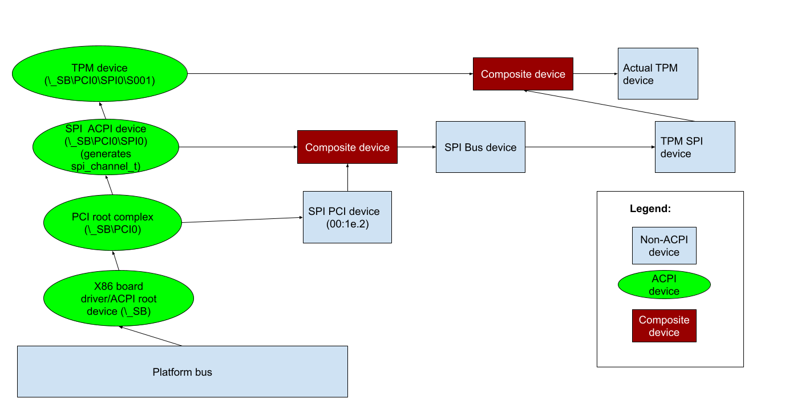

<!-- mdformat off(templates not supported) -->


# {{ rfc.name }}: {{ rfc.title }}
<!-- SET the `rfcid` VAR ABOVE. DO NOT EDIT ANYTHING ELSE ABOVE THIS LINE. -->

<!-- mdformat on -->

<!-- This should begin with an H2 element (for example, ## Summary).-->

## Summary

The Advanced Configuration and Power Interface (ACPI) is used on most x86
platforms to provide information about device topology, configuration, and
provide power management functionality to the OS. Fuchsia's ACPI support is
currently very limited: no support for ACPI devices which are enumerated by
another bus driver (e.g. PCI), and no support for devices accessing
device-specific configuration or power management methods outside of the x86
board driver.

This RFC introduces a mechanism for publishing composite devices consisting of
both an ACPI device and a bus (i.e. I2C, SPI, PCI) device. It also adds support
for using a wider range of ACPI functionality (receiving events, accessing
configuration, and calling methods) outside of the x86 board driver.

## Motivation

Currently, all supported ACPI-only devices (i.e. not on the PCI bus) are
enumerated in a [single if/else statement][acpi_ifelse]. Devices that require
access to other ACPI data (e.g. data from \_DSD) are either part of the x86
board driver, [hard code the data][acpi_hardcoded], or use device-specific
[hacks][acpi_device_hacks] to give devices the data they need to configure
themselves.

Note that _x86 board driver_ is a misnomer: not all x86 platforms necessarily
use ACPI. A better term might be _PC board driver_ -- a board driver for the IBM
PC platform. For simplicity's sake, we continue to refer to the driver as the
_x86 board driver_. While this RFC attempts to outline a reasonably generic
approach to ACPI that would be applicable to both x86 and ARM in the future, the
primary focus of the RFC is changes to the x86 board driver, and future ARM ACPI
work would likely require a separate board driver.

This way of doing things isn't scalable. As we want to support more devices,
we'll run into cases where our hardcoded values conflict with one another, or
the number of drivers in the x86 board driver will become huge. This RFC will
allow us to add more x86 platform and power management support without taking on
more technical debt in the board driver.

## Design

Every existing device on x86 will be given a corresponding _ACPI device_ (so
long as the device has an entry in the ACPI tables). Each ACPI device will be
published by the x86 board driver and will provide access to the device’s ACPI
configuration and methods. The x86 board driver will also publish composite
devices, which are children of the "real" device and the ACPI device. Rather
than binding directly to the "real" device, a driver that wishes to use one of
these devices will then bind to the composite device. The board driver will also
discover devices on statically enumerated buses (i.e. I2C, SPI), and publish
metadata informing the bus driver of the number of child devices it has.

A limited set of devices will also be given access to more dangerous ACPI
operations like acquiring the ACPI global lock. In practice, not many devices
require access to this functionality, so it will only be exposed to a set of
devices allowlisted in the x86 board driver.

Below is an example of what a single branch of the device tree might look like,
for a TPM device connected via a SPI bus.



## Implementation

### Discover device relationships and publish ACPI devices on the system.

When discovering ACPI devices, we need to determine if a given device is a bus
driver, and if it is, what kind of bus it is. This information is important
because it allows us to determine how composite devices added in the next step
should bind with their ACPI and real counterparts. ACPI doesn't have a simple
way of determining these two properties from a device, and nor does it guarantee
that devices on a bus will be children of the bus. These necessitate splitting
the device discovery and publishing process into three stages:

1.  Discover devices in the tree, setting up a mapping of the device’s ACPI
    handle to its internal representation, which includes information needed
    when we finally publish the device, like its parent device, its handle, and
    its bus type.
2.  For each device, check its \_CRS (“Current Resources”) to see if it has an
    I2C/SPI/etc resource. If it does, get the handle to the bus device
    (specified in the resource), look up that handle in the mapping from step 1,
    and tell it about its new child device and bus type.
3.  Publish all devices in the order they were discovered in step 1, including
    information relevant to the device's bus as bind properties (e.g. PCI
    bus:device.function) also creating bus IDs for each bus device. This is
    important because we’ll need to distinguish between, e.g. two I2C devices at
    the same address on different buses.

### Publish composite "ACPI + real" devices.

In order to access resources provided by the bus that a device exists on and
configuration methods provided by ACPI, we need to create composite devices
consisting of the "real" device published by the bus driver, and the ACPI device
published by the x86 board driver.

Using the information gathered in the previous stage of implementation, the
board driver will do one of two things, depending on the bus the device uses:

1.  For buses that are enumerated at runtime (e.g. PCI, USB): provide
    information about devices that are known by ACPI via a protocol-specific
    mechanism (e.g. for PCI, this will be a list of bus:device.functions
    returned as part of Pciroot's `GetPciPlatformInfo()` call). The bus driver
    will then be responsible for publishing composite devices that bind to the
    ACPI device and the "real" device published by the bus driver.
2.  For buses that are not enumerated at runtime (e.g. I2C, SPI): the ACPI
    driver will publish composite devices, and use existing mechanisms (e.g.
    DEVICE_METADATA_I2C_CHANNELS) to inform the bus driver of their children. In
    this case, the bus driver only publishes a device that is bound to by a
    composite fragment. The x86 board driver publishes the composite device.

The reason for this separation of responsibilities is that for
runtime-enumerated buses like PCI, device drivers use information that is
provided by the bus driver to bind (e.g. vendor and device IDs). Publishing
these composites from the x86 board driver would involve devising a mechanism
for gathering this information from the bus driver.

Similarly, other buses like I2C and SPI don't have information that device
drivers want to bind against. They typically only know enough information to
address the device (e.g. an I2C address, a SPI chip select number), but not what
kind of device is attached to the device. This information is instead present in
the ACPI tables as hardware or compatible IDs. Publishing these composites from
the bus driver in a useful manner would therefore involve telling the bus driver
information which it doesn't really need (the HID and CID).

#### Example bind programs

For the first case, the x86 board driver will tell the bus which devices need to
be made composite, and the bus driver will publish a composite device with two
fragments. For instance, the PCI bus driver might publish a composite device
with two fragments. The first would bind to the device on the PCI bus, with a
bind program similar to:

```
BIND_PROTOCOL == PCI
BIND_PCI_TOPO == 0x5a
```

The second would bind to the equivalent device published by the ACPI bus:

```
BIND_PROTOCOL == ACPI
BIND_ACPI_BUS_TYPE == PCI
BIND_PCI_TOPO == 0x5a
```

For the second case, the x86 board driver will use information it knows about
each bus to create the two fragments, similar to above. For instance, an I2C
composite device would bind to its I2C parent with a bind program similar to:

```
BIND_PROTOCOL == I2C
BIND_I2C_ADDRESS == 0xaa
BIND_I2C_BUS_ID == 0
```

and the corresponding ACPI bind program would look like:

```
BIND_PROTOCOL == ACPI
BIND_ACPI_BUS_TYPE == I2C
BIND_I2C_ADDRESS == 0xaa
BIND_I2C_BUS_ID == 0
```

### Expose ACPI events, configuration, and methods over FIDL

The x86 board driver uses the ACPICA library to interface with ACPI. We will
expose a subset of the ACPICA library to each device as a FIDL interface (we may
want to expose more in the future, but this covers everything used by all
in-tree drivers at the time of writing):

*   `AcpiEvaluateObject` - which allows devices arbitrary access to evaluate
    methods in the tree, either to control device state or get configuration
    information. We will restrict devices to evaluating methods on itself and
    its children.
*   Event handlers - ACPI supports three event types: Fixed Events, General
    Purpose Events, and Device Object Notifications. All three are broadly
    similar: Devices can enable/disable events and install an event handler
    which is called when an event is received. We'll expose enable, disable, and
    install method calls over FIDL - remove will be implemented implicitly by
    closing the device end of the channel passed to install.
*   Address space handlers - very similar to event handlers, and will be handled
    in a similar way.

There is one more dangerous mechanism that we are going to restrict to a
separate FIDL protocol exposed only to allowlisted devices,
`AcpiAcquireGlobalLock`. This is currently only used by the `acpi-ec` driver,
and it doesn't appear to be widely used outside of the EC. We'll allowlist this
based on HID, starting with only the ACPI EC HID.

### Migrate drivers

At this stage, we'll be ready to start migrating drivers to use ACPI. For
drivers currently in the x86 board driver, this will involve a rewrite to use
the new ACPI-over-FIDL protocol. For drivers outside of the x86 board driver,
such as the Intel I2C driver or I2C HID driver, this will be relatively simple -
replacing existing hardcoded configuration values with new values determined
from ACPI.

## Performance

The performance impact is expected to be minimal. Most of the new overhead will
come from drivers currently in the x86 board driver being moved to their own
drivers and being forced to do IPC to interact with ACPI.

## Security considerations

*   **ACPI methods can do anything** - ultimately, even with the scoping
    outlined above, an ACPI method can do anything it wants (e.g. power off
    hardware at an inopportune moment), and any driver that has access to call
    that method can therefore do anything it wants. As a result, we need to
    trust any drivers that use ACPI (and the ACPI tables themselves). This is no
    change from the status quo, where all ACPI drivers are in the board driver.
    Also note that all board drivers are equally privileged, and the board
    driver may be externally provided (i.e. not written and built in
    fuchsia.git). Better auditability and controls are likely problems for the
    future.

## Privacy considerations

None.

## Testing

We'll rely heavily on unit tests for testing the board driver implementation,
since ACPI assumes access to the entire system. These unit tests will verify all
functionality works as expected (e.g. bus type inference, device discovery,
etc.). We'll also include tests to make sure that all the FIDL methods
implemented by the ACPI device are implemented correctly.

Device drivers will be able to mock out the new ACPI FIDL protocol fairly
easily, which will allow us to write unit and integration tests for device
drivers that previously could not be tested (or were difficult to test).

## Documentation

The FIDL ACPI protocol will contain documentation on how to use it and its
limitations. Some documentation will need to be written explaining the
"ACPI+real" composite model for devices on ACPI systems, and how drivers should
handle binding in that scenario.

## Drawbacks, alternatives, and unknowns

### No support for arbitrary bus types

Support for new bus types on x86 systems that are exposed via ACPI will require
modifications to the x86 board driver. This is unfortunately a limitation of the
way ACPI is implemented: there is no support for "generic" or "unknown" buses.
We expect the maintenance burden of this to be relatively small, and easily
offset by the gains from being able to access ACPI tables outside the board
driver.

## Prior art and references

*   [The ACPI specification, v6.4](https://uefi.org/sites/default/files/resources/ACPI_Spec_6_4_Jan22.pdf)
*   [Acpi.sys: The Windows ACPI Driver](https://docs.microsoft.com/en-us/windows-hardware/drivers/kernel/acpi-driver)

[acpi_ifelse]: https://cs.opensource.google/fuchsia/fuchsia/+/master:src/devices/board/drivers/x86/acpi-nswalk.cc;l=405;drc=acc84a025add2af44fec6cf135c94e6a1bec3ce7
[acpi_hardcoded]: https://cs.opensource.google/fuchsia/fuchsia/+/master:src/devices/i2c/drivers/intel-i2c/intel-i2c-controller.cc;l=147;drc=c394e3151269fd495bcdf6e694c023e74ffa1782
[acpi_device_hacks]: https://cs.opensource.google/fuchsia/fuchsia/+/master:src/devices/board/drivers/x86/acpi-nswalk.cc;l=335;drc=acc84a025add2af44fec6cf135c94e6a1bec3ce7
