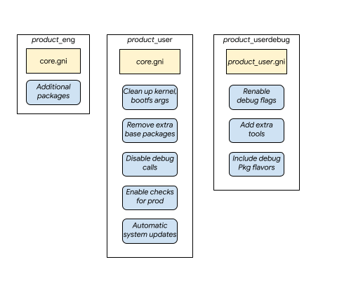

<!-- mdformat off(templates not supported) -->


# {{ rfc.name }}: {{ rfc.title }}
<!-- SET the `rfcid` VAR ABOVE. DO NOT EDIT ANYTHING ELSE ABOVE THIS LINE. -->

<!-- mdformat on -->

## Summary

This document describes the different product build types for Fuchsia:
`eng`, `userdebug`, and, `user`.

A build type in Fuchsia refers to build time and runtime settings for a
[product configuration][doc-products]:

 * Build time settings include packages, tools, signing configuration,
   and flags that define system behavior.

 * Runtime settings include flags passed to the running kernel or software
   modulating runtime behavior based on the build type.

The intent of this document is to formally ratify the design decisions
that have been made for Fuchsia products that are already using these
build types. It also serves as a formal definition for the different
build types in the Fuchsia platform.

## Motivation

Fuchsia defines several build types for use by a diverse set of users
that include developers, testers, and end-users. Each of these user
groups has certain expectations about the behavior of a running
Fuchsia system.

A specific build type codifies and guarantees certain Fuchsia system
behavior for different use cases such as development or a product
shipped to end-users.

Furthermore, build time decisions, such as inclusion of a certain
[package flavor][doc-package-flavor] can be made based on the product
build type. See the [Package Flavors](#flavors) section for more details
and an example.

Thus, the different build types provide the necessary flexibility for
the Fuchsia platform and its users supporting the full lifecycle of a
Fuchsia product.

## Design

This section outlines the current common convention of build types on
Fuchsia. It details the different attributes of each type and the
runtime constraints where applicable.

A constraint is also kept in mind around the number of build types that
are defined due the complexity and implementation cost. See the
[Drawbacks](#drawbacks) section for more details.

For the purposes of Fuchsia's current requirements, there are three
build types:

 * `user`
 * `userdebug`
 * `eng`

The build types are further explained in the [Definitions](#definitions)
section below.

Additional build types will require a proposal that goes through the
[RFC process][docs-rfc] and is approved by the Fuchsia Engineering
Council (FEC).

### Goals

The primary goals for the design are:

 * Formalize a common convention for build types that supports developer
   needs as well as final product shipping requirements.
 * Build types are implemented to be as similar as possible to avoid
   additional divergence in the behavior of the product.
 * Build types are released and qualified with the same criteria and
   cadence.

### Definitions {#definitions}

#### `user`

The `user` build type is used in production devices that are shipped to
end-users.

For `user` builds, the platform enforces the highest security guarantees
at runtime and only includes necessary components for the product
during build time.

#### `userdebug`

The `userdebug` build type behaves the same as `user` by default but allows
for additional debug and instrumentation behavior.

The `userdebug` builds are primarily used in development devices for
end-user product testing and qualification.

#### `eng`

The `eng` build type is primarily for developers and testers and boots
to the full product experience as defined by the product [session][rfc-session].

The `eng` builds of various product configurations are available in-tree,
and as prebuilt system images alongside the [Fuchsia SDK][sdk].

### Product Configuration

The build types are defined as product specific configurations. To maintain
similarity across build types, the configurations inherit and include
from the *core* product of Fuchsia and selectively add or remove packages
and configurations.

The build type relationships can be summarized as such:



**Figure 1: Build type as product configurations.**

Notes:

* The *eng* build type inherits *core* and can include additional
  packages that are specific to the product.

* The *user* build type directly inherits *core* but removes any extra
  packages, debug capabilities, and other instrumentation properties.

* The *userdebug* then inherits *user* and is only slightly different to
  enable additional capabilities required for debugging and
  instrumentation.

* The reverse inheritance between *userdebug* and *user* ensures that
  any changes to *user* that are required for the end-user product are
  automatically reflected in *userdebug* builds.

* The design roughly reflects the product cycle, with `eng` being the
  first product configuration defined that is built on top of the `core`
  Fuchsia product. Then, when the product goes further along its
  lifecycle, `userdebug` and `user` are defined to reflect those
  use cases and requirements.

## Implementation

The section below documents the implementation details for each build type as
organized in the major areas of the platform.

### Assertions

[Zircon][doc-zircon] is the core platform that powers Fuchsia and is
composed of the kernel and a small set of userspace services, drivers,
and libraries.

There are several different assert-like mechanism used throughout the
code base. There are kernel and [usermode asserts][doc-zx-assert] which
are enabled or disabled depending on the build type. As an example,
`ZX_ASSERT` is always on for all build types and must be cheaper to
avoid impacting performance.

In another example, `assert_level` is `2` in `eng` builds and enables
all asserts while this is `0` in `userdebug` and `user` builds, which
disables standard C `assert()` and `ZX_DEBUG_ASSERT`.

The following table outlines the asserts in the kernel:

| Attribute    | *eng* | *userdebug, user* |
| ---------    | ----- | ----------------- |
| ASSERT       | on    | on                |
| DEBUG_ASSERT | on    | off               |
| assert()     | on    | off               |

### Recovery Partition

A Fuchsia end-user product uses an A/B/R update and recovery scheme.

In summary, the system updates via an Over-The-Air (OTA) mechanism,
leverages the A/B update scheme in which two copies of the system are
present(one active and the other inactive). This ensures that a system
has a fallback in case of a failed update. If however, the fallback is
not able to boot, the system uses the recovery image stored in the
recovery partition in an attempt to recover the system.

Each product can define their own recovery image. By default, in `eng`
builds, [`zedboot`][glossary-zedboot] is used. Since *zedboot* is used
for [paving][doc-paving] a Fuchsia system, it makes available a debug
port and other facilities to recover the system.

Note: `Zedboot` is being deprecated in favor of `Fastboot` as outlined
in [RFC-0075][rfc-zedboot]. This further aligns the different build
types to use the same way for provisioning.

In `userdebug` and `user` a different recovery image is used that is
minimal and meets security requirements of an end-user product.

| Attribute    | *eng*   | *userdebug, user*        |
| ---------    | -----   | -----------------        |
| Recovery (R) | zedboot | *minimal recovery image* |

### Packages and Updates

#### Auto Update of Packages

In the `eng` build type, [`auto_update_packages`][doc-auto-update] is enabled
by default. Thus, when resolving a component (i.e., via running the component),
an attempt to update the component's package is first made through
`fuchsia.pkg.PackageResolver`.

In day-to-day development, this facility is useful to ensure the system is
always running the latest components from the developer's environment.

For `userdebug` and `user` builds this feature is disabled. Any changes
to the components and packages must be done through a System Update,
which changes packages in the [`base`][doc-base-packages] system and
triggers a reboot.

| Attribute            | *eng* | *userdebug, user* |
| ---------            | ----- | ----------------- |
| auto_update_packages | true  | false             |

#### Package Flavors {#flavors}

[Package flavors][doc-package-flavor] are used to specify an `eng`
flavor of a package that then includes an `eng` flavor of the
component. The package is then included in the product configuration
that defines the `eng` build type.

For example:

```gn
package_flavor_selections += [
  {
    name = "my_component_pkg"
    flavor = "eng"
  },
]
```

Similarly, a `user` flavor of the package is included in the `user`
build for the product.

#### System Update

Fuchsia uses an Over-The-Air (OTA) update mechanism for operating
[system updates][doc-otas]. There are two entry points, the
`omaha-client` or the `system-update-checker` components:


| Attribute             | *eng*                   | *userdebug, user* |
| ---------             | -----                   | ----------------- |
| Auto System OTA       | false                   | true              |
| Update Checker        | `system-update-checker` | `omaha-client`    |
| Omaha Configuration   | n/a                     | defined           |

Omaha Configuration defines a server side configuration for performing
system updates which is suitable for end-user builds such as `userdebug`
and `user`.

The Omaha configuration contains information that is stored in
the [`VBMeta`][vbmeta] to ensure the full root of trust of the software
is verified before execution.

#### Package Sets, Runnable Components, and Allowlists

Fuchsia boards and products definitions augment three lists of dependencies,
[Base, Cache and Universe][doc-dependency-sets]. Thus, the
[packages][doc-base-packages] that are defined within these sets
determine how they are managed in Fuchsia.

For example, changes to packages in the `base` set are only possible via
a system OTA update. Thus, requires a reboot of the system.

Since the `universe` set allows for access to the entire Fuchsia
software set, it is not allowed in `user` builds.

Note: The allowlist for `userdebug` and `user` can be different depending
on the product requirements.

| Attribute      | *eng*                 | *userdebug*           | *user*    |
| ---------      | -----                 | -----------           | ------    |
| Available Sets | base, cache, universe | base, cache, universe | base      |
| Allowlist      | all packages allowed  | base + allowlist      | only base |

An [allowlist](/src/security/policy/README.md) is a policy that
determines which component can be run (based on the component URL) or
which component can access certain services at runtime. This is useful
to ensure `user` build, for example, does not run a development
component or service meant for `eng` builds.

In another example, the `userdebug` build allows for a limited set of
tools to run for inspecting the system such as [`iquery`] [doc-iquery]
to inspect properties of the running components.

In `user`, only the software required for the running of the product is
allowed. In the current design, this software is restricted to what is
included in the `base` set.

### Software Sources

Fuchsia software is delivered through packages that are hosted in a
software [repository][fuchsia-repository]. These software sources must
be known to Fuchsia and are verified cryptographically through a chain
of trust.

For `eng` builds, there are no restrictions to which software sources
can be added to the system at runtime.

For `userdebug` builds, software sources can only be added when the
target system is connected via a direct interface to the developer's
host workstation.

The software sources in `user` builds are fixed and unmodifiable.

Note: Adding, removing, and inspecting software resources is done using
the `pkgctl` tool.

### Debug, Logs, and Shell

`eng` builds enable full access to the Fuchsia system and make available
all debug ports and logs. `user` builds restrict all access and logs while
`userdebug` looks to enable only limited access for debugging purposes.

| Attribute   | *eng*     | *userdebug*               | *user*            |
| ---------   | -----     | -----------               | ------            |
| ssh         | enabled   | enabled                   | disabled          |
| serial      | enabled   | r/o bootloader and kernel | r/o in bootloader |
| debug_agent | enabled   | disabled                  | disabled          |
| k commands  | enabled   | disabled                  | disabled          |
| ffx runtime | enabled   | enabled                   | disabled          |

Note: [`ffx`][docs-ffx] is the primary Fuchsia workflow tool that leverages
FIDL APIs exposed by the Fuchsia system in a set of sub-commands on the
host side. Most facilities are available via `ffx` without requiring
shell access.

Note: [`k commands`][k-commands] are useful for debugging the kernel at
runtime. More information can be found in `k help`.

### Crash Reporting

Crash reporting services are available and provided by the `fuchsia.feedback`
[API][fidl-crash-reporter]. By default, crash upload is disabled for `eng`
builds. For `user` and `userdebug` builds, user consent must be explicitly
provided to enable crash report upload.

Crash reports are still captured and stored in the local crash report
database by default for all builds.

| Attribute       | *eng*    | *userdebug, user*       |
| ---------       | -----    | ----------------        |
| Crash reporting | enabled  | enabled                 |
| Crash upload    | disabled | allowed on user consent |

Crash uploads includes system and kernel log files, and component
inspect data to help with issue triage. These data files can contain
Personal Identifiable Information (PII) and are scrubbed before
upload.

### Telemetry

The Fuchsia platform provides a service to log, collect, and analyze
metrics. This service is provided by [`fuchsia.metrics`][fidl-metrics].
The two main pillars of Cobalt are protecting user
privacy and providing high-quality, aggregate metrics to serve the
system and component software developers' needs.

| Attribute          | *eng*   | *userdebug, user*       |
| ---------          | -----   | ----------------        |
| Metrics collection | enabled | enabled                 |
| Metrics upload     | enabled | allowed on user consent |

### Verified Execution

Verified execution is a central design of Fuchsia security and ensures
that all executed code is trustworthy. Trustworthiness is recursively
asserted through the verification of hashes and the verification of
digital signatures from trustworthy entities, beginning with an
immutable trust anchor.

### Verified Boot

Verified boot is a phase of verified execution in which the bootloader
validates that the Fuchsia [`zbi`][glossary-zbi] is trusted for
execution by the bootloader.

Local builds (whether `eng`, `userdebug`, or `user`) use an in-tree
development key, while builds produced for release are signed by more
secure keys obtained from a secure key management service.

### Prebuilt System Images

Prebuilt `eng` images are available in the Fuchsia [`SDK`][sdk] while
`userdebug` and `user` builds are downloadable directly from Fuchsia
[Global Integration builders][luci-gi].

### Build Time Optimizations

General build optimizations flags for the Fuchsia platform are kept the
same across all build types to maintain alignment across the builds.

In `eng` builds, [`is_debug`](/build/config/compiler.gni) is set to
`true` which sets the default flags to `debug` instead of `speed` as
set in `user` and `userdebug` builds. The flags are carried and used in
various configurations in the global [`BUILD.gn`][optimization-flags] file.

For components, `eng` [package flavors][doc-package-flavor] can include
components that are compiled using special flags. For example,
[`DCHECK`][chromium-dcheck] assertions are often enabled in developer
builds and bot configurations to help catch unexpected issues in C++
components.

## Performance

It is understood that `eng` builds may induce performance penalties when
compared to `userdebug` builds, though the actual penalty varies by
product and board type. The primary impact comes from enabling extra
assertions in the platform. This is tested using
[`/zircon/system/ulib/perftest`](/zircon/system/ulib/perftest).

In components, `eng` flavors that enable `DCHECK` also will result in
a significant performance impact when these components are heavily
used during benchmarking and testing.

There is very little performance difference between `userdebug` and
`user` builds. When benchmarking performance, prefer a `userdebug`
build over an `eng` build. There are drawbacks to this approach which
are noted in the [Drawbacks](#drawbacks) section below.

## Security considerations

Security implications were heavily considered in the design of Fuchsia
build types. The following approaches are used throughout to enforce
highest level of security guarantees for all users:

 * Leveraging verified execution to establish a full verified trust
   chain from boot with separate signing keys for cryptographic
   signatures.

 * Leveraging allowlist security policies in the Component Framework to
   ensure only the allowed components are resolved and executed.

 * Only including the necessary packages and components for end-user
   builds.

 * Disabling all access ports and facilities in end-user builds.

## Privacy considerations

Privacy considerations were also heavily considered in the design of
Fuchsia build types. All logs on end-user builds are scrubbed for PII
and user consent MUST be provided to upload crash, logs, and metrics.

## Documentation

The build types will be further documented in
[Fuchsia > Concepts > Build System](/docs/development/build/build_system/index.md)
so there is a canonical reference for the different attributes and
behaviors as they apply to products in Fuchsia.

## Testing

### Emulator

The simplest and most straightforward way to test the behavior of
different build types is by leveraging the [Fuchsia Emulator][docs-femu].

Emulating the build types with the emulator allows the developer to
compare and test different behaviors of the platform and applications.
The downside is testing certain areas of the system such as system
updates or verified boot properties is currently not possible in an
emulator environment.

### Release Process

Fuchsia leverages a [CI (Continuous Integration)][luci-gi] and CQ
(Commit Queue) pipeline that ensures code changes are built and tested
before a CL (changelist) has landed and during final integration
when the CL has merged.

 * A CQ pipeline, builds and tests a CL across different product
   configurations and environments before the CL lands.

 * A CI pipeline, builds and tests code that have been checked in at
   the same integration commit, across different product configurations.

Since build types are also implemented as product configurations, all
build type configurations are built, tested, and released at the same
time via the same CI/CQ pipeline.

Note that only the `eng` build type product configurations are tested as
part of CI/CQ. However, `user` and `userdebug` are still part of the
continuous build process.

### Facilities

Testing frameworks and facilities are available in the *universe* set in
`eng` and `userdebug` builds. These services are not enabled by default
but are allowlisted for resolution and execution at runtime.

For `user` builds, testing facilities are not enabled nor allowed by
security policies.

For example, Fuchsia has the [`SL4F`][docs-testing] framework for
end-to-end tests and [`test_runner`][docs-test-runner] for Component
Framework testing.

For automated testing use cases, the above frameworks can be used. But
if additional packages or additional tools are required, the use of `eng`
builds is recommended.

## Drawbacks, alternatives, and unknowns {#drawbacks}

The design documented in this RFC has been implemented and reflects the
current state of Fuchsia product build types.

By leveraging product configurations to implement build types, existing
implementations could be leveraged and re-used. The primary drawback is
the lack of scalability and flexibility to this approach. For example,
for each new product, a minimum of three product configurations
matching the three build types is required. There is cost associated
with this approach in the redundancy of the implementation and the extra
resources required in the Fuchsia infrastructure to spin up builders
for these new configurations.

An additional drawback includes testing of `userdebug` builds. Since
`userdebug` builds include specific flavors of packages, different
system update configurations, and do not enable debug flags, they are
desirable for running end-to-end tests. But due to security restrictions,
it is not possible to run [SL4F][docs-testing] in official `userdebug`
builds.

As an alternative, the [Standalone System Assembly][rfc-assembly]
provides the ability to modify assembled images and it can be leveraged
to assemble local `userdebug` builds that allow access to test
frameworks and are less restrictive.

In the future, we should leverage a more scalable approach that allows
`eng`, `userdebug`, and `user` build type profiles to be applied
across the different product configurations. This avoids a linear
scaling problem in which new products require multiple product
configurations to accommodate build types.

It is also worth noting the current implementation blends product and
platform, which is not the long term desire of the Fuchsia platform.
As discussed, it is advisable to consider a more flexible design in
the future.

## Prior art and references

The Android operating system:

 * [Defines][android-build-types] `eng`, `userdebug`, and `user` builds.
 * Published [guidelines][android-userdebug] for best practices in
   modifying `userdebug` builds.

[android-build-types]: https://source.android.com/setup/build/building
[android-userdebug]: https://source.android.com/setup/develop/new-device#userdebug-guidelines
[chromium-dcheck]: https://chromium.googlesource.com/chromium/src/+/HEAD/styleguide/c++/c++.md
[doc-auto-update]: /docs/gen/build_arguments.md#auto_update_packages
[doc-base-packages]: /docs/concepts/packages/package.md#base-packages
[doc-debugger]: /docs/development/idk/documentation/debugger.md
[doc-dependency-sets]: /docs/development/build/build_system/boards_and_products.md#dependency_sets
[doc-iquery]: /docs/reference/diagnostics/consumers/iquery.md
[doc-otas]: /docs/concepts/packages/ota.md
[doc-package-flavor]: /docs/gen/build_arguments.md#package_flavor_selections
[doc-paving]: /docs/development/build/fx.md#what-is-paving
[doc-products]: /docs/development/build/build_system/boards_and_products.md
[doc-zircon]: /docs/concepts/kernel/README.md
[doc-zx-assert]: /docs/gen/build_arguments.md#zx_assert_level
[docs-femu]: /docs/get-started/set_up_femu.md
[docs-ffx]: /docs/development/tools/ffx/overview.md
[docs-rfc]: /docs/contribute/governance/rfcs/README.md
[docs-test-runner]: /docs/development/testing/components/test_runner_framework.md
[docs-testing]: /docs/development/drivers/concepts/driver_development/sl4f.md
[fidl-metrics]: https://fuchsia.dev/reference/fidl/fuchsia.metrics
[fidl-crash-reporter]: https://fuchsia.dev/reference/fidl/fuchsia.feedback#CrashReporter
[fuchsia-repository]: /docs/concepts/packages/package_url.md#repository_root_verification_known_sources
[glossary-zbi]: /docs/glossary/README.md#zircon-boot-image
[glossary-zedboot]: /docs/glossary/README.md#zedboot
[k-commands]: /docs/development/debugging/tips.md
[luci-gi]: https://ci.chromium.org/p/fuchsia/g/global_ci/console
[optimization-flags]: https://fuchsia.googlesource.com/fuchsia/+/refs/heads/main/build/config/BUILD.gn#287
[rfc-assembly]: /docs/contribute/governance/rfcs/0072_standalone_image_assembly_tool.md
[rfc-session]: /docs/contribute/governance/rfcs/0092_sessions.md
[rfc-zedboot]: /docs/contribute/governance/rfcs/0075_deprecate_zedboot_paving.md
[sdk]: /docs/development/idk/download.md
[vbmeta]: /src/lib/assembly/vbmeta/README.md
