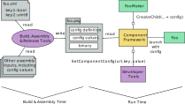
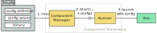
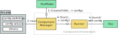
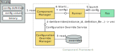

<!-- mdformat off(templates not supported) -->


# {{ rfc.name }}: {{ rfc.title }}
<!-- SET the `rfcid` VAR ABOVE. DO NOT EDIT ANYTHING ELSE ABOVE THIS LINE. -->

<!-- mdformat on -->

## Summary

This RFC proposes a new "structured" configuration system that lets component
developers easily and consistently solve a set of common component configuration
problems using the component framework. It is intended to supplement rather than
replace the existing configuration mechanisms on Fuchsia.

Component developers may declare configuration keys for their component in the
component manifest then the component framework delivers configuration values to
the component as each instance starts. Initial configuration values are defined
at assembly time. When permitted at assembly time, configuration values may also
be set while the system is running by the component's parent or over a FIDL
interface.

This RFC covers the motivation, expected use cases, and overall design. Future
RFCs will define the implementation and the syntax developers use to interact
with this new system.


## Motivation

Software is more flexible and reusable if it can be "configured"; that is, if
aspects of its behavior can be controlled externally rather than being fixed by
its source code. Fuchsia is intended for use across a wide range of products in
large scale production environments; configuration is essential both to enable
this flexibility and to safely evolve the platform over time.

Other large platforms provide infrastructure that helps developers add
configuration to their software (for example [Chromium][chromium_config]) but
configuration on Fuchsia is currently a manual process, requiring bespoke work
both to consume configuration values at runtime and to supply those
configuration values for different environments.

The most common tools for configuration on Fuchsia are currently reading files
from the [config-data][config_data] package and reading data from
configuration-oriented FIDL APIs. These existing tools have been used to solve
several important problems to date, but they are used neither widely nor
consistently.

This RFC proposes a new "structured" configuration system that lets component
developers easily and consistently solve a set of common component configuration
problems using the component framework. It is intended to supplement rather than
replace the existing configuration mechanisms.

Enabling simple and consistent component configuration offers several benefits
to Fuchsia, for example:

* Platform components can be made more flexible to support a wider range of
  products.
* The migration to Component Framework v2 can be simplified by providing a
  replacement for the CFv1 ability to supply arguments while launching a child
  component.
* New platform and product features can be deployed to production more safely
  through the use of feature flags.
* The cost associated with developing, testing, and maintaining configurable
  behavior can be reduced.


## Stakeholders

The stakeholders for this RFC are the Fuchsia Engineering Council, the Component
Platform teams whose scope it increases (i.e., Component Framework and Software
Delivery) and teams working on process where it can unlock improvements
(PDK and Security).

Potential clients of the system are also important, but since this RFC does not
propose a universal configuration system it should not be expected to meet all
the configuration desires of all potential clients.

_Facilitator:_ abarth

_Reviewers:_ geb (Component Framework),
wittrock (SWD), aaronwood (SWD & PDK),  ampearce (Security)

_Consulted:_ ddorwin, hjfreyer, ejia, thatguy, shayba, jamesr, ypomortsev,
crjohns, surajmalhotra, curtisgalloways, adamperry

_Socialization:_ Early drafts of this design or the preceding documents were
reviewed within the Component Framework, Security, Software Delivery, Cobalt,
and PDK teams. Several additional discussions were held with potential clients.


## Use cases

### Common use case: feature flags

Adding new features to a deployed system can be a risky proposition; new designs
and new code occasionally contain errors or invalid assumptions that are not
discovered until after deployment to a production environment. Many other
platforms mitigate this risk through the use of "feature flags": boolean
configuration parameters used to control whether a feature is active or not.
Feature flags offer several benefits:

* Deployment of new software versions can be decoupled from activation of new
  functionality; features added in the same software version do not have to be
  enabled simultaneously.
* The correct operation of a new feature can be
  thoroughly tested before the feature is enabled.
* Each feature can be enabled progressively across devices, either using release
  channels, percentage rollouts, or a combination of both.
* Each feature can be safely and quickly disabled if necessary; disabling a
  feature does not require rollback to an earlier software version.

Let's take one example of a recent feature that would have benefitted from a
feature flag: the [introduction of frequency estimation][cl_frequency] to
[Timekeeper][src_timekeeper]. In the submitted CL this feature was instantly and
permanently enabled across all releases of all products.

**`estimator/mod.rs` (without structured configuration)**

```rust
match self.frequency_estimator.update(&sample) {
  // use resulting frequency update
  ...
}
```

With structured configuration we would have been able to declare a feature flag
in the component manifest for Timekeeper and then gate the use of the frequency
estimator on this flag:

Note: All source code examples in this RFC are notional. Further work will
define the final syntax.


**`timekeeper.cml`**

```json5
{
  ...
  config: {
    enable_frequency: {
      type: "boolean",
      default: "false"
    }
  },
  ...
}
```

**`main.rs`**

```rust
import config_timekeeper as config;
...
let config: config::Struct = config::parse();
// Pass config through to each new Estimator
```

**`estimator/mod.rs`**

```rust
if self.config.enable_frequency {
  match self.frequency_estimator.update(&sample) {
    // Use resulting frequency update
    ...
  }
}
```

In this example, declaring a config section in the manifest caused the build
system to generate a library containing a FIDL struct definition for that
configuration and the code necessary to populate this struct at runtime from
inputs supplied to the component by its runner. The implementation of the
component can then import this library and use fields in the struct to control
its behavior.

Note the component developer can gate a new feature behind a flag with ~10 lines
of code. What do they get in exchange for those 10 lines of code?

* **Initially the feature will be disabled everywhere**. Since the component
  author supplied a default value of "false", the flag will be off until some
  other input to the assembly process explicitly sets a different value.

* **Initially the feature cannot be enabled while the system is running in
  production releases.** Which configuration keys can be mutated while the
  system is running is a policy question and this RFC does not specify policy.
  However, for security reasons it is very likely that no runtime mutation will
  be allowed in production (e.g. "user") releases unless explicitly requested
  and reviewed.

* **Developers can test the feature while the system is running in engineering
  releases.** Which configuration keys can be mutated while the system is
  running is a policy question and this RFC does not specify policy. However, to
  simplify development, test, and debug it is likely that runtime mutation will
  be allowed for most configuration keys in engineering (e.g., "eng") releases.
  A developer could enable the feature for a local device using [`ffx`][ffx].
  For example (using notional syntax): `ffx target config set timekeeper.cml
  enable_frequency=true`. If allowed by policy, the developer could also enable
  the feature such that it persists across device power cycles.

* **Tests can cover both the "feature enabled" and "feature disabled" cases.**
  For unit and component-level tests this involves manually constructing and
  injecting the FIDL config struct, for integration tests it involves providing
  configuration as the component under test is started, for example using
  [Realm Builder][realm_builder].

* **Build & assembly tooling could control the feature as a part of the platform
  boundary.** Build and assembly tooling is currently in work through the
  [DPI][roadmap_dpi] and [SPAC][roadmap_spac] efforts. The outcome of this work
  would let platform maintainers control whether each platform feature is
  exposed to products. Depending on policy and the risk of a feature, the
  platform could either control the rollout of the feature or delegate the
  rollout of the feature to products. For more complex cases the platform could
  enable mutation of the feature flag while the system is running even in
  production (e.g., "user") releases. This would let a product enable the
  feature on individual devices, for example setting the configuration value
  based on an experiment rollout system or an enterprise management console.

* **The flag state is reflected in device metrics.** For releases where the flag
  state can be mutated while the system is running its value is included in an
  additional hash that can be used to separate the feature-enabled cohort from
  the feature-disabled cohort during metric analysis.


### Common use case: product/board/build type tailoring

Fuchsia is a general purpose operating system that can be used across widely
different products and device categories. This means occasionally platform
components need to tailor their behavior based on the characteristics of the
product or board they are operating on.

Let's take another example from [Timekeeper][src_timekeeper]: the
[UTC maintenance algorithm][utc_algorithm] needs to know the accuracy of the
device's oscillator to understand the growth in error bound and to weight
successive samples. Some oscillators are significantly more accurate (and
expensive!) than others, but there is currently no easy way to express
board-based variation so oscillator error is currently hardcoded as a constant:

**`estimator/mod.rs` (without structured configuration)**

```rust
const OSCILLATOR_ERROR_STD_DEV_PPM: u64 = 15;
```

**`kalman_filter.rs` (without structured configuration)**

```rust
static ref OSCILLATOR_ERROR_VARIANCE: f64 =
    (OSCILLATOR_ERROR_STD_DEV_PPM as f64 / MILLION as f64).powi(2);
...
self.covariance_00 += monotonic_step.powf(2.0) * *OSCILLATOR_ERROR_VARIANCE;
```

With structured configuration we would be able to declare an integer
configuration key in the manifest for Timekeeper and then the use the value
supplied by the product or board:

Note: All source code examples in this RFC are notional. Further work will
define the final syntax.

**`timekeeper.cml`**

```json5
{
  ...
  config: {
    oscillator_error_std_dev_ppm: {
      type: "uint8"
    }
  },
  ...
}
```

**`main.rs`**

```rust
import config_timekeeper as config;
...
let config: config::Table = config::parse();
// Pass config through to each new KalmanFilter
```

**`estimator/mod.rs`**

```rust
// Delete hard-coded constant.
```

**`kalman_filter.rs`**

```rust
let oscillator_error_variance: f64 =
    (config.oscillator_error_std_dev_ppm as f64 / MILLION as f64).powi(2);
...
self.covariance_00 += monotonic_step.powf(2.0) * oscillator_error_variance;
```

As in the first use case, the component developer can introduce this tailorable
parameter with ~10 lines of code and receive the same useful properties. In this
use case the manifest does not provide a default value (since the component
author had no idea how good or bad an oscillator might be used) so the assembly
process will fail with an informative error if no other input supplies the
value.


### Other use cases

The previous sections discussed what we see as two very common use cases for
structured configuration, but the same system can also be used to address a
range of other simple configuration use cases. For example:

* **Inhibit-for-test flags.** Some components naturally exhibit behavior that
  makes integration testing difficult (for example the time system has a 5
  minute cooldown after time source failures). Test-only flags can be used to
  inhibit these behaviors during integration or end to end tests.

* **Component instance creation-time configuration.** Occasionally the
  appropriate configuration for a component cannot be determined until a
  component instance is to be created. Configuration keys may be defined that
  let the parent creating a new component instance supply configuration values
  on creation. This can both replace the use of [launch args][src_launch_args]
  in CFv1 and support tailoring multiple instances of a component for different
  roles (e.g., one AccountHandler instance is started for each active account).

* **Simple A/B tests.** Creating an optimal design sometimes requires
  experimenting with two or more options in parallel, each on a different set of
  devices. Products with access to an server-side experiment system may perform
  A/B tests by using this experiment system to drive the configuration values
  for one or more components.


## Philosophy

The design of structured configuration is driven by four congruent philosophies:

* **Simple.** The system must be both simple to use and be designed in a way
  that is simple to understand and analyze. Simplicity encourages adoption and
  supports the "reliable" and "secure" philosophies.
* **Reliable**.  Reliability simplifies development and debugging and lets the
  system be used for components that are critical to the operation of a Fuchsia
  device.
* **Secure**. Security aligns directly with Fuchsia's platform objectives and
  lets the system be used for components that are critical to the security of a
  Fuchsia device.
* **Testable**. Configuration adds new inputs to a component and hence the
  potential for new problems. A developer must be able to fully test the
  component's response to these new inputs.


## Scope

Structured configuration is not intended to be a universal solution for every
configuration problem. The gamut of configuration needs across products built on
Fuchsia is vast and the requirements they bring are often conflicting - a system
that attempted to meet all needs would either be very complex (thereby failing
the simple philosophy and threatening the other three philosophies) or be simple
and overly general (thereby failing to provide the guarantees on presence,
stability, meaning, and auditability of data that are necessary for the reliable
and secure philosophies).

Instead, structured configuration is designed to solve a set of common use cases
easily and well. Components may use general file-based and API-based solutions
to solve other configuration problems. In particular, structured configuration
does not intend to address the following problems:

* **Arbitrarily large and complex configuration data.** Large and complex data
  is difficult to audit and selectively constrain using general tools, in
  conflict with the security philosophy. This data typically requires additional
  domain-specific interpretation and validation, introducing failure modes that
  the configuration system would be unaware of. Finally, large and complex data
  is difficult to combine from multiple sources, limiting the usefulness of the
  assembly tooling and the ability to override configuration while the system is
  running.
    * Components needing large and complex configuration data should read this
      data from a file instead.

* **Configuration data that changes frequently.** Data that changes frequently
  must be delivered to a component multiple times rather than only one time at
  component start. This introduces new failure modes and creates additional
  complexity on the component, in conflict with the reliable and simple
  philosophies. It is also much harder to test. Note that data that changes
  frequently fails our definition of "configuration" below.
    * Components needing configuration data that changes frequently should
      receive this data over a FIDL protocol instead.

* **Configuration data that is set by other components (except parent components
  and admin components).** Structured configuration supports a parent component
  setting configuration for the components it creates and supports
  administrative components setting all mutable configuration for the device.
  Structured configuration does not provide the access controls needed for
  arbitrary components to set subsets of configuration across specific
  components.
    * Components needing configuration data set by other arbitrary components in
      the system should receive this data over a FIDL protocol instead and limit
      access using service routing.

* **Configuration data that is controlled by end users.** Configuration
  controlled by end users (rather than developers or administrators) requires a
  user interface. This user interface fails the "configuration data set by other
  components" test and may also fail the "configuration data that changes
  frequently" test.
    * Configuration that is controlled by end users should either be included in
      [`fuchsia.settings`][fidl_fuchsia_settings], or use a similar approach
      with a FIDL API separating frontend and backend components.


### Meaning of "configuration"

Components consume a wide range of different inputs. Most of these inputs
potentially alter the behavior of the component but only some inputs should be
considered "component configuration" rather than the more general "system state"
or "input data".

For the purposes of this RFC we consider "configuration" to be the inputs a
component instance uses to tailor its operation to the context in which it was
launched (such as the product, board, build type, channel, regulatory region, or
integration test realm). Configuration values are constant during the lifecycle
of a component instance, and are usually constant across some set of devices.
Configuration values are usually set by developers, maintainers, or
administrators rather than end users.


### Data types {#scope_data_types}

Structured configuration is intended for a moderate number of bounded and well
defined configuration keys for each component. Limiting the scope and size of
configuration in this way encourages configuration that is well documented,
testable, has minimal mutability, and is easy to audit. It also enables the
automatic composition of configuration from multiple sources. These well defined
key-value pairs create the "structure" in "structured configuration".

We do not intend to support bytes or arbitrary length strings due to the
"arbitrarily large and complex configuration data" constraint above. The set of
initially supported data types will be defined in further work, but will include
as a minimum: booleans, integers, bounded length strings, and lists of these
data types (where the list length is bounded and all entries in the list are
supplied atomically).

Support for enumerations is highly desirable in the future but is more complex
since all places that verify configuration values (both during assembly and at
run time) must have access to the set of valid enumerators. Developer tools
would be more ergonomic if the system could translate between enumerator names
and values but this adds further complexity.

Support for composable lists (i.e. lists where the entries can be supplied by
multiple configuration sources) might be desirable in the future but this adds
significant complexity. With an atomic type manipulating a configuration key
means simply replacing its value but composable lists would require more complex
operations such as appending, inserting, or removing values or merging list
fragments. These operations would need support both during assembly and at
runtime and would create new failure modes, such as failure to insert an item
because doing so would exceed the maximum list length. The system would need to
distinguish between lists where the order of entries has no impact on the
consumer (and therefore where the configuration hash should be performed using
some canonical order) and lists where the order of entries does matter (and
therefore where configuration manipulation must be explicit in maintaining that
order).


### Component framework version

Structured configuration only supports component framework v2 components. It is
a large project touching many areas and won't be ready for widespread adoption
until early 2022. Supporting two different frameworks would substantially
increase scope and push the end date to beyond the expected deprecation of
component framework v1.


## Design


### Overview

This subsection briefly introduces the overall design of the system. The
following subsections provide more detail on each of the steps introduced here.

The design is summarized in the diagram below:



Each element of configurable data is a key-value pair. Component authors declare
the configuration keys (and optionally default values) for their component in
the component manifest, and together the build system and component framework
are responsible for delivering the configuration values to the component on
start.

The build and assembly process produces a *configuration definition file*
containing the configuration key data types and names, plus a *configuration
value file* containing a value and mutability for each configuration key. In
the initial implementation both of these files are placed inside the same
package as the component (or as separate bootfs files for components that run
before pkgfs is available). See [alternative 3](#alternative_packaging) below
for rationale and a discussion on the future direction.

Each time a component instance is started, the component framework checks for
the presence of a configuration definition file. If a configuration definition
file is present the component framework combines the static values in the
configuration value file with any values supplied by the parent component
instance and any values supplied by a configuration override service,
respecting the mutability constraints in the configuration value file. The
component framework passes these combined values to the new component instance
on start using whichever technique is most idiomatic for the runtime.

The component framework exposes a new FIDL interface that developer tools or
product components may use to query configuration values and define new
overrides. New values set using this interface will be picked up next time a
component instance starts.

Statistics for configuration values are included in inspect and hence
included in snapshots to aid debugging. Hashes of the configuration values
that differ from assembly time are reported for each component through Cobalt so
that cohorts of devices with different configuration values can be assessed
independently.


### Configuration definition

A component author may define configuration keys (each with a data type and
optionally a default value) in their component manifest. Future work will define
the exact syntax, but notionally this may look like:

```json5
{
  program: {
    ...
  },
  config: {
    enable_frequency: {
      type: "boolean",
      default: "false"
    },
    oscillator_error_std_dev_ppm: {
      type: "uint8"
    }
  },
  ...
}
```

In the initial implementation all keys are defined in a single "flat" namespace
for each component but we limit the legal characters in a configuration key to
`[-_a-z0-9]`. If nested or grouped configuration keys are considered valuable
in the future they could be supported and referenced using dot-separated or
slash-separated syntax.

Some runtimes, such as cast and web, will generate CFv2 ComponentDecls
automatically rather than from a component manifest. Initially these runtimes
will not support structured configuration.

Including a config section in the manifest causes the component build rule to
generate a library containing a FIDL table definition for that configuration and
the code necessary to populate this table at runtime from inputs supplied to the
component by its runner. The implementation of the component can then import
this library and use fields in the table to control its behavior.

A component manifest describes both the needs of a component and a contract that
component must fulfil. Prior to this RFC the `*_binary` build rules did not
depend on the contents of a manifest while the `fuchsia_component` build
rules had an optional dependency on the binary. Some changes to build rules are
necessary to avoid circular dependencies.

In some cases a single binary is used by multiple components; these cases will
require some refactoring in order to use structured configuration. One option is
to ensure all components define an identical configuration through the inclusion
of a common CML shard. Another option is to merge the components into a
single definition and use structured configuration to describe differences in
behavior that were previously expressed using different manifests.


### Build, assembly, and release

The build, assembly, and release process is responsible for generating two files
for each configurable component. Both files are placed in the same package as
the component (in the future this will be extended to support supplying values
through a different package, see [this alternative](#alternative_packaging).


#### Configuration definition file

This file contains the following information for each configuration key:

* FIDL field number
* Field name
* Data type

This information is all available in the component manifest so this file may be
generated during the component build process. It is helpful to also calculate
and include a hash over all the information in the configuration definition file
for use as a configuration version ID.

Note that we describe the configuration definition as a "file" to simplify the
discussion of its use, but the implementation is likely to include this
information inside the compiled component manifest (i.e., `*.cm` file)
instead of as a separate file.


#### Configuration value file

This file contains the following information for each configuration key:

* FIDL field number
* Configuration value
* Mutable by [ChildDecl](#values-from-child-decl) (boolean)
* Mutable by [override](#values-from-override-service) (boolean)

The format of the file is not defined by this RFC.

In a mature and scalable assembly system several different actors may wish to
specify or constrain this information for one or more keys. For example:
component authors, board bringup engineers, platform boundary owners, product
integrators, or security reviewers. Some of the tools needed to enable this are
currently in work through the [DPI][roadmap_dpi] and [SPAC][roadmap_spac]
platform roadmap entries and this RFC does not specify how these tools will be
used to generate the configuration value file.

In the interim, while structured configuration is only used by a small number of
components for a small number of keys, we will maintain these files manually in
source code repositories. If a product built out of tree needs to modify the
configuration of a platform component it will do so by replacing the
configuration value file in the platform package.

The assembly process must verify that the contents of the configuration value
file are consistent with the corresponding configuration definition file, i.e.,
that they contain an identical set of field numbers and the data types are
consistent.


#### VBMeta

It is desirable to vary configuration across the formal releases generated from
the same image. For example, debug features could be enabled when signing with
development keys and left disabled when signing for production. Using the same
image reduces the possibility of unintentional differences between the prod and
dev releases and has the potential to reduce the number of images we maintain.

In the future we intend to support this by allowing some configuration values to
be overridden in vbmeta. VBMeta is the central data structure used by Fuchsia's
verified boot implementation and contains metadata for the software included in
a Fuchsia release. Since vbmeta is signed, configuration values that were
overridden by vbmeta would be covered by verified execution.

Configuration by vbmeta would add value when multiple releases could be created
from the same image and those releases could exhibit meaningfully different and
useful behaviors. This in turn would require several infrastructure components
to have already integrated with structured configuration, hence we exclude
configuration by vbmeta from the initial minimal scope.


### Component start

Each time a component instance is started, component manager resolves the
configuration definition file and the configuration value file and uses their
contents to determine which of several sources may supply configuration values.
Each of these sources is discussed in more detail below. Component manager
combines the contributions from the allowed sources to produce the final set of
configuration values.

Once the configuration values have been determined, component manager passes
these values to the runner. The runner passes the configuration values to the
newly started component in the most idiomatic way for the runtime. In many cases
we expect this will be passing a new [procarg][src_procargs] containing a handle
to a VMO containing the FIDL table. In some cases it might be necessary to pass
the configuration as `key=value` command line arguments.

A component can trust that the framework will always deliver a configuration
value for every configuration key declared in its manifest at start and should
fail with a fatal error if this does not occur. Components should never define
internal default values to accommodate missing configuration - doing so can
result in runtime errors altering behavior that was intended to be fixed at
assembly time.


#### With values from the release

The simplest case is where the values provided in the configuration value file
are used. If the configuration value file states that none of a component's
configuration keys are mutable by ChildDecl or mutable by override this will
always be the case and component manager does not need to query the
configuration override service discussed below.

This flow is illustrated below:




#### With values from the ChildDecl {#values-from-child-decl}

We expand [`ChildDecl`][fidl_fuchsia_sys2_child_decl] to include a vector of
configuration key-value pairs, effectively replacing the CFv1 ability to supply
command line arguments when starting a new component instance. A ChildDecl may
be supplied by a parent adding a new instance to a component collection, by a
test constructing a test environment using realm builder, or by the author of a
parent component manifest.

When configuration is present in the ChildDecl, component manager:

* Verifies the ChildDecl keys are present in the configuration definition file
  and have the correct data type.
* Verifies the ChildDecl keys are mutable by ChildDecl in the configuration
  value file.
* Populates the supplied keys using the ChildDecl values.
* Populates the remaining keys using the configuration value file.

Component manager records an informative error and returns a failure if any
keys are not found, contain the wrong data type, or are not mutable by
ChildDecl.

This flow, initiated by a parent component calling CreateChild, is illustrated
below:




#### With values from an override service {#values-from-override-service}

When the configuration value file states that one or more configuration keys are
"mutable by override", component manager makes a FIDL request to a configuration
override service to get override values. This request contains the [component
instance ID][component_instance_id] of the new component instance and a handle
to the configuration definition file. The response contains a (potentially
empty) set of override configuration values to apply.

The typical implementation of the configuration override service is a new
"configuration override manager" component, but the configuration override
service is routed as a capability through the component topology (similar to
storage capabilities and parameterized with a string as in that case) so
different parts of the topology may use configuration overrides supplied by
different implementations of the override service API.

Configuration override manager maintains a database of "overridden"
configuration key-value pairs, editable over FIDL as described below. Each entry
in this database is defined at the component instance level and indexed by
component instance ID (see [this alternative](#alternative_component_id) for
additional justification). Each override entry is either stored on disk to
persist across power cycles or is retained in memory for the remainder of the
current power cycle. Persistence is specified when the entry is created.

On receiving a request for configuration overrides, configuration override
manager:

* Checks for matching entries in the override database.
* Verifies that overridden keys are present in the configuration definition file
  and have the correct data type.
* Returns the matching key-value pairs.

Configuration override manager logs an informative error and deletes the
database entry if a key is not found or the data type is incorrect (these
conditions might occur if a new component version is downloaded after setting a
configuration override).

On receiving a configuration override response, component manager:

* Verifies that overridden keys are mutable by override in the configuration
  value file.
* Populates the overridden keys using the overridden values.
* Populates the remaining keys using the configuration value file.

If component manager does not receive a valid response from the configuration
override service the component start fails.

This flow, in the case where configuration override manager implements the
configuration override service, is illustrated below:



Note that configuration keys are stored in the override database as strings. The
set of configuration fields is likely to change often as a component evolves,
but a configuration override remains valid so long as the key name and data type
do not change. As an optimization the last seen configuration version ID and
field number could also be cached in the database.


#### Value selection summary

Putting these flows together, component manager selects a value for each
configuration key as follows:

1. If the key is mutable by override and a matching override is returned from
   the configuration override service, use this value.
1. Otherwise, if the key is mutable by ChildDecl and a value was supplied in the
   ChildDecl, use this value.
1. Otherwise, use the value from the configuration value file.


### Configuration FIDL interface and override database

Configuration override manager exposes two FIDL services that can be used to
interact with its override database:

1. A service that can:
  * Read all configuration overrides.
  * Create and delete configuration overrides that are held in memory but do not
    persist across configuration override manager restarts.
2. A service that can:
  * Read all configuration overrides
  * Delete all configuration overrides
  * Create configuration overrides that are held in memory but do not persist
    across configuration override manager restarts
  * Create configuration overrides that are stored on disk and persist across
    configuration override manager restarts

The first service cannot introduce long term changes to the configuration and
may be useful for automated end to end testing. Both services are sensitive and
their usage is allowlisted.

We will introduce an ffx plugin that uses the second service to let developers
query and modify configuration on their test devices. The set of configuration
keys that may be edited over FIDL in a particular release is a policy question
and not defined by this RFC, but we imagine that in eng builds there is little
need to restrict the editing of configuration over FIDL.

Even if entries in the override database are validated against the configuration
definition file on creation, entries could become invalid over time as
components are removed or upgraded to new versions containing different
configuration keys. We address this using several garbage collection measures:

* Each entry in the override database may have an expiry time after which it
  will be deleted. In a production system we will consider making expiry time
  mandatory.
* The FIDL service includes methods for easy deletion of redundant entries
  including deleting all entries for a component instance and deleting the
  entire database.
* In future work we will investigate receiving notifications from software
  delivery when packages are removed or upgraded so that corresponding override
  entries could be deleted or revalidated.


### Diagnostics

Understanding the configuration a component is using is important to debug
problems. Separating the metrics from device cohorts running different
configurations is important to assess fractional rollouts and A/B studies.

Most configuration keys on most devices will use the values set during assembly.
For these, knowing the release version (or package version when apps are
updatable) infers the configuration value. Each time a component instance is
started, component manager calculates two hashes: a "ChildDecl configuration
hash" over all the configuration keys and values that were set by ChildDecl and
an "override configuration hash" over all the configuration keys and values that
were set by an override. If no fields were set the corresponding hash will be
zero.

If a moderate number of different configurations are in use these configuration
hashes are sufficient to identify each cohort. If a large number of
configuration values are possible (for example, a developer setting arbitrary
URLs during testing) the configuration hashes may not be sufficient to determine
the configuration values but they still indicate devices that are running with a
different configuration from their assembly and devices that are running with a
different configuration to their peers.


#### Logging

Component manager logs statistics for each calculation of component
configuration but does not log raw configuration values. Configuration override
manager logs all FIDL requests to modify the override database.


#### Inspect & Snapshots

Component manager's inspect data includes statistics about the configuration of
each component instance to aid in debugging. This includes the number of
configuration values set from each source and the configuration hashes
introduced above. Since snapshots include inspect data this means the
configuration hashes of all running component instances are included in a
snapshot.

Where configuration keys are important to the operation and debugging of a
component then the component may choose to include these configuration
values in its own inspect data.


#### Cobalt

Component manager sends both configuration hashes to a component instance on
start (via the runner). We expand
[`fuchsia.metrics.MetricEventLoggerFactory`][fidl_fuchsia_metrics_melf] to
accept these hashes as a new `MetricEventLogger` is created.

Cobalt uses these configuration hashes in conjunction with the existing
`SystemProfile` fields to define the context that a component is running in,
allowing metrics from devices with different configurations to be analyzed
separately. The standard thresholding still applies so metrics are only
available when some minimum number of devices share the same configuration.


## Implementation

We will select a small number of "early access" components to use as clients
during the development of structured configuration while the syntax and tooling
evolves.

The implementation will be split into three phases that provide increasing
capability:

* Phase 1: Static values
  * After this phase it will be possible to create a configuration definition
    (potentially using syntax and tools that are not final), place configuration
    values in a package, and deliver these values to the component instance at
    start.
  * This phase provides a basic way for the behavior of early access components
    to be varied across products or build types.
* Phase 2: Parent values
  * After this phase it will additionally be possible to limit mutability for
    the packaged configuration values, to specify configuration values in a
    ChildDecl, and to deliver these values to the component instance at start.
    The definition of configuration should be through the component manifest and
    use near final syntax.
  * This phase unblocks integration testing of configuration and use cases that
    require a parent component to supply configuration for its children.
* Phase 3: Overridden values
  * After this phase it will additionally be possible to set and read
    configuration overrides through a FIDL interface or an ffx plugin using that
    interface, to deliver these values to the component instance at start, and
    to isolate metrics by configuration in Cobalt.
  * The phase completes the work defined in this RFC and unblocks local
    developer testing, end to end testing, and further product integrations.


## Performance

This RFC introduces a new component, incurring (modest) CPU, memory, and storage
costs. All of these scale with the number of components using structured
configuration and the number of configuration keys.

Calculating configuration values introduces a small delay to the launching of
components whose configuration is mutable by override due to an additional FIDL
call and additional file reads. We will monitor this cost and optimize the
implementation of configuration override manager if necessary.


## Security

Structured configuration may be used by many components to control many
different aspects of their behavior. An attacker who could modify configuration
could potentially compromise the security of a device in numerous and varied
ways. For example:

* Enable debugging output to leak user information.
* Redirect network requests to servers controlled by the attacker.
* Enable experimental features and exploit vulnerabilities in their
  implementation.

This design includes several features intended to prevent these attacks:

* The scope of configurable data is constrained and each element is well
  defined, making them easier to audit.
* A value is defined for every configuration key when a release is signed, these
  values are covered by verified execution.
* The ability to modify configuration keys while the system is running is set
  when a release is signed, separately for each key and each mutation mechanism.
  These mutabilities are covered by verified execution.
* Mutability and default value are defined at the component level not the
  component instance level. New instances of a component with different
  configurations can only be created when mutable by ChildDecl or mutable by
  override is set for the configuration key.
* The ability to change configuration ephemerally and persistently are
  exposed as separate FIDL services.
* The FIDL services to change configuration are controlled by allowlists.
* Configuration data is parsed by the existing well-reviewed FIDL bindings
  rather than by application-specific logic.
* Configuration override manager will be a lucrative target so we will request a
  security review for its implementation.


## Privacy

Structured configuration is not designed to store user settings (these have
different stability, persistence, access, and timing needs) so configuration
values should never contain user generated data. This will be clearly documented
in the guidance to developers.

It is potentially useful for a parent component to pass PII configuration to
dynamically created children (for example, the hardware UID or network address
that a new component instance should use). Without care this information might
leak into logs or metrics through the ChildDecl configuration hash. This will be
addressed during detailed design but several options are available (for example,
sensitive fields could be marked in the configuration definition and then salted
before inclusion in the hash).


## Testing {#testing}

The ability to test multiple configuration values is important to verify
correctness. This design enables testing of different configuration values in
all phases:

* **Unit tests** and **component tests** may manually construct the FIDL
  configuration struct (i.e. the struct supplied by the component runner under
  normal operation) and pass this to methods that consume configuration.
* **Integration tests** may provide configuration for each component instance
  through realm builder (using a `ChildDecl`) when constructing the test realm.
* **End to end tests** may set additional configuration from the host device
  using the configuration FIDL interface. Additional work may be required to
  pause the normal startup sequence to avoid a race condition on component
  start.
* **Manual tests** may use `ffx` commands to conveniently set additional
  configuration using the configuration FIDL interface.
* Future work will consider automated **fuzzing** of a component's
  configuration.

Several different options are available to avoid an implicit dependency on the
configuration override service from hermetic integration tests. For example,
integration test packages could be built with configuration value files that do
not allow overrides and construction of the test realm could avoid routing a
configuration override service.

The implementation of structured configuration itself will be tested using
standard best practices, including unit test and an integration test of the
component manager - configuration override manager - runner interaction.


## Documentation

Once this RFC is approved we will publish a document in `/concepts`
explaining the configuration mechanisms available on Fuchsia and their
relationship.

Once the syntax has stabilized and the structured configuration implementation
is ready for more widespread adoption we will publish a developer guide and
reference documentation.

As developers begin to use structured configuration and discover patterns that
work well we'll develop documentation for best practices and recommended style.


## Alternatives considered

### Implement configuration merges in configuration override manager

An earlier revision of this RFC placed the logic to merge different sets of
configuration data inside component override manager (then named configuration
manager) instead of component manager.

That design would have led to a smaller scope for component manager but the
scope of both component manager and configuration manager would have been
less cleanly defined:

* Component manager would have needed to understand enough about configuration
  to know when to invoke configuration manager while not understanding
  enough to merge values.
* Configuration manager would have been responsible for some of the business
  logic to present configuration to components in addition to the
  maintenance of a database.

The design would also have increased the number of situations in which a FIDL
call was required.


### Implement configuration override database in component manager

This RFC places the responsibility for maintaining the configuration override
database in a new component: configuration override manager. An alternative
would have been to perform this functionality inside component manager.

This alternative would have eliminated a FIDL call and some failure modes, but
would have increased the complexity of component manager and would have been the
first time component manager needed to persist its own data rather than simply
allocating storage for use by other components. This use of storage would have
raising additional security questions and required new infrastructure in CF.


### Deliver configuration through a central package {#alternative_packaging}

This RFC places the configuration values for a component in the component’s
package. An alternative would have been to place all configuration for all
components in a single configuration package, similar to the design of the
[config-data][config_data] package in CFv1.

There are two main reasons reasons we prefer the decentralized approach over the
centralized approach:

1. In the future Fuchsia will need to run components that were not known to the
   base image (for example, as a result of app updates). The configuration for
   these unknown components cannot not be distributed in a central package so
   would require a different solution.
2. Delivering a binary and its configuration atomically lets us make stronger
   statements about their consistency, particularly when a package might be
   updated independently of the base image. There are fewer failure modes that
   lead to a component being available but its configuration being unavailable,
   or to a component and its configuration being incompatible.

As described in the body of the RFC, our decentralized approach currently places
configuration values inside the same package as the component they apply to.
This means changing the configuration of a component at assembly time changes
the root hash of its package. Longer term this is undesirable because it does
not support one organization (for example, the Fuchsia platform maintainers)
publishing and signing a component and a different organization (for example, a
product integrator) supplying the configuration.

In the future, we imagine each package will contain default configuration values
as set by the publishing organization and also declare which subset of these
values may be overridden through a different package potentially published by a
different organization (e.g., a platform component can chose which of its
configuration "knobs" are accessible to product integrators). Future work will
define the nature of this "different package" - options include a meta-package,
a sidecar package, or a wrapper package.


### Index configuration overrides by component URL and moniker {#alternative_component_id}

This RFC indexes configuration overrides by a component's
[instance ID][component_instance_id]. Instance IDs are used to index other
persistent resources in component framework, such as isolated persistent
storage, and are therefore an obvious choice for indexing configuration
overrides.

However, component instance IDs are currently assigned manually at build time
through index files. This means instance IDs and therefore structured
configuration overrides are not available for component instances inside a
component collection or component instances that were introduced by an app
update rather than in the base image.

As an alternative we considered indexing configuration overrides by component
URL and moniker. This would have avoided the limitations of instance ID but both
component URL and moniker may change as the system is refactored so this
alternative would have introduced new stability problems in addition to creating
inconsistency across the handling of component framework persistent resources.

Instead we prefer to address the limitations of instance ID through changes to
the design of instance ID in a future RFC.


### Support configuration override at the component level

This RFC indexes configuration overrides by a component's
[instance ID][component_instance_id], meaning every instance of a component
needs to be overridden separately.

In the future it may be desirable to support overrides at the component level in
addition to at the component instance level. This would be particularly useful
in cases where a component is instantiated many times or where the component
instances are not known in advance.

Currently there is no well-defined canonical and stable identifier for
components that we could use for component-level overrides. Since we have
not yet identified a concrete need for component-level overrides we defer
including the feature.

The changes to the design of instance ID referenced in the previous alternative
may well provide stable component identifiers in addition to component instance
identifiers (for example, instance ID could be a self-certifying identifier for
a component combined with some a function of the instance's moniker through some
quirks database to handle changes in topology). This would simplify adding
component-level override in the future.


### Define configuration keys using FIDL

This design defines configuration keys inside a component manifest using JSON.
Some of this information is used to build a FIDL table. An alternative would
have been to define configuration keys in a `.fidl` file.

Firstly we note that the [FIDL toolchain][fidl_contrib] is deliberately composed
of a frontend and a backend separated by an IR - it is possible to use FIDL
technology without requiring the input be defined in the FIDL language.

The decision to use `.cml` rather than `.fidl` is mainly driven by developer
experience:

1. A component manifest is where a developer describes the needs of their
   component to the framework and defining configuration keys fits within this
   definition. Maintaining a single file is less work than adding a new file.
1. The syntax and data types that are available for defining configuration is a
   small subset of the full FIDL language (see [scope](#scope_data_types)).
   Requiring FIDL syntax while only supporting a subset could be both confusing
   and frustrating.
1. Configuration requires information that cannot be represented in the FIDL
   language (a default value for a table field today and likely additional
   constraints in the future). This information could be stored in custom
   attributes but this would be inconsistent with the rest of the FIDL language
   and confusing to developers.

Where the JSON configuration definition uses concepts that exist in the FIDL
language we will use consistent syntax. For example, data type names will be
consistent.

[`cmc`][src_cmc] already builds FIDL tables from JSON component manifests and
the additional work needed to parse configuration from a manifest is modest.


### Support configuration routing between components

Many resources in component framework support routing from one component
instance to another e.g., protocols, directories, and storage
capabilities. It would be natural to support routing of configuration between
components, so that say a child could use some configuration values from its
parent.

Configuration routing is not supported in this initial design to avoid
introducing new versioning challenges. If we supported defining configuration in
one component and using it in another component packaged at a different point in
time (either because these components were defined in different repositories or
because there were not delivered to devices as a monolithic) we can no longer
guarantee the configuration definition compiled into the component matches the
definition used for the configuration values. We would be introducing a new ABI
between these two components but since this interface would be expressing in the
PDK rather then the IDK we cannot use the process defined in
[RFC-0002][rfc_0002] to manage version compatibility.

Component surface and versioning are likely to be discussed more as the PDK and
out of tree assembly efforts continue and we defer routing of configuration
between components until this is more mature. In the meantime, assembly tools
can be used to deliver consistent configuration values in multiple packages if
necessary.

We have introduced a more limited version of this cross-component compatibility
problem by supporting parents dynamically configuring child components on
creation. We argue these cases are unlikely to create problems in the near term
because this mutability must be opted into and the configuration field will
normally be explicitly designed by the child for the use of the parent.


### Support transparent configuration for reusable libraries.

Many components are built using reusable libraries which support some form of
configuration. Structured configuration as defined in this RFC could be used to
supply this configuration but only in a manual fashion; each component using a
library would need to declare matching configuration keys in its own manifest
then route the configuration values into the library at initialization. A
similar situation exists with runners, in that a runner may directly control
configurable behavior in a library used by the components it runs.

An alternative would be to support a more "transparent" configuration for
libraries where a library could declare its configuration keys and could consume
configuration values directly at runtime. A component would only need to declare
its usage of the library to let the configuration providers set configuration
values for the instance of the library in that component.

As with routing between components (discussed in the alternative above) this
would involve wider agreement about configuration keys across different software
artifacts, such as when a platform library is used by an out of tree component.
This may favor a more formal definition of configuration that provides stronger
guarantees about the forwards and backwards compatibility between configuration
versions. Transparent configuration for libraries would also raise the question
of how to deliver multiple sets of configuration values to a component.

Although transparent configuration for libraries is a desirable feature in the
longer term, we defer this work until the simpler and more "private"
configuration system defined in this RFC is working.


### Support configuration updates after component start

This design only delivers component configuration when a component instance is
started. If configuration were to be modified after component start it would not
reach the component until the next start. An alternative would be to deliver
configuration to components periodically over FIDL.

The decision to focus on component start aligns with our definition of
"configuration" being bound to component lifecycle but also simplifies
implementation for component authors:

1. A component instance that only receives configuration once can initialize all
   its configuration-driven resources during component start. A component that
   must receive new configuration periodically also needs to allocate or collect
   resources periodically as changes in configuration warrant this.
1. A component that must receive new configuration periodically requires some
   periodic or asynchronous processing that otherwise may not have been
   necessary.
1. A component that must receive new configuration periodically must also record
   any changes in configuration through its diagnostics connections, for example
   by creating a new `MetricEventLogger`.
1. A component that must receive new configuration periodically has additional
   failure modes that must be handled, such as termination of the FIDL
   connection and timeouts.

Today the need for configuration update after start is very limited:
configuration values supplied in the release or through ChildDecl cannot change
after component start. The FIDL interface can introduce changes after start but
will initially only be used in developer tools that could easily offer ways to
automatically restart a component after changing its configuration.

In the future, some product-specific components might prefer to implement the
complexity discussed above rather than restart. If so we will consider an opt-in
ability for components to receive updates over FIDL.


## Prior art and references

* [Chromium configuration mechanisms][chromium_config]
* [Windows Registry][windows_registry]


[chromium_config]: https://chromium.googlesource.com/chromium/src/+/refs/heads/main/docs/configuration.md
[windows_registry]: https://docs.microsoft.com/en-us/windows/win32/sysinfo/about-the-registry

[config_data]: /development/components/data.md#product-specific_configuration_with_config_data
[fidl_contrib]: /contribute/contributing-to-fidl/README.md
[ffx]: /development/tools/ffx/getting-started.md
[component_instance_id]: /glossary/README.md#component-instance-identifier
[realm_builder]: /development/testing/components/realm_builder.md
[utc_algorithm]: /concepts/kernel/time/utc/algorithms.md

[roadmap_spac]: /contribute/roadmap/2021/product_assembly.md
[roadmap_dpi]: /contribute/roadmap/2021/decentralized_product_integration.md
[rfc_0002]: /contribute/governance/rfcs/0002_platform_versioning.md

[cl_frequency]: https://fuchsia-review.googlesource.com/c/fuchsia/+/514762

[src_cmc]: https://cs.opensource.google/fuchsia/fuchsia/+/main:tools/cmc/
[src_timekeeper]: https://cs.opensource.google/fuchsia/fuchsia/+/main:src/sys/time/timekeeper/
[src_launch_args]: https://cs.opensource.google/fuchsia/fuchsia/+/main:src/lib/fuchsia-component/src/server/mod.rs;drc=87993a6ba2f2f35204ee54ce5ad86a8a7e8817e7;l=809
[src_procargs]: https://cs.opensource.google/fuchsia/fuchsia/+/main:zircon/system/public/zircon/processargs.h

[fidl_fuchsia_metrics_melf]: https://cs.opensource.google/fuchsia/fuchsia/+/main:sdk/fidl/fuchsia.metrics/metric_event_logger.fidl
[fidl_fuchsia_settings]: https://cs.opensource.google/fuchsia/fuchsia/+/main:sdk/fidl/fuchsia.settings
[fidl_fuchsia_sys2_resolver]: https://cs.opensource.google/fuchsia/fuchsia/+/main:sdk/fidl/fuchsia.sys2/runtime/component_resolver.fidl
[fidl_fuchsia_sys2_child_decl]: https://cs.opensource.google/fuchsia/fuchsia/+/main:sdk/fidl/fuchsia.sys2/decls/child_decl.fidl
