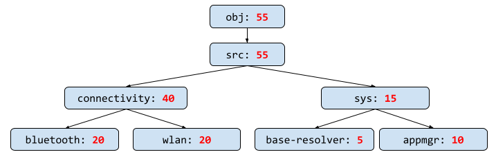



# {{ rfc.name }}: {{rfc.title }}
<!-- SET the `rfcid` VAR ABOVE. DO NOT EDIT ANYTHING ELSE ABOVE THIS LINE. -->

<!-- mdformat on -->
<!-- This should begin with an H2 element (for example, ## Summary).-->

## Summary

This document proposes the development of a new size check tool that will be
added to the SDK, which allows developers and product owners to verify that
their packages and products do not exceed specified size budgets. While the
implementation details are intentionally excluded, because out-of-tree Assembly
is continually shifting the foundation, design requirements and goals are
mentioned.

## Motivation

During software development, it is helpful to know whether your software fits
within the size constraints of your target. Fuchsia has a size check tool that
analyzes the space consumed by different groups of software, and enforces a
budget for each group. This tool is tightly bound to the implementation details
of `fuchsia.git`, therefore it cannot be used without a `fuchsia.git` checkout.
As a result, consumers of Fuchsia, such as Chromium, have implemented their own
ad-hoc method for checking the size of their software. By rewriting the size
check tool as a ffx plugin and adding it to the Fuchsia SDK, the method of
enforcing size budgets on Fuchsia software will be unified, making it easier for
future developers to get started with Fuchsia.

## Stakeholders

Who has a stake in whether this RFC is accepted.

*Facilitator:*

*   Hunter Freyer (hjfreyer@google.com)

*Reviewers:*

*   Saman Sami (samans@google.com) - Functionality
*   Anthony Fadrianto (atyfto@google.com) - Integration with Infrastructure
*   Sébastien Marchand (sebmarchand@google.com) - Integration with
    Infrastructure
*   Rohan Pavone (rohpavone@google.com) - Integration with Chromium
*   Amit Uttamchandani (amituttam@google.com) - Integration into ffx

*Consulted:*

*   Aaron Wood (aaronwood@google.com) - Assembly Integration

*Socialization:*

This project was socialized as an internal document and discussed in meetings
with the stakeholders ahead of time. The requirements were already gathered
before this RFC was drafted.

## Background {#background}

This RFC assumes an understanding of the following topics.

*   [Filesystems][filesystems]
*   [Packages][packages]
*   [BlobFS][blobfs]
*   [OTAs][otas]

### Two flavors of size checking

Size checking can be separated into two categories:

1. Images do not exceed their target partition size when flashing.
1. Blobs fit within the FVM budget during updates.

**Flashing**: A developer can flash new images onto a Fuchsia target. When an
image is flashed, the contents of the partition is completely replaced by the
bytes of the new image. To ensure a successful flash, the new images must not be
larger than the size of the partitions.

**Updating**: A Fuchsia target can take a update [Over-The-Air][otas]. To ensure
a successful update, the total space consumed by blobs must not exceed the
budget set for the FVM. Often times, space in the FVM is reserved for an
[UpdatePackage][update-package] and additional blobs, which means that the tool
cannot simply fill the FVM then check that the final image fits on the
partition.

### Current tools

Fuchsia supplies two tools that assist in size checking:

*   size_checker.go
*   blobfs-compression

#### `size_checker.go`

[Link to source][size-checker-source]

This tool can be used in-tree (inside `fuchsia.git`) to ensure blobs fit within
their budget. `size_checker.go` does this by determining the compressed and
aligned size of a directory of blobs in the Fuchsia repository. The budgets can
be defined per-product, but are currently not used for any products in
`fuchsia.git`. Because it specifically checks directories in `fuchsia.git`, the
tool is incapable of being used without a `fuchsia.git` checkout.

First, the Fuchsia build produces a `blobs.json` file that lists the compressed
and aligned size of every blob in blobfs, and a `blob.manifest` file that lists
the merkle and source path of those blobs.

Next, `size_checker.go` is run and performs the following:

1.  Reads `blobs.json` to collect the compressed size of every blob:
    `compressed_size`.
1.  Reads `blob.manifest` to collect all packages.
1.  Calculates the number of times a blob is included in a package:
    `share_count`.
1.  Calculates the shared size of each blob: `shared_size = compressed_size /
    share_count`. Because multiple budgets could include the same blob, we use
    the `shared_size` of a blob to distribute the size consumption evenly across
    the budgets.
1.  Constructs an N-ary sum tree representing the space consumed by every
    directory in the build output by adding each blob's `shared_size` to the
    nodes in the blob's path.
1.  Iterates over each budget, and asserts that the size budgeted for a
    directory is larger than the space consumed.
1.  Iterates over each non-blobfs package in the budgets, uses
    `blobfs-compression` to calculate the sum of the blob sizes, and asserts
    that it falls within the budget.
1.  Prints the results.



#### `blobfs-compression`

[Link to source][blobfs-compression-source]

This tool can estimate the compressed and aligned size of a set of blobs, but is
not 100% accurate, and may occasionally over-estimate the size of a blob. The
tool will never under-estimate the size of a blob.

`blobfs-compression` is delivered to clients via the Fuchsia SDK, and is
currently the only method of estimating the size of code built for Fuchsia that
exists outside of `fuchsia.git`. Chromium is a client of this tool.

### Problems with current tools

*   In-Tree and Out-Of-Tree methods for checking package sizes are different
    tools.
*   Neither tool can directly check the size of images to ensure flashing
    succeeds.
*   `size_checker.go`
    *   Is not documented.
    *   Depends on the implementation details of the Fuchsia build, which is not
        a stable contract.
    *   Does not work out-of-tree.
*   `blobfs-compression`
    *   Is not guaranteed to return the accurate compressed size of a blob.
    *   Operates at a blob-level, which is not as useful as operating at a
        package-level. Developers add software to a product on a per-package
        basis.
    *   Does not have a standard output format, therefore it is not easily
        scriptable, and automated usage is fragile.

## Requirements

1.  Provide a tool or tools in the SDK that work both In-Tree and Out-Of-Tree.
1.  The tool(s) support all desired existing use cases of the current tools.
1.  The tool(s) can perform two types of size checks:
    -   (a) Images
    -   (b) Blobs in a set of packages
1.  In case (2), blob deduplication across the set of all packages in all sets
    will be performed.
1.  The tool(s) will return a failure when a user-specified budget is exceeded.
1.  The tool(s) work together nicely with the other SDK tools, such as the Image
    Assembler ([RFC-0072][rfc-0072]).
1.  The tool(s) can be easily used in scripts, with parsable output, and
    produces the output used by the [Gerrit Size Plugin][gerrit-size-plugin].
1.  The tool(s) usage and architecture will be documented in fuchsia.dev.

## Design {#design}

### Cohesive Developer Experience

A new `ffx` plugin will be written in Rust that performs the two types of size
checks. Incorporating it into `ffx` is preferable, as per the
[CLI Rubric][cli-rubric], to encourage a shared workflow, and increase the
discoverability. Also, preference will be given to expanding existing file
formats, rather than inventing new ones.

### Scriptable

This tool will primarily be used in build systems, therefore the output should
be parsable. The output format will likely use json5 as the output format, but
as the Assembly project progresses, alternate formats may be considered.

### Image Sizes

The image size checker should be run at the same time as the construction of the
flash manifest, where the assembled images are mapped to partitions. Currently,
flash manifest creation is done in the Fuchsia build system, so the `ffx` plugin
will be invoked via a GN action. In the future, a SDK tool may be provided for
constructing the flash manifest, and as a `ffx` plugin, our size checker tool
should work seamlessly in that scenario.

Measuring the size of an image is a simple as opening the file and reading the
length in the metadata. This works for any images that are not compressed or
sparse. An example of where this method does not work is sparse FVMs, and
because there currently exists no library for calculating the expanded size of a
sparse FVM, the tool will ignore size checks for sparse FVMs.

### Package Sizes

Blob and package size checks should be closely integrated with Assembly, because
it is during Assembly that engineers group packages into sets and combine these
sets to specify products.

The size check tool uses `blobs.json` files that list the compressed and aligned
sizes of each blob. The developer may provide multiple `blobs.json` files as an
input to the tool. If a package's blob is not found in any provided `blobs.json`
files, then the size check tool will generate a single blobfs image for all the
missing blobs, using the `blobfs` tool, which generates an additional
`blobs.json`. The size check tool will read the generated `blobs.json` to get
the sizes of the missing blobs.

Similar to the existing `size_checker.go` tool, the new size check tool will
calculate the shared size of each blob by dividing the size by the number of
packages that use the blob. This shared size is what is used during budgeting.

## Implementation

The implementation and integration of this tool will be completed in several
stages.

1.  Declare the budgets for the package sets. See the
    [explanation](#budget-generation) below.
2.  Write a ffx plugin that ensures the package sets fall within their budget
3.  Ensure that the output of the ffx plugin matches that of the previous tool
    as part of the build system. If the outputs are different, then the build
    should fail. See the [explanation](#output-comparison) below.
4.  Declare the budgets for the images
5.  Add functionality to ensure the image sizes fall within their budgets
6.  Disable `size_checker.go` and make the new ffx plugin load bearing
7.  Delete the `size_checker.go` code.

### Budget file generation {#budget-generation}

In order to avoid the toil of maintaining two identical sets of budgets for a
given product, the build system will be updated to read the existing
`size_limits.json` and assembly [product config][product-config] and produce the
new budgets file. The product config will be parsed to collect every package
manifest, and those manifest will be categoried according to their directory
budgets set in `size_limits.json`.

A potential budget file format is:

```json5
[
    {
        name: "name-of-package-set",
        packages: [
            "path/to/manifest1.json",
            "path/to/manifest2.json",
        ],
        budget_bytes: 12000,
    },
]
```

Once the new size check tool is load-bearing for the build, the generated
budgets file will be checked into the repository and the generated code will be
deleted.

### Output comparison {#output-comparison}

During the transition to the new size checker, the build system will assert that
the output of the new tool matches that of the new tool. A script will be
written that parses the outputs of both tools, and ensures that the budgets and
calculated consumption for each package group (or directory) is equivalent. In
order to correlate the two output formats, the script will assume that the names
identifying the sets of packages are identical. Because both the old tool and
the new tool are using the same underlying mechanism for calculating the size of
a blob (using `blobfs`), the calculated consumption will also be identical.

## Performance

The size check tool is intended for use in a build system, therefore is has a
higher tolerance for performance instability than, for example, a network stack.
On the other hand, lowering build times is important for developer productivity.
Additionally, this tool is on the critical path for a build, because it must
wait for all the packages to be build, and the images to be assembled before it
can start running, therefore it is not parallelizable.

The current `size_checker.go` tool takes approximately 1-2 seconds to run, and
our new tool should aim to be close to the same duration.

## Ergonomics

See the [Design](#design) section.

## Backwards Compatibility

This design does not need to be backwards compatible.

## Security considerations

This design has no security implications.

## Privacy considerations

This design has no privacy implications.

## Testing

In the Fuchsia build, the new size check tool will be ran alongside
`size_checker.go`, and the output will be compared to ensure that they have the
same budgets and calculated space consumption.

Unit tests will also be written as features are added to the tool.

## Documentation

Documentation will be added to [fuchsia.dev](https://fuchsia.dev).

## Drawbacks, alternatives, and unknowns

There exist a few unfavorable alternatives.

**Do nothing**: This would require clients to create their own ad-hoc method for
completing size checks, which does not scale well as our client base increases.

**Refactor existing tools**: `size_checker.go` could be refactored to be
supported out-of-tree. According to the [CLI Rubric][cli-rubric], the preference
is that public tools are added to `ffx` to encourage a shared workflow and
better discovery. Also, the changes required to refactor the current code are so
drastic that it is actually less work to rewrite the tool entirely.

**Use blobfs-compression**: In order to calculate the compressed and aligned
size of each blob, the `blobfs-compression` tool could be used instead of
generating a new blobfs image. This alternative has the major drawback, that the
`blobfs-compression` tool is not guaranteed to have an accurate compression or
alignment. To be specific the `blobfs-compression` tool assumes non-compact
merkle trees, which often causes it to result in a larger blob size than
reality. Additionally, the `blobfs-compression` tool can only measure one blob
at a time, and is therefore more cumbersome to use, and likely slower than
running the `blobfs` tool once. Generating a blobfs image is more inline with
the current `size_checker.go` and more accurate.

## Prior art and references

See the [Background](#background) section.

[filesystems]: /docs/concepts/filesystems/filesystems.md
[packages]: /docs/development/idk/documentation/packages.md
[blobfs]: /docs/concepts/filesystems/blobfs.md
[otas]: /docs/concepts/packages/ota.md
[update-package]: /docs/concepts/packages/update_pkg.md
[cli-rubric]: /docs/development/api/cli.md
[rfc-0072]: /docs/contribute/governance/rfcs/0072_standalone_image_assembly_tool.md
[size-checker-source]: https://fuchsia.googlesource.com/fuchsia/+/refs/heads/main/tools/size_checker
[blobfs-compression-source]: https://fuchsia.googlesource.com/fuchsia/+/refs/heads/main/src/storage/tools/blobfs-compression
[product-config]: https://fuchsia.googlesource.com/fuchsia/+/refs/heads/main/src/developer/ffx/plugins/assembly/#product-config
[gerrit-size-plugin]: https://chromium.googlesource.com/infra/gerrit-plugins/binary-size/+/HEAD/README.md
