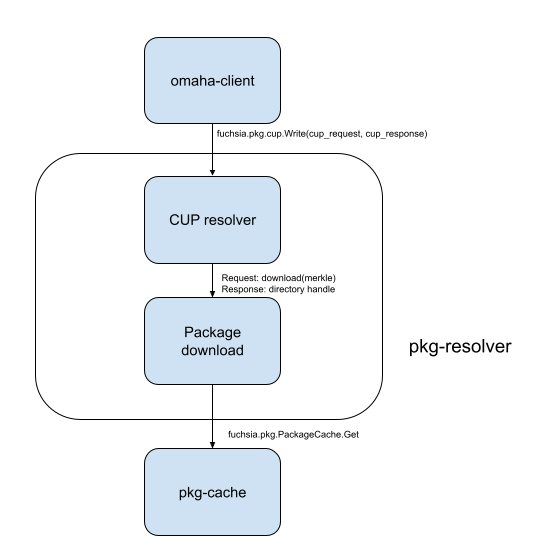

<!-- mdformat off(templates not supported) -->


# {{ rfc.name }}: {{ rfc.title }}
<!-- SET the `rfcid` VAR ABOVE. DO NOT EDIT ANYTHING ELSE ABOVE THIS LINE. -->

<!-- mdformat on -->

## Summary

A mechanism for updating packages outside of full system updates and persisting
them across reboots, with consideration to Component Framework
interaction and the verification process for updated packages.

## Motivation

We need to provide a mechanism for package owners to release updates to software
on devices without requiring a single global integration process. This will
allow the Fuchsia platform and base system to be released separately from
individual package experiences, like a web browser or supporting data.

We aim to support first party (1P) products and packages, including products
constructed outside of the Fuchsia tree. We do not currently have requirements
to support third party (3P) products or packages, but nothing about this design
should preclude us from adding support for them later.

## Stakeholders

_Facilitator:_ `hjfreyer@google.com`

_Reviewers:_

* `ampearce@google.com` - Security
* `computerdruid@google.com` - Software Delivery
* `geb@google.com` - Component Framework
* `hjfreyer@google.com` - FEC, Component Platform
* `jsankey@google.com` - Structured configuration
* `marvinpaul@google.com` - Server infrastructure
* `camrdale@google.com` - Cobalt

_Consulted:_

List people who should review the RFC, but whose approval is not required.

* `aaronwood@google.com`
* `abarth@google.com`
* `bryanhenry@google.com`
* `ddorwin@google.com`
* `gstai@google.com`
* Software Delivery team

_Socialization:_

This RFC has been through multiple internal rounds of socialization as a doc,
with the reviewers, the Software Delivery team, and potential customers.

## RFC Format Definitions

The key words "MUST", "MUST NOT", "REQUIRED", "SHALL", "SHALL NOT", "SHOULD",
"SHOULD NOT", "RECOMMENDED", "MAY", and "OPTIONAL" in this document are to be
interpreted as described in [IETF RFC
2119](https://tools.ietf.org/html/rfc2119).

## Requirements

### Requirements of the Fuchsia Platform

#### Package Updates

Packages can be updated independently from the rest of the Fuchsia system.
Packages can be updated without a system reboot, which implies that
package updates cannot _only_ come as part of a system update.

#### Component Relationships

Package owners must be able to to qualify the release of a
multiple-package group independently of the base system and push out an update
for only the packages and components in that group.

The package relationship should be modifiable (or nullified) to support only a
single package update.

**Note:** We will not be fully addressing this requirement in this RFC. It
corresponds to the next phase of work, and we'll address it in a subsequent
design. Nothing about this design should preclude us from addressing this
requirement in the future.

#### A/B updates: Only use an updated version of a package if all blobs in the package have been updated

A package should be fully downloaded and verified before committing an update.

#### System Version Dependency

Eagerly updated packages may declare a dependency on a particular ABI revision
of the Fuchsia platform (as defined by [RFC-0002][rfc-2], which is a dependency
of this work), and must only be downloaded by versions of the Fuchsia platform
that support their required ABI revision.

#### Metrics

The package update system must support similar metrics to the system
update flow, and provide metrics to package owners such as successful
updates, download times, size in bytes of update (which does not exist today for
system updates), etc.

We must allow package owners to get metrics on their components based on the
versions of those components, based on the version running, which is not
necessarily the version most recently committed to disk.

#### Don't block component startup on downloading updates

Also interpretable as "don't make events like session restart very slow." It
would be easy to make session restarts much slower if we checked for updates of
packages on a session restart or reboot, and didn't have an eager update
checker. This is because the device might have to download an entire package
or set of packages in order to complete the session restart.

#### Rebooting the system should not revert the effects of a successfully applied update

We must not fall back to previous versions of a package on a reboot if the
device does not have network access at the time of the reboot, and we must not
block an application launch if the network is flaky, unless that application is
excessively out of date.

#### We _may_ define policy for what it means for a package to be "sufficiently out of date" and refuse to launch until it is updated

If an application is significantly out of date and an update is known to be
available, we may in the future enter a 'forced update mode' to prevent
launching a known-vulnerable or known-bad version of software.

#### Packages with a single URL in client-side code must be able to contain different code or data depending on device context

Many developers do not want to or cannot change code or manifests each time a
there is an available update for a package they depend on. An example of
this is found in Modular configs, which encode specific component URLs for
Modular components. The developer experience of changing these configurations
for each change in a dependency would be undesirable, and there are additional
cases in which it is impossible.

This implies that a single package URL must represent potentially different
versions of a package depending on where and when it is used (though update
rules for a given package can also embed requirements like system ABI).

Because a single component URL will not be sufficient to determine exactly what
version of software is running, we'll need to add metrics and feedback
integration to obtain that information for debugging flows.

#### Solutions which require a single global manifest of compatible versions are not acceptable long-term

Multiple customers will likely want to release packages without coordinating or
integrating at all with Fuchsia or product owners. Solutions which require a
single manifest of all package versions in a pre-defined tuple from the server
may not meet such a requirement. (This would also violate the Software Delivery
goal that the platform should be capable of producing products which can install
arbitrary software, not known at the build time of the product).

#### Spread package downloads over all parts of the day

Limiting package downloads to a particular time of day (for instance,
around a session restart) means that devices may be chronically offline during
their attempted update window. Updates should download during any available part
of the day.

### Requirements of package hosting and release processes

Some of these requirements will also result in platform features to support
their server-side implementation.

#### Package Repositories

Eagerly updated packages must be hosted on release infrastructure separately and
independently of Fuchsia system update packages and blobs. This guarantees that
repositories hosting Fuchsia platform packages are not affected by any package
changes by applications. This implies for now that platform packages will not be
eagerly updated, though we may later relax this restriction.

If a product wishes to supply its own release infrastructure, it may as long as
it meets the requirements and design points specified in this RFC.

#### Update Channels

Eagerly updated packages must support channel based rollouts, using channel
names that may be distinct from the set of channels used to distribute the rest
of the product. For instance Chrome may wish to use more or fewer channels
than the product on which it is running uses.

This will require client-side support to negotiate the correct channel
assignment.

#### Staged Rollout

Staged rollout is an extension of channel management and the support ensures
users can trigger a percentage based rollout (e.g. 1%, 10%, etc) for their
applications to follow best management practices.

An urgent update mechanism should also be provided to allow for important pushes
to be rolled out quickly to 100% of the population. Note that the
[platform][urgent-updates] provides an urgent update mechanism to allow for 100%
rollout within five hours. **Note**: this is out of scope for this RFC, but is a
long-term requirement.

This will require client-side support to negotiate the correct staged rollout
group.

#### Stepping stones

A 'stepping stone' is a build of a package which any device might have to
download and run before upgrading to the most recently available version.

We have no explicit requirement from a product at this time to support stepping
stones for packages in the short term, but this design considers them a
long term requirement which we are likely to have a request for. We won't
explicitly build support for them in the implementation of this RFC, but we must
not preclude later support for them.

This will require client-side support to negotiate the version to download.

### Security Requirements

*   Make it provably impossible to override a package in the [base
    set][base-packages] with one from an independently updatable repo - see
    [prerequisite properties for updatable package
    groups](#prerequisite-properties-of-updatable-packages)
*   In order to conform to [Fuchsia Verified Execution][fvx](FVX), anything the
    Software Delivery stack loads from disk into memory must always be
    re-verified at load time, as opposed to just once at download time. See [the
    section on cross-reboot
    verification](#verification-of-downloaded-metadata-across-reboots)
*   Make it easy to understand and control what packages can contain executables
    - see [Controls on executability](#controls-on-executability). Packages
    which do not contain executable code are still security sensitive, but out
    of scope for FVX implementation.
*   Make it easy to audit the content of package releases. Have an explicit
    approval process for signing based on technical controls, not just process
    controls - this is out of scope for this RFC in particular, but is covered
    by other documents.
*   Packages must be subject to an antirollback mechanism covered by the
    verified boot chain - see [the section on cross-reboot
    verification](#verification-of-downloaded-metadata-across-reboots)

## Design

This section will attempt to capture the overall flow of a package update
for packages which contain machine code. We'll include where checks on
executability and code verification are made, as well as the developer
experience. We'll highlight gaps between the desired state and current
functionality, and use that to inform implementation strategy.

We'll use Chrome as a representative use case, as it fits well
into this first stage of work:

*   It is a single package to update (e.g. `chrome`)
    *   No dependencies that must be updated in lockstep
*   The package contains executable machine code
*   It requires channel and staged rollout support

### Prerequisite properties of updatable packages

This section details the types of packages that the proposed design will
support in the short term. We expect that over the long term, we'll relax many
of these restrictions.

*   Referred to in code and config files by non-`fuchsia.com` URLs, to avoid
    conflation with base packages
*   Must target a specific system ABI (relies on an implementation of RFC-0002)
*   Can't rely on the config-data package (i.e. must
    not expect config-data to change along with the package in schema or
    contents)
*   May rely on [structured configuration][structured-config]
*   Must have a qualification process outside of Fuchsia Global Integration and
    Fuchsia release qualification that can run on what's included in the SDK
*   Must fit in half the space left over by 2 copies of the base image
    without assuming deduplication with base image files (to allow for A/B
    updates of the package)
*   Can't depend on non-base packages (i.e. other updatable packages)
*   Updates to packages outside of a full system OTA must not change
    the ABI exposed by components in the package in a backwards
    incompatible way, and must not change the expected ABI of services they
    consume from other non-system packages without a versioning strategy for
    those interactions
  * May be single-architecture packages or multiple-architecture packages
*   The dependents of the package must handle resolution errors for that package
    (for example, some edge cases with fallback versions will attempt to
    downgrade a package, which Fuchsia will refuse to run).

### Overview
We propose to use the Omaha Client already used for production system update
checks to check for package updates.

We'll add support to `omaha-client` to check for updates to multiple packages as
well as the system image.

We'll integrate `omaha-client` with the `pkg-resolver` infrastructure to
abstract away whether a developer is using a real Omaha server or a development
server on their local machine.

We'll add support for garbage collection of updatable packages, and safety
measures to ensure that package updates cannot block system OTAs.

We'll integrate with the Omaha server infrastructure to negotiate for the
appropriate version of a package given a particular package URL.

We divide the use cases into two main events: **update checks and package
download** and **package resolution**. The former will run on a timer or when
manually requested by a developer, and trigger package download and caching. The
latter will run whenever a package is *resolved* by the Component Framework.

A full overview of the new package resolution architecture follows. It will be
discussed in detail in the sections below.

### Update Checks and Package Download

#### When to check for an update

`omaha-client` runs a state machine which is configurable per "app" (for Omaha,
this means a set of software which the client is checking for updates).

The current `omaha-client` check interval for system updates in production is
five hours and is automatically jittered to plus or minus one hour. We propose
using the same update check interval for both system images and package
updates, to reduce load on Omaha servers and to simplify implementation when
there is both a system update and an update for a package available. (Note
that we expect over time to decouple the checks for system updates from the
checks for package updates, in both interval and hosting. This is a short
term simplification to make initial implementation simpler.)

#### Where to check for an update (repository configurations)

We will add a new Omaha Client configuration for every eagerly updatable
package, compiled into the SWD stack's configuration on a per-product basis.
This will include a mapping of which package URLs on the system should refer to
that package's configuration. That configuration will include the name and URL
of the package, as well as its Omaha App ID and other default
configuration options like channel.

This has a nice security side effect: eagerly updated packages will not be able
to override packages from other repositories in `user\*` builds, since their
hostnames are hardcoded to different values. Eagerly updated packages will never
be able to override base packages (n.b. fallback versions are not in base), as
packages which have a name in the `/system/static_packages` list will never go
to the network for resolution.

Code in petals, as well as in fuchsia.git will need to be updated to not refer
to `fuchsia.com` URLs for packages, but rather the hostnames corresponding
to the new repositories, such as `chrome-fuchsia-updates.googleusercontent.com`.

We will need to add additional metadata to package update configurations, which
will be parsed by the package resolver. In particular, we will add a boolean
value which specifies whether the package is expected to contain
executable code. This boolean will be used in runtime executability restrictions
similar to the ones already contained in pkgfs. See our [Controls on
executability](#controls-on-executability) section for more details.

At startup `omaha-client` will be given configuration for updatable packages
which originates in [vbmeta][vbmeta]. No runtime configuration is _currently_
possible; this means that in order to do automated testing of `omaha-client`
we'll need to continue constructing a vbmeta as we do in [Omaha E2E
tests][omaha-e2e-vbmeta].

#### Package Negotiation

We define package negotiation as the process of transforming a package URL (like
`fuchsia-pkg://chromium.org/chrome`) into a (hostname, merkle) tuple. The
precise output of this transformation is affected by several variables,
including:

* the update channel the package is set to
* the running system version on the device
* whether there's a staged rollout occurring, and which staged rollout group the
  update checker is part of.

We propose to do package negotiation mostly on the server side, to keep
client-side code as simple as possible.

`omaha-client` will send a request to the Omaha server listed in the package
update configuration with at least the following information:

*   App ID (this is the identifier of the package to the Omaha service)
*   Package update channel
*   Package update flavor (usually encoded in the app id)
    * Flavor is used to request different variants of a package, like one with
      debug symbols or tools. Since it will be encoded in the App ID, it will
      not be possible for a production device to change which flavor it's
      running in the field without a system OTA
*   Supported system ABIs (usually encoded in the platform version field)
*   Staged rollout membership
*   Current package version (in the format A.B.C.D where A-D are string
    representations of 32-bit integers, following the Omaha specification for
    [version numbers][omaha-version-numbers]), so that Omaha can do downgrade
    prevention
    * OMCL will retrieve this from the CUP metadata of the most recently
      committed version of the package, or from the vbmeta version metadata of a
      fallback version, or set this field to `0.0.0.0` if there is no version of
      the package currently on the disk
*   Supported system architecture (e.g. x64, arm64, etc., matching the names in
    the [list of Fuchsia's supported architectures][fuchsia-supported-arch])

The Omaha server will compute the correct version of the package for the device,
and send back a merkle-pinned URL for a blob to download, which contains a
(package host, package name, merkle root) triple to download. We must check the
content of the response against the merkle provided by Omaha before using its
data. The format of the response may match the format of the current `update`
package used for system OTAs.

The response will include the cohort of the device for that app, which will
include channel information. Since the entire response will be signed, we can
use this to effectively determine the channel of the package on boot. The
response cohort is also used for changing the channel of the subsequent requests
(see below section on channel support).

The Omaha response must implement the [Client Update Protocol (CUP)][omaha-cup]
which provides a signature over the Omaha response. We will add support for this
protocol to Omaha Client. CUP is required so that we can persist the response to
disk and later re-verify it based on public keys stored in a base package and
rooted in vbmeta.

##### Channel support

The Omaha protocol supports channels through its [`cohort`][omaha-cohort]
concept.

Since an updatable package might use a different set of channels than the base
system, we will need a new API for developers similar to
[`fuchsia.update.channelcontrol`][fuchsia.update.channelcontrol] in order to
manage channel settings for packages in development. We will store the channel
information in the CUP response similar to how we store channel information in
vbmeta for system updates. We intend to expose this API through an extension to
`pkgctl` as a CLI tool, and potentially to component developers who wish to
change their component's channel at runtime.

For devices with both a committed update and a [fallback
version](#fallback-versions-of-package-required-for-early-boot) of a package, we
should use the channel information from the committed update even if the
fallback version is newer (even if the committed version is older than the
[backstop version](#rollback-protection)), to avoid overwriting channel
assignments by updating the backstop version. We must still validate the
signature on the committed response before we use its channel information.

If an Omaha request contains a channel that does not exist, the Omaha server
should either redirect to a channel that does exist, or we should use the
fallback version.

When a channel change is requested using the channel control API on a Fuchsia
device, that setting shall not be persisted across reboots except in the form of
a persisted signed CUP response with the channel contained in it. We do not wish
to trust unsigned data as a matter of policy. The next update check will use the
in-memory channel, and the response to that update check will be stored once the
correct package version is committed to disk.

Omaha configurations in the system image should contain default channels for
eagerly updated packages. If there is no persisted CUP response for a given
package, Omaha should use the default channel.

If a channel change results in the same version of the package being returned
(because the package is present on two channels), then the download flow should
proceed as normal. `pkg-resolver` will simply not download any new blobs, and
will instead return the blobs that were already on the disk.

##### Staged rollout support

A device is assigned to a cohort by the server based on a random dice roll on
the server (this is an existing Omaha feature), and that cohort ID is used to
track whether a device should be receiving a staged rollout. The dice roll is
independent for each App ID on the server side.

#### Size required for persistence

Omaha requests and CUP responses are quite small, on the order of hundreds of
bytes. We will likely need less than 1KB per package to persist metadata.

### Package download

Once `omaha-client` has the final merkle-pinned package URL(s) computed by the
Omaha server, it will trigger a download of the package(s) using a new protocol
(plausibly called `fuchsia.pkg.cup`) to the `pkg-resolver` component. If the
requested version of a package is already on the device, `pkg-resolver` will not
re-download it.

If the new version of a package is not on the device, `pkg-resolver` will
download the new version and hold open the directory it returns (to prevent
garbage collection). Before returning a handle to the package directory,
`pkg-resolver` must commit the CUP request/response pair to storage for later
reverification.

`pkg-resolver` must keep this directory handle open to avoid the
package getting garbage collected (this design assumes we have garbage
collection based on open package tracking, which is work in progress). It must
drop the handle to the old version of the package.

We will also add a size limit to each updatable package downloaded by
pkg-resolver, in `pkg-resolver`'s configuration. After download, if the package
is larger than the configured limit, `pkg-resolver` will delete all blobs
associated with the package and fail the update with an appropriate error
condition.

A diagram of this flow follows:

#### What happens if a download fails?

A download failure must prevent the CUP result of an update check from being
committed. New resolves will continue to use the previously committed version.

#### Space management and garbage collection

We need to maintain a couple of space-related invariants while downloading
updates for packages:

*   There is always enough space to cache packages required for the core product
    experience to run (for instance, Chrome).
*   There is always enough space to install a system update, or we can create
    enough space to install a system update.

If an eager package update is allowed to use enough un-reclaimable space to
prevent a system OTA, an FDR would be required to remedy it. Preventing this
error condition requires changes to our current garbage collection process.

Our garbage collection mechanism [currently
uses][garbage-collection] the following criteria for
keeping a package:

*   If the package is in the currently running base package set, keep it
*   If the package is the most recently resolved version of a non-base package
    and was resolved during the current boot, keep it
*   Else, allow the package to be deleted.

This strategy works today, but has a couple of notable downsides:

*   It may delete packages that will be needed by the running system in the
    future (if they have not yet been resolved during the current boot)
*   It may not delete packages that have been resolved during the current boot
    but are no longer necessary (like test packages which accumulate over time)

We've been resistant to changing the current garbage collection scheme until we
move away from pkgfs for hosting our package cache. Now that that work is nearly
done, we can implement changes to the garbage collection scheme that allow us to
maintain these invariants, namely a scheme which prevents garbage collection of
packages that are currently in use.

For the short term implementation of eager updates (before we have package
tracking-based garbage collection), we will utilize stringent size checking for
system updates and eager package updates. This means that an updatable package
_must_ fit into the space budgeted for it by the product owner, and we will
check its space requirements at the time of the package upload (managed
centrally, for now). Long term, a better garbage collection implementation will
allow much more flexibility.

#### What happens if we run out of space anyway?

There is always a possibility that a device runs out of space downloading an
update, despite our best efforts to check package size at release time and
ensure everything fits in a budget.

To combat this, we will add a 'nuclear option' for space management, which, when
we run out of space during an OTA, reboots the device with a new reboot reason
(`OUT_OF_SPACE_PANIC`) and runs an OTA immediately on network up, without
waiting for a check interval. This will trigger a garbage collection. The system
update checker should block eager package updates until the OTA completes.

We will add a configuration option to `system-updater` on whether it should
reboot the system on `NO_SPACE` errors. We will give product owners the option
to set this option to true on `user*` builds, but it should default to false on
`_eng` builds to aid debugging. If the option is true and `system-updater` runs
out of space attempting to install an update, `system-updater` will trigger
system reboot with the `OUT_OF_SPACE_PANIC` reason.

On reboot, the system update checker component (either omaha client or
system-update-checker) starts on boot. If the update checker component finds
that the reboot reason is `OUT_OF_SPACE_PANIC`, it will immediately attempt to
run an OTA, while inhibiting package updates.

We will also add a backoff to `OUT_OF_SPACE_PANIC` reboots, to ensure
that if a device reboots multiple times in a row with `OUT_OF_SPACE_PANIC` as
the reason that we do not continue rebooting in a loop.

### Starting a component from an updatable package

Components from an updatable package will get used the next time that component
is resolved through the component framework. On certain products, a nightly
session restart will automatically take care of a component restart, and update
notifications are probably not necessary. However on other products components
may desire a notification of an update so that they can display a "please
restart" notification to the user. See the [future work](#future-work) section
for more details.

#### Resolution flow for the new component

All package URLs will still be of the form
`fuchsia-pkg://{hostname}/{package_name}`. However, given that package
negotiation for some package URLs will be managed by Omaha Client on the device,
and some will be managed by other methods (like `cache_packages` or
`base_packages`), we need a package resolution flow which allows the package
stack to differentiate packages which should be managed through Omaha from
packages which should be managed through other metadata.

To do so, we propose a resolution flow like the following. For a call to resolve
a given package URL using the
[`fuchsia.pkg.PackageResolver`][fuchsia.pkg.PackageResolver.Resolve] protocol,
`pkg-resolver` will

1. Apply base pinning and rewrite rules
2. Determine whether the rewritten URL to be resolved is managed by Omaha + CUP,
   and if so...
2. Ask an internal library which manages CUP packages for the directory handle
   associated with that URL.
3. The CUP library will retrieve the package designated by the merkle cached in
   the most recently committed CUP response for that URL, or fall back to the
   fallback version if an error is encountered and the [requirements for using a
   fallback version](#when-to-use-a-fallback-version) are met. For the version
   of the package it selects, it will go directly to `pkg-cache` and return a
   directory handle (to avoid various race conditions in which a package is read
   as a new one is being written).

A diagram of this flow follows:

#### Controls on executability

`pkg-resolver` being part of the active resolution path on production devices
means it will need to participate in [FVX][fvx] enforcement. The list of keys
that we need to trust will include CUP keys.

We will implement executability controls in `pkg-resolver` which ensure that
on user* builds the only packages which can contain executable code are either:

* in base
* managed by Omaha and configured as executable in pkg-resolver configuration
* allowlisted through the existing `pkgfs_static_packages` allowlist
  [mechanism][pkgfs-executable-allowlist] for executability control

The specific implementation of these controls will be the subject of a follow-on
document.

### Verification of downloaded metadata across reboots

#### Signature Verification and Auditability

In order to persist an updatable package across reboots, we will need to
remember its merkle root. We will persist both the Omaha request and the CUP
response. When we look for a merkle for a package using the persisted data, we
will verify that:

*   the signature of the request/response pair matches trusted keys
*   the request is equivalent to what we _would_ have requested if the device
    had internet (matching on Omaha App ID, channel, and flavor), and
*   the response matches the signature parameters and is a valid response, and
*   the response's intended version is greater than or equal to the backstop
    version in the system image
*   the response contains a package which supports the running system ABI
    version

If all of those criteria are met, the CUP module in pkg-resolver can return the
persisted merkle from the CUP response.

This approach has a downside: we need to parse the persisted request and
response to get the value of the persisted merkle root. However, we believe we
can mitigate this risk in implementation with isolation of the components that
actually do the parsing.

#### Rollback Prevention

This solution relies on rollback protection provided by vbmeta, using
version-based backstopping. If the intended version number in the CUP response
is older than the minimum required version in the configuration of the system
image, we will fall back to versions of packages contained in the OTA images if
they exist, and the version in the response will not be committed.

For an example of implementing rollback prevention with this scheme, let's
assume version 1.0 of an updatable package has a vulnerability that's patched in
1.1. We'd need to direct Omaha to stop serving 1.0 and start serving 1.1, then
issue a system OTA to the fleet with a new backstop version of 1.1. This
provides guarantees no worse than our current monolithic behavior on devices
without Replay Protected Memory Blocks or equivalent functionality.

For packages which do not have a backstop version set, we will add a
timestamp-based backstop which we confirm is older than each CUP response for
that package. This mode would be required to support updating packages which are
not known to the system ahead of time. The backstop time will be set to the
system backstop time, which is currently the timestamp of the Fuchsia build
which generated the system image. We have no current requirements for updating
packages not previously known to the system image, but we should design with
them in mind.

### Fallback versions of package required for early boot

Some packages in updatable packages may be required during the boot process, or
before a device has network (for instance, they may provide a user interface to
the out-of-box-experience (OOBE) that _configures_ the network). This means that
we cannot rely on having network to download certain packages if they are
out of date, and we must include versions of these packages in system
update images. We call these included packages "fallback versions," since
they will generally only be used if another updated version of the package is
not available.

There are several design pressures on fallback versions:

* they must be runnable without network access
* they must persist across a Factory Data Reset (FDR), since they may be
  required for OOBE
* they must be distributed with a system update, and qualified with it
* we must minimize the space that fallback versions use, especially in
  conjunction with other versions of the package
  * a case in which we must store a fallback version, a currently running
    version, and a new, not yet running version of a package would mean we
    need to store _three_ copies of a particular package at once (assuming
    we forbid system updates and package updates happening at the same
    time)
* we must strive to avoid a situation in which a system is running version N of
  a package and a system update forces a downgrade to version N-1 of the
  package, since avoiding downgrades is a useful property to give to
  developers
* while preventing downgrades of packages, we must also avoid rejecting
  system updates due to downgrades

A given package owner should decide whether a fallback version of their package
is required in coordination with the product owner. Fallback versions will not
be required for all updatable packages.

In order to include a fallback version in an OTA image, we will put the fallback
version package in the system update package, and include versioning metadata
for that package in the system's system_image package. The versioning metadata
(mainly its merkle root) will allow `pkg-resolver` to respond to requests for
the package even if it does not have network connectivity. The fact that the
versioning metadata is included in vbmeta means it will not be subject to
deletion by FDRs.

During a system update, we will garbage collect and delete non-committed
versions of an updated package, but we will still potentially need to store
three versions of a package which includes a fallback version: a fallback
version in the current system image, a committed version that's been downloaded
and may be running, and a new fallback version in the new system image.

#### When to use a fallback version

Our CUP module will return a directory of the fallback version if and only if
based on CUP metadata, the fallback version is _newer_ (has a larger version
number) than the most recently committed version of the package on the disk.

In cases where the most recently updated version of a package is corrupt, a
manual Factory Data Reset will clear the stored CUP metadata and allow us to
reset to the fallback version by satisfying condition 1. In future, we can also
use a blob corruption handler to determine that the updated package is corrupt,
and use the fallback version (this is mentioned in Future Work).

It's technically possible that the fallback version in a new system image could
be a downgrade from the most recently committed package. However, in order for
us to use that downgraded fallback, the new system image would have to not
support the required ABI of the most recently committed package. We see a
situation in which a system is released with a _newer_ system ABI and an _older_
fallback version which supports that newer system ABI as infeasible, but we will
investigate adding server-side checks to prevent such a case from ever
occurring.

In the case in which a system update upgrades a fallback version beyond the most
recently committed version, we should prefer using the most recently updated
version of the package, based on the version strings in the CUP metadata.

### Metrics

#### Metrics from updatable packages
For the benefit of 1P package developers, we'll add Cobalt metrics that
automatically aggregate by the package version of a component which produced the
metrics. Cobalt has some current limitations around logging arbitrary strings
(for instance, the hashes of updatable packages). We don't plan on embedding
version numbers or arbitrary other version strings directly in
the package format, but rather embedding those version numbers in CUP metadata
on the client side and using that to report versions to tooling. Since
`pkg-resolver` has access to the CUP metadata for packages, it will be able to
report human-readable version strings for committed packages to Cobalt.

There are several methods by which metrics get to Cobalt, and all need to
support version information:

1. Direct logging from a component
2. Logging from a component on behalf of another, like Sampler which reads
   inspect data about a component and propagates it as Cobalt metrics
3. Logging from a component on behalf of many, like log statistics. This may
   seem like a general case of 2., but represents a need for scalability in
   whatever solution we choose.

Fuchsia's use of Cobalt comes with several requirements for the integration of
updatable packages:

1. Component owners do not wish to use dashboards with versions broken down by
   merkle root, they prefer human-readable strings
2. In order to accurately aggregate by a human-readable version string, we need
   to do so on the device
3. We cannot update the Cobalt registry for each new release of a package, as
   that would defeat the point of an independent package update release flow
4. The data about a component version given to Cobalt may refer to a component
   version that is no longer running, as in the case of log statistics
5. We don't need to support v1 components for the short-term solution (since
   they cannot be updated dynamically), but we do need to report version strings
   for every component that _can_ be updated. Cobalt would like version strings
   for every package, but we will not mandate that all packages must use the new
   format before we can enable version reporting for any packages.

In order to log version strings for packages to Cobalt, we propose a system by
which merkle roots for packages are propagated along with metrics, in order to
keep track of which version of a component emitted a given metric.

We will modify the Cobalt logging protocol to allow for an optional package
identifier field. Once the Cobalt component itself has a merkle root associated
with a particular set of metrics, it can map from that merkle root to a
string-based version string by which to locally aggregate metrics. It may also
combine this merkle root with a component name from another source (like logging
statistics or Sampler data).

We must aggregate by version string on the device rather than sending it off the
device, to conform with Cobalt's privacy requirements. Given that we will likely
have human-readable version information on the device, it is prudent to do the
mapping on the device rather than on a backend system.

Customers also desire a human-readable arbitrary string by which to
partition their metrics. This is supported today by individual packages which
may log their versions, but there is no system-wide system or standard for it.
Android supports this as [version names][android-versioning].

We propose to add another field to CUP metadata for this purpose, transmitted as
an extension to the Omaha response, also called `version-name`. This field will
not be used for anything except processing of version strings by humans, and the
SWD stack will make no guarantees about its uniqueness, nor use it for downgrade
prevention; package owners will need to maintain their own version strings.

##### Validating version strings: new SWD API

Cobalt restricts the types of strings that can be logged for privacy reasons. In
particular, Cobalt cannot trust arbitrary strings (like version strings) not to
contain Personally Identifiable Information (PII). To allow us to log version
strings from components (which cannot be known to Cobalt in advance, as
components may update to arbitrary versions), Cobalt needs a way to validate
from a trusted system component that a particular version string is known to
that trusted system component.

Software Delivery will work with the Cobalt team to validate package identifiers
(either merkle roots or package URLs) and associate them with human-readable
version strings for the purposes of telemetry. When Cobalt attempts to find a
version for a given package based on package identifiers, the SWD stack will
return a version name and version number, if they exist.

We will not currently guarantee version information for arbitrary components
associated with the system image, but we may later standardize on an encoding
for human-readable version information in packages and broaden our guarantee
here.

If a package identifier is not supplied from the logging component to Cobalt (as
may be the case for things like log statistics), Cobalt should report the
version of the currently-running component based on its package identifier.

The Software Delivery stack will expect Cobalt to cache responses to requests
for human-readable version strings. The Cobalt component must avoid calling the
version string API for each metrics call, or it will create unnecessary resource
cost. We may choose to create a bulk API for Cobalt to call periodically to
reduce the amount of FIDL traffic for version strings.

We may later decide to integrate version strings and version names
into the package format, but do not propose to do so at this time.

#### Metrics about the update system itself
We also need to report metrics about the package download process itself, like
success/failure metrics. As mentioned above, Cobalt has some limitations about
logging arbitrary strings for privacy reasons.

However, since Omaha also has backend metrics which have their own privacy
preservation strategy, Omaha itself can provide metrics on the precise number of
devices running particular versions. This is an advantage to this solution vs
the TUF alternative.

For metrics about the update process itself, we plan to utilize Omaha's metrics
as well as working with the Cobalt team to report dimensions based on arbitrary
strings in very limited circumstances (validated by trusted system components).

Finally, we will log the versions of updatable packages from our update
infrastructure to device snapshots, to aid troubleshooting.

## Implementation

We'll likely split this work into phases, corresponding with increases in
functionality.

The first phase could encompass a basic Omaha-based package fetch protocol,
which would require:

* SWD
    * Multi-app support in `omaha-client`
    * Implement CUP, integrate into the package resolution flow
    * Minimal open-source Omaha server for testing
    * Package configuration, mapping of package URLs to Omaha App IDs.
* Server side packaging team
    * Release management in the server side packaging infrastructure, along with
      basic package negotiation like channels and downgrade protection
    * Storage for packages and integration with the blob store.
    * Server-side package negotiation (channel support, staged rollout, etc.)

The second phase will introduce additional security mechanisms needed for
production use, along with safety measures required for space management:

* SWD
    * Implement CUP backstopping
    * Space management: implement open package tracking and overhaul garbage
      collection to enable more flexible package management.
    * Executability restrictions outside of pkg-cache
    * App-specific qualification processes
    * Fallback packages for packages, built into base images
    * Add Cobalt API for validating version strings

* Server side packaging infrastructure
    * Enable CUP
    * Release time provenance and code-signing checks before signing
    * Enhanced package negotiation support, features like staged rollout, ABI
      revision negotiation, etc.
    * Release-time size checking
    * Add interface to package upload to allow specifying version strings

**Note**: this section does not cover implementation of [RFC-0002][rfc-2], which
is a dependency, but has its own implementation plan.

## Performance

We don't anticipate significant runtime performance impact from this change.
We'll need to closely monitor the memory and CPU usage of `omaha-client` and the
other portions of the SWD stack as we roll this change out. We'll also monitor
boot and reboot times for regressions.

This change does introduce potential disk usage increases, in the form of
additional space required to store packages and a small amount of
additional space required to store package metadata. Those considerations
are detailed in the section on [space
management](#appendix-space-management-guarantees-and-garbage-collection).

## Ergonomics

### Eng workflows
We will build out new `_eng` workflows to test and validate package updates
using `omaha-client`. We expect that most developers using packages will use
TUF-based workflows in development, though we will need to build an open-source
Omaha server to run automated tests with before we release platform updates to
production.

We expect that product tools layered on top of SDK tools will eventually add
support for Omaha configuration in eng builds. Until they do, product developers
may have to interact with Omaha configuration directly (as part of their
workflow for setting up a package test).

We will also need to extend our command line tooling to support adding new
dynamically configured updatable packages at runtime.

## Backwards Compatibility

This work should be backwards compatible with existing uses of the Software
Delivery stack, mainly thanks to keeping the TUF flows around while we develop
the Omaha flows, and not changing the package URL namespace structure.

## Security considerations

There are numerous security considerations associated with this solution. First
and foremost, this design introduces [indirect
verification][indirect-verification] to end-user devices for the first time.
It's an inherently riskier security posture, but we feel the tradeoff is
worthwhile, and manageable through all of our existing defenses and planned
mitigations.

Here are the security-sensitive tasks that are different from the TUF
alternative:

* We need to add a new trusted protocol and a parser for it: CUP
* We need to add CUP public keys to vbmeta.
* We will need to make omaha-client an implementer of the
   `fuchsia.pkg.PackageResolver` protocol
* We will need to implement some level of executability restrictions in Omaha
  Client, probably similar to the per-repo-config executability bit detailed in
  Controls on executability.

All of these security tasks are tractable, but will require detailed design and
coordination with the security team.

## Privacy considerations

Any metrics collected by an Omaha server on the server-side cannot be opted out
of - the client has to give its execution context (ABI revision, app ID, etc.)
to a server, and the server may decide to keep metrics on that interaction.

Access to Omaha metrics for Google's Omaha server is heavily restricted, but
does provide precise numbers of how many devices have downloaded a particular
version of software or are running it.

See [the Omaha protocol specification][omaha-spec] for more details on how the
Omaha protocol preserves privacy.

## Testing

Qualification of package releases is covered in [the relevant
section](#updatable-package-qualification).

The changes detailed in the implementation section will need to be extensively
tested. In particular, we'll need to add support for an in-tree Omaha server so
we can run integration tests against Omaha client. We'll also invest in
integration testing the new interactions between Omaha client and the package
resolver.

We will invest in end-to-end testing for our new update flows, using our new
Omaha server.

We will also need to rigorously test our new garbage collection mechanisms, to
include integration tests which fill the disk and ensure that system updates can
still be installed.

Finally, we'll need rigorous verification of our new or changed security
surfaces: CUP response verification and persistence, as well as executability
restrictions.

## Documentation

We'll need to update the Software Delivery documentation on
[fuchsia.dev](https://fuchsia.dev) as we roll out these changes, to detail at
least:

* The model and state transition diagrams for updatable packages
* How to configure updates
* What an Omaha server implementation requires

## Future work

### Update Notification API

Past the implementation of this initial proposal, we'll also make a notification
API available for clients to subscribe to updates about packages (so they can
trigger a component restart if they need to). There are two use cases for update
notifications:

Package resolutions will use the new version of a package when their component
is re-resolved by their parent component, which could be when they restart
themselves or on a session restart.

We propose a new component resolver API which:

*   Resolves a component
*   Provides a channel for notifications about available updates to that
    component
*   Notifies the holder of the other end of the channel when the download of the
    new one has completed and a new version is available, then provides a
    self-restart mechanism

We'll plumb the notification and triggering logic through the component resolver
to the package resolver, which will provide a similar API. We'll also add a
capability for components to request from `framework` to notify the component
that there's an update for itself, which lets the component trigger its own
restart.

### Blob corruption notifications for updated packages
If a package is downloaded and later corrupted, we should either attempt to
re-download the corrupt blob, or we should use the fallback version of that
package if one exists (provided it meets the
[requirements](#when-to-use-a-fallback-version) for using a fallback version).

This would involve integrating with the existing [blob corruption notification
API][blob-corruption-fidl] and triggering a re-download or a wipe of the cached
CUP metadata for a corrupt updatable package.

### Foreground updates for updatable packages which fail to launch

If a component in an updatable package fails to launch, we should give product
owners the option of showing a foreground update screen while the package system
re-downloads the package. This will prevent users needing to FDR their devices
to get a fallback version of the package running.

### Update self-checks for updatable components

Some components may desire the ability to check for updates to themselves and
trigger downloads. We should investigate what customers exist for this feature,
and whether we should integrate it into the component framework and software
delivery APIs.

## Drawbacks, alternatives, and unknowns

### Alternative: Use TUF for package negotiation

Instead of using an Omaha-based protocol, we could use [The Update
Framework][tuf-spec] for distributing package version metadata and transforming
a particular `fuchsia-pkg://` URL into a hostname and merkle of a blob to
download.

The basic design of this would be:

* Add an 'eager update' function to `pkg-resolver` which replicates aspects of
  the current `omaha-client` state machine, and checks for updates for a package
  group periodically.
* Implement channel, staged rollout, stepping stone, etc. functionality by
  overhauling our TUF metadata format and implementing that new format on the
  Fuchsia update servers. This would be significant work.
* When pkg-resolver gets a request for a particular package URL, have it
  download new metadata for all packages in that repository (or use persisted
  metadata if there is no network or route to an update server) and compute the
  correct merkle root to download based on the context of the request, including
  channel, staged rollout membership, etc., all of which would have to be
  persisted locally on the device. This means that the server would not have any
  ability to change its response to a client based on context, all the
  computation would be done locally.
* Store downloaded metadata for each eagerly-updated package, which could
  be significant depending on how many channels and releases exist in the TUF
  repository (based on our estimates, ~3MiB per package with a naive
  approach, or ~82KiB per package if we do more work to enable TUF
  metadata sharding)
* Figure out a Cobalt-based metrics approach which is acceptable to customers
  (gives enough precision on number of devices running a particular version,
  etc.) and doesn't violate Cobalt's design tenets
* Add engineering workflows via `ffx` to support eager update repositories, and
  update developer tooling to support the new TUF metadata format.
* Implement a downgrade-prevention mechanism (Omaha provides this on the server
  side).

There are a couple of upsides to this alternative:

* Clients can 'check their work' because TUF metadata persistence means that all
  the data needed to prove the correct version of a package is physically on the
  device.
* We already use TUF for engineering flows, so we already have a lot of tooling
  for it.
* The notion of a package URL corresponding to a TUF repo and package name is
  useful, and doesn't require any mapping to another service-specific ID like an
  Omaha App ID.

There are also downsides to this alternative:

* We already use Omaha for system updates in production, so this would be
  introducing a second update server that's required to run a production Fuchsia
  device.
* We'd have to re-implement many features that Omaha provides already, including
  staged rollout, channel support, and stepping stones.
* If we get the package negotiation code wrong in a system image, we'll have to
  OTA devices in order to fix it, rather than fixing the negotiation logic on
  the server side

We believe that the downsides to this approach outweigh the upsides, and that
the differences between the two approaches can be mostly abstracted away, so
we've gone with the Omaha-based approach as written above.

## Prior art and references

There are many, many implementations of updatable software packages. Some
significant ones are:

* The [Debian packaging model][debian-packaging]
* The Android [app][android-app] model, including [APEX][android-apex], and [App
  Bundles][android-app-bundles].

References to update metadata protocols are:

* The [Omaha specification][omaha-spec], used by many Google and non-Google
  products, including by Fuchsia.
* [The Update Framework][tuf-spec] specification, which is used by Fuchsia in
  some places today.

## Appendix: Size computation at release time

For devices with a strict size budget, we don't want to interfere with OTAs by
using too much space, so we'll need an optional size budget for packages
which we check at the package's release time.

Fuchsia currently does streaming compression of assets as they're written to
disk, and that compression level is determined at system assembly time. In order
to do pre-computation of how much space a given package will take up, we'll need
to know the compression level of a given system version, and we propose to do
this by **making blobfs compression level and compression scheme part of the
system ABI**. This will allow us to use the same compression parameters on the
server to check whether a package will fit within its budget, and pass the
package into a package repository or fail its release.

As part of the release process, the package server infrastructure will check
whether the app's compressed size (the cumulative size of the set of blobs
compressed using the targeted ABI's compression parameters and tools from the
SDK) fits in the budget configured for the package on the target device.

There is a possibility that no matter how good our size checking is during the
release process, we will eventually break our size checking process and devices
will run out of space attempting to download an update. See our [space
management and garbage
collection](#appendix-space-management-guarantees-and-garbage-collection)
section for more information on how to manage this.

**As an alternative** to checking size limits by mimicking the compression done
on device, we could implement offline compression so that we could know exactly
how much space would be taken up by a given set of files in a package.
However, this work has not been prioritized, and may require substantial changes
to SWD and Storage codebases.

[android-apex]: https://source.android.com/devices/tech/ota/apex
[android-app]: https://developer.android.com/reference/android/app/package-summary
[android-app-bundles]: https://developer.android.com/guide/app-bundle
[android-versioning]: https://developer.android.com/studio/publish/versioning#appversioning
[base-packages]: get-started/learn/build/product-packages.md
[blob-corruption-fidl]: https://cs.opensource.google/fuchsia/fuchsia/+/main:sdk/fidl/fuchsia.blobfs/blobfs.fidl;l=34;drc=e3b39f2b57e720770773b857feca4f770ee0619e
[debian-packaging]: https://wiki.debian.org/Packaging/BinaryPackage
[fuchsia.pkg.PackageCache.Open]: https://fuchsia.dev/reference/fidl/fuchsia.pkg#PackageCache.Open
[fuchsia.pkg.PackageResolver.GetHash]: https://fuchsia.dev/reference/fidl/fuchsia.pkg#PackageResolver.GetHash
[fuchsia.pkg.PackageResolver.Resolve]: https://fuchsia.dev/reference/fidl/fuchsia.pkg#PackageResolver.Resolve
[fuchsia.update.channelcontrol]: https://fuchsia.dev/reference/fidl/fuchsia.update.channelcontrol
[fuchsia-supported-arch]: https://cs.opensource.google/fuchsia/fuchsia/+/main:sdk/fidl/fuchsia.hwinfo/hwinfo.fidl;l=9;drc=e3b39f2b57e720770773b857feca4f770ee0619e
[fvx]: concepts/security/verified_execution.md
[garbage-collection]: concepts/packages/garbage_collection.md
[indirect-verification]: concepts/security/verified_execution.md#direct_vs_indirect_verification
[omaha-cohort]: https://github.com/google/omaha/blob/ebc25b2b3d77eed3d9a122bcfd89a66f6f192e4b/doc/ServerProtocolV3.md#app-response
[omaha-cup]: https://github.com/google/omaha/blob/ebc25b2b3d77eed3d9a122bcfd89a66f6f192e4b/doc/ClientUpdateProtocol.md
[omaha-e2e-vbmeta]: https://cs.opensource.google/fuchsia/fuchsia/+/main:src/testing/host-target-testing/updater/updater.go;drc=bf2c499132832e547ff658f9626dee9245c507df;l=212
[omaha-spec]: https://github.com/google/omaha/blob/1a675d48658b99404702f99b2edbf8556332e6bb/doc/ServerProtocolV3.md
[omaha-version-numbers]: https://github.com/google/omaha/blob/1a675d48658b99404702f99b2edbf8556332e6bb/doc/ServerProtocolV3.md#version-numbers
[pkgfs-executable-allowlist]: https://cs.opensource.google/fuchsia/fuchsia/+/main:src/sys/pkg/bin/pkgfs/pkgfs/package_directory.go;l=205;drc=c1465e2b83b7a24d2d9d4a991236fb41e68ca833
[retained-packages-api]: https://cs.opensource.google/fuchsia/fuchsia/+/main:sdk/fidl/fuchsia.pkg/cache.fidl;l=201;drc=896f3220d71b442b44da13bc04a5634993488330
[rfc-2]: contribute/governance/rfcs/0002_platform_versioning.md
[rfc-component-scoped-executability]: https://fuchsia-review.googlesource.com/c/fuchsia/+/543282
[structured-config]: contribute/governance/rfcs/0127_structured_configuration.md
[tuf-spec]: https://theupdateframework.github.io/specification/latest/
[urgent-updates]: https://cs.opensource.google/fuchsia/fuchsia/+/main:src/sys/pkg/bin/omaha-client/src/install_plan.rs;l=22;drc=c3dfd63bde9855d52c32541a4ae9d30c1fe05b59
[vbmeta]: https://android.googlesource.com/platform/external/avb/+/b3947a2fc1751f2f3afbb372412c3b4028e715a5/README.md#The-VBMeta-Digest
