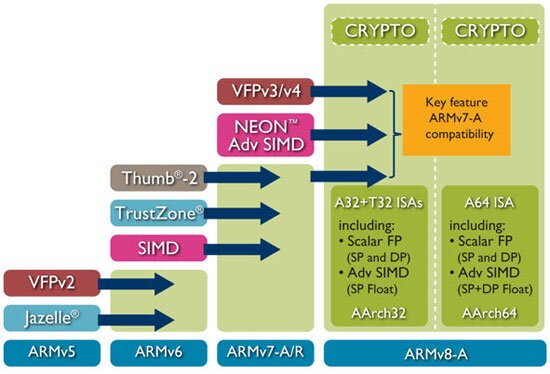

<!-- mdformat off(templates not supported) -->


# {{ rfc.name }}: {{ rfc.title }}
<!-- SET the `rfcid` VAR ABOVE. DO NOT EDIT ANYTHING ELSE ABOVE THIS LINE. -->

<!-- mdformat on -->

## Summary

Proposed changes to compiler flags that govern CPU targeting, and their effects
on the platform and SDK build.

Note: To skip the background information given below, jump directly to the
[proposal](#proposal).

## Motivation

Fuchsia's build produces many artifacts that comprise executable machine code
for different architectures. For instance: [prebuilt][cipd-prebuilt] shared
libraries that are [published][cipd-publish] for SDK use, or executable C/C++ or
Rust binaries that are included in platform and product system images. When
generating machine code in a compiler, it's important to indicate the following:

**Target architecture**: What instruction set architecture to use? For instance
x86-64 or AArch64 ISA. Furthermore the compiler may target revisions of an ISA.
Revisions may offer additional instructions or variations on existing
instructions, such as new floating point or SIMD instructions, or wider atomic
memory operations, that can significantly improve performance. It is critical to
know the target architecture to produce code that is guaranteed to work on
targeted devices. "Raising" the target architecture unlocks new features at the
cost of backward compatibility with older hardware.



_Above_: progression of ARM ISA ([source][arm-blog])

**Target micro-architecture**: How is the ISA implemented? This is typically
expressed in terms of whether instructions are executed in-order or
out-of-order, decoding bandwidth, cache load latencies, etc. Specifying a target
micro-architecture allows the compiler to produce machine code that may run
faster on targeted hardware, without constraining hardware compatibility.


_Above_: Intel Core 2 micro-architecture block diagram
([source][wikipedia-core2-diagram])

Compilers allow users to specify these targets in ways that we will review
later. Fuchsia's build system is able to configure compilers on a global or
per-binary basis. The existing implementation of CPU targeting in Fuchsia's
build has several shortcomings, which this RFC aims to address:

1. The choice of a baseline configuration for arm64 targets a specific CPU
   ([Cortex-A53]{:.external}), rather than an ISA plus features used. This makes
   for a poorly defined platform baseline.

1. It's unclear how to set overrides for this baseline due to lack of prior art
   and no documented policies or best practices. As a result, Fuchsia builds all
   but fall back to the baseline, including build configurations that target
   hardware that's explicitly outside the baseline.

These shortcomings have been present since the build's inception in 2016, and
before that in prior art that Fuchsia evolved from. The present system was to
ship Fuchsia on a first device (which happens to use the same micro-architecture
as the present-day platform arm64 baseline).

Recent developments indicate that it's time for an overhaul. Specifically, in
addition to the Astro and Sherlock board configurations that target Cortex-A53,
Fuchsia now supports the Nelson board configuration ([Cortex-A55]{:.external})
and the Atlas board configuration (Intel Amber Lake). However these builds are
currently not configured to take advantage of the differences between the
baseline and the actual target.

Additionally, there is growing interest in refining the definition of the
platform's hardware baseline, or in increasing it. A clearer definition of the
baseline configuration and of specific board configurations would accelerate
related efforts. See also:

- [RFC-0073: Raising x86-64 platform requirement to x86-64-v2][rfc-0073]
- [RFC-0111: Initial Fuchsia hardware platform specifications][rfc-0111]
- [RFC-0130: Supported Hardware][rfc-0130]

To meet present and future challenges, this RFC proposes immediate-term changes
to be made to CPU targeting in the build, as well as mechanisms and policies to
govern targeting in the foreseeable future.

## Stakeholders

_Facilitator:_ `cpu@google.com`

_Reviewers:_

- `aaronwood@google.com` - System assembly
- `digit@google.com` - Build
- `mcgrathr@google.com` - Kernel
- `mvanotti@google.com` - Security
- `maniscalco@google.com` - Kernel
- `phosek@google.com` - Toolchain
- `travisg@google.com` - Kernel

_Consulted:_

Since the proposed changes affect much of the platform, all parties are
encouraged to self-appoint as consulted. I would especially welcome feedback
from teams such as Graphics, Media, and SDK.

_Socialization:_

The highlights of this proposal was first reviewed as a 60 minutes presentation
and open discussion at Fuchsia's Kernel Evolution Working Group.

## Background

### Compile-time tuning flags

Fuchsia uses clang to compile C/C++, with some subsets of Fuchsia code also
continuously building and testing with gcc. Both tools offer the following
flags:

**`-march`**: Sets the target architecture, for instance `x86-64-v2` (our
current x64 baseline per [RFC-0073]) or ARMv8-A. Optionally also specified
additional architecture features, for instance `+avx2` to indicate Intel Haswell
extensions that are greater than the x64 baseline.

**`-mtune`**: Sets the target microarchitecture, for instance `cortex-a53` or
`haswell`. When neither `-mtune` nor `-mcpu` is used, then this value is set to
`generic` to target a balance across a range of targeted CPUs.

**`-mcpu`**: Sets the target CPU. Accepts similar values to `-mtune`. For ARM
CPUs this is equivalent to setting the target architecture (`-march`) and target
microarchitecture (`-mtune`) to match the target CPU. On x86 this is considered
[deprecated][gcc-x86-flags], and the value given is redirected to `-mtune`.

The Rust compiler offers [codegen options][rust-codegen] as follows:

**`target-cpu`**: Similar to `-mcpu`, accepts for instance `cortex-a53`.

**`target-features`**: Similar to `-march` features, for instance `+avx2`.

### Present state

Currently all x64 builds are compiled with `-march=x86-64-v2`, and all ARM
builds are compiled with `-mcpu=cortex-a53`.

There exists a mechanism for overriding this configuration via a GN argument
named `board_configs`, which can be overridden by a board configuration in a
`.gni` file. Some boards, specifically Astro and Sherlock, manually specify the
Cortex-A53 configuration described above, though this is currently a no-op as
the same configuration also serves as the fallback if no override is defined.
Most board configurations do not set `board_configs`.

## Tuning objectives and tradeoffs

This section briefly reviews different objectives to consider when setting CPU
targeting options, and some of the tradeoffs between them.

**Hardware compatibility**: Targeting an earlier revision of an ISA unlocks
compatibility with older hardware. Greater compatibility comes at the cost of
losing access to new ISA features that can have performance or security
benefits.

**Performance**: New instructions can deliver performance gains: faster or wider
atomic operations, accelerated math (FPU, SIMD improvements), built-in
accelerators for common algorithms (such as CRC and AES). Tuning machine code
for a given CPU can produce code that runs faster on the target CPU, though
often at the expense of performance on other CPU that are outside the target
parameters.

Interplay with binary size: tuning has been observed to increase binary size
under some circumstances, for instance when instruction scheduling optimizations
targeting in-order processors increase register pressure.

**Binary size**: Some codegen features are unlocked with certain CPU features.
For instance SIMD enables [auto vectorization][llvm-vectorizers]{:.external},
which has a similar effect to loop unrolling in that it generates code that is
faster but also larger. Instruction scheduling tuned for in-order CPUs tends to
generate larger code because it adds more scheduling constraints and can
increase register pressure and register spilling.

Other codegen features can decrease binary size. For instance replacing
algorithms such as CRC and AES with specialized instructions produces code that
is both faster and smaller.

**Ease of troubleshooting i.e. binary diversity**: Tuning for different CPUs
means producing more binary variants of the same logical artifacts over time.
For instance, multiple "flavors" of the kernel image or of prebuilt shared
libraries, each optimized for a different target. This can make reproducing
issues more complex, or expose Fuchsia to issues that manifest in some binary
variants but not others.

**Level playing field**: In addition to baseline builds, Fuchsia may offer SDK
prebuilts (system image, redistributable shared libraries) that are tuned to
particular CPUs. Doing so affords a narrow privilege to some hardware choices
over others. It's reasonable to assume that creating SDK flavors that are tuned
to some CPUs will create a future expectation of offering more tuned SDK release
channels.

**Simplicity**: All of the above adds complexity to understanding Fuchsia, to
developing on Fuchsia, and to maintaining Fuchsia. The tradeoffs expressed above
are for setting CPU targeting options to introduce binary diversity where it is
already feasible, on build and distribution channels that are intended for
specific hardware such as build and release pipelines that target OTA channels
for specific user hardware. At the time of this writing there simply isn't a
mechanism for system or package delivery that can offer multiple binaries to
different target hardware, matching the right binary to the right device.

## Proposal {#proposal}

The immediate proposed modifications can be seen in [this change][fxr-623461].
Additional explanation is given below.

### New arm64 baseline hardware target

The current baseline for arm64 is defined as targeting Cortex-A53, as follows:

```none
-mcpu=cortex-a53
```

This is technically equivalent to expressing `-march` in terms of a precise set
of Cortex-A53 features, and tuning codegen for Cortex-A53.

```none
-march=<armv8a + Cortex-A53 features>
-mtune=cortex-a53
```

Instead, the baseline will express the ARMv8-A ISA features that are actually
exercised by the platform and are therefore assumed as baseline, then tune
codegen for a generic armv8a CPU.

```none
-march=armv8-a+simd+crc+crypto
-mtune=generic
```

The effect on `-march` is effectively a no-op, since removing `-march` features
that are supported in Cortex-A53 but not exercised in the code is a no-op.

The effect on `-mtune` is minimal or none, since a generic tuning target
optimizes for a typical in-order ARMv8-A CPU, such as Cortex-A53.

### Changes to existing x64 baseline hardware target

The current baseline for x64 is:

```none
-march=x86-64-v2
```

This subject was previously covered in the above-mentioned
[RFC-0073: Raising x86-64 platform requirement to x86-64-v2][rfc-0073].

This will be change to the flag set below:

```none
-march=x86-64-v2
-mtune=generic
```

This is not a behavior change, since `-mtune` defaults to `generic` when
neither `-mtune` nor `-mcpu` is specified, as previously explained. However,
adding `-mtune=generic` makes this behavior explicit and is consistent with the
definition for the arm64 baseline.

### Board-specific configuration

The `board_configs` board argument, specified in board-specific `.gni` files
(such as those found in `//boards/`), will continue to be used to override the
baseline configuration with a board-specific configuration.

Specifically, board configurations such as `astro.gni` and `sherlock.gni`, which
use Cortex-A53, will continue to target Cortex-A53 and will keep the current
`-mcpu=cortex-a53` configuration.

Essentially this RFC is taking the existing arm64 configuration that targets
Cortex-A53 and extracts it from the platform baseline to the board-specific
configurations for Astro and Sherlock boards that carry such CPUs. Then, this
RFC redefines the platform baseline in ARM ISA terms that generalize to many
hardware choices, rather than in terms of a single ARM CPU.

Additionally, it's possible to add support for optimizations targeting different
architecture variants (such ARM Cortex-A73 or Intel AVX extensions) in future
releases of the SDK. This merits further discussion and is out of scope.

### Kernel configuration

The `board_configs` argument will no longer apply to the kernel image. This is
for the following reasons:

1. Newer instructions or other CPU features that need to be known at codegen
   time don't currently present benefits to the kernel.

1. Micro-architecture based tuning of kernel code doesn't present a benefit to
   counter the cost of increasing binary diversity and complexity.

The kernel can continue to provide information about supported hardware
capabilities, such as with the
[`zx_system_get_features`][zx_system_get_features] syscall.

Additionally, the kernel can still take advantage of some newer hardware
features such as 64kB memory pages which don't require generating different
code, only querying for the presence of these features at runtime. If a new
feature such as this is introduced that requires board-specific configuration
then it's easy to introduce a new argument `kernel_board_configs` that defines
the associated flags.

## Backwards Compatibility

The immediate changes proposed in this RFC do not raise Fuchsia's minimum
hardware requirements, so there is no impact to backwards compatibility. Future
changes that do raise the minimum requirements may be aided by the policies that
this RFC advocates for.

## Security considerations

Fuchsia uses or intends to use several CPU features that improve security or
support the use of sanitizers (which then improve security). These are generally
not controlled by the compiler flags discussed here and so are not of concern.

Notably:

- [Userspace Top-Byte-Ignore][arm-tbi]{:.external} (see also [RFC-0143] is
  supported universally across AArch64.
- New instructions that improve sanitizer support (such as
  [ARM MTE][arm-mte]{:.external}) or mitigate vulnerabilities by ensuring
  control flow integrity (such as
  [Pointer Authentication and Branch Target Identification][pacbti]{:.external}
  or [Intel Control-flow Enforcement Technology][intel-cet]{:.external})
  are in the NOP-space, making them backwards-compatible (in the sense that
  older CPUs execute them as NOPs). As such using these instructions doesn't
  require raising the minimum supported ISA for the platform or for an SDK
  flavor.

## Testing

**Correctness**: Changes to CPU targeting should never compromise correctness.
This is verified with continuous presubmit and postsubmit testing. The present
systems are sufficient to ensure this.

**Performance**: Changes to CPU targeting often have performance implications.
Fuchsia's Perfcompare system will be used to validate any such changes, as has
been the case [before][rfc-0073-performance].

**Binary size**: Changes to CPU targeting often affect binary size in subtle
ways. Specifically, Fuchsia is currently tracking the size of the Astro image
most closely, since this is the most constrained target that we have. The
immediate changes do not regress this size. Future changes that affect specific
product images can be reviewed and carefully considered on the tradeoffs by the
owners of those product definitions.

## Drawbacks, alternatives, and unknowns

CPU targeting presents many engineering and business tradeoffs among
sometimes-conflicting objectives. These are reviewed above. Future changes that
shift these tradeoffs and future tuning opportunities and considerations are
outside the scope of this RFC.

[arm-blog]: https://community.arm.com/arm-community-blogs/b/architectures-and-processors-blog/posts/the-armv8-a-architecture-and-its-ongoing-development
[arm-mte]: https://community.arm.com/arm-community-blogs/b/architectures-and-processors-blog/posts/enhancing-memory-safety
[arm-tbi]: https://developer.arm.com/documentation/den0024/a/ch12s05s01
[cipd-prebuilt]: /docs/development/prebuilt_packages/prebuilt_cipd_packages_in_fuchsia.md
[cipd-publish]: /docs/development/prebuilt_packages/publish_a_cipd_symbols_package_for_elf_binaries.md
[cortex-a53]: https://developer.arm.com/ip-products/processors/cortex-a/cortex-a53
[cortex-a55]: https://developer.arm.com/ip-products/processors/cortex-a/cortex-a55
[fxr-623461]: https://fuchsia-review.googlesource.com/c/fuchsia/+/623461
[gcc-aarch64-flags]: https://gcc.gnu.org/onlinedocs/gcc/AArch64-Options.html
[gcc-x86-flags]: https://gcc.gnu.org/onlinedocs/gcc/x86-Options.html
[intel-cet]: https://www.intel.com/content/www/us/en/developer/articles/technical/technical-look-control-flow-enforcement-technology.html
[llvm-vectorizers]: https://llvm.org/docs/Vectorizers.html
[pacbti]: https://community.arm.com/arm-community-blogs/b/architectures-and-processors-blog/posts/armv8-1-m-pointer-authentication-and-branch-target-identification-extension
[rfc-0073]: /docs/contribute/governance/rfcs/0073_x86_64_platform_requirement.md
[rfc-0073-performance]: /docs/contribute/governance/rfcs/0073_x86_64_platform_requirement.md#performance
[rfc-0111]: /docs/contribute/governance/rfcs/0111_fuchsia_hardware_specifications.md
[rfc-0130]: /docs/contribute/governance/rfcs/0130_supported_hardware.md
[rfc-0143]: /docs/contribute/governance/rfcs/0143_userspace_top_byte_ignore.md
[rust-codegen]: https://doc.rust-lang.org/rustc/codegen-options/index.html#target-cpu
[wikipedia-core2-diagram]: https://commons.wikimedia.org/wiki/File:Intel_Core2_arch.svg
[zx_system_get_features]: /docs/reference/syscalls/system_get_features.md
