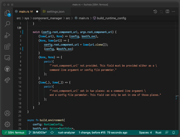
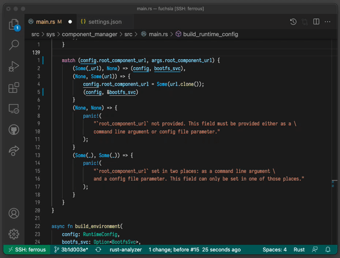

<!-- mdformat off(templates not supported) -->


# {{ rfc.name }}: {{ rfc.title }}
<!-- SET the `rfcid` VAR ABOVE. DO NOT EDIT ANYTHING ELSE ABOVE THIS LINE. -->

<!-- mdformat on -->

<!-- This should begin with an H2 element (for example, ## Summary).-->

## Summary

This RFC proposes to use a temporary customized version of the open-source
[Ninja][ninja-build] tool, used by the Fuchsia platform build, in order
to integrate several existing third-party patches that significantly improve
its performance and usability, and which the upstream maintainer(s) have
not been able to accept yet for a variety of reasons explained in the
[Motivation](#motivation) section.

[ninja-build]: https://ninja-build.org/

In particular, doing this would allow to:

- Reduce the total build time noticeably, by optimizing the scheduling
  algorithm used by Ninja.

- Improve the status reporting and logging, as well as solving a
  [serious usability issue](https://fxbug.dev/92532) that routinely
  triggers in our CI builds.

- Improve the responsiveness and general performance of Ninja without
  changing its behaviour. For example by speeding up certain Ninja
  operations 22x.

- As an outcome of the above, significantly speed up integration between
  the build system and IDEs such as Visual Studio Code and Vim, by making
  it possible to regenerate IDE bindings in a fraction of the time, and
  providing great interactive code-editing experience.

Customization would be achieved by maintaining a custom git branch on
`https://fuchsia.googlesource.com/third_party/ninja`, which would be managed
using a [disciplined branch strategy](#branch-strategy) that closely tracks
upstream, as well as keep it expressible as a series of small patches on
top of recent upstream history.

The situation of this experimental branch will be revised in Q3 2022, since
there are plans to help upstream maintainers accept pull requests of interest,
but these depend on many external factors that are out of scope for this RFC.
It is expected though that by that time the custom branch will no longer be
needed.

## Motivation

The [Ninja][ninja-build] build tool was developed by Evan Martin at Google as
an experiment while he was working for Chrome
[1](http://neugierig.org/software/blog/2020/05/ninja.html).
The experiment succeeded, turned into a very useful tool that became part of
the official Chrome build and was open-sourced. It was then quickly picked up
by a number of other build configuration tools or systems that are widely
deployed, including today:

- The GN build tool, now used by Chrome, Fuchsia and Pigweed projects.
- The Blueprint and Kati tools, used by the Android project.
- The CMake build generator, which supports Ninja as a backend.
- The Meson build system, used by many Linux open-source projects.
- LLVM, which developers can build with either CMake or GN, which
  includes Fuchsia team members who contribute to LLVM.

[Ninja][ninja-build] is now being used by thousands of developers worldwide,
and is maintained as an open-source project on GitHub. Ninja's maintainers
try to ensure that the project remains true to its original goal of being
small, simple, reliable and extremely portable.

Due to a number of reasons, progress on the upstream Ninja project remains
slow, with a large number of interesting pull requests that have been
waiting for review for several months, if not years. The current maintainer
has been contacted privately, and recognizes that regrettably, this is mostly
due to lack of time to properly review and test non-trivial changes, and that
this is also a consequence of the state of the regression test suite, which is
currently very basic, requiring manual testing of pull requests in many cases.
Said maintainer would also first appreciate any help to ramp up said test
suite in the Github CI in order to facilite and speed up Ninja's maintenance
and evolution. As an example, he is not opposed to switching the codebase from
C++03 to C++11, as long as there is a guarantee that the code compiles and works
correctly on older distributions (namely Centos 7, Debian 8, Ubuntu 18.04 and
OSX 10.12) using their default toolchains, enforced by proper continuous
integration verification.

There are unfortunately a large number of blocking issues like the one describe
previously, and solving all of them requires a non-trivial amount of work that
the Fuchsia build team currently doesn't have the capacity to achieve right now.

This RFC provides a technical proposition to temporarily work-around this
limitation, even though it is strongly hoped that proper head-count could be
dedicated soon to address the situation in cooperation with the upstream
maintainer(s). Such head count could come from the Fuchsia project, or a joint
effort with other teams at Google who have expressed in interest in Ninja's
future evolution and improvements. However, funding such work is out-of-scope
for this RFC.

In the meantime, a customized branch of Ninja would allow cherry-picking the
most impactful pull requests, with the greatest benefits to Fuchsia developers.
To ensure that this branch keeps as close as possible to upstream, a
[disciplined branch strategy](#branch-strategy) will be enforced to ensure
that the Fuchsia branch is always expressible as a series of patches on top
of recent upstream releases.

Note that this situation is very different from the
[custom Android Ninja fork][android-ninja] which has deviated from upstream
significantly since its creation, and lacks features required by the Fuchsia
build.

[android-ninja]: https://android.googlesource.com/platform/external/ninja/

The most interesting pull requests, that motivate this RFC are the following:

### Faster builds using better scheduling algorithms

Three open pull requests have the potential to reduce build time in
important ways. They both modify the way Ninja picks up new commands to
launch based on different conditions:

* [PR 2019][pr-2019-critical-build-path]: Assign priorities to commands to be
  launched, using the build log to estimate their duration. The author states
  that this reduces the build time of a large build project from
  [20 to 15 minutes!](https://github.com/ninja-build/ninja/pull/2019#issuecomment-907457615)

* [PR 1949][pr-1949-consider-remaining-capacity]: Limits spawning new commands
  to avoid saturating the load limitation. This avoids overloading the build
  machine when spawning too many processes that fight for the same CPU
  resources. The author claims that reduces a test build from 22 to 15 minutes
  under certain conditions.

* [PR 1140][pr-1140-jobserver-support]: Adds support to Ninja for
  [GNU Make jobserver][make-jobserver], which is a way for Ninja and the
  commands it executes to coordinate their allocation of CPU processes.
  This comes from the Kitware branch of Ninja. Note the similarities with
  the previous PR. No timings were posted by the author, and is less likely
  to be useful, since it requires invoked programs to support this explicitly.

[make-jobserver]: http://make.mad-scientist.net/papers/jobserver-implementation/
[pr-1140-jobserver-support]: https://github.com/ninja-build/ninja/pull/1140
[pr-2019-critical-build-path]: https://github.com/ninja-build/ninja/pull/2019
[pr-1949-consider-remaining-capacity]: https://github.com/ninja-build/ninja/pull/1949
[pr-1958-remove-using-namespace-std]: https://github.com/ninja-build/ninja/pull/1958

### Fixing Ninja's build output for long commands.

During a build, Ninja only prints status lines for commands that have
completed. In practice, when a long running command that stalls the build is
running then:

- If the command times out, as it happens on our CI bots during very
  long Rust link commands, there is absolutely nothing in the output or the
  Ninja log files to tell which target/command actually expired!

- On a terminal, the single-line status seems frozen, and still displays
  the name of the last completed target, which is
  [confusing](https://github.com/ninja-build/ninja/pull/1320#issue-255419782)
  (many developers assume it is the root cause for the delay). The only way to
  see what is really going on is to use "ps" in another terminal, but few
  people actually know that.

The first point is [a problem for the Fuchsia build](https://fxbug.dev/92532),
that cannot be solved without modifying Ninja. The second one is a usability
annoyance that has been bugging users for several years, to the point where
there exist several pull requests to fix it in different ways:

- [Print "still waiting" for long running commands #678][pr-678].
- [Proposed/still running #629][pr-629].
- [Print finish status for interrupted edges #1026][pr-1026].
- [Print when command starts #1158][pr-1158].
- [Add `NINJA_STATUS_STARTED` and `_FINISHED` #1191][pr-1191].
- [While waiting for only one edge, print status for that edge][patch-waiting].

[pr-629]: https://github.com/ninja-build/ninja/pull/629
[pr-678]: https://github.com/ninja-build/ninja/pull/678
[pr-1026]: https://github.com/ninja-build/ninja/pull/1026
[pr-1158]: https://github.com/ninja-build/ninja/pull/1158
[pr-1191]: https://github.com/ninja-build/ninja/pull/1191
[patch-waiting]: https://github.com/ninja-build/ninja/pull/1158

And this is due to the fact that Ninja's output is text-based, with a pretty
limited format, which also includes *arbitrary command outputs*, in case
of error. This creates [all kind of subtle issues][frontend-issues],
and [makes the output difficult to parse reliably][parsing-reliability].

[frontend-issues]: https://github.com/ninja-build/ninja/labels/frontend
[parsing-reliability]: https://github.com/ninja-build/ninja/pull/1210#issuecomment-379688080

Indeed the current behaviour was [introduced intentionally][pr-999]
in 2015 to solve the issue that
[Ninja's build output was not machine parseable][pr-1010].
Hence, any change in the output format is considered very risky by
upstream.

[pr-999]: https://github.com/ninja-build/ninja/pull/999
[pr-1010]: https://github.com/ninja-build/ninja/issues/1010

However, in the context of Fuchsia, where the scripts that parse
the Ninja output are controlled by the Fuchsia infra team, a small change
to the output format makes sense if it can get rid of the problem completely.

### Serialized status updates for better log filtering

Another interesting feature of the Android customization is a work-around
for the output limitation, which instead sends status updates to an external
"frontend" program, as a stream of structured binary data.

This has allowed the Android team to store multiple output streams with
different levels of logging, collect errors messages into a separate file,
as well as produce accurate build traces that can be loaded with
chrome://tracing.

For the Fuchsia build, it should be possible to extract that feature from
the Android branch to get the same benefits.

Note that this was proposed as a pull request, but was rejected after some
[long][pr-1210] [discussions][pr-1600] where upstream concluded that a
better way to solve the output parsing problem is to
[turn Ninja into a library][ninja-as-a-library], a *considerably* larger
effort given the state of the code base (someone tried to do it with
[an experimental PR that requires 120 commits][pr-1729]).

[pr-1210]: https://github.com/ninja-build/ninja/pull/1210
[pr-1600]: https://github.com/ninja-build/ninja/pull/1600
[ninja-as-a-library]: https://github.com/ninja-build/ninja/pull/1600#issuecomment-517986673
[pr-1729]: https://github.com/ninja-build/ninja/pull/1729

### Improved developer experience

The Android branch has implemented dramatically faster (up to 22x) parsing of
Ninja input files, through the use of threads to parse splits of the inputs,
determined at proper token boundaries anad merged in a final pass.

This was motivated by the fact that the Android build tools generated around
1.2 GiB of Ninja build plans which took 12s to parse before doing anything
(on a powerful workstation with hot filesystem caches).

The Fuchsia build is reaching a similar situation, unfortunately, generating
around 800 MiB currently of Ninja build plans, which take up to 10s to parse,
making the experience of incremental builds annoying. The Fuchsia build team
thinks these improvements are significant and should be integrated into the
Ninja version used by the build.

When writing code, compiler error messages and warnings are the first line of
feedback to the developer. This is especially true in static languages and
becoming more true in newer languages like Rust that are designed to check a
wide range of conditions at compile time. Therefore the time to get feedback
is critical for developer productivity. Every second spent waiting for compiler
output is a second the developer is left guessing whether their code is correct
or at risk of being distracted by something else, and fast feedback is
especially critical for programmers who are still learning a language.

The most productive environments give feedback instantly in the development
environment once a file is saved. This feeling of "flow" is so important that
Fuchsia developers have created tooling to allow them to use an entirely
different build system, cargo, to get quick feedback and testing cycles.
This tooling is still in use by some developers despite being unsupported
and breaking fairly regularly.

For Fuchsia, Ninja takes up to 10 seconds at the beginning of every invocation
to parse its own build files (the `build.ninja` file and the other ones
it includes). That's a very large lower bound on how quickly we can deliver
feedback, and at least 25x slower than what we can provide with cargo today.
By cutting parse time down by 25-100x, combined with other tooling workstreams
rolling out this quarter, we can take the experience of writing code for
Fuchsia from "snails on a chalkboard slow" to "snappy and responsive". The
result will be faster development cycles, happier engineers, and higher
quality software.

Below you can see a screen capture of the current experience of changing code
in an IDE and reviewing compilation errors.



The delay in developer feedback is almost fully attributable to time that Ninja
spends parsing its files. Compare to this demo below of the IDE experience
that's possible with a patched Ninja.



Similarly, `fx setup-go` was created to use the Go build system exclusively
during local development, precisely because incremental builds with Ninja
are too slow.

Note that this exact feature was proposed in 2019 by the Android team, but
was rejected by upstream maintainers at the time, due to its requirement for
C++11, which was not considered acceptable yet. Time have passed since then
and such a switch could be considered, granted the guarantees described in
the motivation section are enforced.

### Improved user interface

The [following PR](https://github.com/ninja-build/ninja/pull/1020) was
submitted to implement a table-like status output in interactive terminals,
inspired by the Buck build system (see
[animated example](https://buckbuild.com/static/buck-build-15fps.gif)).

The PR was dropped by its author, but could be rebased to provide a very
nice UI improvements when building Fuchsia locally.


## Stakeholders

_Facilitator:_

`pascallouis@google.com` has been appointed by FEC to shepherd this RFC
through the RFC process.

_Reviewers:_

shayba@google.com, Build
maruel@google.com, Fuchsia Platform EngProd
abarth@google.com, Platform Lead

Other team members who actively participated in prior conversations on this
topic:

brettw@google.com, (as Fuchsia Tools contributor).
fangism@google.com, Build
haowei@google.com, LLVM for Fuchsia
jayzhuang@google.com, Build
olivernewman@google.com, Fuchsia CI
phosek@google.com, Fuchsia Toolchain

_Consulted:_

fangism@google.com, Build
jayzhuang@google.com, Build
tmandry@google.com, Rust on Fuchsia
rudymathu@google.com, Fuchsia EngProd

_Socialization:_

The idea was first proposed by tmandry from Rust on Fuchsia team, then
socialized on Google-internal email threads, and is now presented here
in a publicly accessible forum for further discussion and approval.


## Design

A Fuchsia-controlled git repository will be used to fork the upstream Ninja
`master` branch, in order to manage a branch containing Fuchsia-specific
customizations, while tracking the upstream `origin/master`. Patches will
be reviewed by the OWNERS of the branch and should be considered on a
case-by-case basis in terms of:

* Benefits provided
* Maintainability of the patch
* Divergence from upstream, which affects maintainability.

As well as other criteria the owners see as appropriate.

The list of local modifications will be tracked in a
[`FUCHSIA.readme`]((/development/source_code/third-party-metadata.md)
file as standard practice.

The maintainers of that branch will be the Fuchsia Build Team, which is
responsible and accountable for the Fuchsia build system and its correctness,
maintainability and performance.

It is the intent of this RFC to ensure that this branch does not
diverge to the point of making upstream changes difficult to integrate.
To achieve this, the following strategy will be applied:

### Strategy to keep the Fuchsia branch close to upstream {#branch-strategy}

The Fuchsia Ninja branch should be disciplined, which means that in order to
keep it as close as possible to upstream, we will routinely create
"usptream-sync" branches that express our changes as a series of clean
patches on top of recent upstream releases. A few graphics should help
understand what is meant here.

When creating a custom git fork, one typically creates a new branch on top
of an existing upstream release, that adds new commits. The following graphics
illustrates a situation when an 'upstream' history is branched into a 'fuchsia'
branch which adds 3 commits on top of them:

```none
upstream  ___U1__U2___
                      \
fuchsia                \__F1__F2__F3
```

Commits are added to the upstream project by its maintainers. The upstream and
fuchsia history have now diverged, as in:

```none
upstream  ___U1__U2______U3__U4__U5
                      \
fuchsia                \__F1__F2__F3
```

A simple way to get upstream changes into the fuchsia branch is to perform a
merge operation, which may reveal conflicts between commits that need to be
resolved manually, which can be seen as:

```none
upstream  ___U1__U2______U3__U4___U5___
                      \                \
fuchsia                \__F1__F2__F3____\F4__
```

Where `F4` denotes a merge commit. Now the 'fuchsia' branch has all the
improvements from upstream, but it can no longer be expressed as a series
of patches on top of the upstream's most recent release (i.e. U5).

To keep this goal, it is possible to avoid merging upstream directly into
the fuchsia branch. Instead, create a duplicate of the fuchsia branch and
rebase it on top of `U5`, solving any conflict on the way (this can be done
locally first with a `git rebase` operation). Let's call this branch
`upstream-sync-U5` as in:

```none
upstream  ___U1__U2______U3__U4__U5
                      \            \
upstream-sync-U5       \            \__F1'__F2'__F3'
                        \
fuchsia                  \__F1__F2__F3
```

Both `fuchsia` and `upstream-sync-U5` should be functionally equivalent at
this point (to be enforced by testing), the content of the new commits F1'
to F3' may even be identical to F1 to F3, unless some conflicts had to be
resolved.

It is now possible to merge the latter into the former (resolving any
conflict by simply taking the changes from `upstream-sync-U5`) as in:

```none
upstream  ___U1__U2______U3__U4__U5
                      \            \
upstream-sync-U5       \            \__F1'__F2'__F3'
                        \                           \
fuchsia                  \__F1__F2__F3_______________\F4
```

This can be repeated later when syncing with other upstream changes, as
in:

```none
upstream  ___U1__U2______U3__U4__U5__________________U6__U7
                      \            \                       \
upstream-sync-U5       \            \__F1'__F2'__F3'        \
                        \                           \        \
upstream-sync-U7         \                           \        \__F1"__F2"__F3"__F5"
                          \                           \                            \
fuchsia                    \__F1__F2__F3_______________\F4__F5______________________\F6
```

Each new `upstream-sync-XXX` branch expresses the customization state
as a new series of patches on top of a recent upstream release. This
makes the Fuchsia changes easier to understand, and improves the ability
to send them back to upstream if needed.

Maintainers of the Fuchsia branch should create upstream-sync branches
whenever possible.

## Implementation

The branch will be maintained on a Git-on-Borg instance at
https://fuchsia.googlesource.com/third_party/ninja (which already exists),
and its public Gerrit instance will be used to review and accept patches.

The [LUCI recipe][ninja-recipe] used to build Ninja prebuilt binaries
for the Fuchsia platform build will switch its source GIT URL accordingly,
since it currently points to a mirror of the upstream GitHub repository.

[ninja-recipe]: https://fuchsia.googlesource.com/infra/recipes/+/refs/heads/main/recipes/contrib/ninja.py

## Performance

Reducing the Fuchsia platform build time is the main motivation for this RFC,
along with improving the developer experience with much faster tool response
times.

## Ergonomics

By lowering the time to developer feedback, we will improve developer
throughput and reduce context switching.

This lower latency also opens up new use cases for Fuchsia's build system, like
reporting compile-time errors inside of IDEs for source code that depends on
generated files. This includes code using FIDL as well as all Rust and Go
source code.

## Backwards Compatibility

In-tree tooling is allowed to rely on new features exposed by the CLI of
Fuchsia's fork of Ninja. Any tools intended to be used outside the Fuchsia tree
must not assume the presence of Fuchsia's fork of Ninja.

However, these Fuchsia-specific features should be limited to the strict minimum
as being able to rollback to upstream is an important goal for this RFC.

For example, for certain uses, a valid alternative is to write offline tools
that parse Ninja build plans directly and perform computations over them (as in
https://fuchsia-review.googlesource.com/c/fuchsia/+/644561).

## Security considerations

This change should not have any significant impact on security. Ninja is already
capable of running arbitrary commands on a developer's system. Any security
vulnerabilities in Ninja could just as easily come from upstream, and our fork
will involve Fuchsia engineers reviewing every change, which is an improvement
over the status quo.

By using Google's standard suite of source code tooling, we mitigate any source
code supply chain issues that could occur.

## Privacy considerations

This proposal should not affect privacy in any way.

## Testing

As is currently the case, the Ninja test suite will be run for any change
that is submitted to Fuchsia's Ninja fork, including upstream-sync merges.
Changes must adhere to Ninja's standard testing practices, which include
unit testing.

## Documentation

A standard
[`README.fuchsia`](/development/source_code/third-party-metadata.md)
file will be added at the top of the Fuchsia git branch explaining the
differences between the current state of the branch and upstream.

It will contain a link to this RFC to explain the branch management strategy
described here.

## Drawbacks, alternatives, and unknowns

The main drawback of this proposal is the work required to keep the
branch close to upstream, by performing upstream-sync branches as
frequently as possible. Each such operation may trigger one or more
*rebase conflicts* that need to be manually resolved by maintainers of
the Fuchsia branch.

Note that a good way to make these considerably easier to fix is to
decompose the changes in the Fuchsia branch in as many small patches
as possible (each one resulting in a fully testable source tree).

Trying to use the Android Ninja branch as a starting point has been
considered, but its divergence is very large. Just merging recent
upstream changes into it would require resolving a huge amount of
conflicts (e.g. they switched everything to C++17 and removed C++03
support code entirely), and would be extremely difficult to rebase
into a set of clean patches of top of upstream.

Starting from upstream, and rebasing a few Android-specific features
on top of it thus seems a better solution, capable of providing results
in a few weeks.

Additionally, several other attempts have been made to get the same
benefits as some of the upstream patches without changing upstream
Ninja, but they've all fallen far short. Most notably, thanks to a
[multi-year investigation][gn-stamp-bug] and a
[series of changes to GN][gn-stamp-changes] we were able to reduce
Ninja no-op build times. However we were disappointed to find that
we've only achieved [marginal improvements][gn-stamp-results].

[gn-stamp-bug]: https://bugs.chromium.org/p/gn/issues/detail?id=16
[gn-stamp-changes]: https://gn-review.googlesource.com/q/change:10181+OR+change:10100+OR+change:9820+OR+change:10620+OR+change:10400+change:10401+OR+change:11380
[gn-stamp-results]: https://gn-review.googlesource.com/c/gn/+/11380/comments/14b41282_5caf4132

Note that Ninja is being used by several different teams at Google,
and some people have expressed interest in a coordinated way to manage
Ninja evolution across the company, or to find a way to help the
upstream maintainers. This RFC does not prevent any of these things,
but its priority is to rapidly bring benefits to the Fuchsia platform
first.

Finally, Fuchsia now has a Bazel SDK and has demonstrated a Bazel
build for Fuchsia components (see
[RFC-0139](/contribute/governance/rfcs/0139_bazel_sdk.md)).
In the long term Fuchsia should consider alternatives to Ninja
as a platform build backend and explore potential multi-year
migrations. For the purpose of this RFC we consider such migrations
to be out of scope.
