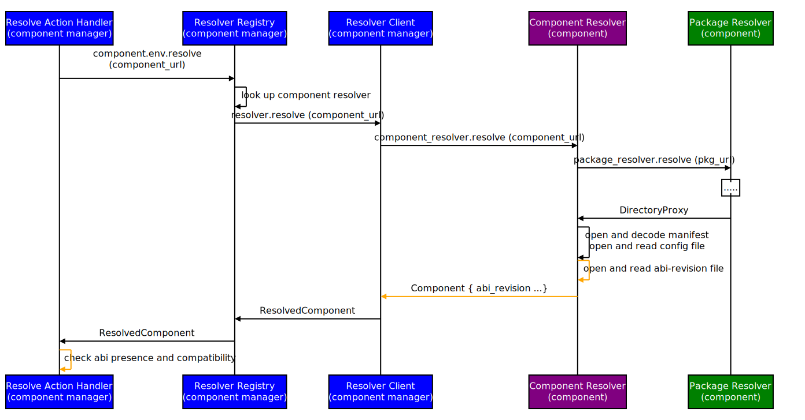

<!-- Generated with `fx rfc` -->
<!-- mdformat off(templates not supported) -->


# {{ rfc.name }}: {{ rfc.title }}
{# Fuchsia RFCs use templates to display various fields from _rfcs.yaml. View the #}
{# fully rendered RFCs at https://fuchsia.dev/fuchsia-src/contribute/governance/rfcs #}
<!-- SET the `rfcid` VAR ABOVE. DO NOT EDIT ANYTHING ELSE ABOVE THIS LINE. -->

<!-- mdformat on -->

<!-- This should begin with an H2 element (for example, ## Summary).-->

## Summary

This document describes how the Component Framework will detect a component's
target ABI revision and check if it's compatible with the Fuchsia platform
before interacting with the component.

## Motivation

As applications and the [Fuchsia System Interface][fuchsia-system-interface]
evolve, the need to regulate the ABI compatibility of components with the
platform grows.

Components are built with a set of behavioral expectations from the platform
ABI, and without enforcing an explicit ABI contract with ABI revisions, this
expectation becomes a constraint for platform development. There will come a
time when a component is built targeting an ABI revision that is no longer
supported by the platform.

The Component Framework can prevent executing components targeting an
unsupported ABI revision, and likewise guarantee that the platform supports a
component's target ABI when the component is run. This RFC outlines how the
Component Framework will enforce this ABI contract between the component and the
Fuchsia platform.

## Stakeholders

_Facilitator:_

- leannogasawara@google.com

_Reviewers:_

- abarth@google.com
- etryzelaar@google.com
- geb@google.com
- jsankey@google.com

_Consulted:_

- adamperry@google.com
- jmatt@google.com
- lukenicholson@google.com
- richkadel@google.com
- wittrock@google.com
- yeg@google.com

_Socialization:_

The design doc for this RFC went through a design review with the Component
Framework team.

## What is Component ABI Compatibility?

ABI compatibility refers to an agreement of behavioral expectations offered by
the [Fuchsia System Interface][fuchsia-system-interface] to a component.
[RFC-0002][platform-versioning] describes in detail the implications of ABI
revisions and how they are supported by the platform.

RFC-0002 details how the Fuchsia platform supports an [evolving][platform-versioning-evolution]
set of ABI revisions: each ABI revision added presents a backwards-incompatible
change to the Fuchsia System Interface, and older ABI revisions are removed from
the set when their behavioral guarantees are no longer supported by the platform.
A component is considered compatible with the platform if its target ABI
revision is included in this evolving set.

This RFC describes ABI compatibility between a component and the platform.
General guarantees around the behavioral compatibility of components with
*each other* - particularly if they are built with different, but supported ABI
revisions - is outside the scope of this RFC and may be a part of future work
suggested in RFC-0002, such as introducing capability routes according to ABI
revision.

## Terms

The design delineates between several actors in the component resolution
process for packaged components. The following terms will be used to refer to
actors with designated roles:

| Actor                 | Role |
|:--------------------:|:----:|
| Resolve Action | The action in Component Manager that executes the component resolution workflow. |
| Resolver-Client | A client entity in Component Manager that proxies a FIDL request to the component resolver to resolve a component. |
| Component Resolver | A component that serves the `fuchsia.component.resolution.Resolver` FIDL protocol to resolve a component. Note: this actor does not apply to builtin resolvers. |
| Package Resolver | A component that serves the `fuchsia.pkg.PackageResolver` FIDL protocol to resolve a package. |

---
**NOTE**

The resolve action and resolver-client are both a part of Component Manager, but
play destinctive roles in this design.

An important difference is that the resolve action cannot distinguish a packaged
component from a non-packaged component. The ABI revision must be decoded from
its data source, which varies between packaged and non-packaged components,
before it reaches the resolve action.

On the other hand, a resolver-client is currently implemented for each component
resolver, and performs duties specific to the type of component its resolving.

---

## Design

### The Current State
This document designs around the stipulation that a packaged component's target
ABI revision is taken from its package target ABI revision source, defined in
[RFC-0135][package-abi-revisions].

This design presents a way to satisfy requirements given the current state of
ABI revisions for packaged components, without making assumptions on how
target ABI revisions will be represented for components in the future and the
timeframe for developments.

How ABI revisions are supported for non-packaged components is addressed
separately in the [ABI Revisions and Non-Packaged Components](#abi-revisions-and-non-packaged-components) section.

### Overview

This RFC proposes the component resolution workflow include the reading and
decoding of the component's target ABI revision from its package, the
communication of the value over FIDL, and the check to determine if the ABI
revision is compatible with the platform.

{:#fig-1}

**Figure 1: ABI Component Resolution Workflow with ABI Support**

### 1. Component Resolver Opens and Reads the Package ABI Revision File
A packaged component's target ABI revision is currently the same as its package
target ABI revision. The ABI revision value is stored in a file found in the
`meta.far` of the package.

While the component's target ABI is defined this way, the component resolver MAY
read the file using the directory proxy returned by the package resolver. The
rationale for the component resolver to read the file directly is to minimize
the impact of setting the component's target ABI from the package target ABI; the
[Drawbacks](#drawbacks) section discusses the particular downsides of this
behavior.

If the file is present, the component resolver MUST read and decode the ABI
revision and include the value in the FIDL component representation returned to
the resolver-client. If the file is absent, the value is not included.
Therefore, the component resolver defers the enforcement of ABI existence to
Component Manager.

### 2. Introduce an ABI Revision Field to `fuchsia.component.resolution.Component`
A separate field for the component's target ABI revision is introduced to the
component FIDL representation, where `AbiRevision` is an alias for an `uint64`
value:

sdk/fidl/fuchsia.component.resolution/component.fidl:

```
type Component = resource table {
...
   abi_revision AbiRevision;
}
...
```

The [Tech Debt](#tech-debt) section will discuss the how this field will become
redundant if the component's target ABI revision becomes included in a data
source already represented in FIDL, such as the component manifest.

### 3. Checking ABI Revision Presence and Compatibility in Component Manager
The resolver-client translates the FIDL `fuchsia.component.resolution.Component`
type with an optional ABI revision field into a Component Manager representation
to hand off to the resolve action.

Checking if the ABI revision is present and whether it's compatible with the
Fuchsia platform SHOULD be performed when the resolved component's
meta-information is validated.

The resolve action MUST use a library that exposes an API to check whether a
given ABI value is among the set of ABI values supported by the platform. This
will determine whether the resolved component's target ABI revision is
compatible with the platform.

A config flag for Component Manager MAY direct the resolve action to produce a
warning instead of an error for an absent target ABI revision, which will be
used to enable backwards compatibility in the [Implementation](#implementation) strategy.
Similarly, introducing a separate config flag to permit incompatible component
ABI revisions may be useful for testing components against different builds
without ABI compatibility regulation.

## Why do ABI Compatibility Checks in Component Resolution?
Callers in Component Manager resolve a component URL so they can interact with
the constructed component or its capabilities. Integrating ABI compatibility
into the component resolution process ensures that the component will behave
against the platform in expected ways.

When a component is re-resolved, the ABI revision should be among the component
data that is updated. Similar to other component metadata, the ABI revision
should not change until the component is explicitly updated.

## Other Design Considerations

### Handling a Missing or Incompatible Target ABI Revision in Packaged Components
Packaged components expected to present a target ABI revision can error and cut
short component resolution at any of these points:

* The component resolver fails to decode an ABI revision value if the ABI
  revision file is present.
* The resolve action cannot decode the FIDL value into an ABI Revision data
  type.
* The resolve action finds the ABI revision is absent or incompatible with the
  platform, and a Component Manager config flag signals this as an error.

It depends on context whether an end user or Component Manager triggers
component resolution, and whether an error can be returned directly to a user
or can only be logged for discoverability. The [Ergonomics](#ergonomics) section
goes into more detail on how warnings and errors may be surfaced to the user.

### ABI Revisions and Non-Packaged Components
This RFC does not define how non-packaged components, such as web components,
represent ABI revisions. The meaning of ABI compatibility for such components
will be considered separately, and does not affect the initial rollout of this
design, which allows ABI revisions to be optional.

### ABI Compatibility with Subpackages
The top-level package and child subpackages, as introduced by [RFC-0154][subpackages],
SHOULD include ABI revisions. For the concerns of this RFC, there is no special
handling needed for subpackaged components: as each child subpackage component
is resolved, it will be subjected to the same component resolution workflow
described by [Figure 1](#fig-1). However, if a subpackaged component were to
have a different target ABI revision than the top-level packaged component, and
the platform dropped support for the ABI revision of that subpackaged component,
then the subpackaged component would fail component resolution. This would
conflict with the availability guarantees that subpackages typically provide,
outlined by RFC-0154.

### ABI Compatibility and Builtin Resolvers
[Boot components][boot-components] are resolved by a boot component resolver
built into Component Manager. [RFC-0167][packaging-boot-components] introduced the
packaging of boot components: the boot component resolver resolves the component
from a bootfs package, formatted in a similar way to non-boot component packages.

Retrieving and evaluating the ABI revision for boot components follows a similar
design workflow described by [Figure 1](#fig-1), except the boot component and
boot package resolver are not implemented as external components.

Specifically, the changes needed for the boot component resolver are:

- The boot component resolver opens and reads an abi-revision file found in the
  `meta.far` of the bootfs package.
- The boot component resolver includes the ABI revision value into the resolved
  component representation returned to the resolve action handler.

## Implementation

This design is implemented in two phases:

1. Component Manager makes component target ABI revisions optional.
2. Component Manager makes component target ABI revisions required.
    - Packaged component resolvers error if an ABI revision file is not found.
    - ABI revisions for non-packaged components are represented.

A config flag for Component Manager can be used to enforce ABI requirements and
enable phase #2.

The component's target ABI revision may be inspected through component discovery
tools like [`ffx component`][ffx-component].

## Performance

No notable impact to performance.

## Ergonomics

Component Manager is responsible for surfacing warnings or errors from component
resolution as a result of missing or incompatible target ABI revisions. All
component resolution warnings and errors should be logged.

In some scenarios, such as with [`ffx component`][ffx-component], the end-user
user may initiate a FIDL request that will resolve a component and return a
descriptive FIDL error response on failure.

Other scenarios do not make it possible to provide the user direct feedback. For
example, [capability routing][capability-routing] may be interrupted by a
component resolution failure along the routing path from a target component to
the source component providing the capability. This will close the `fuchsia.io`
capability channel with an epitaph, requiring the user to read logs or
potentially use diagnostic tools to obtain the reason behind the closed channel.

## Backwards Compatibility

The two-phase implementation strategy ensures component resolution continues to
work for component packages that do not yet specify a target ABI revision.

Generated bindings for the FIDL ABI revision field inherently make the field
member optional and allows us to roll out the [implementation](#implementation)
without breaking components that do not yet have an ABI revision specified.

Backwards compatibility behavior is gated on a config flag, which directs
Component Manager to return an error if the component's target ABI revision is
absent or found incompatible with the platform.

## Security considerations

No known security concerns.

## Privacy considerations

No known privacy concerns.

## Testing

The existing testing frameworks will be used to test the following scenarios:

* Unit testing for reading and decoding the abi-revision file in component
  resolver.
* Unit testing for checking the existence/values of ABI revisions against config
  settings.
* Integration testing between the component resolver and resolver-client
  interfaces.

## Documentation

Documentation on [https://fuchsia.dev](https://fuchsia.dev) will be introduced
to describe:

* The concept of component target ABI Revisions.
* How component target ABI Revisions are defined.
* What happens when a component's target ABI revision is found incompatible with
  the platform.

Additionally, in-source documentation will be written as needed.

## Drawbacks

### Component Resolvers Read Package Metadata to Retrieve The Component's Target ABI Revision
A component's target ABI revision is derived from its package target ABI
revision, stored in the `meta.far`, where package metadata is stored.
Alternatively, component target ABI revisions could be defined in component
metadata and the component resolver would not be interacting with package
metadata.

Additionally, since all components in a package derive their target ABI revision
from the same singular value, this limits how components in a package can evolve
independently from each other. This could be problematic for separate
maintainers of components in a package with different update cadences. On the
other hand, subpackages provide a way to group and distinguish component target
ABI revisions among dependencies.

This point confronts the decision of why a component's target ABI revision is
set to its package target ABI revision. An [unknown](#unknowns) of this RFC is
if, how, or when there will be changes to how component target ABI revisions are
defined in the future. However, we may acknowledge that it is easier to define
and introduce a package-level target ABI revision than component-specific target
ABI revisions, which require a greater level of commitment and coordination
effort. Moreover, the current strategy presents an MVP that affords us the
ability to begin using component target ABI revisions without waiting on how
they may be defined in package or component metadata in the future.

## Alternatives

### Check for ABI Compatibility in the Package Resolver
An alternative design could acknowledge that the ABI revision is defined at the
package level and the first point of discovery of the ABI revision file in the
component resolution process is at package resolution. An adjacent argument is
to defer introducing component-level target ABI revisions until the ABIs are
defined in component metadata.

__Pros__:

* Addresses the immediate world of how ABI revisions are defined.

__Cons__:

* Not a solution for packageless components.
* Affects future work plans using component target ABI revisions in Component
  Manager, such as regulating capability routes according to ABI revision.
* Moves ABI control to an external component outside of Component Manager.
* Adding a user controllable way to disable ABI enforcement for debugging or
  testing purposes is not as easy as adding a config flag to Component Manager.
* May be overly restrictive, or otherwise special handling is needed, for
  packages with incompatible ABI revisions that are resolved and downloaded, but
  not used. For example, resolving and fetching updated packages that contain an
  ABI revision not yet supported by the current running platform should still
  succeed.

### Check for ABI Compatibility in the Component Resolver
It is also possible for the component resolver to check for ABI compatibility
with the system in addition to opening and parsing the ABI revision file.

__Pros__:

* Prevents returning a component to Component Manager if the component's target
  ABI is not supported.

__Cons__:

* Moves ABI control to an external component outside of Component Manager.
* Affects future work plans using ABI revisions in Component Manager, such as
  introducing capability routes according to ABI revision.
* Adding a user controllable way to disable ABI enforcement for debugging or
  testing purposes is not as easy as adding a config flag to Component Manager.

### Component Manager Checks Target ABI Compatibility Before Specific Component Interactions
Component Manager can check whether a (resolved) component's target ABI revision
is supported before performing specific actions on the component, such as
starting it or accessing one of its capabilities.

__Pros__:

* More specific about when ABI revisions should be checked.
* Potentially better control over error handling.

__Cons__:

* Ignores how a component's target ABI is a part of the declaration that forms
  its interface, which is validated during component resolution.
* High maintenance cost that requires human knowledge of the contexts in which
  ABI checks should be performed.
* Prone to introducing breaking, unexpected, or difficult-to-debug behavior from
  a component because it was missing an ABI compatibility check.

### Open and Read the Package ABI-Revision File from the Resolver-Client
We may want to minimize the impact of this interim design for component target
ABIs and implement a solution that is the easiest to undo by refraining from
introducing new behavior to component resolvers and FIDL.

__Pros__:

* Avoids introducing a new FIDL field to
  `fuchsia.component.resolution.Component`, which may become tech debt if
  component target ABI revisions become included in a data source also
  represented in FIDL, like the component manifest. The [Tech Debt](#tech-debt) section goes
  into this scenario in more detail.

__Cons__:

* Directly reading a file from the package violates abstraction boundaries for
  the resolver-client. This must be performed in the resolver-client, and not
  the resolve action, because the resolve action cannot delineate between
  packaged and non-packaged components.
* It's unknown how long this temporary fix will be in place.

## Unknowns

### If/How/When Component-Specific Target ABI Revisions will be Defined in the Future

The timeline of when ABI revisions will be defined per component, allowing
components in the same package to have distinct target ABI revisions, is
unknown. There are also no commitments about the data source that will store
component target ABI revisions in the future; whether the ABI will be included
in the component manifest is an open question.

## Tech Debt
This design does not make assumptions of how component target ABI revisions will
be defined in the future and risks introducing tech-debt.

If component target ABI revisions become included in a source that also has a FIDL
representation, such as the component manifest, then the ABI revision field
member of `fuchsia.component.resolution.Component` will become redundant and
should be removed. This tech debt would be limited to the
`fuchsia.component.resolution.Resolver` protocol and the components using it.

## Prior art and references

None considered in this design.

[boot-components]: /concepts/process/everything_between_power_on_and_your_component.md#v2-components
[boot-resolver-changes]: /contribute/governance/rfcs/0167_early_boot_packages.md#bootresolver_changes
[fuchsia-system-interface]: /concepts/packages/system.md
[package-abi-revisions]: /contribute/governance/rfcs/0135_package_abi_revision.md
[packaging-boot-components]: /contribute/governance/rfcs/0167_early_boot_packages.md
[platform-versioning]: /contribute/governance/rfcs/0002_platform_versioning.md
[platform-versioning-evolution]: /contribute/governance/rfcs/0002_platform_versioning.md#evolution
[subpackages]: /contribute/governance/rfcs/0154_subpackages.md
[ffx-component]: /development/sdk/ffx/view-component-information.md
[capability-routing]: /concepts/components/v2/capabilities/README.md#routing
