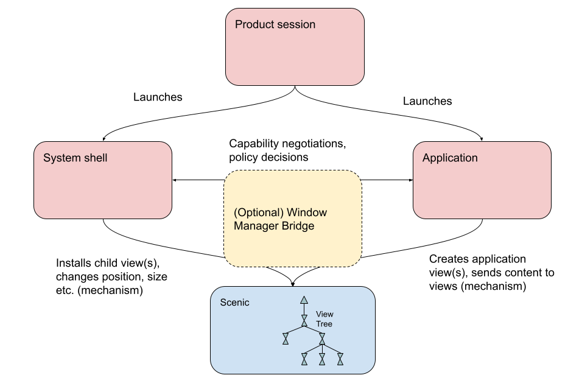
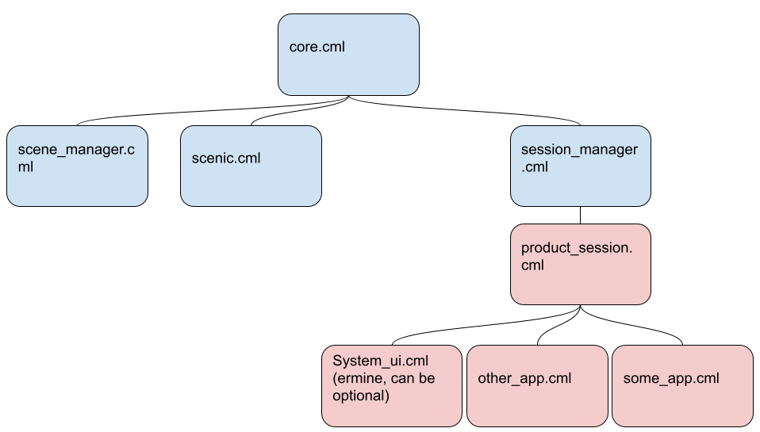
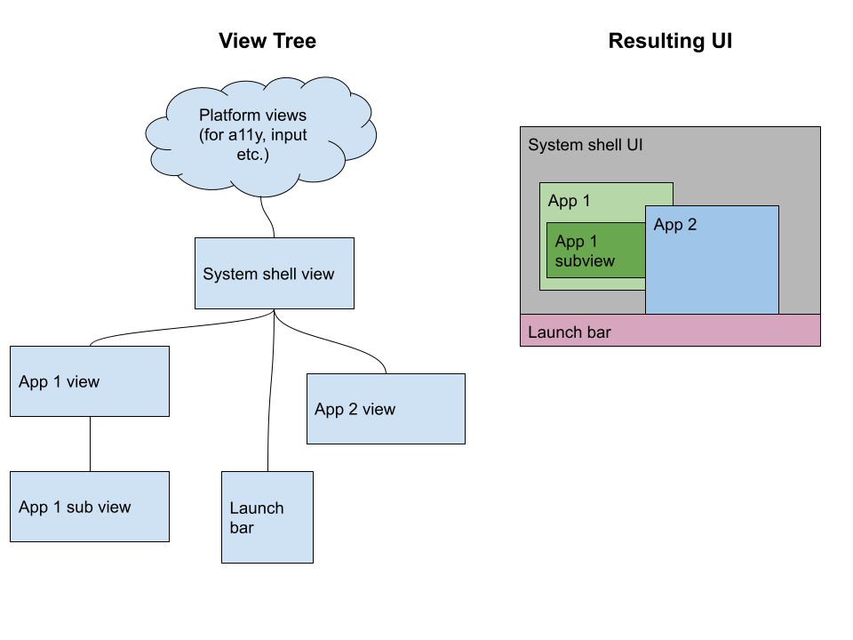



# {{ rfc.name }} - {{ rfc.title }}
<!-- *** DO NOT EDIT ABOVE THIS LINE -->

## Summary

This RFC proposes a model for how the fuchsia platform, the
[product session][session] and the session shell work together to support
complex graphical applications with multiple windows. In particular:

* While the platform is responsible for the *mechanisms* for putting graphics
on screen and routing input, the product component(s) must specify the product
specific *policies* for when and how graphics may be displayed.
* The platform will define a *standardized API surface for window
  management*[^1], to allow for maximum compatibility between applications and
  products.

[^1]: These APIs will be defined in subsequent RFCs.

An important consequence of this is that applications integrate with the Fuchsia
Platform rather than with a particular Fuchsia product, and thus an application
that works with one Fuchsia product should work with any other Fuchsia product
that supports the same set of windowing capabilities. In particular, an
application that runs against one Fuchsia desktop product should run against any
such product, regardless of the particular product session or system shell
implementation.

This RFC expands on [RFC-0092: Sessions][session]. It describes the planned
state rather than how things work today. The approach described in this RFC
replaces all prior attempts (Modular, Session Framework) and is the plan of
record moving forward.

## Motivation

Current Fuchsia APIs make it difficult for products and applications to
implement rich window management and multi-window apps. The distinction between
platform and product responsibilities is confusing, and the APIs supplied by the
platform date from an earlier era of Fuchsia vision and lack some important
features required for current work (e.g. Workstation). Multiple prior attempts
have been made to solve this and related problems (modular, session framework)
but none have been fully implemented across all Fuchsia surfaces.

The current state of the system lacks a clear division of responsibilities and
has multiple ways to perform the same actions. This has led to fragmentation
across different products. Ratifying the architecture now allows us to make
future decisions about the APIs the platform will support in the future (such as
potentially adopting Wayland for use in Fuchsia) and unblocks development for
both shells and applications.

This RFC is likely the first of a series covering different aspects of window
management. Its goal is to clarify the split between product and platform and
make it easier to make later decisions about exactly what APIs to use (e.g.
[Wayland][wayland]).

## Stakeholders

*Facilitator:* abarth@google.com

*Reviewers:*

* Graphics: dworsham@google.com
* Workstation: sanjayc@google.com
* Architecture: abarth@google.com
* Component Framework: thatguy@google.com
* Chrome: wez@google.com
* UX: asz@google.com

*Consulted:* quiche@google.com, jasoncampbell@google.com, geb@google.com,
masonben@google.com, jsankey@google.com, tjdetwiler@google.com

*Socialization:* Prior to publication via Gerrit a draft of this RFC was shared
and discussed extensively with stakeholders.

## Definitions

For the purpose of this doc:

*   *Display Server a.k.a Compositor:* A component that is responsible for
    allowing application components to create and display views, allowing the
    placement and size of those views to be controlled, and making sure
    graphical input events are delivered to application components based on
    their views. On Fuchsia this is [scenic][scenic].
*   *Window Manager:* A component (or multiple components) that controls the
    placement and appearance of windows supplied by applications. On some
    systems, this system is also responsible for rendering UI (e.g. title bars).
    Because the Fuchsia platform may be used to implement a variety of products
    with very different graphical and input capabilities, the distribution of
    window manager responsibilities on Fuchsia may look very different than
    other operating systems where the platform is more closely tied to a single
    user experience.
*   *System Shell:* The component responsible for drawing product UI. This
    component owns the top scenic view in the product sub-tree of the view
    hierarchy that displays visual content. This view is sometimes referred to
    as the shell view. The system shell is responsible for installing views
    supplied by application components in the view tree, and making policy
    decisions about how those view can be displayed.
*   *[Product Session][session]:* A component responsible for implementing a
    Fuchsia product experience. This component runs as a child of session
    manager. This component is responsible for launching application components
    with the appropriate capabilities in response to user actions. As of the
    writing of this RFC Fuchsia only supports a single session at a time.
*   *Element:* A session framework concept for a component with
    graphics. This RFC deprecates the element role.
*   *Application Component:* A component that implements a graphical user
    experience and runs within a system shell.
*   *[View Tree][view_tree]:* The hierarchy of views in scenic's scene graph.

## Design

### Overview

There are two main aspects of window management on Fuchsia: mechanism, and
policy.

*   "Policy" refers to the product-specific details about which components are
    allowed to put graphics on screen, where those graphics are displayed, how
    they receive input and focus, and how they are related in the view tree.
    Policy is about deciding what is allowed to happen to windows.
*   "Mechanism" refers to the mechanics of getting pixels on the screen and
    routing input to their underlying components, and is largely handled through
    the [Fuchsia UI stack][ui_stack]. All components that supply graphics must
    communicate with these APIs. The implications of a policy decision may
    require multiple calls to mechanism APIs to effect the relevant change to
    the UI.

The Fuchsia SDK defines two API surfaces for window management policy:

1.  An API for a System Shell to implement its product-specific window
    management policy and supply information about which window manager features
    are available on this product. Today, this is achieved by requiring the
    system shell to implement the
    [graphical presenter role][graphical_presenter].
1.  An API or set of APIs for application components to use to request changes
    to the existence and appearance of views owned by that component. This takes
    the form of a core API that all application clients are expected to use,
    with possible extensions for additional behaviors (detectable at runtime).
    This API surface should be shared across all Fuchsia applications, which
    facilitates compatibility across different products built on top of Fuchsia.

The implementation details for client applications currently vary widely. Some
applications implement the element role while others interact
directly with the component framework and scenic, or implement the element
manager API within the app. This RFC mandates simplifying this by moving to a
single API for all application components.

**This RFC does not currently express an opinion about whether the system shell
and application components communicate directly with each other, or if a
platform component should mediate these interactions.**

### Architecture diagram

The above diagram shows a possible architecture for a graphical product running
on Fuchsia. The product session is responsible for launching the system shell
and any applications. The application and system shell must communicate about
any policy decisions, possibly through a window manager or "bridge" component
supplied by the platform (see [Possible platform bridge component](#bridge)
below). Both the system shell and application must also communicate with the
Fuchsia platform UI stack (which includes components that handle graphics and
input processing) to execute on the "mechanism" aspects of window management.
This communication may also happen through a bridge component.

### Product Session responsibilities

The [product session][session] is the first product-specific component to be
launched when a product boots up. On products with graphics, it has the
following additional responsibilities:

1.  The product session is responsible for launching application components and
    supplying them with appropriate capabilities, including the capabilities
    necessary to put UI on screen.
1.  The product session must supply a [root view][view_system] for the user
    experience, either by implementing this directly or delegating this to a
    child component. The component that supplies this view is also referred to
    as the system shell (also sometimes called System UI). The system shell has
    a capability (fuchsia.session.scene.Manager) that allows it to install its
    root view in the view tree. (Note that a product may include more than one
    shell, such as a login and user shell, and swap between them as needed.)
1.  The product session is responsible for the product policy aspects of window
    management. In particular, the session must implement the window management
    policy API supplied by the Fuchsia SDK. This responsibility includes
    supplying information about what kinds of window operations are available on
    this product.

#### Example Component hierarchy

This diagram shows a possible component hierarchy for the user experience. Note
that this eliminates element manager. As shown, application components are
children of the product session. Some products may choose to set things up
differently, for example by creating a component in the product session's realm
that is responsible for launching applications, or by delegating application
component instantiation to some platform component with different capabilities.

### Setting up the view hierarchy

Once launched, the application can contact scenic to create an application view,
and then contact the system shell via the window management API to show that
view as part of the system shell's user experience. The system shell contacts
scenic to install the application view into the view tree, typically as a child
of the root view.

An application may open a second top-level window by following the same flow
described above for the initial window creation. Further window management
actions such as resizing the application view, launching a popup, etc. require
the application component to request these changes from the system shell via
calls to the window management API. In general each component that is
responsible for communicating directly with scenic about the contents of the
View(s) that it owns. However, if a view owner/application wishes to change *how
its views are displayed* (such as resizing, minimizing, or opening another
top-level view), the system shell must somehow indicate that this action is
permitted. The system shell may do so either by responding to client API calls,
or by storing information in the view tree to indicate what that view is allowed
to do and allowing Scenic to execute on the relevant policy.

Notes:

* The resulting component hierarchy and view tree do not look the same!
While application views must be child views of a view owned by the system shell,
application components need not be part of the realm of the system shell
component.
* This description elides a lot of detail about view creation,
including how user input etc. are routed to views via the view tree.

#### Example View Hierarchy

The above diagram shows a sample view tree for a system UI running multiple
graphical applications The system shell view is the root view of the user
experience. Note that the view tree may have different parent-child
relationships than the component hierarchy shown above.

### Negotiation of window management capabilities

Not all system shell implementations will expose identical capabilities, because
a system shell is in part implementing product-specific policy. Therefore, these
implementations will vary per-product. For example, a smart watch might have a
very simple UI with a single view on screen at a time, while a desktop would
support multiple applications with multiple overlapping windows. Some products
support user input via a touchscreen, while others support only mouse and
keyboard.

For product-specific capabilities exposed outside of the "core set", clients
must be able to discover which of these capabilities are supported on the
current product. This allows the client to tailor its behavior across different
products, and makes it possible to implement graphical fuchsia applications that
can function across different products.

Similarly, the system UI must tell the platform what features are currently
available.

### Possible platform bridge component {#bridge}

The platform may introduce a "bridge" component that mediates communication
between the client application and the system UI. This component would be
analogous to the window manager on other platforms and could then automate some
"mechanism" actions for window management and reduce the need for developers to
write code that sends low-level commands to the Fuchsia UI stack. This has the
advantage of allowing the client to communicate with a single API surface for
both mechanism and policy, which is a common pattern in other systems (e.g. in
[Wayland][wayland]). By situating the bridge component in the platform, this
would also allow products to share window management code and avoid duplication
for similar functionality.

**The decision about whether to use a platform bridge component/platform window
manager is left to a future RFC.**

## Implementation

This RFC addresses the high-level architecture for window management. Because we
expect significant changes to the APIs involved via future RFCs, many
implementation details should be addressed in those RFCs.

When APIs are in place, this RFC implies the removal of a number of legacy
workarounds for the system's current deficiencies. In particular:

* This RFC deprecates [Element Manager][element_manager] (the current element
  manager functionality becomes the job of the product session).
* This RFC ratifies the intent to normalize how applications behave (no more
Chrome-specific workarounds). The replacements for existing APIs will be
addressed in future RFCs.

## Performance

While graphics and user input processing can be very performance-sensitive,
window management policy decisions such as opening a new application or window
typically happen at "human speed" and thus do not require the same level of
performance as rendering or input processing. Thus it's typically fine to use
extra RPC when executing "control" actions such as opening a new
window. However, care should be taken when designing APIs to ensure that any
performance-sensitive flows (typically those involving data flow, such as
putting frames on screen, routing user input) avoid unnecessary IPC and do not
block unnecessarily on client responses. This is especially relevant in cases
where the window manager and shell are not the same component. The performance
implications of particular APIs should be addressed in detail in upcoming RFCs.

### Animations and synchronization

In order to provide a smooth experience for users, it's important to ensure that
UI actions such as resize animations can be synchronized across multiple
components. While this is mostly a function of the particular API and its
guarantees about atomicity, architecture can influence how difficult
it is to build user experiences where such synchronization is possible.

This RFC does not formally adopt a specific API, but the decisions contained in
it were evaluated against the Wayland API, which has a stated goal of making
"every frame perfect". Synchronization concerns will be an important
consideration when finalizing the APIs described in this RFC.

## Security and privacy considerations

### Component security

This RFC clarifies that the component hierarchy and view hierarchy do not have
to be the same, and allows for the possibility of applications launching as
children of the product session rather than the system shell (which may be less
stable or less secure on some systems). This should make it easier for products
to ensure that the component hierarchy within a product suits that product's
particular security and privacy needs.

### View security

The security guarantees for the view system are addressed in detail in
[the view system RFC][view_system]. Of note for this RFC is the guarantee that a
view may only manipulate view focus when it or its child is currently focused,
and that views that are disconnected from the view tree cannot receive user
input. This means that the product session's installation of the system UI view
and the window management policy decisions made by the system shell (such as
installing a child view for a launched application) are also decisions about
which components are eligible to receive user input at any given time. While the
platform cannot guarantee that all products will implement secure behavior, the
view system provides the building blocks for a product to create a secure
experience.

## Testing

The platform should provide conformance tests for all window management APIs so
that both products and applications can ensure compatibility with the Fuchsia
platform. These tests may vary depending on which extensions to the window
management APIs are supported by a given application or product session.

System shell and Application developers may use the
[Test UI Stack](/docs/contribute/governance/rfcs/0180_test_ui_stack.md)
to write integration tests for the interaction of their code with the Fuchsia
platform UI stack.

## Documentation

This RFC and subsequent RFCs dealing with API specifics will require significant
updates to the Session Framework documentation on fuchsia.dev to reflect updated
expectations about the split between product and platform and the elimination of
Element Manager.

## Drawbacks, alternatives, and unknowns

### Alternative: Scenic does Window Management

*   Without a new API, doesn't let system shell apply product-level
    policies/concepts.
*   Unclear how to extend this API to handle product differences. Otherwise,
    pushes a lot of product-specific logic (e.g. what does "minimize" mean) into
    the platform.

## Prior art and references

*   [RFC-0092: Sessions][session]
*   [RFC-0096: User Input Architecture][input_arch]
*   [RFC-0147: View System][view_system]

[session]: /docs/contribute/governance/rfcs/0092_sessions.md
[wayland]: https://wayland.freedesktop.org
[view_system]: /docs/contribute/governance/rfcs/0147_view_system.md
[scenic]: /docs//concepts/ui/scenic/index.md
[view_tree]: /docs/concepts/ui/scenic/views.md
[ui_stack]: /docs/contribute/governance/rfcs/0166_ui_stack.md
[graphical_presenter]: /sdk/fidl/fuchsia.element/graphical_presenter.fidl
[input_arch]: /docs/contribute/governance/rfcs/0096_user_input_arch.md
[element_manager]: https://cs.opensource.google/fuchsia/fuchsia/+/main:src/session/bin/element_manager/meta/element_manager.cml
