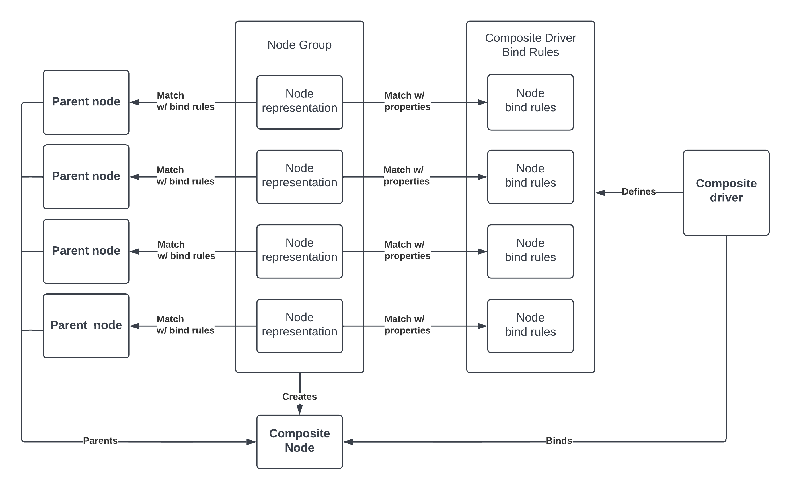
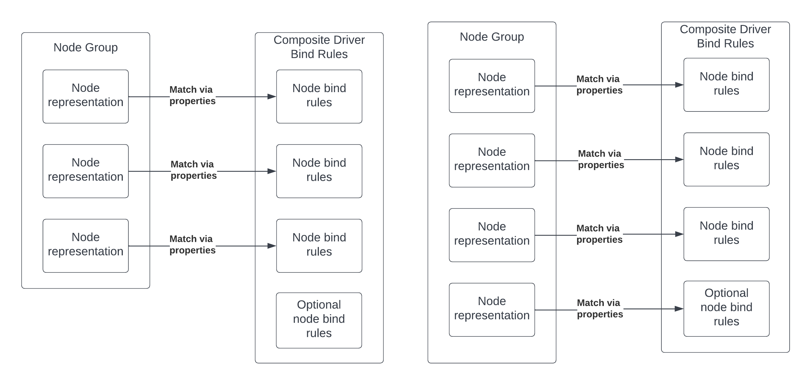

<!-- mdformat off(templates not supported) -->


# {{ rfc.name }}: {{ rfc.title }}
{# Fuchsia RFCs use templates to display various fields from _rfcs.yaml. View the #}
{# fully rendered RFCs at https://fuchsia.dev/fuchsia-src/contribute/governance/rfcs #}
<!-- SET the `rfcid` VAR ABOVE. DO NOT EDIT ANYTHING ELSE ABOVE THIS LINE. -->

<!-- mdformat on -->

<!-- This should begin with an H2 element (for example, ## Summary).-->

## Summary

This RFC proposes a design on how composite nodes can be defined at runtime in
the Driver Framework v2 (DFv2).

## Motivation

### Background

In Driver Framework v1 (DFv1), drivers can create
[composite nodes](/docs/concepts/drivers/drivers_and_nodes.md#composite_nodes)
at runtime through the `AddComposite()` function. The driver defines the bind
rules for the composite's parents and bind properties and the driver manager
creates the composite node as the driver's child. A separate driver binds to the
composite node.

In DFv2, composite drivers define the composite node through
[bind rules](/docs/development/drivers/concepts/device_driver_model/driver-binding.md),
which are static files written in the driver bind language. When drivers are
loaded at runtime, the Driver Runner gathers the parent nodes that match the
composite bind rules, and then creates the composite node. The composite driver
binds to the node.

### Problem

Since composite drivers can only define the composite node statically, it cannot
fully replace DFv1's `AddComposite()` functionality. This prevents some drivers
from migrating to DFv2.

Some composite nodes are only known at runtime, which makes it impossible to
define in composite drivers. For example, the ACPI bus driver creates ACPI
composite nodes at runtime. When the bus driver is started, it reads in the ACPI
table and uses that information to create the nodes.

The static bind rules also make it difficult to write board agnostic composite
drivers because the bind rules require knowing the node properties at build
time. For instance, a touch composite driver may require a node for a GPIO pin
for a specific functionality. Since the GPIO pin varies by board, it is more
difficult to write board agnostic bind rules with that node.

## Stakeholders

*Facilitator:* cpu@google.com

*Reviewers:* surajmalhotra@google.com (FDF), dgilhooley@google.com (FDF)

*Consulted:* Members of the drivers team

*Socialization:*

A draft of the RFC was shared among tq-drivers

## Design

### Requirements

Since the goal of the design is to create a mechanism to allow drivers to define
composite nodes at runtime, the following must be dynamic:

*   The bind rules for each parent in the composite node
*   The bind properties for matching the composite node to a composite driver
*   The parents in a composite node. It might be determined at runtime if a
    composite node should include specific parents

In addition, the mechanism needs to be supported by DFv1 and DFv2. As part of
the transition to DFv2, all DFv1 drivers need to migrate from `AddComposite()`
to composite drivers.

### Overview

This proposal adds a new API to the Driver Framework in which drivers can use to
define a group of device nodes.

When a driver defines a node group, the process is as follows:

1.  The driver manager asks the driver index to find a composite driver that
    matches the node group
2.  Once a matching composite driver is found, the driver manager finds a
    matching device node for each node representation
3.  Once each of the node representation has a match, the driver manager creates
    a composite node with the nodes as parents, and binds it to the composite
    driver. The primary node and node names are provided by the composite driver



#### Node representation

Each node representation in the group is defined with the following:

*   **Bind rules** - The rules for matching the node representation to a device
    node
*   **Bind properties** - The bind properties in the node representation that
    will be used to match with a composite driver's static bind rules

#### Node group bind rules

The bind rules consist of a list of accepted and rejected bind property values.
To match to the bind rules, the bind properties must contain all the accepted
bind property values and not any of the rejected ones. For instance, if a node
group node contains the bind rules:

*   Accept `fuchsia.BIND_PROTOCOL` values 15 and 17
*   Reject `fuchsia.BIND_PLATFORM_DEV_VID` values "Intel"

Then a device binds to the node if it contains a value of 15 or 17 for the
`fuchsia.BIND_PROTOCOL` property and it doesn't contain a "Intel" value for
`fuchsia.BIND_PLATFORM_DEV_VID` property.

#### Optional nodes in the composite bind rules

Since the availability of some parents are only known at runtime, composite
drivers need to be able to support optional nodes. To do that, the bind language
needs to be updated so that composite drivers can mark nodes as optional:

```
primary node "sysmem" {
  fuchsia.BIND_PROTOCOL == fuchsia.sysmem.BIND_PROTOCOL.DEVICE;
}

optional node "acpi" {
  fuchsia.BIND_PROTOCOL == fuchsia.acpi.BIND_PROTOCOL.DEVICE;
}
```

#### Matching to composite drivers

The matching process is done by applying a composite driver's bind rules to the
node representations' bind properties. A match is successful if the following is
fulfilled:

*   All node representations must match with a node in the composite bind rules
*   All non-optional composite bind rules node must match with a node
    representation
*   Matching cannot be ambiguous:
    *   Each node representation must correspond with only one composite bind
        rules node
    *   Node representations cannot match with the same node in the composite
        bind rules
*   Nodes do not need to be matched in order

If an ambiguous case occurs, a warning message will be printed out.



#### Node group API

Drivers will need to use FIDL to add a node group through a `NodeGroupManager`
protocol in the `fuchsia.driver.framework` FIDL library:

*device\_group.fidl*

```
@discoverable
protocol NodeGroupManager {
    AddNodeGroup(fuchsia.driver.framework.NodeGroup) -> (struct {}) error zx.status;
};
```

Node groups are represented in FIDL:

```
/// Represents the conditions for evaluating the device
/// group properties.
type Condition = strict enum {
    ACCEPT = 0;
    REJECT = 1;
};

/// Represents a bind rule for a node group node.
type BindRule = struct {
    /// Property key.
    key NodePropertyKey;

    /// Condition for evaluating the property values in
    /// the matching process. The values are accepted or
    /// rejected based on the condition.
    condition Condition;

    /// A list of property values. Must not be empty. The property
    /// values must be the same type.
    values vector<NodePropertyValue>:MAX_PROPERTY_COUNT;
};

/// Struct that represents a node in a node group.
type NodeRepresentation = struct {
    /// Bind rules for the node group node. Keys must be unique.
    bind_rules: vector<BindRule>:MAX_PROPERTY_COUNT;

    /// Properties used for matching composite bind rules. Keys must be unique.
    bind_properties vector<NodeProperty>:MAX_PROPERTY_COUNT;
};

/// Struct that represents a node group.
type NodeGroup = table {
    /// The node group's name.
    1: name string:MAX;

    /// The nodes in the node group.
    2: nodes vector<NodeRepresentation>:MAX;
};
```

**NodeProperty is defined in topology.fidl*

#### Example: Focaltech Touch Driver

##### DFv1 definition

In DFv1, the focaltech touch driver contains the following bind rules: using
fuchsia.platform;

```
fuchsia.BIND_COMPOSITE == 1;
fuchsia.BIND_PLATFORM_DEV_VID == fuchsia.platform.BIND_PLATFORM_DEV_VID.GENERIC;
fuchsia.BIND_PLATFORM_DEV_DID == fuchsia.platform.BIND_PLATFORM_DEV_DID.FOCALTOUCH;
```

The composite device is defined in `astro-touch`:

```
// Composite binding rules for focaltech touch driver.
const zx_bind_inst_t ft_i2c_match[] = {
    BI_ABORT_IF(NE, BIND_PROTOCOL, ZX_PROTOCOL_I2C),
    BI_ABORT_IF(NE, BIND_I2C_BUS_ID, ASTRO_I2C_2),
    BI_MATCH_IF(EQ, BIND_I2C_ADDRESS, I2C_FOCALTECH_TOUCH_ADDR),
};
const zx_bind_inst_t goodix_i2c_match[] = {
    BI_ABORT_IF(NE, BIND_PROTOCOL, ZX_PROTOCOL_I2C),
    BI_ABORT_IF(NE, BIND_I2C_BUS_ID, ASTRO_I2C_2),
    BI_MATCH_IF(EQ, BIND_I2C_ADDRESS, I2C_GOODIX_TOUCH_ADDR),
};
static const zx_bind_inst_t gpio_int_match[] = {
    BI_ABORT_IF(NE, BIND_PROTOCOL, ZX_PROTOCOL_GPIO),
    BI_MATCH_IF(EQ, BIND_GPIO_PIN, GPIO_TOUCH_INTERRUPT),
};
static const zx_bind_inst_t gpio_reset_match[] = {
    BI_ABORT_IF(NE, BIND_PROTOCOL, ZX_PROTOCOL_GPIO),
    BI_MATCH_IF(EQ, BIND_GPIO_PIN, GPIO_TOUCH_RESET),
};

static const device_fragment_part_t ft_i2c_fragment[] = {
    {countof(ft_i2c_match), ft_i2c_match},
};
static const device_fragment_part_t goodix_i2c_fragment[] = {
    {countof(goodix_i2c_match), goodix_i2c_match},
};
static const device_fragment_part_t gpio_int_fragment[] = {
    {countof(gpio_int_match), gpio_int_match},
};
static const device_fragment_part_t gpio_reset_fragment[] = {
    {countof(gpio_reset_match), gpio_reset_match},
};

static const device_fragment_t ft_fragments[] = {
    {"i2c", countof(ft_i2c_fragment), ft_i2c_fragment},
    {"gpio-int", countof(gpio_int_fragment), gpio_int_fragment},
    {"gpio-reset", countof(gpio_reset_fragment), gpio_reset_fragment},
};
static const device_fragment_t goodix_fragments[] = {
    {"i2c", countof(goodix_i2c_fragment), goodix_i2c_fragment},
    {"gpio-int", countof(gpio_int_fragment), gpio_int_fragment},
    {"gpio-reset", countof(gpio_reset_fragment), gpio_reset_fragment},
};

const zx_device_prop_t props[] = {
    {BIND_PLATFORM_DEV_VID, 0, PDEV_VID_GENERIC},
    {BIND_PLATFORM_DEV_PID, 0, PDEV_PID_ASTRO},
    {BIND_PLATFORM_DEV_DID, 0, PDEV_DID_FOCALTOUCH},
};
```

And then added using `DdkAddComposite()` API:

```
const composite_device_desc_t comp_desc = {
    .props = props,
    .props_count = std::size(props),
    .fragments = ft3x27_touch_fragments,
    .fragments_count = std::size(ft3x27_touch_fragments),
    .primary_fragment = "i2c",
};

zx_status_t status = DdkAddComposite("ft3x27-touch", &comp_desc);
if (status != ZX_OK) {
   zxlogf(ERROR, "%s(ft3x27): CompositeDeviceAdd failed: %d", __func__, status);
   return status;
}
```

##### Composite drivers with node groups

With node groups, the node representation bind rules can match to the GPIO pin
IDs and provide bind properties for the GPIO pin types. This allows the
composite driver to contain bind rules that are agnostic to the board that it's
on.

Given the fuchsia.gpio bind library:

```
library fuchsia.gpio;

extend uint fuchsia.BIND_PROTOCOL {
  DEVICE = 20,
  IMPL = 21,
};

enum FUNCTION {
   TOUCH_INTERRUPT,
   TOUCH_RESET,
};
```

The node group can be defined as follows:

```
node {
   bind_rules {
     fuchsia.BIND_FIDL_PROTOCOL == fuchsia.i2c.BIND_FIDL_PROTOCOL.DEVICE;
     fuchsia.BIND_I2C_BUS_ID == fuchsia.i2c.BIND_I2C_BUS_ID.ASTRO_2;
     fuchsia.BIND_I2C_ADDRESS == fuchsia.i2c.BIND_I2C_ADDRESS.FOCALTECH_TOUCH;
   },
   bind_properties {
     fuchsia.BIND_FIDL_PROTOCOL: fuchsia.i2c.BIND_FIDL_PROTOCOL.DEVICE,
     fuchsia.gpio.FUNCTION: fuchsia.platform.BIND_PLATFORM_DEV_DID.FOCALTOUCH,
   }
}

node {
   bind_rules {
     fuchsia.BIND_PROTOCOL == fuchsia.gpio.BIND_PROTOCOL.DEVICE;
     fuchsia.BIND_GPIO_PIN == fuchsia.amlogic.platform.s905d3.GPIOZ_PIN_ID.PIN_6;
   },
   bind_properties {
     fuchsia.BIND_PROTOCOL: fuchsia.gpio.BIND_PROTOCOL.DEVICE,
     fuchsia.gpio.FUNCTION: fuchsia.gpio.FUNCTION.TOUCH_INTERRUPT,
     fuchsia.gpio.BIND_PLATFORM_DEV_DID:
        fuchsia.platform.BIND_PLATFORM_DEV_DID.FOCALTOUCH,
   }
}

node {
   bind_rules {
     fuchsia.BIND_PROTOCOL == fuchsia.gpio.BIND_PROTOCOL.DEVICE;
     fuchsia.BIND_GPIO_PIN == fuchsia.amlogic.platform.s905d3.GPIOZ_PIN_ID.PIN_9;
   },
   bind_properties {
     fuchsia.BIND_PROTOCOL: fuchsia.gpio.BIND_PROTOCOL.DEVICE,
     fuchsia.gpio.FUNCTION: fuchsia.gpio.FUNCTION.TOUCH_RESET,
     fuchsia.BIND_PLATFORM_DEV_DID:
         fuchsia.platform.BIND_PLATFORM_DEV_DID.FOCALTOUCH,
   }
}
```

With a `driver2` library (DDK for DFv1), the driver code can then add the node
group:

```
const fdf::BindRule i2c_bind_rules[] = {
  fdf::BindRule::Accept(
      BIND_FIDL_PROTOCOL, bind_fuchsia_i2c::BIND_FIDL_PROTOCOL_DEVICE),
  fdf::BindRule::Accept(
      BIND_I2C_BUS_ID, bind_fuchsia_i2c::BIND_I2C_BUS_ID_ASTRO_2),
  fdf::BindRule::Accept(
      BIND_I2C_ADDRESS, bind_fuchsia_i2c::BIND_I2C_ADDRESS_FOCALTECH_TOUCH),
};

const fdf::NodeProperty i2c_bind_properties[] = {
  fdf::MakeProperty(BIND_FIDL_PROTOCOL,
     bind_fuchsia_i2c::BIND_FIDL_PROTOCOL_DEVICE),
  fdf::MakeProperty(BIND_PLATFORM_DEV_DID,
     bind_fuchsia_platform::BIND_PLATFORM_DEV_DID_FOCALTOUCH),

};

const fdf::BindRule gpio_interrupt_bind_rules[] = {
  fdf::BindRule::Accept(
      BIND_PROTOCOL, bind_fuchsia_gpio::BIND_PROTOCOL_DEVICE),
  fdf::BindRule::Accept(
      BIND_GPIO_PIN, bind_fuchsia_amlogic_platform_s905d2::GPIOZ_PIN_ID_PIN_4),
}

const fdf::NodeProperty gpio_interrupt_bind_properties[] = {
  fdf::MakeProperty(BIND_PROTOCOL, bind_fuchsia_gpio::BIND_PROTOCOL_DEVICE),
  fdf::MakeProperty(bind_fuchsia_gpio::FUNCTION,
     bind_fuchsia_gpio::FUNCTION_TOUCH_INTERRUPT),
  fdf::MakeProperty(BIND_PLATFORM_DEV_DID,
     bind_fuchsia_platform::BIND_PLATFORM_DEV_DID_FOCALTOUCH),
};

const fdf::BindRule gpio_reset_bind_rules[] = {
  fdf::BindRule::Accept(
      BIND_PROTOCOL, bind_fuchsia_gpio::BIND_PROTOCOL_DEVICE),
  fdf::BindRule::Accept(
      BIND_GPIO_PIN, bind_fuchsia_amlogic_platform_s905d2::GPIOZ_PIN_ID_PIN_9),
};

const fdf::NodeProperty gpio_reset_bind_properties[] = {
  fdf::MakeProperty(BIND_PROTOCOL, bind_fuchsia_gpio::BIND_PROTOCOL_DEVICE),
  fdf::MakeProperty(bind_fuchsia_gpio::FUNCTION,
       bind_fuchsia_gpio::FUNCTION_TOUCH_RESET),
  fdf::MakeProperty(BIND_PLATFORM_DEV_DID,
     bind_fuchsia_platform::BIND_PLATFORM_DEV_DID_FOCALTOUCH),
};

auto focaltech_touch_device =
  fdf::NodeGroup(i2c_bind_rules, i2c_bind_properties)
      .AddNodeRepresentation(gpio_interrupt_bind_rules,
          gpio_interrupt_bind_properties)
      .AddNodeRepresentation(gpio_reset_bind_rules, gpio_reset_bind_properties);
fdf::AddNodeGroup(node, focaltech_touch_device);
```

The Focaltech driver composite bind rules will then need to be updated:

```
composite ft3x27_touch;

using fuchsia.amlogic.platform.s905d2;
using fuchsia.gpio;
using fuchsia.i2c;
using fuchsia.platform;

primary node "i2c" {
  fuchsia.BIND_FIDL_PROTOCOL == fuchsia.i2c.BIND_FIDL_PROTOCOL.DEVICE;
  fuchsia.BIND_PLATFORM_DEV_DID ==
      fuchsia.platform.BIND_PLATFORM_DEV_DID.FOCALTOUCH;
}

node "gpio-int" {
  fuchsia.BIND_PROTOCOL == fuchsia.gpio.BIND_PROTOCOL.DEVICE;
  fuchsia.gpio.GPIO_FUNCTION == fuchsia.gpio.GPIO_FUNCTION.TOUCH_INTERRUPT;
  fuchsia.BIND_PLATFORM_DEV_DID ==
      fuchsia.platform.BIND_PLATFORM_DEV_DID.FOCALTOUCH;
}

node "gpio-reset" {
  fuchsia.BIND_PROTOCOL == fuchsia.gpio.BIND_PROTOCOL.DEVICE;
  fuchsia.gpio.GPIO_FUNCTION == fuchsia.gpio.GPIO_FUNCTION.TOUCH_RESET;
  fuchsia.BIND_PLATFORM_DEV_DID ==
      fuchsia.platform.BIND_PLATFORM_DEV_DID.FOCALTOUCH;
}
```

### Changes to DFv2 composites drivers

Node groups will replace the current mechanism for DFv2 composite drivers. In
the future, composite nodes can only be created through node groups. Once node
groups are fully implemented in DFv2, we will migrate all composite drivers to
it and remove the current mechanism.

## Implementation

The change will involve supporting node groups to the `fuchsia.driver.framework`
FIDL API. The driver manager and index will need to be updated so that they
handle and keep track of all the node groups.

To support optional nodes, the bind compiler needs to be updated so it supports
the `optional` keyword in the bind language and encodes the information into the
bytecode.

### Migration to node groups

Since all composites will be created through node groups, all existing
composites in DFv1 and DFv2 need to migrate to node groups once it's fully
implemented.

In DFv1, all usages for `AddComposite()` will be replaced with an
`AddNodeGroup()` function call in DDK. This involves migrating the driver to a
composite driver with composite bind rules, and then creating the composite with
`AddNodeGroup()`.

In DFv2, a matching node group needs to be created for each composite driver.

Since both support the current composite driver implementation, it is possible
that there will be conflicts in the driver index with matching nodes. For
instance, if a node matches to one in a composite driver or node group, then the
driver index may return a match for only one. One way to prevent that is to
prioritize matching to node groups over composite drivers.

To prevent regressions, each migrated driver will be verified manually and
through tests. Migration is not mechanical for DFv1 so more time will need to be
spent to verify the drivers.

Once all composite drivers are migrated to node groups, we can remove the
current implementation.

## Performance

This won't really impact performance, since this is similar to how composite
nodes in DFv1 are created.

## Ergonomics

Creating node groups via the FIDL bindings directly is not ergonomic. To
simplify things and improve readability, we'll create helper libraries in
`driver2` for defining bind rules and properties.

Most node groups will be defined through a form of DSL, such as ACPI and device
tree, in the future. As such, it is not a priority to make it very ergonomic to
write nodes groups via code in board drivers

## Backwards Compatibility

This needs to be compatible with DFv1 and DFv2. To address this, we can
implement node groups for DFv1 as well. DFv1 drivers can add node groups through
DDK. All `AddComposite()` calls will be migrated to node groups. The compat shim
will be responsible for bridging between DFv1 and DFv2.

## Security considerations

One concern is that since the node groups are defined dynamically, we cannot
audit the board configuration statically. It is possible to manipulate the node
topology without binding to any of the nodes.

To address this, the board driver will be the one that can add node groups. This
can be restricted through capabilities. In addition, in the future, we will
migrate important data to declarative formats, such as device tree and ACPI to
make auditing easier.

## Privacy considerations

None

## Testing

Integration tests and unit tests will be written for this.

## Documentation

The composite device concept documentation will be updated. In addition,
creating a node group can be showcased in a tutorial for writing a board driver.

## Drawbacks, alternatives, and unknowns

While `AddNodeGroup()` provides all the functionality in `AddComposite()`, it's
still possible that there may be gaps or use cases that it fails to address. In
addition, when we start migrating `AddComposite()` cases to node groups, we
might uncover more edge cases.

There are some more complex cases, such as the ACPI bus which dynamically
enumerates through the ACPI table and adds the composites. Since there are many
drivers that bind to the ACPI composites, we may have to migrate multiple
drivers at once.

## Prior art and references

[Driver Framework](/docs/concepts/drivers/driver_framework.md)

[Composite nodes](/docs/concepts/drivers/drivers_and_nodes.md#composite_nodes)

[Driver Binding](/docs/development/drivers/concepts/device_driver_model/driver-binding.md)
