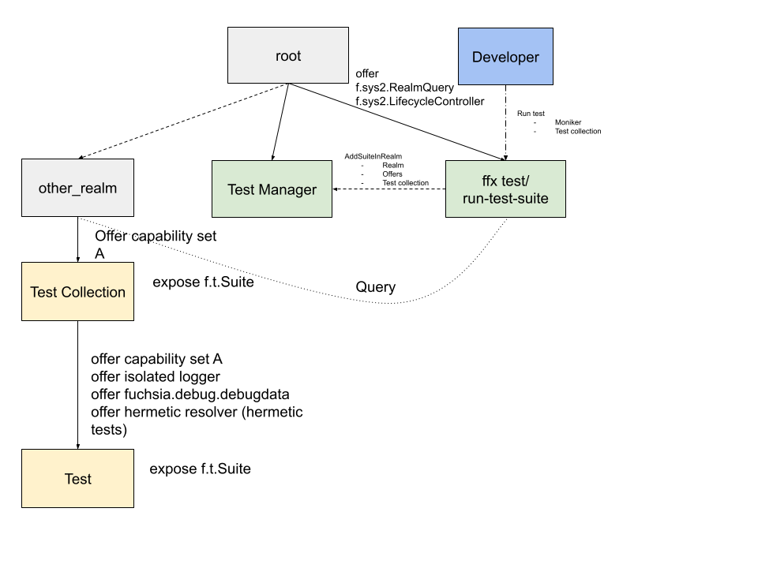

<!-- Generated with `fx rfc` -->
<!-- mdformat off(templates not supported) -->


# {{ rfc.name }}: {{ rfc.title }}
{# Fuchsia RFCs use templates to display various fields from _rfcs.yaml. View the #}
{# fully rendered RFCs at https://fuchsia.dev/fuchsia-src/contribute/governance/rfcs #}
<!-- SET the `rfcid` VAR ABOVE. DO NOT EDIT ANYTHING ELSE ABOVE THIS LINE. -->

<!-- mdformat on -->

<!-- This should begin with an H2 element (for example, ## Summary).-->

## Summary

Currently a test on Fuchsia is executed as a dynamic child of Test Manager.
This design enables Test Manager to launch tests in any realm (that product
owner's have permission to create) thereby allowing test authors to route
required runners and capabilities without making changes to Test Manager.

## Motivation

Test Manager launches a test as a dynamic child providing it with various
hermetic/non-hermetic capabilities and in-tree runners. The current design of
Test Manager is to run with a static set of built-in test runners and test
realms. It does not allow out-of-tree (OOT) and in-tree customers to include
their own test runners and required capabilities, but as we gain more customers
we will need to support their use-cases. This document proposes "Test Manager
as a service" which will allow our customers to run tests in a test realm of
their choosing, potentially outside of the Test Manager's realm. This reduces
responsibility of the Test Manager in routing required system capabilities to
the tests.

## Stakeholders

_Facilitator:_ davemoore@google.com

_Reviewers:_ geb@google.com, shayba@google.com, richkadel@google.com,
kjharland@google.com, crjohns@google.com, cgonyeo@google.com,
aaronwood@google.com, satsukiu@google.com, xbhatnag@google.com,
yaneury@google.com, hjfreyer@google.com, akbiggs@google.com

_Consulted:_

Component Framework team was consulted relating to questions about capability
routing, framework and testing APIs used in this design.

_Socialization:_

This RFC went through a design review with the Testing Architecture and
Component Framework team.

## Design

In this design product owners will decide where the test should run and the test
executors (ffx test/run-test-suite) will pass in required information to the
Test Manager. We will add a new method to the [RunBuilder protocol][run-builder]
called AddSuiteInRealm and pass in required realm information.

```fidl
  AddSuiteInRealm(resource struct {
      // The realm which contains the collection to launch the test in
      realm client_end:fuchsia.component.Realm;
      // All offers from the realm to the test collection
      offers: Vec<Capabilities>
      // the test collection to launch the test in.
      test_collection: string

      // ... existing fields from AddSuite
  });
```

Test Manager will use above information to launch the test in the specified
collection using Realm Builder while providing isolated logger, coverage
collection, in-tree runners, etc to support test execution. Component manager
will route LifecycleController and RealmQuery protocol (scoped to "/") to
the test executor.

Test realms can either be authored by the platform itself, or by product owners
by using some existing/new mechanism. So far only the platform could define
test realms, and that this work seeks to democratize test realm definitions
and management.

This design assumes two types of users.

- _Test Realm author_: This user will create and maintain the realm where the
   test will run (They should have permission to create the realm in the
   topology).
- _Test author_: Author of the test which will run in the realm created by the
  realm author.

_Test Realm author_ will create a test realm, set it up and integrate with build
tools to allow _Test author_ to run the test. They need to install
[Realm Builder shard][realm_builder_shard] in their test realm for this to work.

Sample test realm:

```cml
{
  include: [
      "sys/component/realm_builder.shard.cml",
  ],
  collections: [
      // The collection to launch test in
      {
          name: "tests",
          environment: "#test_env",
          durability: "transient",
      },
  ],
  offer: [
      {
          protocol: [
              // Some system or mocked protocol
              "fuchsia.foo.bar",
              ...
          ],
          from: "parent",
          to: [
              "#tests",
          ],
      },
      ...
  ],
  environments: [
      {
          name: "test_env",
          extends: "realm",
          runners: [
              // Offer some OOT runner to the test
              {
                  runner: "fuchsia_oot_runner",
                  from: "parent",
              },
              // TODO(fxbug.dev/112381): Abstract out into a shard.
              // This is important so that Realm Builder can work.
              {
                  runner: "realm_builder",
                  from: "#realm_builder_server",
              },
          ],
          resolvers: [
              // This is important so that Realm Builder can work.
              {
                  resolver: "realm_builder_resolver",
                  from: "#realm_builder_server",
                  scheme: "realm-builder",
              },
          ],
      },
  ]
}
```

The realm author will provide integration with the build tools so that test
executors can read the moniker and the test collection during execution.

_[Ergonomics](#ergonomics) section briefly touches on some solutions to pass in
moniker and test collection name to the test executor and detailed discussion
is out of scope for this document._

_Test author_ will use one of the ergonomic solutions (TBD) to run their test,
which will pass in the information to test executor to run the test.

The test executor will use [RealmQuery API][realm_query_api] to query the
realm object for the realm and all the offers to the test collection and pass
them to Test Manager using the proposed AddSuiteInRealm API.

It will also use [LifecycleController API][lifecycle_controller_api] to resolve
the moniker if required.

Following changes are required for this design:

- Modify RealmQuery API to read 'offer' declaration.
- The Realm Builder Rust client library will be modified to allow constructing
  a realm with the provided `fuchsia.component/Realm` proxy.
- Test Manager will use the new method in the Realm Builder library to start the
  test instance using the Realm Builder scoped to the custom realm.
- Test Manager will use the provided `offers` and route them using Realm
  Builder.
- Test Manager will setup an isolated logger, debug data protocol, in-tree
  runners, etc in the test environment.

Test Manager can connect to all capabilities from the test realm because now it
has handles to the component instance.

Test Manager will collect all the artifacts and upload test results after the
test ends. Tests will have access to any capability that its parent realm
provides and all the hermetic capabilities provided by Test Architecture.

Advantages of this approach

- Developers can bring their own runners.
- This can be achieved right now. Don't need to wait for any additional
  features.

Additional benefits

- Developers can configure their test realm the way they want it without any
  changes required in core product or testing architecture.
- No need to support custom test types.

The drawbacks of this solution are:

- Developers can create their own non-hermetic realms to launch the tests in, so
  we might end up with bunch of non-hermetic tests which could have been made
  hermetic with little bit of effort.
- Developers who use `ffx test` directly will need to  provide their moniker and
  collection name to the tool.
  - ffx test is a foundational tool, so developers should be using others tools
    which call ffx test and there would be no need for manual passing of the
    moniker.

The diagram of the test topology once Test Manager can be used as a
service.



## Implementation

- Change Realm Builder to allow it launch components in arbitrary realms by
  accepting fuchsia.component.Realm object.
- Change test executor to accept realm info query the moniker for required
  information.
- Change Test Manager to implement new FIDL API and launch the test in supplied
  realm and collection.
- Document the changes and help guides
- Work with OOT developers to create realms containing OOT runners.
- Port current OOT tests to new realm

Future work:

- Port current tests using custom test types to their own realm.
- Explore removing dependency on monikers.
- Remove all test realms from under test manager and publish them inside product
  realms.

## Performance

This change will have no or minimal performance impact as this will not affect
how the test is launched, it only affects where the test is launched in the
topology.

## Ergonomics

This sections describes some solutions to pass in moniker and test collection
to the test executor. Detailed solutions are out of scope for this document.

### Integration with the build

Once a custom realm is defined, product owners can define test categories in
their build system. _Test author_ will use that category and the build system
will produce corresponding moniker and test collection as inputs to the test
executor.

### Add information to the test manifest

We can embed moniker and test collection information inside test facet. Test
executor will need to resolve and read the component manifest file to obtain
the information.

For better ergonomics, _Test Realm author_ will provide manifest shards which
the _Test author_ can include in their test manifest.

## Backwards Compatibility

We will keep supporting current tests and will always support hermetic test
realm which does not need custom runners.

## Security considerations

- Developers can launch tests in any realm in the system, but as the tests will
  run on eng builds, the user devices will not be affected by this change.
  - We will also have a flag in test executor to disable the feature on certain
    shared machines and builds.
- We will need to route RealmQuery and LifecycleController to all test
  executors. It can be a security concern depending on how we decide to do that.
  We will discuss it in the next document when we design how test executors will
  have access to this information.

## Privacy considerations

We do not collect any personal data, so this design will not have any privacy
effects.

## Testing

Current tests along with new integration and unit tests to launch tests in
custom realm should fully test this feature.

## Documentation

Document this feature explaining the use-case and implementation guide for
developers to create their own test realms.

Also document the way for test developers to use custom realms.

## Drawbacks, alternatives, and unknowns

### Alternative: Clients launch their own Test Manager

Test developers will launch their own Test Manager in their topology. ffx test
will use RCS to connect to fuchsia.test.manager.RunBuilder protocol to execute
and collect results from the test.

Benefits of this solution:

- We just need to change ffx test to support this
- Developers can use current Test Manager code along with their custom manifest
  to use Test Manager component in their topology

The problems with this solution are:

- It would be hard to change the Test Manager once it is running in various
  topologies and OOT. This will greatly affect the Test Architecture team's
  velocity.
- Clients will need to route all capabilities needed by the Test Manager to
  their own topology.
- Clients will need to write tests to make sure that Test Manager works fine
  in their topology and to prevent any regressions

### Alternative: Sub-assemblies

Sub-assemblies could solve our problem of bring-your-own-test-runner but it
is not as flexible as proposed solution.

The proposed solution allows us the flexibility to in future remove all hard
coded test realms from test manager and provide full ownership to the product
owners.

### Alternative: Tests package their own runners

Tests can package their own runner and run their test components using them

Benefits of this solution:

- No need for any changes
- This can be achieved right now

The problems with this solution are:

- Performance impact of running a new runner for each test.
- Need to route capabilities needed by the runner to the test (breaks
  hermeticity and weakens our guarantees).
- Need to create a custom realm for every new runner (due to capability
  routing requirement). This is compounding technical debt.

### Alternative: Tests Configurations

Parameterize a test with capabilities and the source of those capabilities and
then pipe those to the test realm itself.

```json5
"fuchsia.test.additional_capabilities": {
  "runner": "dart_runner",
  "source": "/core/dart/runner"
}
```

For routable capabiltiies, Test Manager can use
[RealmQuery API][realm_query_api] to proxy the request using Realm Builder. For
runners, Test Manager can use hub to proxy runner protocol.

Benefits of this solution:

- Tests runs as a child of Test Manager so Test Manager has full control over
  its capabilities.

The problems with this solution are:

- Tests might depend on production monikers, so they would become part of
  exposed APIs.
- Using hub to proxy runner requests is only a short term solution, we will
  eventually need nested or chained runners.
- Tests would be able to access any system capability which can be a security
  concern breaking explicit routing, creating action at a distance.

### Alternative: Test Manager uses RealmQuery API

In this design the Test Manager will have access to
[RealmQuery API][realm_query_api] and use that to query the required information
from the test realm to launch the test.

The _test author_ will use shard to include realm and test collection
information in their test manifest.

Shard:

```cml
{
  facets: {
    "fuchsia.test": {
      launch: {
        realm: "/core/foo/bar/test_realm",
        collection: "tests" // default is "tests", can be omitted.
      }
    },
  },
}
```

test.cml:

```cml
{
    include: [
        "syslog/client.shard.cml",
        "//some/path/oot_runner/default.shard.cml",
        "//some/path/test_realm/default.shard.cml",
    ],
    program: {
        binary: "bin/sample_test",
    },
    use: [
      {
          protocol: [
              "fuchsia.foo.bar",
              ...
          ],
      },
      ...
  ],
}
```

Test manager will read the facets and use provided capability to query and
launch the test in specified test realm.


### Alternative: Test Manager runs system tests at one known place in topology

This design proposes that there would be a common known place in topology
(eg /core/tests), where the Test Manager can execute all the system tests. The
platform developers will create and maintain this known realm and the Test
Manager will only provide the mechanism to execute and collect artifacts from
the tests.

#### Cons

- Less configurability and not scalable in the future if we need more than one
  place to run the tests.
- We want to be able to have nested Test Manager in future which can run tests
  in sibling realms. This design discourages it.
- We can achieve the same functionality using the design from this RFC,
  targeting /core/tests as the realm in which tests should be run. This RFC
  provides further flexibility we believe will be useful.

## Prior art and references

This is a concept unique to Fuchsia, so no prior art for the same.

[realm_query_api]: /sdk/fidl/fuchsia.sys2/realm.fidl
[lifecycle_controller_api]: /sdk/fidl/fuchsia.sys2/lifecycle_controller.fidl
[realm_builder_shard]: /sdk/lib/sys/component/realm_builder.shard.cml
[run-builder]: /sdk/fidl/fuchsia.test.manager/test_manager.fidl

## Future Work

- Remove all non-hermetic realms from test manager topology and work with our
  clients to move their test to their own custom test realms.
- Design for "Bring your own test manager" as sibling of the test realm. This
  would useful to run the tests under session or any OOT realms without
  requiring any product-specific support in the platform.
