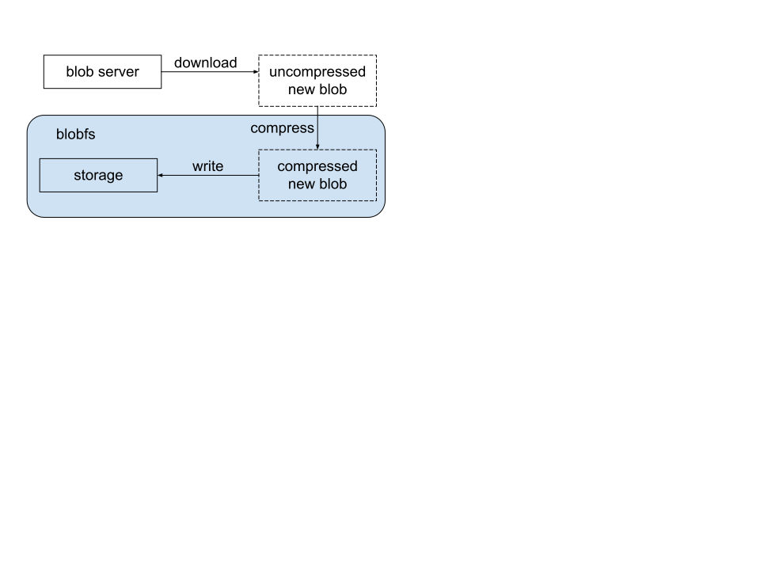
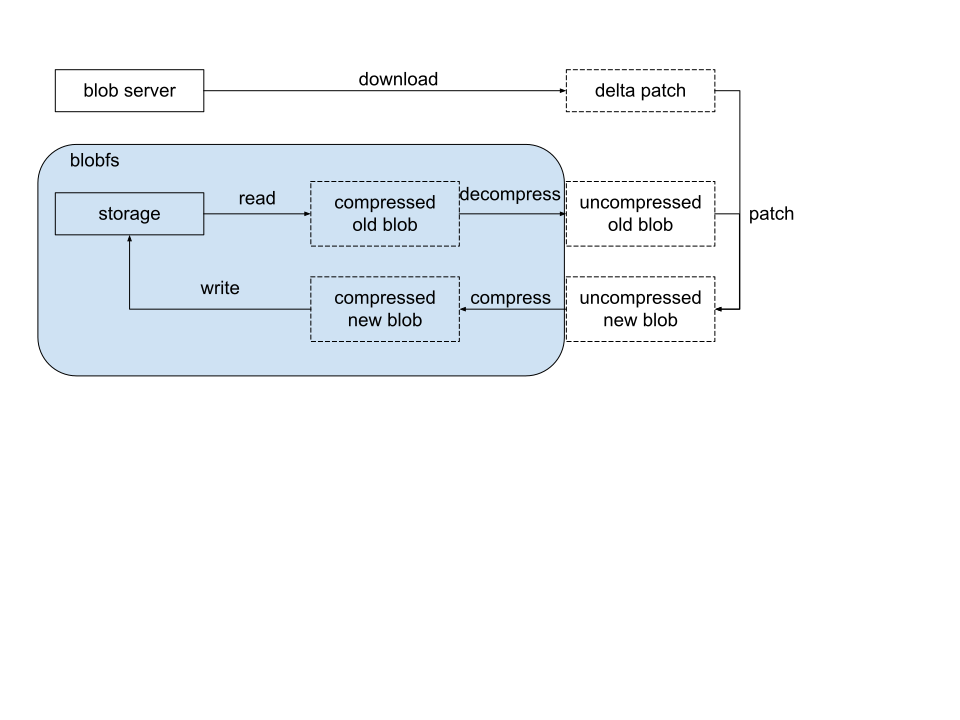
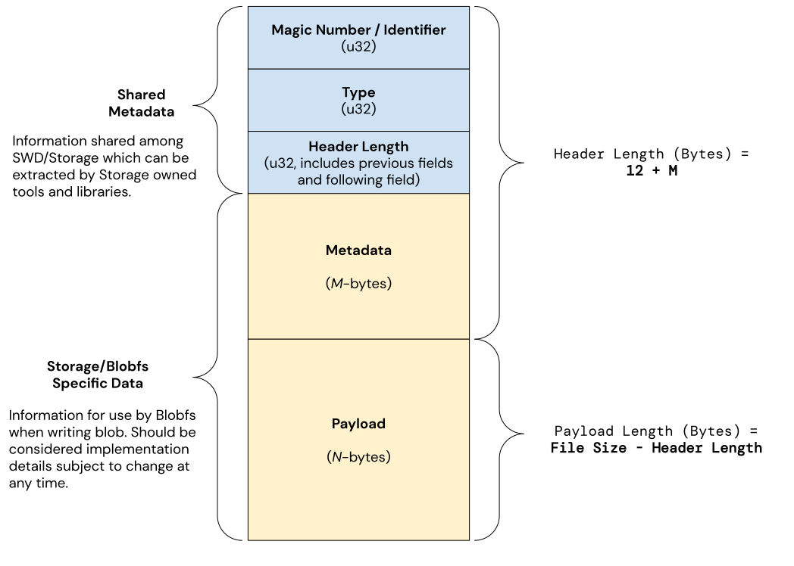

<!-- mdformat off(templates not supported) -->


# {{ rfc.name }}: {{ rfc.title }}
{# Fuchsia RFCs use templates to display various fields from _rfcs.yaml. View the #}
{# fully rendered RFCs at https://fuchsia.dev/fuchsia-src/contribute/governance/rfcs #}
<!-- SET the `rfcid` VAR ABOVE. DO NOT EDIT ANYTHING ELSE ABOVE THIS LINE. -->

<!-- mdformat on -->

<!-- This should begin with an H2 element (for example, ## Summary).-->

## Summary

In Fuchsia's current design, when packages are resolved, uncompressed blobs are
fetched over the network, and then compressed on the device before writing to
disk. This RFC proposes an alternative where compressed blob artifacts can be
fetched directly. This will reduce bandwidth and eliminate computationally
expensive on-device compression.

## Motivation

pkg-resolver fetches uncompressed blobs from a blob server, and writes the blob
directly to Blobfs. Blobfs compresses data on-the-fly, which requires a
significant amount of CPU and memory.

With offline compression, blobs will be pre-compressed before fetching, and
delivered to Blobfs in a format suitable for writing directly to disk.  This
will reduce CPU, memory, and network usage during package resolution and system
updates. As a result, updates will complete faster, the out-of-memory (OOM) rate
will be lower, and there will be a reduction in server bandwidth costs.

Developer productivity will be improved as well, since large test binaries won't
need to be compressed on device. Launching tests with large binary sizes should
be much faster.

## Stakeholders

_Facilitator:_

abarth@google.com

_Reviewers:_

*   jsankey@google.com (SWD)

*   etryzelaar@google.com (SWD)

*   mlindsay@google.com (Local Storage)

*   csuter@google.com (Local Storage)

*   bcastell@google.com (Local Storage)

*   marvinpaul@google.com (Server Infrastructure)

*   aaronwood@google.com (Product Assembly)

*   amituttam@google.com (PM)

*   dschuyler@google.com (SDK Delivery)

*   atyfto@google.com (Infra)

_Socialization:_

Offline compression and delta updates were discussed in design discussion within
the software delivery team. An early draft of the RFC was reviewed by relevant
stakeholders.

## Strategy

There are two main strategies when it comes to improving OTA time and bandwidth:

*   Offline compression: Blobfs dynamically compresses blobs on disk. However,
    pkg-resolver is fetching uncompressed blobs over the wire. We can instead
    fetch pre-compressed blobs to save bandwidth, CPU, and memory usage.
*   Delta patches: Unchanged blobs do not need to be downloaded again. This is
    a form of delta compression, but only works when the blob content remains
    identical. If there are some small changes within a blob, the server can
    generate a delta patch between the old and new blob, and serve only the
    difference between the two.

### Methods

Combining the above strategies, we have the following methods for delivering a
blob from blob server to device, we'll go over each of them and then show
experimental results.

#### Uncompressed Blobs

This is the current behavior. Blobs are downloaded directly in uncompressed form
and compressed on-the-fly as Blobfs writes the blob to persistent storage.

#### Offline Compression

The package server supports downloading pre-compressed blob artifacts in a
format suitable for ingestion by Blobfs. No on-device compression is required,
and an online algorithm can be used to calculate the Merkle tree / root in a
memory efficient manner using a streaming decompressor.

#### Delta Between Uncompressed Blobs

For each new blob, we find an old blob in the same package, and generate a patch
between the two uncompressed blobs. Devices will need to download the patch,
find the old blob, decompress it, apply the patch, and compress/verify the new
blob contents.

This would require significant additional CPU and memory compared to other
methods because of the extra decompression and compression step. This will also
prevent the eventual removal of compression code from Blobfs.

#### Delta Between Compressed Blobs

Similar to above, except that we generate the patch between two offline
compressed blobs. In this case, we don't need to decompress the old blob or
compress the new blob on the device. One drawback of this approach is that the
use of compression may result in large delta patches.

#### Delta Between Partially Decompressed Blobs

Similar to above, except that in the patching step, we apply a transformation
before and after to reduce patch size.

This transformation will undo the [tANS encoding] in zstd, which makes the data
byte aligned and more stable. As a result delta patching becomes more efficient,
while still avoiding redoing the expensive match finding part of the compression
algorithm when applying the patch on the device.

### Experimental Data

Experiments show that any of these methods can save OTA size by more than half
compared to the current method of using only uncompressed blobs. Delta between
uncompressed blobs is about 30-50% smaller than offline compression, and the
delta between compressed blobs is about 10-40% smaller than offline compression.
We didn't experiment on delta between partial decompressed blobs at this time,
but it is estimated that it will be somewhere between the two delta methods.

### Proposal

Based on the experimental data, we propose to implement offline compression as a
first step. In the future, we may also explore delta patches between compressed
or partially decompressed blobs method in addition to offline compression
(falling back to offline compression if no previous blob was found).

This route prevents us from utilizing deltas between uncompressed blobs in the
future, which uses the least amount of bandwidth out of all the options, but the
amount of extra CPU and memory utilization on the device may outweigh the
potential bandwidth cost.

The design of delta updates will be introduced in a future RFC which shall
include the required changes to the update package format.

## Design

### Delivery Blob

A delivery blob is a blob in a format suitable for efficient delivery and
writing from the server to a device. Delivery blobs will include a header with
metadata and a payload containing the blob data itself.

The delivery blob format shall include the following fields byte aligned and in
little-endian:

 - **Magic Number**: `b"\xfc\x1a\xb1\x0b"` 4-byte identifier (stands for fuchsia
   blob) for confidence check, will not change
 - **Type** (**Format**): Indicates the format of the blob payload (e.g.
   uncompressed, zstd-chunked), 4-byte enum
 - **Header Length**: Size of the header including magic and storage-specific
   metadata, 4-byte
 - **Metadata**: Storage-specific metadata required to write the delivery blob
   to device storage via Blobfs
 - **Payload**: Blob data in the format specified by **Type**

The **Payload** and **Metadata** fields will evolve over time and should be
considered implementation details and only be interacted with using tools and
libraries provided by the storage team. For a given **Type** identifier, changes
to the associated **Metadata** and **Payload** formats must be done in a
backwards compatible manner.

### Generating Delivery Blobs

#### Production

The Fuchsia product build process creates artifacts including uncompressed blobs
and metadata specifying the supported [delivery blob](#delivery_blob) **Type**
the product expects to receive. The production blob server shall use a tool
provided by the storage team in SDK to compress each blob and generate a
[delivery blob](#delivery_blob) with the specified **Type** (`--type`). This
allows the server to generate and serve multiple formats of a given blob, both
to support the format transition, as well as handle potential differences in
blob types used across different products.

The server will always use the tool from the latest published SDK, so support
for older formats must be kept until stepping stones have been put in place for
all channels on all products. This ensures that pushing any new releases will
not need to generate blobs in the old format.

For the same data, **Type** and tool version, the tool must produce
deterministic output, however newer versions of the tool **is allowed to**
produce output not bit-for-bit identical to the previous version. This can be
caused, for example, by updating the underlying compression library to a newer
version. For a given **Type**, the tool **must guarantee** the generated
delivery blob is backward compatible with existing fuchsia releases that are
expecting this **Type** of blob.

If a delivery blob of the same hash and **Type** already exists, the server
should use that instead of generating a new delivery blob with the latest tool.
This makes sure that an existing well tested OTA path will not be affected by
future unrelated build releases.

#### Developer Workflow

Currently the build compresses all blobs when generating the Blobfs image.
Instead, compression will be moved out of image generation, and will be
performed separately on each blob using a dedicated tool. The output of
the tool will be the blob in the specified
[delivery blob format](#delivery_blob), which can be used directly by
the blob server on the host to save build time.

Generating the final Blobfs image shall have the option to use delivery blobs
directly as input (in addition to uncompressed blobs).

#### Infrastructure Workflow

The builders will upload delivery blobs generated during the product build &
assembly in addition to uncompressed blobs to the shared GCS bucket for blobs.
These delivery blobs will be used by test runners and some developer workflow
where downloading packages from infra is required.

Because the GCS bucket is shared among all builds, infra should verify that the
hash of the decompressed delivery blob matches before uploading. It MUST not be
possible to bypass this verification within a fuchsia.git change, to prevent any
malicious change from running pre-submit uploading these blobs without
verification.

### Blob Server Protocol

#### Current State

Currently the only metadata we need to download a blob is the hash, we can use
the hash to find the uncompressed blob URL on the blob server, for example
`https://blob.server.example/781205489a95d5915de51cf80861b7d773c879b87c4e0280b36ea42be8e98365`

The size of the blob is currently required by Blobfs to begin the write process,
and can be obtained from the Content-Length HTTP header.

#### Offline Compression

For offline compression, the hash of a given blob is still the same (i.e. it
matches the Merkle root of the uncompressed blob). Thus, pkg-resolver can use
the hash to find the delivery blob on the blob server by URL, include the blob
format/type. For example, the URL for a blob of type 1 would be
`https://blob.server.example/1/781205489a95d5915de51cf80861b7d773c879b87c4e0280b36ea42be8e98365`

The size of the delivery blob can be obtained from the Content-Length HTTP
header. The [delivery blob format](#delivery_blob) contains the length of the
header, allowing efficient extraction of just the payload if required.

If the blob does not exist in the requested type, the server will return 404. In
this case, we shall fall back to downloading and writing the blob uncompressed
using the [existing write path](#current_state). This fallback will be disabled
in production, and can be removed after offline compression has been fully
rolled out.

Probing if a blob type is available has the advantage over other options that it
doesn't require format changes. The main downside of probing, however, is the
chance we could double the HTTP requests when installing a package. We can avoid
that by guaranteeing that the blob is always available and disable the fallback
in production.

### Blobfs

#### Current State

The current flow for writing blobs is as follows:

  1. `Open` a file handle to `/blob/781...` in `Create` mode.
  2. `Truncate` the file to the exact length of the uncompressed blob.
  3. `Write` the uncompressed blob payload.

#### Offline Compression

The packaging system will write blobs to Blobfs by communicating the delivery
blob format type when writing the blob. While the protocol between them is
internal, we suggest the current system could be extended to implement them by:

  1. To write a delivery blob, pkg-cache will open up `/blob/v1-781...` for
  writing, and write the delivery blob as-is. Truncation is no longer necessary
  as the [delivery blob header](#delivery_blob) includes all information
  required by Blobfs to write the blob.

  2. If the package resolver falls back to downloading the original uncompressed
  format, pkg-cache will instead open `/blob/781...` and follow the
  [existing write path](#current_state_2).

Regardless of how the blob was written to the device, reading it back from
Blobfs will remain the same, using the Merkle root as the path (e.g.
`/blob/781...`).

Once the transition to offline compression is complete, blobfs and pkg-cache
could remove support for writing the old uncompressed blob format and remove the
`v1-` prefix.

In order to reduce memory during writing, Blobfs shall stream the blob data to
storage, and utilize a streaming decompressor for Merkle tree generation. As
blobs should be considered untrusted inputs to the system, all decompression
must be done in a sandboxed component. See [Security
Considerations](#security_considerations) for more details.

After offline compression has rolled out, we may improve the performance of
the write path further by making use of [zx stream] support.

### Size Checking

After this RFC the compressed size of a given blob in blobfs has the potential
to vary more significantly because different software releases may use different
compression algorithms for the same blob. If a blob was cached in blobfs using
an earlier compression algorithm the size on disk may be different to a newer
compression of the same blob on the server. Products should consider this point
when determining the size of a release and setting a threshold on the maximum
release size for space-constrained devices.

## Implementation

The following steps are required to support offline compression:

*   Blobfs updates the experimental implementation of offline compression to
    include format type in the path, and enable it by default.

*   pkg-cache supports writing [delivery blobs] to Blobfs.

*   pkg-resolver supports downloading [delivery blobs] of a specified type.

*   Blob server generates [delivery blobs] in various types, and serves them.

*   Build system publishes [delivery blobs] to the devhost TUF repo.

*   `ffx repository` supports serving [delivery blobs] directly.

## Performance

Offline compression will significantly reduce bandwidth, CPU, and memory usage
when downloading a blob.

Clean build time could be slower depending on how many universe packages are
included in the build. This is because these packages aren't currently
compressed during a build, and are instead compressed on each device when
resolving the package.

Incremental build time may be much faster because rebuilding blobfs image
may not need to recompress all base blobs anymore.

## Ergonomics

Now that we have a delivery blob format in multiple places, a host tool to
interact with it will be helpful for debugging.

We will have a host tool in ffx that can:

*   convert between delivery blob and uncompressed blob.
*   show delivery blob format information: version, uncompressed size, on device
    space size, compression ratio, number of chunks, chunk size, etc.

## Backwards Compatibility

Migrating from uncompressed to offline compression and from one delivery blob
format type to another is very similar, this section covers both.

A delivery blob of a given format type **must** be backwards compatible with any
existing device that accepts/supports the type. Any breaking changes to a given
blob format **must** use a different type identifier.

Production and developer workflow will use different strategies to transition,
because the trade offs are different. In production, one server serves all
devices in the field, whereas for developers, there is usually only one device.

### Production

During the transition period, the server must generate multiple types of the
blobs for the same build. This is required to update any device that might get
an update to that build, until a stepping stone is put in place.

This approach allows us to begin rolling out new types sooner, and a stepping
stone is only needed to end the transition.  It also removes the need to have
client side fallback logic in production.

### Developer Workflow

The development host shall only publish one blob format at a time. As such, the
host side server is **not** guaranteed to have older blob formats for backward
compatibility.

To allow `fx ota` to continue to work, we will rely on device side fallback.
During a transition period, devices running newer builds will first try to get
the newer blob type. If the package server on the host does not have this blob
format, then the device shall request an older type blob as a fallback. When
most devices get updated, we can switch host side to generate the new type,
and remove on-device support for this fallback method.

## Security Considerations

Offline compression extends the attack surface on the decompressor, which must
now parse data coming over the network, in addition to data stored on disk.
Outside of using TLS, the blobs downloaded in [delivery format](#delivery_blob)
do not include signing, and can only be verified by feeding untrusted data
into the decompressor.

As a result, we must use a sandboxed decompressor for offline compression as
defense-in-depth. If an attacker finds a vulnerability in the decompressor, the
system cannot be compromised without chaining another attack to escape the
sandbox. Any decompressed data will be verified using the merkle root hash, this
prevents compromised decompressor from producing malicious output.

Parsing the metadata in [delivery format](#delivery_blob) will be done using
security approved parsing library.

Another possible attack is malicious blob being uploaded to infrastructure GCS
bucket, which is covered in [Infrastructure Workflow](#infrastructure_workflow)
section.

## Privacy Considerations

The only extra information that the device sends to the server is the delivery
blob format type.

## Testing

This feature will be covered by pkg-resolver integration tests, E2E OTA tests
and manual OTA tests by the test team.

## Documentation

fuchsia.dev documentation on [OTA updates] will be updated to clarify that a
delivery blob is downloaded during package resolution and the merkle root hash
of the blob is still the uncompressed data.

## Drawbacks, Alternatives, and Unknowns

### Drawbacks

Offline compression moves the compression from device side to server side, so
package resolve will be faster, but build could be slower, and uploading a build
to server could use more resources and take longer.

### Alternatives

#### Delta Between Uncompressed Blobs

It could also significantly reduce OTA size, but will use even more CPU and
memory on the device.

#### Content Address With Compressed Hash

In addition to uncompressed hash, we can also include the compressed hash when
referring to a blob in packages, for blobs that don't change, we will still need
to fetch them again if the compressed hash change.

Pros:

*   Devices running the same build will have exactly the same blobs, no matter
    which upgrade path they took.
*   Blobfs does not need to support very old blob format.
*   Space usage calculate is more accurate.

Cons:

*   Require significant changes to package format, blocked by meta/content
    format change.
*   Require change to pinned package URL format to include compressed hash.
*   Blobfs has to do more work to track the uncompressed and compressed hashes.
*   Devices would use more bandwidth downloading the same blob if the
    compression changes.
*   An update that changes blob format will need to update every blob, putting
    the device very close to storage limit.

#### Verifying Delivery Blob Hash during Package Resolution

Similar to "Content Address with Compressed Hash", we could gain some of the
same security benefits by verifying the delivery blob hash when the Package
Resolver downloads a blob. The delivery blobs stored in the blob store could be
changed to include the hash at the beginning:

 - **Delivery Blob Merkle**: The merkle computed over the remaining bytes in the
   delivery blob.

Then, the package format, TUF metadata, Omaha responses, and pinned package urls
could be changed to include both the merkles of the uncompressed blob and the
delivery blob.

When downloading a blob:

* Package Resolver begins to download the first 32 bytes, and extract out the
  delivery blob merkle from the delivery blob.
* Package Resolver opens /blobs/<uncompressed blob>, truncates it to the length
  of the delivery blob minus 32 bytes.
* Package Resolver begins to stream each chunk after the first 32 bytes to
  blobfs while computing the actual merkle of the delivery blob.
* Upon receiving the last chunk, before writing it to blobfs, validate the
  delivery blob has the correct merkle. If so, write the last chunk to blobfs,
  otherwise close the file early.
* Blobfs, upon receiving file closed, uncompresses the delivery blob in a
  sandbox, and validates that it's merkle matches the uncompressed blob merkle.

Pros:

* Since the delivery blob hash is stored in signed metadata, devices would
  reject a malicious blob with a decompressor attack written by an attacker with
  write access to a blob store.

Cons:

* The package format would need to be changed, either with a new meta/contents
  format, or a new file in meta/fuchsia.pkg.
* Would not protect against a local attacker with the ability to overwrite a
  local blob with a decompressor attack directly into blobfs.
* Does not guarantee that all devices would have exactly the same blobs, since
  we would not overwrite any blobs that exist locally.
* Requires changes to the pinned package URL format to include compressed hash.

#### Signing Delivery Blob

The signature of the compressed data could be included in the metadata to be
verified before passing the payload to decompressor. This would address security
concern of decompressing untrusted data.

However in order to make this streamable, we will have to include the complete
merkle tree of the compressed data in delivery blob, and verify hash of each
block. We would also need to consider key management, key rotation, etc.

This introduces a lot of complexity to the streaming flow and delivery blob
generation process, and it's unclear how this could work with third party blob
servers.

We think using security approved parsing library and decompression sandbox is
enough to mitigate this risk.

## Prior Art and References

### Chrome OS

The crostini image is squashfs using gzip compression, [puffin] is used to
generate an efficient delta patch between two compressed images by decoding the
huffman coding of deflate stream into a custom format.

### Android

Non A/B updates in Android uses imgdiff to patch APKs, it's running bsdiff on
uncompressed files in APKs, when Android moved to A/B updates, imgdiff is
replaced by [puffin].

[delivery blobs]: #delivery_blob
[zx stream]: /docs/reference/kernel_objects/stream.md
[tANS encoding]: https://en.wikipedia.org/wiki/Asymmetric_numeral_systems#Tabled_variant_(tANS)
[puffin]: https://android.googlesource.com/platform/external/puffin/+/refs/heads/master/README.md
[OTA updates]: /docs/concepts/packages/ota.md
